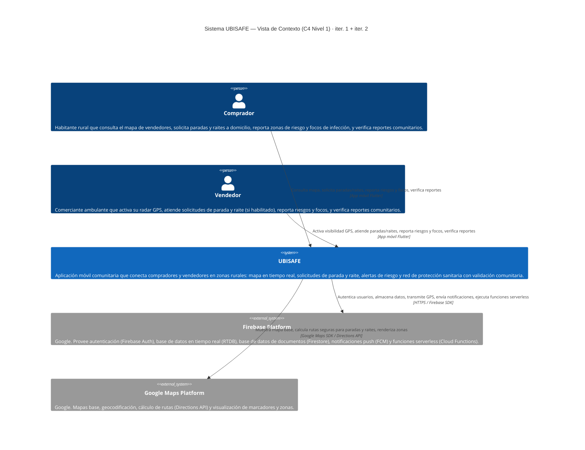
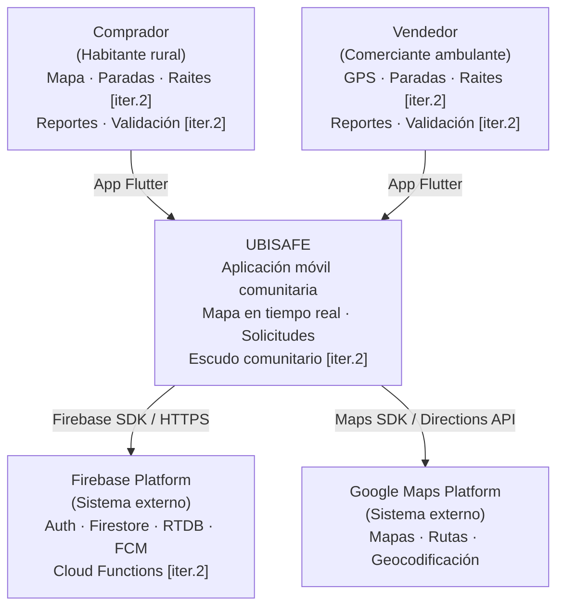
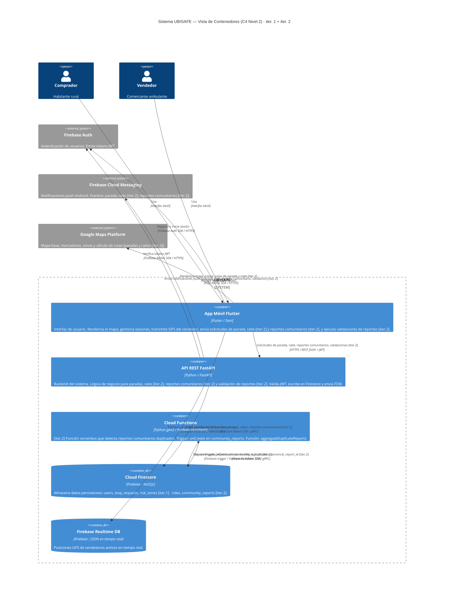
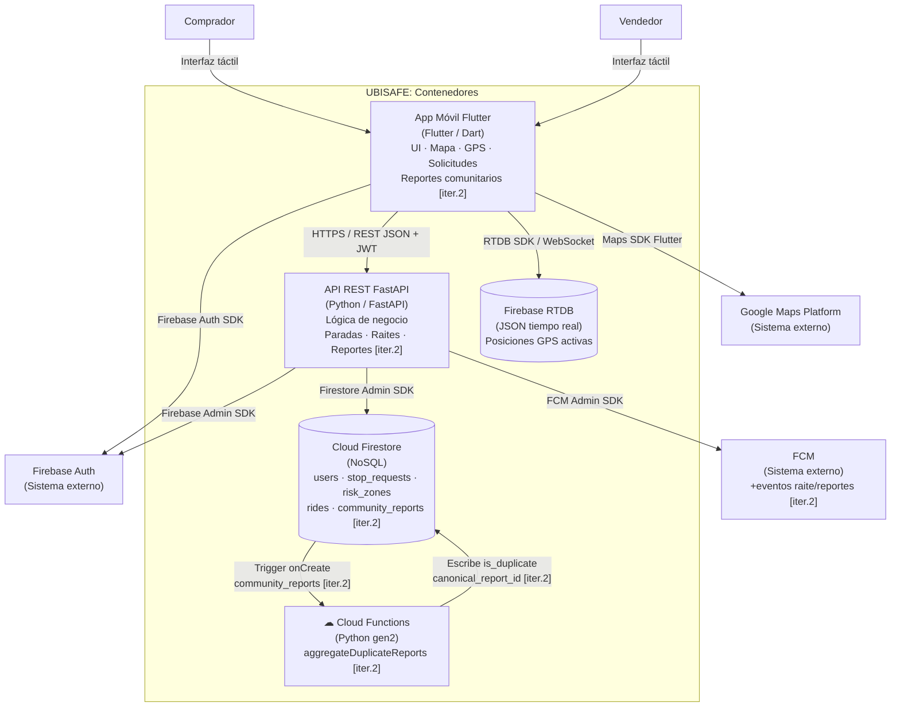

# SDD2_FASE1_UBISAFE.md
## Fase 1' — Actualización C4 Nivel 1–2 (Iteración 2)
### Los Borbotones · UBISAFE · 24/04/2026

> **Propósito de este archivo:** Extensión de `SDD_FASE1_UBISAFE.md` para reflejar los cambios de iter. 2. No repite el contenido de iter. 1 — lo complementa y marca los cambios con **[iter. 2]**. Alexis debe integrar este contenido al .docx sobre las secciones §3 y §4 existentes.
>
> **Archivos base leídos:** `SDD_FASE1_UBISAFE.md` (C4 L1–L2 iter. 1) · `SDD2_FASE0_UBISAFE.md` (decisiones iter. 2)
>
> **Nota de integración para Alexis — Renumeración §4.2:** Al insertar el nuevo contenedor Cloud Functions como §4.2.5 en el .docx, los números de los contenedores originales se desplazan. Renumerar en el documento Word de la siguiente forma:
> - §4.2.5 Firebase Auth → **§4.2.6** (actualizar título y todas las referencias internas al documento)
> - §4.2.6 Firebase Cloud Messaging → **§4.2.7** (actualizar título y referencias)
> - §4.2.7 Google Maps Platform → **§4.2.8** (actualizar título y referencias)
>
> También actualizar las referencias en el resumen de cobertura (Sección §12 Trazabilidad) si existen.

---

## PASO 1'.1 — SECCIÓN 3: C4 NIVEL 1 — ¿Cambia algo en iter. 2?

### 3.0. Revisión de sistemas externos — iter. 2

**Resultado: No se añaden nuevos sistemas externos en iter. 2.**

| Sistema externo | Estado en iter. 2 | Justificación |
|---|---|---|
| Firebase Platform | Sin cambios | Cloud Functions es un servicio dentro de Firebase Platform; no es un sistema externo nuevo. Ya estaba contemplado en el boundary de Firebase en iter. 1. |
| Google Maps Platform | Sin cambios | CU-04 usa Directions API (ya presente en iter. 1) para trazar la ruta del raite. No se requieren nuevas APIs de Google Maps. |
| Firebase Auth | Sin cambios | Mismo flujo JWT. |
| FCM | Sin cambios | Se añaden 3 nuevos tipos de evento push, pero el sistema externo es el mismo. |

> **Conclusión:** El diagrama C4 Nivel 1 **no cambia estructuralmente**. Sí se actualizan las descripciones de actores y del sistema para reflejar las capacidades nuevas. Se muestra el diagrama completo con anotaciones [iter. 2] en los textos actualizados.

---

### 3.1. Descripción general — actualizada [iter. 2]

UBISAFE es una aplicación móvil comunitaria que permite a **compradores** localizar vendedores ambulantes en tiempo real, solicitar que se detengan en su domicilio (CU-01), solicitar transporte asistido a un destino cercano (CU-04) **[iter. 2]**, y reportar tanto zonas de riesgo de seguridad (CU-03) como focos de infección sanitaria con validación comunitaria (CU-05, CU-06) **[iter. 2]**. Los **vendedores** activan su radar GPS (CU-02), atienden solicitudes de parada y de raite, y participan como reportantes y validadores comunitarios.

---

### 3.2. Diagrama C4 Nivel 1 — Contexto actualizado [iter. 2]



#### Diagrama alternativo (flowchart) — para editores sin soporte C4 nativo



---

### 3.3. Actores del sistema — actualizados [iter. 2]

| Actor | Tipo | Descripción actualizada |
|---|---|---|
| **Comprador** | Usuario humano | Habitante rural que usa la app para localizar vendedores cercanos, solicitar que un vendedor se detenga en su domicilio (CU-01), solicitar ser transportado a un destino (CU-04) **[iter. 2]**, reportar zonas de riesgo de seguridad (CU-03) y focos de infección sanitaria (CU-05) **[iter. 2]**, y verificar reportes comunitarios de otros usuarios (CU-06) **[iter. 2]**. |
| **Vendedor** | Usuario humano | Comerciante ambulante que activa su localización GPS para aparecer en el mapa comunitario (CU-02), recibe y atiende solicitudes de parada (CU-01) y de raite si tiene la opción habilitada (CU-04) **[iter. 2]**, puede reportar zonas de riesgo (CU-03) y focos de infección (CU-05) **[iter. 2]**, y puede verificar reportes de otros usuarios (CU-06) **[iter. 2]**. |

> **Nota §2 del SDD [iter. 2]:** No se añade un stakeholder nuevo formal en iter. 2. El actor "Comunidad" que aparece implícito en CU-06 es el conjunto de compradores y vendedores ejerciendo la función de validación; no requiere registro separado en el sistema.

---

### 3.4. Sistemas externos — actualizados [iter. 2]

| Sistema | Proveedor | Servicios utilizados | Protocolo | Cambio en iter. 2 |
|---|---|---|---|---|
| **Firebase Platform** | Google LLC | Firebase Authentication, Cloud Firestore, Firebase RTDB, Firebase Cloud Messaging (FCM), **Cloud Functions (Python gen2)** | Firebase SDK / HTTPS / WebSocket | **[iter. 2]** Se activa Cloud Functions como servicio adicional dentro de Firebase Platform |
| **Google Maps Platform** | Google LLC | Maps SDK for Flutter, Directions API | Google Maps SDK / REST API | Sin cambios. Directions API ya cubre el cálculo de rutas de raite (CU-04). |

---

## PASO 1'.2 — SECCIÓN 4: C4 NIVEL 2 — Contenedores actualizados [iter. 2]

### 4.1. Diagrama C4 Nivel 2 — Contenedores [iter. 2]

> **Cambios respecto a iter. 1:** Se añade el contenedor **Cloud Functions** dentro del boundary de UBISAFE. El resto de contenedores se mantienen; sus relaciones se extienden con los nuevos flujos de iter. 2.



#### Diagrama alternativo (flowchart) — para editores sin soporte C4 nativo [iter. 2]



---

## PASO 1'.3 — SECCIÓN 4.2: Descripción de contenedores — cambios iter. 2

> **Nota de integración:** Solo se documentan los cambios respecto a `SDD_FASE1_UBISAFE.md §4.2`. Los contenedores sin cambios (Firebase Auth, FCM, Google Maps) mantienen su descripción original.

---

### 4.2.1. App Móvil Flutter — extensión [iter. 2]

Las siguientes responsabilidades se añaden al contenedor existente:

**Nuevas responsabilidades en iter. 2:**

La app envía solicitudes de raite al endpoint `POST /rides` de FastAPI cuando el comprador selecciona un vendedor con `ride_enabled: true` en el mapa (CU-04). Muestra la pantalla de seguimiento de raite en tiempo real reutilizando el mismo flujo de tracking de CU-01 con el rol del rider. Presenta un nuevo formulario de reporte de foco de infección (CU-05) accesible desde el FAB "+" en ambas HomeScreens, enviando la solicitud a `POST /community-reports`. Muestra en el mapa los `community_reports` activos en estado `pending_validation` (leyenda "Pendiente") y `confirmed` (leyenda "Validado"), con marcadores de color negro (`animal_muerto`) y café (`zona_sucia`). Permite al usuario validar o desmentir un reporte comunitario cercano (CU-06) enviando `PATCH /community-reports/{id}/validations`.

**Nuevos eventos FCM que maneja en iter. 2:**

| Evento FCM | Dirección | Acción en la app |
|---|---|---|
| `ride_request_incoming` | → Vendedor | Muestra dialog de solicitud de raite en MapScreenVendor |
| `ride_request_accepted` | → Comprador | Navega a pantalla de tracking de raite |
| `ride_request_rejected` | → Comprador | Muestra notificación de rechazo, vuelve al mapa |
| `community_report_nearby` | → Usuarios en radio 4 km | Muestra alerta de nuevo reporte de foco cercano |

---

### 4.2.2. API REST FastAPI — extensión [iter. 2]

**Nuevas responsabilidades en iter. 2:**

La API gestiona el ciclo de vida completo del raite (CU-04): crea el documento en la colección `rides`, verifica que el vendedor tiene `ride_enabled: true`, no tiene ninguna solicitud de raite activa en `rides` (status ≠ `completed`/`rejected`/`expired`) **y no tiene ninguna solicitud de parada activa en `stop_requests`** (status ≠ `completed`/`cancelled`/`rejected`) — condición exigida por SRS CU-04 Pre-condiciones; notifica al vendedor vía FCM (`ride_request_incoming`), y gestiona la aceptación/rechazo/finalización del raite con sus respectivas notificaciones al comprador. Gestiona la creación de reportes comunitarios (CU-05): valida que el usuario reportante está en un radio ≤4 km del punto reportado, crea el documento en `community_reports` con estado `pending_validation` y radio fijo de 15 m, y notifica vía FCM a usuarios cercanos en radio 4 km (`community_report_nearby`). Gestiona las validaciones de reportes comunitarios (CU-06): registra el voto (`confirm` / `dismiss`) en el array `validations[]`, actualiza `confirm_count` y `dismiss_count`, y aplica la regla de transición de estado: si `confirm_count ≥ 3` → `status = confirmed`; si `dismiss_count ≥ 3` → `status = dismissed`.

**Nuevos endpoints en iter. 2:**

| Endpoint | Método | Dominio | Descripción |
|---|---|---|---|
| `/rides` | POST | Dispatching | Crea solicitud de raite; notifica al vendedor |
| `/rides/{id}` | GET | Dispatching | Consulta estado del raite |
| `/rides/{id}/status` | PATCH | Dispatching | Acepta / rechaza / completa el raite |
| `/community-reports` | POST | Community | Crea reporte de foco; notifica a cercanos |
| `/community-reports` | GET | Community | Lista reportes activos por bounding box |
| `/community-reports/{id}/validations` | PATCH | Community | Registra voto confirm/dismiss; actualiza estado |

**Reglas críticas de negocio:**

- **CU-04 — Disponibilidad del vendedor:** FastAPI retorna `409 Conflict` si el vendedor tiene alguna solicitud de parada activa (`stop_requests`) o de raite activa (`rides`) con status distinto de `completed`, `rejected` o `expired`.
- **CU-06 — Auto-validación:** FastAPI rechaza con `403 Forbidden` si `validator_uid === reporter_uid` (un usuario no puede validar su propio reporte).
- **CU-06 — Proximidad del validador:** El body del `PATCH /community-reports/{id}/validations` debe incluir las coordenadas actuales del validador (`validator_lat`, `validator_lng`). FastAPI valida que la distancia Haversine entre esas coordenadas y el campo `location` del reporte sea ≤4 km (SRS CU-06 Pre-condiciones). Si no se cumple, retorna `403 Forbidden` con mensaje `"Debes estar a menos de 4 km del reporte para validarlo"`.

---

### 4.2.3. Cloud Firestore — extensión [iter. 2]

**Nuevas colecciones en iter. 2:**

| Colección | CU | Descripción |
|---|---|---|
| `rides/{id}` | CU-04 | Solicitudes de raite: buyer_uid, vendor_uid, pickup_location, destination, status, ruta, timestamps |
| `community_reports/{id}` | CU-05 / CU-06 | Reportes comunitarios de focos de infección con ciclo de validación comunitaria |

**Campo nuevo en colección `users`:**

| Campo | Tipo | Aplica a | Descripción |
|---|---|---|---|
| `ride_enabled` | boolean | VENDOR | Habilita la recepción de solicitudes de raite. Persistente en Firestore. Default: `false`. Configurable desde el Drawer. |

> La descripción detallada del modelo de datos de `rides` y `community_reports` se desarrolla en la Fase 3.A' y 3.B' respectivamente.

---

### 4.2.4. Firebase Realtime Database (RTDB) — sin cambios

Sin cambios respecto a iter. 1. Ver `SDD_FASE1_UBISAFE.md §4.2.4`. RTDB continúa siendo el almacén exclusivo de posiciones GPS de vendedores activos en tiempo real; iter. 2 no añade nuevos nodos ni modifica las reglas de seguridad existentes.

---

### 4.2.5. Cloud Functions — CONTENEDOR NUEVO [iter. 2]

| Atributo | Detalle |
|---|---|
| **Nombre** | Cloud Functions UBISAFE |
| **Tecnología** | Firebase Cloud Functions (Python gen2) |
| **Despliegue** | Firebase Platform — misma cuenta del proyecto; tier gratuito (2M invocaciones/mes) |
| **Responsabilidad principal** | Ejecutar lógica asíncrona desencadenada por eventos de Firestore. En iter. 2, detecta reportes comunitarios duplicados y los marca para evitar saturar el mapa con múltiples reportes del mismo foco. |

**Responsabilidades detalladas:**

Cloud Functions actúa como capa de lógica asíncrona complementaria al monolito FastAPI (ADR #1). Mientras FastAPI gestiona las operaciones síncronas iniciadas por el usuario (crear el reporte, validarlo), Cloud Functions intercepta el evento de creación de un documento en `community_reports` y ejecuta la detección de duplicados de forma no bloqueante, sin añadir latencia al flujo del usuario.

La única función activa en iter. 2 es `aggregateDuplicateReports`, que opera de la siguiente manera: al detectar la creación de un nuevo documento en `community_reports/{id}`, consulta en Firestore si existe algún reporte en estado `pending_validation` o `confirmed` del mismo `threat_type` en un radio de **100 m** alrededor del nuevo reporte. Si encuentra un documento candidato, marca el nuevo reporte con `is_duplicate: true` y añade el campo `canonical_report_id` apuntando al reporte original. El cliente (Flutter) usa estos campos para decidir si muestra el reporte como un marcador individual o lo agrupa visualmente con su reporte canónico en el mapa (CA-05.3).

**Función activa en iter. 2:**

| Función | Trigger | Runtime | Lógica |
|---|---|---|---|
| `aggregateDuplicateReports` | Firestore `onCreate` en `community_reports/{id}` | Python gen2 | Busca reporte activo del mismo `threat_type` en radio ≤100 m. Si existe: escribe `is_duplicate: true` + `canonical_report_id`. Si no: no modifica nada (el reporte es canónico). |

**Protocolos de comunicación:**

- **Trigger de entrada:** evento Firestore `onCreate` (Firebase Functions SDK, interno a Firebase Platform)
- **Lectura:** Cloud Firestore — consulta con bounding box + Haversine sobre `community_reports` activos (Firestore Admin SDK / gRPC)
- **Escritura:** Cloud Firestore — actualiza el documento recién creado con `is_duplicate` y `canonical_report_id` (Firestore Admin SDK / gRPC)
- **Sin interacción con:** FastAPI (no hay llamadas HTTP entre Cloud Functions y FastAPI), FCM (las notificaciones push las maneja FastAPI al crear el reporte)

**Estructura de archivos (nueva carpeta en el proyecto):**

```
/  (raíz del repositorio)
├── .firebaserc                   ← Config de proyecto Firebase (nombre del proyecto, alias)
├── firebase.json                 ← Config de despliegue: qué se despliega y cómo
└── functions/                    ← Nueva en iter. 2
    ├── main.py                   ← Punto de entrada y definición de triggers
    ├── services/
    │   └── duplicate_detector.py ← Lógica de detección por bounding box + Haversine
    └── requirements.txt          ← firebase-functions, firebase-admin, etc.
```

> **Nota:** `.firebaserc` y `firebase.json` deben vivir en la raíz del repositorio para que `firebase deploy --only functions` los reconozca. Colocarlos dentro de `functions/` impediría el despliegue desde CLI.

**Decisión de runtime:** Python gen2. Mantiene consistencia de lenguaje con el monolito FastAPI; el equipo no necesita aprender Node.js. El Cold Start de Python gen2 (~1–2s) es aceptable para este trigger asíncrono que no afecta la latencia percibida por el usuario.

---

### 4.2.6. Firebase Auth — sin cambios

Sin cambios respecto a iter. 1. Ver `SDD_FASE1_UBISAFE.md §4.2.5` (Firebase Auth en el documento original; pasa a ser §4.2.6 tras la renumeración por inserción de Cloud Functions).

---

### 4.2.7. Firebase Cloud Messaging (FCM) — extensión [iter. 2]

Sin cambios en el contenedor. Se extienden los **tipos de evento** push que se envían:

**Nuevos eventos FCM en iter. 2:**

| Evento | Enviado por | Destinatario | CU |
|---|---|---|---|
| `ride_request_incoming` | FastAPI | Vendedor con `ride_enabled: true` | CU-04 |
| `ride_request_accepted` | FastAPI | Comprador que solicitó raite | CU-04 |
| `ride_request_rejected` | FastAPI | Comprador que solicitó raite | CU-04 |
| `community_report_nearby` | FastAPI | Usuarios activos en radio 4 km del reporte | CU-05 |

> **Total de tipos de evento FCM tras iter. 2:** 8 (4 de iter. 1 + 4 nuevos).
>
> **Decisión de diseño — Sin evento FCM para cambio de estado de reporte:** No se emite notificación push cuando un reporte comunitario transiciona a `confirmed` o `dismissed`. La app Flutter actualiza el estado de los marcadores mediante el endpoint `GET /community-reports` (polling al montar el mapa) o suscripción directa a Firestore desde el cliente. Esta decisión evita notificaciones redundantes a usuarios que pueden ya no estar en el área del reporte. Si en iter. 3 se requiere notificación de resolución, se añadirá el evento `community_report_resolved` en este mismo contenedor.

---

### 4.2.8. Google Maps Platform — sin cambios

Sin cambios en el sistema externo. **Directions API** ya presente en iter. 1 cubre el cálculo de rutas del raite (CU-04) sin requerir nuevas APIs. El radio de exclusión de rutas aplica a zonas `risk_level HIGH` y `MEDIUM` (decisión Fase 0', A-P5).

---

## Resumen de cobertura — Fase 1'

| Paso | Output generado | Sección del SDD | Estado |
|---|---|---|---|
| 1'.1 | Revisión C4 L1: sin sistemas externos nuevos; actores y descripciones extendidos | §3 | ✅ |
| 1'.2 | Diagrama C4 L2 actualizado con Cloud Functions como contenedor nuevo | §4.1 | ✅ |
| 1'.3 | Firebase RTDB declarado sin cambios en iter. 2 | §4.2.4 | ✅ |
| 1'.3 | Descripción del nuevo contenedor Cloud Functions (`aggregateDuplicateReports`) | §4.2.5 | ✅ |
| 1'.3 | Extensión de descripciones de App Flutter, FastAPI y Firestore para iter. 2 | §4.2.1–4.2.3 | ✅ |
| 1'.3 | Extensión de FCM con nuevos eventos de iter. 2 + decisión de diseño CU-06 | §4.2.7 | ✅ |

**Archivos producidos:** `SDD2_FASE1_UBISAFE.md`

**Compartir con Alexis:** Este archivo completo. Alexis lo necesita en Fase 3.B' para confirmar las interacciones de Cloud Functions con `community_reports`.

**Desbloquea:** Fase 2' (C4 L3 — componentes nuevos por dominio).

---

## Nota sobre ADR #10

El ADR #10 (Cloud Functions como orquestador) queda **aprobado** desde Fase 0'. Se redacta formalmente en **Fase 6'**. La descripción de este archivo sirve como borrador del contexto y decisión para ese ADR.

---

*Generado: 24/04/2026 — Los Borbotones / UBISAFE Iteración 2 · Fase 1' completada*
