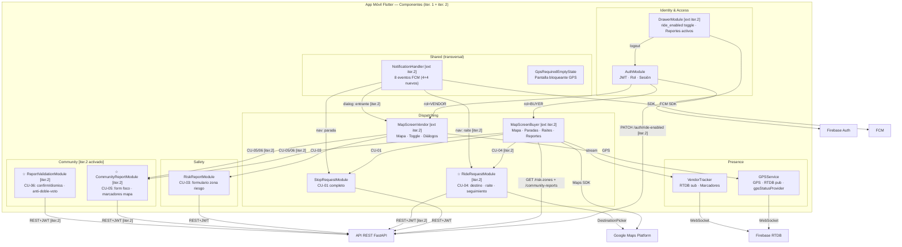
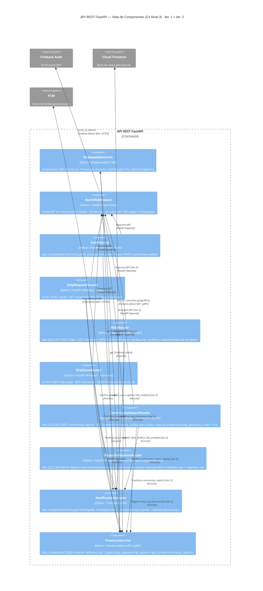
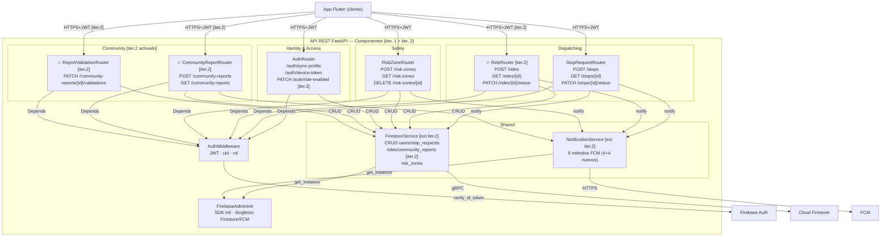
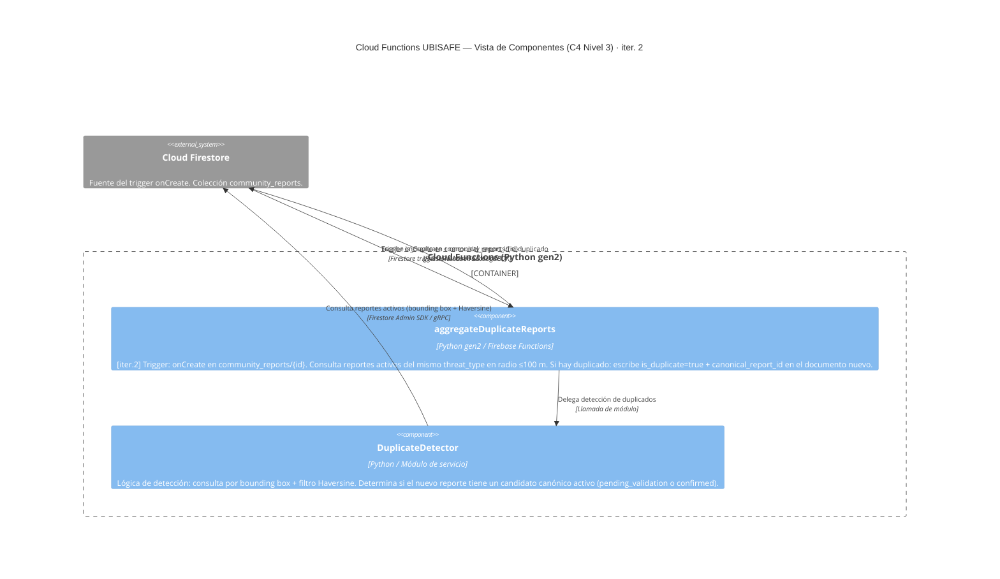
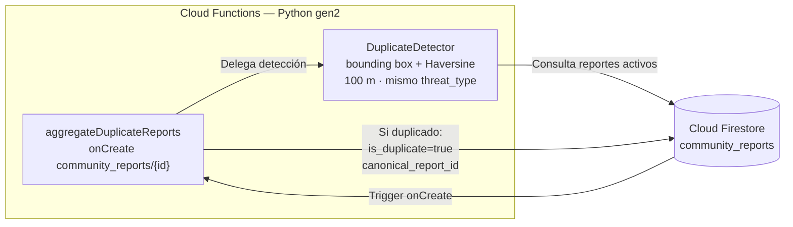

# SDD2_FASE2_UBISAFE.md
## Fase 2' — C4 Nivel 3 ampliado + Estructura de carpetas (Iteración 2)
### Los Borbotones · UBISAFE · 24/04/2026

> **Propósito de este archivo:** Extensión de `SDD_FASE2_PASO25_UBISAFE.md` para reflejar los componentes nuevos y extendidos de iter. 2. No repite el contenido de iter. 1 — lo complementa y marca los cambios con **[iter. 2]**. Alexis debe integrar este contenido sobre las secciones §5 y §11 existentes.
>
> **Archivos base leídos:** `SDD_FASE2_UBISAFE.md` (C4 L3 iter. 1) · `SDD_FASE2_PASO25_UBISAFE.md` (reorganización domain-first iter. 1) · `SDD2_FASE1_UBISAFE.md` (C4 L1–L2 iter. 2) · `SDD2_FASE0_UBISAFE.md` (decisiones iter. 2)

---

## PASO 2'.1 — TABLA DE MAPEO DOMINIO → COMPONENTES (actualizada iter. 2)

> **Nota de integración:** Reemplaza la tabla de §5.3 «Tabla de mapeo dominio → componentes» de `SDD_FASE2_PASO25_UBISAFE.md`. Las filas son idénticas a las de iter. 1; se añaden las columnas de iter. 2 y la fila Cloud Functions.

| Dominio | Flutter — iter. 1 | Flutter — iter. 2 **[nuevo]** | FastAPI — iter. 1 | FastAPI — iter. 2 **[nuevo]** | Cloud Functions |
|---|---|---|---|---|---|
| **Identity & Access** | AuthModule, DrawerModule ¹ | — | AuthMiddleware, AuthRouter ¹ | — | — |
| **Presence** | GPSService, VendorTracker | — | *(vacío — GPS directo a RTDB, ADR #2)* | — | — |
| **Dispatching** | MapScreenBuyer ¹, MapScreenVendor ¹, StopRequestModule | **RideRequestModule** | StopRequestRouter | **RideRouter** | — |
| **Safety** | RiskReportModule | — | RiskZoneRouter | — | — |
| **Community** | *(vacío en iter. 1)* | **CommunityReportModule, ReportValidationModule** | *(vacío en iter. 1)* | **CommunityReportRouter, ReportValidationRouter** | **aggregateDuplicateReports** |
| **Shared** | NotificationHandler ¹, GpsRequiredEmptyState | — | FirebaseAdminInit, FirestoreService ¹, NotificationService ¹ | — | — |

> ¹ Componente existente de iter. 1 **extendido** en iter. 2 (ver §PASO 2'.4).
>
> **Resumen iter. 2:** +4 componentes Flutter · +3 componentes FastAPI · +1 contenedor Cloud Functions con 1 función. El dominio **Community** queda activado. Total del sistema tras iter. 2: **14 componentes Flutter + 10 componentes FastAPI + 1 función Cloud Functions**.

---

## PASO 2'.2 — DIAGRAMAS C4 NIVEL 3 ACTUALIZADOS [iter. 2]

---

### 2'.2.1 — App Móvil Flutter — C4 L3 extendido [iter. 2]

> **Cambios respecto a iter. 1:** Se añaden `RideRequestModule` (Dispatching), `CommunityReportModule` y `ReportValidationModule` (Community). Se extienden `DrawerModule`, `MapScreenBuyer`, `MapScreenVendor` y `NotificationHandler`. El resto de componentes permanece sin cambio estructural.

```mermaid
C4Component
  title App Móvil Flutter — Vista de Componentes (C4 Nivel 3) · iter. 1 + iter. 2

  Container_Boundary(app_flutter, "App Móvil Flutter") {

    %% ── Identity & Access ────────────────────────────────────────────
    Component(auth_module, "AuthModule", "Dart / Firebase Auth SDK", "Registro, login, JWT, cierre de sesión. Decide qué HomeScreen mostrar según el rol.")
    Component(drawer_module, "DrawerModule", "Dart / Flutter Widget", "[iter.2 extendido] Menú lateral. Provee toggle ride_enabled (VENDOR) y acceso a Reportes activos. Cerrar Sesión, Mi Perfil, Historial.")

    %% ── Presence ─────────────────────────────────────────────────────
    Component(gps_service, "GPSService", "Dart / geolocator + RTDB SDK", "Publica posición GPS del vendedor en RTDB. Provee gpsStatusProvider para toda la app.")
    Component(vendor_tracker, "VendorTracker", "Dart / Firebase RTDB SDK", "Suscripción en tiempo real al árbol de vendedores activos en RTDB. Emite stream de marcadores.")

    %% ── Dispatching ──────────────────────────────────────────────────
    Component(map_screen_buyer, "MapScreenBuyer", "Dart / Flutter + Maps SDK", "[iter.2 extendido] Mapa del Comprador. Solicita paradas (CU-01), solicita raites (CU-04), muestra reportes comunitarios (CU-05/06).")
    Component(map_screen_vendor, "MapScreenVendor", "Dart / Flutter + Maps SDK", "[iter.2 extendido] Mapa del Vendedor. Toggle GPS, diálogos de parada y raite entrantes, reportes comunitarios.")
    Component(stop_request_module, "StopRequestModule", "Dart / HTTP Client", "Ciclo de vida CU-01: crear solicitud, timeout 60s, seguimiento en tiempo real.")
    Component(ride_request_module, "RideRequestModule", "Dart / HTTP Client + Maps SDK", "[iter.2] Ciclo de vida CU-04: selección de destino (DestinationPicker), creación de ride, aceptación/rechazo, seguimiento en tiempo real.")

    %% ── Safety ───────────────────────────────────────────────────────
    Component(risk_report_module, "RiskReportModule", "Dart / Flutter + HTTP Client", "CU-03: formulario de zona de riesgo, envío a /risk-zones.")

    %% ── Community ────────────────────────────────────────────────────
    Component(community_report_module, "CommunityReportModule", "Dart / Flutter + HTTP Client", "[iter.2] CU-05: formulario de foco de infección. Renderiza reportes comunitarios en mapa con marcadores negro/café.")
    Component(report_validation_module, "ReportValidationModule", "Dart / HTTP Client", "[iter.2] CU-06: envío de voto confirm/dismiss. Bloquea doble voto y voto propio.")

    %% ── Shared ───────────────────────────────────────────────────────
    Component(notification_handler, "NotificationHandler", "Dart / Firebase Messaging SDK", "[iter.2 extendido] FCM init, token refresh. Maneja 8 tipos de evento: 4 iter.1 + 4 iter.2 (raite + reporte comunitario).")
    Component(gps_empty_state, "GpsRequiredEmptyState", "Dart / Flutter ConsumerWidget", "Pantalla bloqueante reutilizable cuando GPS no disponible. Observa gpsStatusProvider.")
  }

  System_Ext(firebase_auth_ext, "Firebase Auth", "Autenticación JWT.")
  System_Ext(rtdb_ext, "Firebase RTDB", "Posiciones GPS en tiempo real.")
  System_Ext(fcm_ext, "FCM", "Notificaciones push.")
  System_Ext(googlemaps_ext, "Google Maps Platform", "Mapa base, marcadores, rutas.")
  System_Ext(api_fastapi_ext, "API REST FastAPI", "Backend. Endpoints CU-01/03/04/05/06.")

  Rel(auth_module, firebase_auth_ext, "Registro e inicio de sesión", "Firebase Auth SDK")
  Rel(auth_module, map_screen_buyer, "Navega si rol=BUYER", "Flutter Navigation")
  Rel(auth_module, map_screen_vendor, "Navega si rol=VENDOR", "Flutter Navigation")

  Rel(map_screen_buyer, vendor_tracker, "Stream marcadores vendedores", "Stream reactivo")
  Rel(map_screen_buyer, stop_request_module, "Inicia CU-01 al seleccionar vendedor", "Llamada directa")
  Rel(map_screen_buyer, ride_request_module, "Inicia CU-04 si vendedor ride_enabled [iter.2]", "Llamada directa")
  Rel(map_screen_buyer, community_report_module, "Muestra reportes y abre formulario CU-05 [iter.2]", "Llamada directa")
  Rel(map_screen_buyer, risk_report_module, "Abre formulario CU-03 vía FAB", "Flutter Navigation")
  Rel(map_screen_buyer, googlemaps_ext, "Mapa, marcadores, zonas, rutas", "Maps SDK Flutter")
  Rel(map_screen_buyer, api_fastapi_ext, "GET /risk-zones · GET /community-reports [iter.2]", "HTTPS/REST+JWT")

  Rel(map_screen_vendor, gps_service, "Activa/desactiva GPS", "Llamada directa")
  Rel(map_screen_vendor, risk_report_module, "Abre formulario CU-03 vía FAB", "Flutter Navigation")
  Rel(map_screen_vendor, community_report_module, "Muestra reportes y abre formulario CU-05 [iter.2]", "Llamada directa")
  Rel(map_screen_vendor, googlemaps_ext, "Mapa, ruta de navegación segura", "Maps SDK Flutter")

  Rel(gps_service, rtdb_ext, "Publica/elimina posición GPS", "RTDB SDK / WebSocket")
  Rel(vendor_tracker, rtdb_ext, "Suscribe árbol vendedores activos", "RTDB SDK / WebSocket")

  Rel(stop_request_module, api_fastapi_ext, "POST /stops · GET /stops/{id} · PATCH /stops/{id}/status", "HTTPS/REST+JWT")
  Rel(ride_request_module, api_fastapi_ext, "POST /rides · GET /rides/{id} · PATCH /rides/{id}/status [iter.2]", "HTTPS/REST+JWT")
  Rel(ride_request_module, googlemaps_ext, "DestinationPicker: renderiza mapa de selección [iter.2]", "Maps SDK Flutter")
  Rel(risk_report_module, api_fastapi_ext, "POST /risk-zones", "HTTPS/REST+JWT")
  Rel(community_report_module, api_fastapi_ext, "POST /community-reports · GET /community-reports [iter.2]", "HTTPS/REST+JWT")
  Rel(report_validation_module, api_fastapi_ext, "PATCH /community-reports/{id}/validations [iter.2]", "HTTPS/REST+JWT")

  Rel(notification_handler, fcm_ext, "Recibe push del dispositivo", "Firebase Messaging SDK")
  Rel(notification_handler, stop_request_module, "Navega a seguimiento (stop_request_accepted)", "Flutter Navigation")
  Rel(notification_handler, map_screen_vendor, "Muestra dialog parada/raite entrante [iter.2]", "Flutter Navigation")
  Rel(notification_handler, ride_request_module, "Navega a seguimiento raite (ride_request_accepted) [iter.2]", "Flutter Navigation")

  Rel(drawer_module, auth_module, "Cierre de sesión", "Llamada directa")
  Rel(drawer_module, api_fastapi_ext, "PATCH /auth/ride-enabled (toggle VENDOR) [iter.2]", "HTTPS/REST+JWT")
```



#### Diagrama alternativo (flowchart) — para editores sin soporte C4 nativo [iter. 2]



---

### 2'.2.2 — API REST FastAPI — C4 L3 extendido [iter. 2]

> **Cambios respecto a iter. 1:** Se añaden `RideRouter` (Dispatching), `CommunityReportRouter` y `ReportValidationRouter` (Community). Se extienden `FirestoreService` y `NotificationService` con métodos para las nuevas colecciones.



#### Diagrama alternativo (flowchart) [iter. 2]



---

### 2'.2.3 — Cloud Functions — C4 L3 NUEVO [iter. 2]

> El contenedor Cloud Functions fue descrito estructuralmente en `SDD2_FASE1_UBISAFE.md §4.2.5`. Este diagrama descompone su único componente activo en iter. 2.



#### Diagrama alternativo (flowchart)



---

## PASO 2'.3 — DESCRIPCIONES DE COMPONENTES NUEVOS [iter. 2]

> **Nota de integración:** Añadir estos componentes en §5.3 inmediatamente después de sus dominios correspondientes (Dispatching §5.3.3, Community §5.3.5).

---

### Dominio: Dispatching — componentes nuevos

---

#### 5.3.3.5. RideRequestModule *(Flutter)* **[iter. 2]**

| Atributo | Detalle |
|---|---|
| **Nombre** | RideRequestModule |
| **Tipo** | Módulo de flujo / caso de uso |
| **Tecnología** | Dart · HTTP Client (dio) · Google Maps SDK for Flutter · Flutter Navigation |
| **Responsabilidad principal** | Gestionar el flujo completo del Caso de Uso CU-04 desde el lado del Comprador: selección interactiva del destino, creación de la solicitud de raite, manejo de respuesta del vendedor y seguimiento en tiempo real del viaje. |

**Responsabilidades detalladas:**

RideRequestModule es invocado desde `MapScreenBuyer` cuando el comprador toca el marcador de un vendedor que tiene `ride_enabled: true`. El módulo inicia el sub-flujo de selección de destino a través del widget `DestinationPicker`, que renderiza un mapa de Google Maps con un pin draggable para que el comprador indique el punto de llegada. Una vez el comprador confirma el destino, RideRequestModule valida que la distancia origen-destino sea ≤ 4 km (validación local antes de enviar); si supera el límite, muestra un mensaje de error sin llegar al API.

Al confirmar, envía `POST /rides` al API FastAPI con `vendor_uid`, `pickup_location` (posición actual del comprador), `destination` y el `buyer_uid` del JWT. La API responde con el `ride_id` y estado `pending`. RideRequestModule inicia un temporizador de **60 segundos** (CA-04.3): si el vendedor no responde antes, cancela la solicitud automáticamente con `PATCH /rides/{id}/status → expired` y notifica al comprador.

Al recibir el evento FCM `ride_request_accepted`, navega a la pantalla de seguimiento de raite reutilizando `TrackingScreen` (la misma pantalla de seguimiento de CU-01 con el rol `rider`). Al recibir `ride_request_rejected`, vuelve a `MapScreenBuyer` con un toast de feedback.

**Degradación ante pérdida de conexión (CA-04.4):** Si durante el raite activo se pierde la conexión GPS o de red, RideRequestModule muestra como fallback estático los campos `pickup_location` y `destination` del documento `rides` (ya descargados al iniciar el viaje). Notifica a ambos actores con el mensaje "Conexión perdida. Mostrando última ubicación conocida." e intenta reconectar automáticamente (comportamiento análogo al de `StopRequestModule` en CU-01).

**Widget DestinationPicker:**

Sub-widget interno de RideRequestModule presentado como bottom sheet o pantalla modal. Renderiza un mapa de Google Maps centrado en la posición actual del comprador. Permite arrastrar un pin para seleccionar el destino. Muestra la distancia estimada al destino en tiempo real. Tiene botón "Confirmar destino" que devuelve las coordenadas seleccionadas al flujo de RideRequestModule. Ubicación de archivo: `lib/features/dispatching/widgets/destination_picker.dart`.

**Interfaces expuestas:**

- `createRideRequest(vendorId, buyerLocation, destination) → Future<Ride>` — Crea y retorna la solicitud de raite.
- `cancelRideRequest(rideId) → Future<void>` — Cancela una solicitud pendiente (timeout o acción del usuario).
- `Stream<RideStatus> rideStatusStream(rideId)` — Stream del estado del raite.

**Dependencias:** API FastAPI (`POST /rides`, `GET /rides/{id}`, `PATCH /rides/{id}/status`), NotificationHandler (FCM `ride_request_accepted` / `ride_request_rejected`), Google Maps SDK Flutter (DestinationPicker), AuthModule (JWT).

---

#### 5.3.3.6. RideRouter *(FastAPI)* **[iter. 2]**

| Atributo | Detalle |
|---|---|
| **Nombre** | RideRouter |
| **Tipo** | FastAPI APIRouter |
| **Prefijo de ruta** | `/rides` |
| **Responsabilidad principal** | Exponer los endpoints REST del ciclo de vida completo de una solicitud de raite (CU-04). Verificar precondiciones de negocio (ride_enabled, disponibilidad, distancia) antes de crear la solicitud. |

**Endpoints expuestos:**

| Método | Ruta | Descripción |
|---|---|---|
| `POST` | `/rides` | Crea solicitud de raite. Requiere rol=BUYER. Verifica que el vendedor tenga `ride_enabled: true` y no tenga rides en estado `pending`, `accepted` o `in_progress`. Verifica que la distancia origen-destino sea ≤ 4 km. Crea documento en `rides` con estado `pending`. Envía FCM `ride_request_incoming` al vendedor. Timeout: 60 s gestionado por el cliente. |
| `GET` | `/rides/{ride_id}` | Consulta el estado actual del raite. Accesible solo por el comprador que lo creó o el vendedor asignado (control de acceso por `buyer_uid` / `vendor_uid`). |
| `PATCH` | `/rides/{ride_id}/status` | Actualiza el estado del raite. Transiciones permitidas: `pending → accepted` (VENDOR) · `pending → rejected` (VENDOR) · `accepted → in_progress` (VENDOR) · `in_progress → completed` (VENDOR) · `pending → expired` (sistema/timeout). Envía FCM al comprador al aceptar (`ride_request_accepted`) o rechazar (`ride_request_rejected`). |

**Reglas de negocio críticas:**

- Si el vendedor ya tiene una solicitud de parada activa (`stop_requests` con estado `pending` o `accepted`) **o un raite activo** (`rides` con estado `pending`, `accepted` o `in_progress`), `POST /rides` responde `409 Conflict` con mensaje "Vendedor ocupado con otra solicitud activa". Se usa `FirestoreService.get_active_rides_for_vendor(vendor_uid)` para verificar ambas condiciones. (Condición 3A del SRS: "el vendedor tiene una solicitud a parada activa, ya está dando un raite o la zona no es segura".)
- La ruta calculada para el raite debe evitar zonas de riesgo `HIGH` y `MEDIUM` (CA-04.2). La validación geográfica de la ruta se delega a Google Maps Directions API desde el cliente Flutter; FastAPI registra la ruta recibida sin recalcularla.

**Dependencias:** AuthMiddleware, FirestoreService (colecciones `rides`, `users`), NotificationService (`notify_ride_request_incoming`, `notify_ride_request_accepted`, `notify_ride_request_rejected`).

---

### Dominio: Community — ACTIVADO [iter. 2]

**Responsabilidad del dominio:** Gestionar los reportes comunitarios de focos de infección sanitaria y su ciclo de validación colectiva (CU-05 y CU-06). Provee la capa de confianza comunitaria de UBISAFE mediante votación simple con umbral.

---

#### 5.3.5.1. CommunityReportModule *(Flutter)* **[iter. 2]**

| Atributo | Detalle |
|---|---|
| **Nombre** | CommunityReportModule |
| **Tipo** | Módulo de flujo / caso de uso + Widget de visualización |
| **Tecnología** | Dart · Flutter · HTTP Client (dio) · Google Maps SDK for Flutter |
| **Responsabilidad principal** | Implementar el flujo de reporte de foco de infección (CU-05): capturar tipo de foco y ubicación, enviar el reporte a la API. Renderizar en el mapa los reportes comunitarios activos con marcadores diferenciados por tipo y estado. |

**Responsabilidades detalladas:**

CommunityReportModule tiene dos responsabilidades: (1) **formulario de creación** (CU-05) y (2) **visualización de reportes** en el mapa.

Para la **creación** (CU-05): el módulo se activa desde el FAB "+" en ambas HomeScreens (MapScreenBuyer y MapScreenVendor) con un ícono distinto al del FAB de CU-03 para evitar confusión. Presenta una bottom sheet con el formulario: selector de tipo de foco (`animal_muerto` / `zona_sucia`), coordenadas auto-completadas con la posición GPS actual (no editables por el usuario — el foco se reporta en el sitio del usuario). Al confirmar, envía `POST /community-reports` al API FastAPI. Muestra confirmación visual de éxito o error de red. Implementa retry automático ante pérdida de conexión (CA-05.4): guarda el payload en memoria y reintenta hasta 3 veces con backoff exponencial.

Para la **visualización** en el mapa: consulta `GET /community-reports` con bounding box de la vista actual del mapa al cargar MapScreenBuyer o MapScreenVendor. Renderiza marcadores según `threat_type` y `status`:

| threat_type | status | Color del marcador | Leyenda |
|---|---|---|---|
| `animal_muerto` | `pending_validation` | Negro | "Pendiente" |
| `animal_muerto` | `confirmed` | Negro oscuro / saturado | "Validado" |
| `zona_sucia` | `pending_validation` | Café / marrón | "Pendiente" |
| `zona_sucia` | `confirmed` | Café oscuro / saturado | "Validado" |
| cualquiera | `dismissed` | Gris atenuado | *(oculto o transparente)* |

Los reportes con `is_duplicate: true` no se muestran como marcadores independientes; se agrupan visualmente con su reporte canónico (CA-05.3) mostrando un contador de "N reportes similares en esta zona".

Al tocar un marcador de reporte comunitario, abre un panel de detalle que invoca `ReportValidationModule` para que el usuario pueda validar o desmentir (CU-06).

**Interfaces expuestas:**

- `openReportForm(context, currentLocation) → Future<void>` — Abre el formulario de creación de reporte como bottom sheet modal.
- `fetchReports(boundingBox) → Future<List<CommunityReport>>` — Consulta reportes activos por área del mapa.
- `Stream<List<CommunityReport>> reportsStream` — Stream actualizado de reportes visibles en el mapa.

**Dependencias:** API FastAPI (`POST /community-reports`, `GET /community-reports`), GPSService (posición actual), AuthModule (JWT), ReportValidationModule (panel de detalle → validación), Google Maps SDK Flutter (marcadores en mapa).

---

#### 5.3.5.2. ReportValidationModule *(Flutter)* **[iter. 2]**

| Atributo | Detalle |
|---|---|
| **Nombre** | ReportValidationModule |
| **Tipo** | Módulo de flujo / caso de uso |
| **Tecnología** | Dart · HTTP Client (dio) · Flutter |
| **Responsabilidad principal** | Gestionar la interacción de validación o refutación de un reporte comunitario (CU-06): presentar las opciones al usuario, enviar el voto al API y actualizar visualmente el estado del reporte en el mapa. |

**Responsabilidades detalladas:**

ReportValidationModule es invocado desde el panel de detalle de un marcador de reporte comunitario (abierto por `CommunityReportModule`). Presenta dos botones de acción: "Confirmar reporte" y "Es falso / Desmentir", junto con la información del reporte (tipo, fecha, contadores actuales de confirmaciones y rechazos).

Antes de enviar el voto, aplica validaciones de negocio en el cliente:
1. **Proximidad:** si la distancia entre `currentUser.location` (de `GPSService`) y `report.location` es > 4 km, oculta los botones y muestra el mensaje "Debes estar a menos de 4 km del reporte para validarlo" (la API también lo bloquea con `403`, pero el cliente evita la llamada innecesaria). (Pre-condición de CU-06 en SRS.)
2. **Anti-voto propio:** si `report.reporter_uid == currentUser.uid`, oculta los botones y muestra el mensaje "No puedes validar tu propio reporte" (la API también lo bloquea con `403`, pero el cliente evita la llamada innecesaria).
3. **Anti-doble-voto:** si el `uid` del usuario ya está en el array `validations[]` del reporte (consultado del documento local), oculta los botones y muestra "Ya validaste este reporte".

Al confirmar la acción, envía `PATCH /community-reports/{id}/validations` con el payload `{vote: "confirm" | "dismiss"}`. Si la respuesta incluye un nuevo `status` (`confirmed` o `dismissed`), actualiza el marcador en el mapa (cambia color/leyenda) a través del stream de `CommunityReportModule`. Implementa retry automático ante pérdida de conexión (CA-06.1).

**Interfaces expuestas:**

- `openValidationPanel(context, report) → Future<void>` — Abre el panel de validación como bottom sheet modal.

**Dependencias:** API FastAPI (`PATCH /community-reports/{id}/validations`), AuthModule (JWT + `currentUser.uid`), CommunityReportModule (actualización del stream de marcadores).

---

#### 5.3.5.3. CommunityReportRouter *(FastAPI)* **[iter. 2]**

| Atributo | Detalle |
|---|---|
| **Nombre** | CommunityReportRouter |
| **Tipo** | FastAPI APIRouter |
| **Prefijo de ruta** | `/community-reports` |
| **Responsabilidad principal** | Gestionar la creación y consulta de reportes comunitarios de focos de infección (CU-05). |

**Endpoints expuestos:**

| Método | Ruta | Descripción |
|---|---|---|
| `POST` | `/community-reports` | Crea un reporte de foco. Requiere JWT (ambos roles). Valida que la ubicación del reporte esté a ≤ 4 km de la posición actual del usuario (CA-05.2). Crea documento en `community_reports` con `status: pending_validation`, `radius_m: 15` (fijo, ADR #7/ADR #11), `reporter_uid`, `threat_type`, `location (GeoPoint)` y `created_at`. Envía FCM `community_report_nearby` a usuarios activos en radio 4 km. |
| `GET` | `/community-reports` | Lista reportes activos (`status: pending_validation` o `confirmed`) en un bounding box geográfico. Acepta parámetros `lat`, `lng`, `radius_km`. Excluye reportes en estado `dismissed` y `expired`. |

**Reglas de negocio:**

- El campo `is_duplicate` y `canonical_report_id` lo escribe **Cloud Functions** (post-creación), no este router. El router crea el documento con `is_duplicate: false` por defecto.
- Los valores del enum `threat_type` (`animal_muerto` / `zona_sucia`) corresponden a los tipos descritos en SRS CU-05 ("animal muerto" y "basura dispersa por perros"). El identificador `zona_sucia` es la clave técnica interna; la etiqueta visible en la UI debe mostrar "Basura/zona sucia" o equivalente legible (ver ADR #7 en Fase 3B).
- La expiración de reportes (`status → expired`) ocurre a las **24 horas** de creación. Se implementa mediante un TTL en Firestore o una Cloud Function Scheduled (iter. futura); en iter. 2, la expiración es responsabilidad de la función de limpieza o del cliente al filtrar por `created_at`.

**Dependencias:** AuthMiddleware, FirestoreService (colección `community_reports`, lectura de posición del usuario), NotificationService (`notify_community_report_nearby`).

---

#### 5.3.5.4. ReportValidationRouter *(FastAPI)* **[iter. 2]**

| Atributo | Detalle |
|---|---|
| **Nombre** | ReportValidationRouter |
| **Tipo** | FastAPI APIRouter |
| **Prefijo de ruta** | `/community-reports/{report_id}/validations` |
| **Responsabilidad principal** | Gestionar los votos de validación sobre reportes comunitarios (CU-06). Aplicar las reglas de transición de estado según los umbrales de confianza. |

**Endpoints expuestos:**

| Método | Ruta | Descripción |
|---|---|---|
| `PATCH` | `/community-reports/{report_id}/validations` | Registra un voto. Body: `{vote: "confirm" \| "dismiss"}`. Protegido con JWT (ambos roles). |

**Lógica de negocio detallada:**

1. **Proximidad:** calcula distancia Haversine entre la ubicación actual del validador (`request.user.location`) y `report.location`. Si la distancia es > 4 km → `403 Forbidden` con mensaje `"Debes estar a menos de 4 km del reporte para validarlo"`. (Pre-condición de CU-06 en SRS.)
2. **Anti-voto propio:** si `validator_uid == report.reporter_uid` → `403 Forbidden` con mensaje `"No puedes validar tu propio reporte"`.
3. **Anti-doble-voto:** si `validator_uid` ya existe en el array `validations[]` → `409 Conflict` con mensaje `"Ya validaste este reporte"`.
4. **Estado activo:** si `report.status != "pending_validation"` → `409 Conflict` con mensaje `"Este reporte ya no está disponible para validación"`. (Excepción E2 del SRS.)
5. **Registro del voto:** añade `{validator_uid, vote, timestamp}` al array `validations[]`. Incrementa `confirm_count` o `dismiss_count` según el voto.
6. **Transición de estado:**
   - Si `confirm_count ≥ 3` → `status = confirmed`
   - Si `dismiss_count ≥ 3` → `status = dismissed`
   - En caso contrario → `status` permanece `pending_validation`
7. Retorna el documento actualizado con el nuevo `status`, `confirm_count` y `dismiss_count`.

**Dependencias:** AuthMiddleware, FirestoreService (colección `community_reports` — lectura del reporte y actualización atómica del array de votaciones).

---

### Cloud Functions — aggregateDuplicateReports **[iter. 2]**

> **Nota de integración:** La descripción completa de este componente se encuentra en `SDD2_FASE1_UBISAFE.md §4.2.5`. Este párrafo provee la referencia de nivel C4 L3.

| Atributo | Detalle |
|---|---|
| **Nombre** | `aggregateDuplicateReports` |
| **Contenedor** | Cloud Functions (Python gen2) |
| **Trigger** | Firestore `onCreate` en `community_reports/{id}` |
| **Responsabilidad** | Detecta si el nuevo reporte es un duplicado espacial de otro reporte activo del mismo `threat_type` en radio ≤ 100 m. Si es duplicado: escribe `is_duplicate: true` + `canonical_report_id` en el documento recién creado. |
| **Módulo interno** | `DuplicateDetector` (`services/duplicate_detector.py`) — implementa la consulta por bounding box + filtro Haversine. |
| **Solo interactúa con** | Cloud Firestore (Firestore Admin SDK). **No llama a FastAPI ni a FCM.** |

---

## PASO 2'.4 — EXTENSIONES A COMPONENTES EXISTENTES [iter. 2]

> **Nota de integración:** Añadir estas extensiones al final de la descripción del componente correspondiente en §5.3 de `SDD_FASE2_PASO25_UBISAFE.md`. Usar el marcador `[iter. 2]` para distinguirlas del texto original.

---

### DrawerModule *(Flutter / Identity & Access)* — extendido [iter. 2]

**Extensiones en iter. 2:**

DrawerModule añade dos nuevas entradas al menú lateral en iter. 2:

1. **Toggle `ride_enabled`** (solo visible para rol=VENDOR): un `SwitchListTile` con el label "Ofrecer raites" que refleja el estado actual del campo `ride_enabled` en el perfil del usuario. Al cambiar el estado, envía `PATCH /auth/ride-enabled` con `{ride_enabled: true | false}` al API FastAPI, que actualiza el campo en `users/{uid}` en Firestore. Persiste en Firestore entre sesiones (ADR: ride_enabled location = Drawer). Si la llamada falla, revierte el estado visual del toggle y muestra un snackbar de error.

2. **"Reportes activos"** (ambos roles): entrada de navegación al listado de reportes comunitarios del usuario. Navega a `CommunityReportsHistoryScreen` (parte del dominio Community).

**Nuevas dependencias:** API FastAPI (`PATCH /auth/ride-enabled`).

---

### MapScreenBuyer *(Flutter / Dispatching)* — extendido [iter. 2]

**Extensiones en iter. 2:**

Al tocar el marcador de un vendedor, MapScreenBuyer verifica `vendor.ride_enabled` (incluido en los metadatos del `VendorMarker`). Si es `true`, el bottom sheet de selección de acción ofrece dos opciones: "Solicitar parada" (CU-01, flujo existente) y "Solicitar raite" (CU-04, invoca `RideRequestModule`). Si `ride_enabled` es `false`, solo aparece "Solicitar parada".

Además, al iniciar la pantalla, carga los reportes comunitarios activos del bounding box visible consultando `GET /community-reports` y los pasa a `CommunityReportModule` para que los renderice como marcadores en el mapa. Al mover el mapa (pan/zoom), recarga los reportes del nuevo bounding box (con debounce de 500 ms para no saturar la API).

El FAB "+" ahora despliega un `SpeedDial` (o similar) con dos sub-acciones: "Reportar zona de riesgo" (ícono shield → `RiskReportModule`) y "Reportar foco de infección" (ícono biohazard → `CommunityReportModule.openReportForm()`).

**Nuevas dependencias:** `RideRequestModule`, `CommunityReportModule`, API FastAPI (`GET /community-reports`).

---

### MapScreenVendor *(Flutter / Dispatching)* — extendido [iter. 2]

**Extensiones en iter. 2:**

Al recibir el evento FCM `ride_request_incoming`, `NotificationHandler` llama a `MapScreenVendor` para que muestre un diálogo de solicitud de raite análogo al diálogo existente de parada. El diálogo muestra: nombre del comprador, punto de recogida, destino seleccionado y distancia estimada. El vendedor puede aceptar o rechazar. Si acepta, invoca `PATCH /rides/{id}/status → accepted` y navega a la pantalla de tracking del raite.

Al igual que en `MapScreenBuyer`, renderiza marcadores de reportes comunitarios activos en el mapa y ofrece el sub-menú en el FAB "+" para CU-03 y CU-05.

**Nuevas dependencias:** API FastAPI (`PATCH /rides/{id}/status`, `GET /community-reports`), `CommunityReportModule`.

---

### NotificationHandler *(Flutter / Shared)* — extendido [iter. 2]

**Extensiones en iter. 2:**

Se añaden 4 nuevos tipos de evento FCM al router de NotificationHandler:

| Evento FCM | Acción en la app |
|---|---|
| `ride_request_incoming` | Llama a `MapScreenVendor` para mostrar el diálogo de raite entrante |
| `ride_request_accepted` | Llama a `RideRequestModule` para navegar a la pantalla de tracking del raite |
| `ride_request_rejected` | Muestra un `SnackBar` / notificación de rechazo y vuelve a `MapScreenBuyer` |
| `community_report_nearby` | Muestra una alerta informativa de nuevo foco comunitario a ≤ 4 km; no fuerza navegación |

**Total de tipos de evento FCM tras iter. 2:** 8 (4 de iter. 1: `stop_request_incoming`, `stop_request_accepted`, `stop_request_rejected`, `risk_zone_alert` + 4 nuevos de iter. 2).

**Nuevas dependencias:** `RideRequestModule` (navegación al tracking de raite).

---

### FirestoreService *(FastAPI / Shared)* — extendido [iter. 2]

**Extensiones en iter. 2:**

Se añaden los siguientes métodos para las colecciones nuevas:

**Colección `rides`:**

- `create_ride(data) → Ride` — Crea un documento en `rides` con estado `pending`.
- `get_ride(ride_id) → Ride` — Consulta un ride por ID.
- `update_ride_status(ride_id, status) → Ride` — Actualiza el estado; valida la transición (máquina de estados).
- `get_active_rides_for_vendor(vendor_uid) → List[Ride]` — Consulta rides activos (`pending`, `accepted`, `in_progress`) para un vendedor dado.

**Colección `community_reports`:**

- `create_community_report(data) → CommunityReport` — Crea el reporte con estado `pending_validation` y `is_duplicate: false`.
- `get_community_reports_in_bbox(lat, lng, radius_km, statuses) → List[CommunityReport]` — Consulta reportes activos en bounding box geográfico.
- `add_validation(report_id, validator_uid, vote) → CommunityReport` — Operación atómica: añade al array `validations[]`, incrementa contador, aplica transición de estado.
- `get_community_report(report_id) → CommunityReport` — Consulta un reporte por ID.

**Campo `ride_enabled` en `users`:**

- `update_ride_enabled(uid, value: bool) → None` — Actualiza el campo `ride_enabled` en `users/{uid}`.
- `get_user_ride_enabled(uid) → bool` — Lee el campo `ride_enabled` del perfil del vendedor.

---

### NotificationService *(FastAPI / Shared)* — extendido [iter. 2]

**Extensiones en iter. 2:**

Se añaden los siguientes métodos semánticos para los eventos de iter. 2:

**Nuevas interfaces expuestas:**

- `notify_ride_request_incoming(vendor_uid, ride_data) → None` — FCM al vendedor cuando llega solicitud de raite.
- `notify_ride_request_accepted(buyer_uid, ride_data) → None` — FCM al comprador cuando el vendedor acepta.
- `notify_ride_request_rejected(buyer_uid, reason) → None` — FCM al comprador cuando el vendedor rechaza.
- `notify_community_report_nearby(user_uids: List[str], report_data) → None` — FCM a usuarios en radio 4 km del nuevo reporte. Se usa `messaging.send_each()` para el envío masivo.

**Total de métodos en NotificationService tras iter. 2:** 8 (4 iter. 1 + 4 nuevos).

---

## PASO 2'.5 — §11 ESTRUCTURA DE CARPETAS ACTUALIZADA [iter. 2]

> **Nota de integración:** Reemplaza §11 de `SDD_FASE2_PASO25_UBISAFE.md`. Los cambios son: (1) activación de `lib/features/community/`, (2) activación de `modules/community/`, (3) extensiones menores a dominios existentes, (4) nueva carpeta raíz `functions/`.

---

### 11.1. Estructura del proyecto Flutter — actualizada [iter. 2]

```
ubisafe_app/
├── lib/
│   ├── main.dart
│   │
│   ├── core/
│   │   ├── api/
│   │   │   └── api_client.dart
│   │   └── design_system/
│   │       ├── colors.dart
│   │       ├── typography.dart
│   │       ├── spacing.dart
│   │       └── theme.dart
│   │
│   ├── features/
│   │   │
│   │   ├── identity/                          # 🔐 Identity & Access
│   │   │   ├── auth/
│   │   │   │   ├── auth_module.dart
│   │   │   │   └── screens/
│   │   │   │       ├── welcome_screen.dart
│   │   │   │       ├── login_screen.dart
│   │   │   │       └── signup_screen.dart
│   │   │   └── profile/
│   │   │       ├── screens/
│   │   │       │   ├── profile_screen.dart
│   │   │       │   └── history_screen.dart
│   │   │       └── widgets/
│   │   │           └── drawer_module.dart     # [iter.2] +toggle ride_enabled +Reportes activos
│   │   │
│   │   ├── presence/                          # 📡 Presence
│   │   │   ├── services/
│   │   │   │   ├── gps_service.dart
│   │   │   │   └── vendor_tracker.dart
│   │   │   └── models/
│   │   │       └── vendor_marker.dart         # [iter.2] +campo ride_enabled en VendorMarker
│   │   │
│   │   ├── dispatching/                       # 🗺️ Dispatching
│   │   │   ├── screens/
│   │   │   │   ├── map_screen_buyer.dart      # [iter.2 ext] +SpeedDial FAB +raite +reportes comunit.
│   │   │   │   ├── map_screen_vendor.dart     # [iter.2 ext] +diálogo raite entrante +reportes comunit.
│   │   │   │   └── tracking_screen.dart       # Reutilizada para raite (CU-04) sin cambio estructural
│   │   │   ├── services/
│   │   │   │   ├── stop_request_module.dart
│   │   │   │   └── ride_request_module.dart   # ☆ [iter.2] CU-04 completo
│   │   │   ├── widgets/
│   │   │   │   ├── visibility_toggle.dart
│   │   │   │   └── destination_picker.dart    # ☆ [iter.2] Widget mapa selección destino (sub-widget de RideRequestModule)
│   │   │   └── models/
│   │   │       ├── stop_request.dart
│   │   │       └── ride.dart                  # ☆ [iter.2] Modelo Ride (id, buyer_uid, vendor_uid, status, ruta, timestamps)
│   │   │
│   │   ├── safety/                            # ⚠️ Safety
│   │   │   ├── screens/
│   │   │   │   └── risk_form_bottom_sheet.dart
│   │   │   └── models/
│   │   │       └── risk_zone.dart
│   │   │
│   │   ├── community/                         # 🌐 Community — ☆ ACTIVADO EN ITER. 2
│   │   │   ├── screens/
│   │   │   │   └── community_reports_history_screen.dart  # ☆ [iter.2] Lista de reportes del usuario
│   │   │   ├── services/
│   │   │   │   ├── community_report_module.dart           # ☆ [iter.2] CU-05: form + visualización mapa
│   │   │   │   └── report_validation_module.dart          # ☆ [iter.2] CU-06: votar confirm/dismiss
│   │   │   ├── widgets/
│   │   │   │   └── report_marker_panel.dart               # ☆ [iter.2] Panel de detalle al tocar marcador
│   │   │   └── models/
│   │   │       └── community_report.dart                  # ☆ [iter.2] Modelo CommunityReport
│   │   │
│   │   └── shared/                            # 🔔 Shared (transversal)
│   │       ├── notifications/
│   │       │   └── notification_handler.dart  # [iter.2 ext] +4 eventos FCM (raite + reporte comunit.)
│   │       └── widgets/
│   │           └── gps_required_empty_state.dart
│   │
│   └── router/
│       └── app_router.dart                    # [iter.2] +rutas community
│
├── pubspec.yaml
└── android/
```

**Paquetes con uso ampliado en iter. 2:**

> `riverpod` / `flutter_riverpod` ya estaban declarados en iter. 1 (usados por `GPSService` y `GpsRequiredEmptyState`). En iter. 2 se amplía su uso con nuevos providers: `reportsStream` (CommunityReportModule). No es necesario añadirlos a `pubspec.yaml` de nuevo.

> Los demás paquetes de iter. 1 permanecen sin cambio.

---

### 11.2. Estructura del proyecto FastAPI — actualizada [iter. 2]

```
ubisafe_api/
├── main.py                                    # [iter.2] Registra nuevos routers: ride_router, community_report_router, report_validation_router
│
├── modules/
│   ├── identity/
│   │   ├── router.py                          # [iter.2 ext] +PATCH /auth/ride-enabled
│   │   └── schemas.py                         # [iter.2] +RideEnabledRequest
│   │
│   ├── dispatching/
│   │   ├── router.py                          # StopRequestRouter (sin cambio)
│   │   ├── schemas.py                         # StopRequest schemas (sin cambio)
│   │   ├── ride_router.py                     # ☆ [iter.2] RideRouter: POST/GET/PATCH /rides
│   │   └── ride_schemas.py                    # ☆ [iter.2] Ride · CreateRideBody · UpdateRideStatusBody
│   │
│   ├── safety/
│   │   ├── router.py
│   │   └── schemas.py
│   │
│   ├── community/                             # ☆ ACTIVADO EN ITER. 2
│   │   ├── report_router.py                   # ☆ [iter.2] CommunityReportRouter: POST/GET /community-reports
│   │   ├── validation_router.py               # ☆ [iter.2] ReportValidationRouter: PATCH /community-reports/{id}/validations
│   │   └── schemas.py                         # ☆ [iter.2] CommunityReport · CreateReportBody · ValidationBody
│   │
│   └── shared/
│       ├── firebase_admin_init.py
│       ├── firestore_service.py               # [iter.2 ext] +métodos rides, community_reports, ride_enabled
│       └── notification_service.py            # [iter.2 ext] +4 métodos notify_ride_* y notify_community_report_nearby
│
├── dependencies.py
├── .env
├── requirements.txt
└── Dockerfile
```

---

### 11.3. Proyecto Cloud Functions — NUEVO [iter. 2]

```
functions/                                     # ☆ Nueva carpeta raíz en iter. 2
├── main.py                                    # Entry point. Define el trigger onCreate + llama a aggregateDuplicateReports.
├── services/
│   └── duplicate_detector.py                 # DuplicateDetector: bounding box + Haversine, radio 100 m.
├── requirements.txt                           # firebase-functions>=0.1, firebase-admin>=6.x, geopy (Haversine)
└── .firebaserc                                # Configuración del proyecto Firebase (project alias)
```

> **Nota:** `functions/` vive en el mismo repositorio que `ubisafe_app/` y `ubisafe_api/`, como carpeta hermana. Se despliega independientemente con `firebase deploy --only functions`.

---

## Resumen de cobertura — Fase 2'

| Paso | Output generado | Sección del SDD | Estado |
|---|---|---|---|
| 2'.1 | Tabla de mapeo dominio → componentes actualizada (iter. 1 + iter. 2) | §5.3 (tabla) | ✅ |
| 2'.2 | Diagrama C4 L3 Flutter extendido (14 componentes; 4 nuevos [iter.2]) | §5.1 | ✅ |
| 2'.2 | Diagrama C4 L3 FastAPI extendido (10 componentes; 3 nuevos [iter.2]) | §5.2 | ✅ |
| 2'.2 | Diagrama C4 L3 Cloud Functions (1 función + DuplicateDetector) | §5.4 (nueva) | ✅ |
| 2'.3 | Descripciones: RideRequestModule, RideRouter, CommunityReportModule, ReportValidationModule, CommunityReportRouter, ReportValidationRouter, aggregateDuplicateReports | §5.3.3, §5.3.5 | ✅ |
| 2'.4 | Extensiones: DrawerModule, MapScreenBuyer, MapScreenVendor, NotificationHandler, FirestoreService, NotificationService | §5.3.1, §5.3.3, §5.3.6 | ✅ |
| 2'.5 | §11 carpetas Flutter + FastAPI + Cloud Functions — domain-first actualizado | §11 | ✅ |

**Archivos producidos:** `SDD2_FASE2_UBISAFE.md`

**Compartir con Alexis:** Este archivo completo. Alexis lo necesita en Fases 3.A' y 3.B' para confirmar los datos que viajan en los flujos de CU-04 y CU-05/06, y en Fase 5B.alt' para el diseño de wireframes de las pantallas nuevas.

**Desbloquea:** Fase 4.A' (Miguel — secuencias CU-04) cuando llegue `SDD2_FASE3A_UBISAFE.md` de Alexis. Fase 5B' (Miguel — wireframes) cuando se complete Fase 5A'.

---

*Generado: 24/04/2026 — Los Borbotones / UBISAFE Iteración 2 · Fase 2' completada*
