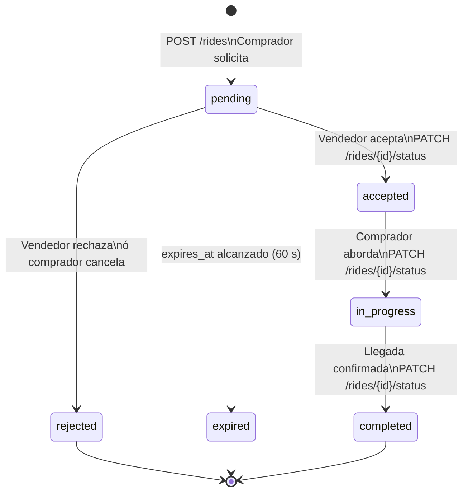
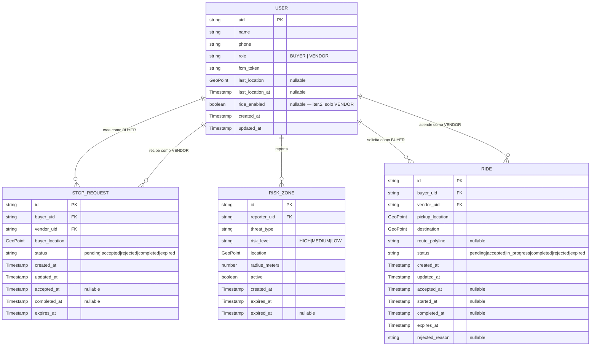

# SDD2 — Fase 3.A': Base de Datos — Raite (CU-04)
## Colección `rides` + Extensión de `users`
### UBISAFE · Los Borbotones · 24/04/2026 · [iter. 2]

> **Propósito de este archivo:** Diseñar el modelo de datos necesario para soportar CU-04 (Solicitar raite). Cubre la colección `rides`, la extensión del campo `ride_enabled` en `users`, las reglas de seguridad Firestore para la nueva colección, y un checklist de cobertura de RF. Producido por Alexis (Fase 3.A' del Plan Iter. 2).
>
> **Archivos base leídos:** `SDD_FASE3_UBISAFE.md` (convenciones iter. 1), `BB_SRS_V2.1.md` (CU-04), `SDD2_FASE0_UBISAFE.md` (decisiones anticipadas).
>
> **Nota para Miguel:** Este archivo es prerequisito para Fase 4.A' (diagramas de secuencia CU-04). Leer antes de empezar.

---

## 3.A'.1 — Colección `rides` [iter. 2]

### Ruta: `/rides/{ride_id}`

Cada documento representa un servicio de raite completo, desde la solicitud del comprador hasta la confirmación de llegada al destino. El `ride_id` es auto-generado por Firestore.

> **Relación con `stop_requests`:** La colección `rides` es independiente de `stop_requests`. Ambas gestionan servicios distintos: `stop_requests` (CU-01) para entregas a domicilio, `rides` (CU-04) para acompañamiento de persona a destino. Comparten el mismo estilo de ciclo de vida con estados y timestamps por transición.

---

### 7.2.4. Colección `rides` [iter. 2]

**Ruta:** `/rides/{ride_id}`

| Campo              | Tipo                | Requerido | Descripción                                                                                                                                                                                                               |
| ------------------ | ------------------- | --------- | ------------------------------------------------------------------------------------------------------------------------------------------------------------------------------------------------------------------------- |
| `id`               | `string`            | ✅         | ID auto-generado por Firestore. Coincide con el ID del documento.                                                                                                                                                         |
| `buyer_uid`        | `string`            | ✅         | UID del Comprador que solicitó el raite (referencia a `users/{uid}`).                                                                                                                                                     |
| `vendor_uid`       | `string`            | ✅         | UID del Vendedor al que se le envió la solicitud (referencia a `users/{uid}`).                                                                                                                                            |
| `pickup_location`  | `GeoPoint`          | ✅         | Posición GPS del Comprador en el momento de crear la solicitud. Punto de encuentro al que navega el Vendedor.                                                                                                             |
| `destination`      | `GeoPoint`          | ✅         | Destino seleccionado por el Comprador en el mapa. A ≤ 4 km del `pickup_location` (validado por FastAPI antes de crear el documento).                                                                                      |
| `route_polyline`   | `string \| null`    | —         | Polyline codificada de la ruta (formato Google Directions API) desde `pickup_location` hasta `destination`, evitando zonas HIGH y MEDIUM. Se calcula al crear el ride y se actualiza si la ruta debe recalcularse.       |
| `status`           | `string`            | ✅         | Estado actual del raite. Ver ciclo de vida completo abajo.                                                                                                                                                                |
| `created_at`       | `Timestamp`         | ✅         | Momento en que el Comprador creó la solicitud (`POST /rides`).                                                                                                                                                            |
| `updated_at`       | `Timestamp`         | ✅         | Última actualización del estado del documento.                                                                                                                                                                            |
| `accepted_at`      | `Timestamp \| null` | —         | Momento en que el Vendedor aceptó la solicitud. `null` en los demás estados.                                                                                                                                              |
| `started_at`       | `Timestamp \| null` | —         | Momento en que el Comprador abordó y comenzó el viaje (`status → in_progress`). `null` antes de este evento.                                                                                                             |
| `completed_at`     | `Timestamp \| null` | —         | Momento en que UBISAFE registró la llegada al destino y cierre del servicio. `null` antes de este evento.                                                                                                                |
| `expires_at`       | `Timestamp`         | ✅         | Límite de tiempo para la respuesta del Vendedor. Calculado como `created_at + 60 segundos`. *(Nota: el SRS indica 15 s en CA-04.3, pero el equipo confirmó uniformidad con CU-01 → 60 s. Ver `SDD2_FASE0_UBISAFE.md` §A-P1.)* |
| `rejected_reason`  | `string \| null`    | —         | Razón del rechazo o cancelación, si aplica. Valores posibles: `vendor_busy` (vendedor ya ocupado), `route_unsafe` (ruta insegura), `vendor_rejected` (rechazo manual), `buyer_cancelled` (cancelación antes del encuentro), `timeout` (expiración 60 s). |

**Restricción de distancia:** FastAPI valida en `POST /rides` que la distancia haversine entre `pickup_location` y `destination` no exceda 4 km (Condición 4A del SRS). Si excede, devuelve `400 Bad Request` sin crear el documento.

---

### Ciclo de vida del campo `status`

```
POST /rides (comprador solicita)
        │
        ▼
    [pending]  ←── UBISAFE notifica al vendedor (FCM, < 5 s · CA-04.1)
        │
        ├─── Vendedor acepta ──────────────────────────────► [accepted]
        │                                                         │
        ├─── Vendedor rechaza ────────────────────────────► [rejected]    (fin)
        │                                                         │
        ├─── expires_at alcanzado (60 s sin respuesta) ──► [expired]     (fin)
        │
        └─── Comprador cancela antes del encuentro ───────► [rejected]   (fin)
                                                 reason: buyer_cancelled

[accepted]
        │
        │  Vendedor llega al punto de encuentro
        │  UBISAFE notifica al comprador (FCM)
        │  Comprador aborda
        ▼
   [in_progress]
        │
        │  Vendedor y comprador llegan al destino
        │  UBISAFE registra finalización
        ▼
   [completed]                                                            (fin)
```

**Diagrama Mermaid — Ciclo de vida `rides.status`:**



---

### Ejemplo de documento (`status: in_progress`)

```json
{
  "id": "ride_7hJkR3Xp",
  "buyer_uid": "def456ABC",
  "vendor_uid": "abc123XYZ",
  "pickup_location": { "_latitude": 20.6750, "_longitude": -103.4410 },
  "destination":     { "_latitude": 20.6820, "_longitude": -103.4500 },
  "route_polyline": "a~l~Fjk~uOwHJy@P...",
  "status": "in_progress",
  "created_at":   { "_seconds": 1714000000, "_nanoseconds": 0 },
  "updated_at":   { "_seconds": 1714000420, "_nanoseconds": 0 },
  "accepted_at":  { "_seconds": 1714000035, "_nanoseconds": 0 },
  "started_at":   { "_seconds": 1714000420, "_nanoseconds": 0 },
  "completed_at": null,
  "expires_at":   { "_seconds": 1714000060, "_nanoseconds": 0 },
  "rejected_reason": null
}
```

---

## 3.A'.2 — Extensión de `users`: campo `ride_enabled` [iter. 2]

### 7.2.1 (extensión) — Campo nuevo en colección `users`

Se añade un campo al esquema de `users` para soportar la pre-condición de CU-04: "El vendedor tiene que tener habilitada la opción de raite".

| Campo          | Tipo               | Requerido | Descripción                                                                                                                                                                                                                      |
| -------------- | ------------------ | --------- | -------------------------------------------------------------------------------------------------------------------------------------------------------------------------------------------------------------------------------- |
| `ride_enabled` | `boolean \| null`  | —         | **[iter. 2]** Indica si el Vendedor tiene habilitada la opción de ofrecer raites. Solo es significativo cuando `role == VENDOR`. Para `role == BUYER` el campo es `null` o ausente. Valor por defecto al registrar un VENDOR: `false`. |

**Comportamiento detallado:**

| Aspecto                        | Decisión                                                                                 | Fuente                          |
| ------------------------------ | ---------------------------------------------------------------------------------------- | ------------------------------- |
| ¿Quién puede modificarlo?      | Solo el propio VENDOR, desde el **Menú Lateral (Drawer)** — nueva entrada [iter. 2]    | `SDD2_FASE0_UBISAFE.md` §A-P2  |
| ¿Es persistente?               | **Sí.** Se guarda en Firestore y sobrevive al cierre de la app                           | `SDD2_FASE0_UBISAFE.md` §M-P4  |
| ¿Se diferencia del radar GPS?  | Sí. El radar GPS (CU-02) se **resetea** al cerrar la app; `ride_enabled` **no se resetea** | Comparación iter. 1 vs. iter. 2 |
| ¿Qué valor tiene el BUYER?     | `null` (campo ausente o explícitamente nulo en documentos BUYER)                         | Decisión de esquema             |
| Valor inicial al registrarse   | `false` para VENDOR (el vendedor debe activarlo manualmente)                             | Principio de mínimo privilegio  |

**Esquema `users` actualizado (solo campo nuevo):**

```
/users/{uid}
  ...campos iter. 1 (uid, name, phone, role, fcm_token, last_location, last_location_at, created_at, updated_at)...
  ride_enabled: boolean | null     ← [iter. 2] Solo VENDOR
```

**Ejemplo de documento VENDOR con `ride_enabled: true`:**

```json
{
  "uid": "abc123XYZ",
  "name": "Carlos Ruiz",
  "phone": "+52 33 9876 5432",
  "role": "VENDOR",
  "fcm_token": "fHq8kT2..._APA91b",
  "last_location": { "_latitude": 20.6739, "_longitude": -103.4439 },
  "last_location_at": { "_seconds": 1714000000, "_nanoseconds": 0 },
  "ride_enabled": true,
  "created_at": { "_seconds": 1713200000, "_nanoseconds": 0 },
  "updated_at": { "_seconds": 1714001000, "_nanoseconds": 0 }
}
```

---

## 3.A'.3 — Reglas de Seguridad Firestore para `rides` [iter. 2]

> **Principio:** Solo el comprador y el vendedor involucrados en un ride pueden leer y modificar su documento. La creación la gestiona FastAPI (Admin SDK), pero se añade protección client-side. El borrado nunca está permitido desde el cliente.

```
// ─── COLECCIÓN: rides [iter. 2] ───────────────────────────────────────────
match /rides/{rideId} {

  // Lectura: solo el comprador o el vendedor involucrados
  allow read: if isAuthenticated()
              && (resource.data.buyer_uid == request.auth.uid
                  || resource.data.vendor_uid == request.auth.uid);

  // Creación: cualquier usuario autenticado puede iniciar la creación
  // (FastAPI valida: rol BUYER, vendedor con ride_enabled=true, disponibilidad,
  //  distancia ≤4 km, zona no bloqueada antes de escribir con Admin SDK)
  allow create: if isAuthenticated();

  // Actualización: solo los participantes
  // (FastAPI aplica las transiciones de estado permitidas — cliente no actualiza directamente)
  allow update: if isAuthenticated()
                && (resource.data.buyer_uid == request.auth.uid
                    || resource.data.vendor_uid == request.auth.uid);

  // Borrado: no permitido desde el cliente nunca
  allow delete: if false;
}
```

**Validaciones adicionales en FastAPI** (no expresables en reglas Firestore):

| Validación                                               | Capa     | Descripción                                                                           |
| -------------------------------------------------------- | -------- | ------------------------------------------------------------------------------------- |
| Solo BUYER puede crear un `ride`                         | FastAPI  | `AuthMiddleware` verifica `role == BUYER`                                             |
| El VENDOR debe tener `ride_enabled == true`              | FastAPI  | `GET /users/{vendor_uid}` verifica el campo antes de crear el documento               |
| El VENDOR no debe tener solicitudes activas              | FastAPI  | Consulta `stop_requests` y `rides` con `status in [pending, accepted, in_progress]`   |
| Distancia `pickup_location` → `destination` ≤ 4 km      | FastAPI  | Cálculo Haversine antes del `POST /rides`                                             |
| Ruta evita zonas HIGH y MEDIUM                          | FastAPI  | `RideRouter` usa `RiskZoneRouter` lógica de CU-01 (reutilización del componente)     |
| Un usuario no puede crear dos rides simultáneos          | FastAPI  | Consulta activos de ese `buyer_uid` antes de crear                                    |

---

## 3.A'.4 — Checklist de cobertura RF/CA de CU-04

| Criterio de aceptación / RF          | Campo / Mecanismo de datos que lo cubre                                                  | ✅/⚠️ |
| ------------------------------------- | ---------------------------------------------------------------------------------------- | ----- |
| CA-04.1: Notificación al vendedor < 5 s | `vendor_uid` en `rides` → FCM via `users.fcm_token`. No es un campo de BD, es flujo FCM. | ✅    |
| CA-04.2: Ruta segura evitando zonas HIGH | `route_polyline` calculada por FastAPI/Directions API excluyendo `risk_zones` HIGH+MED  | ✅    |
| CA-04.3: Timeout 60 s (equipo: 60 s)  | `expires_at = created_at + 60s` en `rides`                                               | ✅    |
| CA-04.4: Degradación ante pérdida GPS  | Campo `status` se mantiene; cliente muestra `pickup_location` / `destination` estáticos | ✅    |
| Pre-cond: ride_enabled del vendedor   | `users.ride_enabled: boolean` — verificado en FastAPI antes de crear `rides`             | ✅    |
| Pre-cond: vendedor disponible         | Consulta rides activos antes de crear — lógica FastAPI                                   | ✅    |
| Pre-cond: radio 4 km comprador-vendor | Validación Haversine en FastAPI (igual que CU-01) — no campo de BD                      | ✅    |
| Post-cond éxito: raite registrado     | `rides` con `status: completed`                                                          | ✅    |
| Post-cond fracaso: vendor disponible  | `status: rejected/expired` libera al vendor (FastAPI actualiza disponibilidad)           | ✅    |
| Condición 3A: vendor ocupado          | FastAPI rechaza el `POST /rides` si el vendor tiene rides/stops activos → 409 Conflict   | ✅    |
| Condición 4A: destino > 4 km          | FastAPI valida Haversine `pickup → destination` → `rejected_reason: route_too_long`      | ✅    |
| Condición 6A: vendor rechaza          | `PATCH /rides/{id}/status` → `rejected` + `rejected_reason: vendor_rejected`            | ✅    |
| Excepción E1: pérdida de conexión     | Cliente usa `pickup_location` y `destination` como fallback visual (campos persistentes) | ✅    |
| Excepción E2: buyer cancela           | `PATCH /rides/{id}/status` → `rejected` + `rejected_reason: buyer_cancelled`            | ✅    |
| RNF-05: solo participantes acceden    | Reglas Firestore: `read/update` restringidos a `buyer_uid` o `vendor_uid`                | ✅    |

**Resultado: todos los RF/CA de CU-04 tienen cobertura en el modelo de datos. ✅**

---

## Diagrama ER actualizado (iter. 1 + iter. 2) — solo entidades Firestore



---

## Resumen de cobertura — Fase 3.A'

| Paso     | Output generado                                                                                      | Sección del SDD   |
| -------- | ---------------------------------------------------------------------------------------------------- | ----------------- |
| 3.A'.1   | Colección `rides`: 15 campos, ciclo de vida 6 estados, ejemplo JSON, restricción 4 km              | §7.2.4 [iter. 2]  |
| 3.A'.2   | Extensión `users.ride_enabled: boolean`, comportamiento, ejemplo JSON actualizado                   | §7.2.1 [iter. 2]  |
| 3.A'.3   | Reglas Firestore para `rides` + tabla de validaciones adicionales FastAPI                           | §7.2.4 [iter. 2]  |
| 3.A'.4   | Checklist: 15 RF/CA de CU-04 cubiertos. Sin brechas.                                               | Verificación      |

---

## Handoff a Miguel (Fase 4.A')

Miguel necesita los siguientes datos de este archivo para construir el diagrama de secuencia de CU-04:

1. **Endpoint:** `POST /rides` — crea el documento con `status: pending`
2. **Endpoint:** `PATCH /rides/{id}/status` — transiciones de estado (accepted, in_progress, completed, rejected, expired)
3. **Timeout:** `expires_at = created_at + 60 s` (60 s, no 15 s del SRS)
4. **Ruta:** FastAPI calcula `route_polyline` evitando `risk_zones` HIGH y MEDIUM usando lógica de `RiskZoneRouter` (CU-01)
5. **Notificaciones FCM:** Al crear (`pending`) → notifica al vendor; al llegar al punto de encuentro (`accepted`) → notifica al buyer; al completar → notifica a ambos
6. **Campo `ride_enabled`:** FastAPI valida `users/{vendor_uid}.ride_enabled == true` antes de `POST /rides`
7. **Nombres canónicos:** `RideRouter` (FastAPI), `RideRequestModule` (Flutter), `rides` (Firestore)

---

## Historial del archivo

| Versión | Fecha      | Autor                          | Descripción                                                                |
| ------- | ---------- | ------------------------------ | -------------------------------------------------------------------------- |
| V1.0    | 24/04/2026 | Alexis Córdova (con Claude)    | Fase 3.A' completa: colección `rides`, extensión `users`, reglas, checklist |

---

*Fase 3.A' completada. Output: `SDD2_FASE3A_UBISAFE.md`. Compartir a Miguel antes de Fase 4.A'.*
*Generado: 24/04/2026 — Los Borbotones / UBISAFE Iteración 2*
