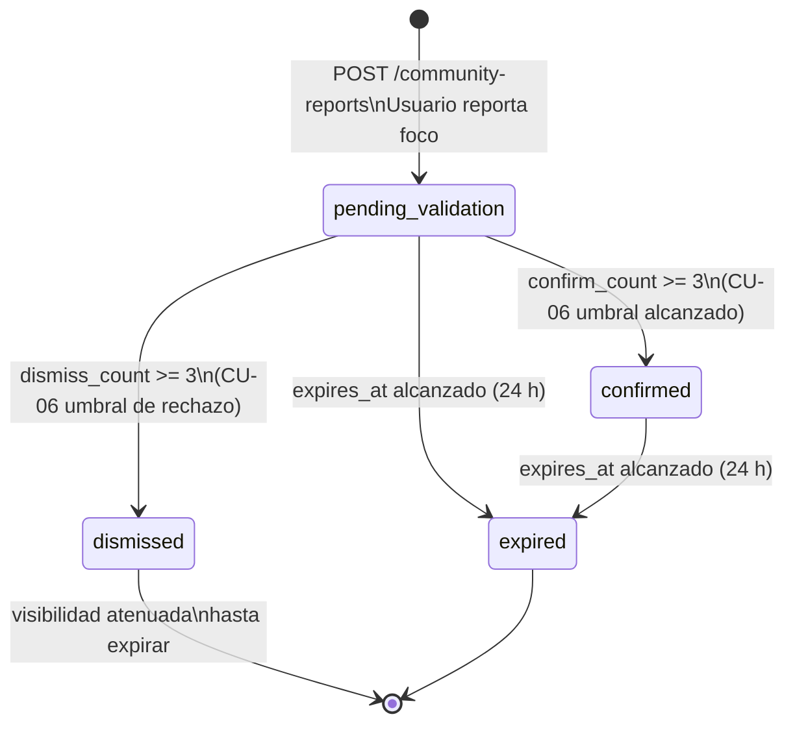
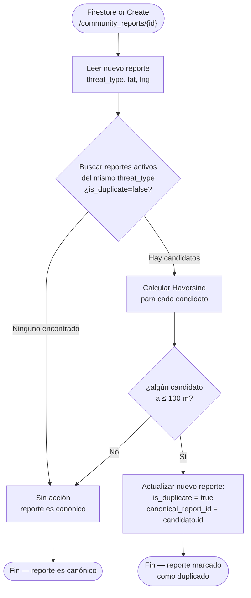
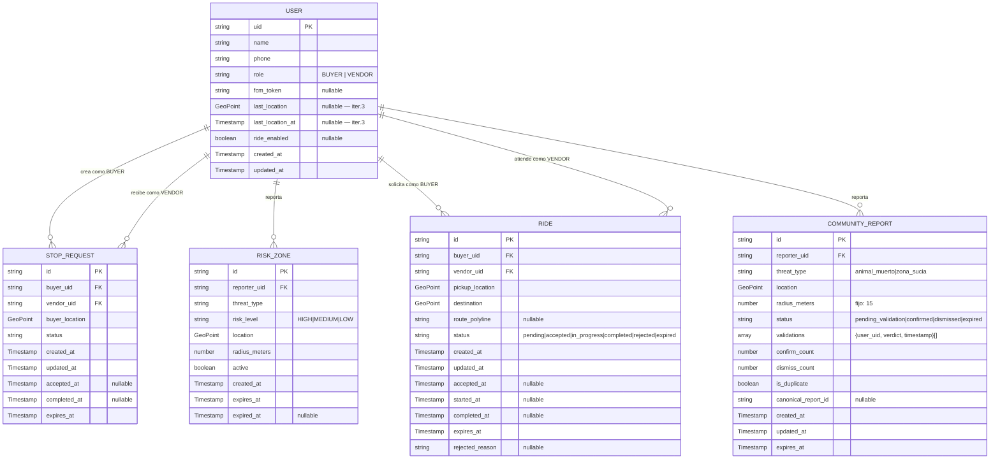

# SDD2 — Fase 3.B': Base de Datos — Reportes Comunitarios (CU-05 + CU-06)
## Colección `community_reports` + ADRs #6, #7, #11 + Cloud Function trigger
### UBISAFE · Los Borbotones · 24/04/2026 · [iter. 2]

> **Propósito de este archivo:** Diseñar el modelo de datos para CU-05 (Reportar focos de infección) y CU-06 (Verificar reportes comunitarios). Cubre la colección `community_reports`, el trigger de Cloud Function, los ADRs #6, #7 y #11, y la actualización de §8.3 del SDD. Producido por Alexis (Fase 3.B' del Plan Iter. 2).
>
> **Archivos base leídos:** `SDD_FASE3_UBISAFE.md` (convenciones iter. 1), `BB_SRS_V2.1.md` (CU-05, CU-06), `SDD2_FASE0_UBISAFE.md` (decisiones anticipadas §0'.3, §0'.4, §0'.5, §0'.6).
>
> **Nota para Miguel:** Este archivo es prerequisito para Fase 4.B' (diagramas de secuencia CU-05/06). Leer antes de empezar.

---

## 3.B'.1 — Colección `community_reports` [iter. 2]

### 7.2.5. Colección `community_reports` [iter. 2]

**Ruta:** `/community_reports/{report_id}`

Cada documento representa un reporte de foco de infección creado por la comunidad (Comprador o Vendedor) dentro del radio de 4 km de su ubicación actual. A diferencia de `risk_zones` (CU-03), los reportes comunitarios comienzan con estado `pending_validation` y requieren validación colectiva antes de ser confirmados. **No bloquean rutas de vendedores** — son puramente informativos.

> **Relación con `risk_zones`:** Las dos colecciones coexisten de forma independiente. `risk_zones` maneja zonas de riesgo de seguridad (CU-03: jaurías, robos, accidentes) y sí bloquea rutas. `community_reports` maneja focos de infección sanitaria (CU-05/06: cadáveres de animales, zonas sucias) y solo informa. Ver ADR #11 al final de este documento.

---

| Campo               | Tipo                | Requerido | Descripción                                                                                                                                                                                                                                           |
| ------------------- | ------------------- | --------- | ----------------------------------------------------------------------------------------------------------------------------------------------------------------------------------------------------------------------------------------------------- |
| `id`                | `string`            | ✅         | ID auto-generado por Firestore. Coincide con el ID del documento.                                                                                                                                                                                     |
| `reporter_uid`      | `string`            | ✅         | UID del usuario que creó el reporte (referencia a `users/{uid}`). Puede ser BUYER o VENDOR.                                                                                                                                                           |
| `threat_type`       | `string`            | ✅         | Tipo de foco de infección. Valores posibles: `animal_muerto` \| `zona_sucia`. Determinado por el usuario en el formulario de CU-05.                                                                                                                   |
| `location`          | `GeoPoint`          | ✅         | Coordenadas GPS del reportante en el momento de crear el reporte. UBISAFE obtiene la ubicación automáticamente (el usuario no dibuja zona, el punto es su posición actual). Radio de 4 km validado contra esta posición.                              |
| `radius_meters`     | `number`            | ✅         | Radio de representación visual del foco en el mapa. Valor **fijo: 15** (no configurable por el usuario en iter. 2). Mismo modelo geométrico que `risk_zones` (GeoPoint + radius).                                                                     |
| `status`            | `string`            | ✅         | Estado del reporte. Valores posibles: `pending_validation` \| `confirmed` \| `dismissed` \| `expired`. Ver ciclo de vida abajo.                                                                                                                       |
| `validations`       | `array`             | ✅ (vacío) | Array de validaciones emitidas por otros usuarios. Estructura de cada elemento: `{ user_uid: string, verdict: "confirm" \| "dismiss", timestamp: Timestamp }`. Vacío al crear. Máx. una entrada por `user_uid` (FastAPI valida duplicados).           |
| `confirm_count`     | `number`            | ✅         | Contador desnormalizado de validaciones con `verdict: "confirm"`. Valor inicial: `0`. Incrementa/decrementa junto con `validations`. Usado por FastAPI para evaluar el umbral (≥ 3 → `confirmed`).                                                   |
| `dismiss_count`     | `number`            | ✅         | Contador desnormalizado de validaciones con `verdict: "dismiss"`. Valor inicial: `0`. Incrementa/decrementa junto con `validations`. Usado por FastAPI para evaluar el umbral (≥ 3 → `dismissed`).                                                   |
| `is_duplicate`      | `boolean`           | ✅         | Indicador de duplicado establecido por la Cloud Function `aggregateDuplicateReports`. `false` al crear; la Cloud Function lo cambia a `true` si detecta un reporte activo del mismo `threat_type` a ≤ 100 m.                                          |
| `canonical_report_id` | `string \| null`  | —         | ID del reporte original si `is_duplicate == true`. Permite al cliente agrupar visualmente los duplicados bajo el reporte canónico. `null` si `is_duplicate == false`.                                                                                 |
| `created_at`        | `Timestamp`         | ✅         | Momento en que el usuario confirmó el envío del reporte (`POST /community-reports`).                                                                                                                                                                  |
| `updated_at`        | `Timestamp`         | ✅         | Última modificación del documento (validación recibida, cambio de estado, actualización de contadores).                                                                                                                                               |
| `expires_at`        | `Timestamp`         | ✅         | Expiración automática del reporte. Calculada como `created_at + 24 horas`. Misma lógica que `risk_zones`. Al alcanzar `expires_at`, el estado pasa a `expired` (evaluación en FastAPI o Cloud Function programada).                                    |

**Nota sobre `severity`:** La colección `community_reports` **no tiene campo `risk_level` ni `severity`**. Los focos de infección son siempre informativos. El color de representación en mapa se deriva únicamente del `threat_type`: `animal_muerto` → **negro**, `zona_sucia` → **café**.

---

### Ciclo de vida del campo `status`

```
POST /community-reports
        │
        ▼
[pending_validation]  ← visible en mapa con leyenda "Pendiente"
        │
        ├─── confirm_count >= 3 ──────────────────────► [confirmed]
        │     (PATCH /community-reports/{id}/validations)   │
        │                                                     │
        ├─── dismiss_count >= 3 ──────────────────────► [dismissed]
        │     (PATCH /community-reports/{id}/validations)   │
        │                                                     │
        └─── expires_at alcanzado (24 h) ─────────────► [expired]
                                                             │
[confirmed]                                                  │
        │                                                    │
        └─── expires_at alcanzado (24 h) ─────────────► [expired]

[dismissed] ← visibilidad atenuada en mapa; se elimina al expirar
```

**Leyenda en mapa por estado:**

| Estado               | Leyenda en mapa     | Visibilidad  |
| -------------------- | ------------------- | ------------ |
| `pending_validation` | "Pendiente"         | Normal       |
| `confirmed`          | "Validado"          | Normal       |
| `dismissed`          | *(oculto/atenuado)* | Atenuada     |
| `expired`            | *(no se muestra)*   | No visible   |

---

### Diagrama Mermaid — Ciclo de vida `community_reports.status`



---

### Ejemplo de documento (reporte `pending_validation` con 1 confirmación)

```json
{
  "id": "cr_5mPqT8Wz",
  "reporter_uid": "def456ABC",
  "threat_type": "animal_muerto",
  "location": { "_latitude": 20.6755, "_longitude": -103.4425 },
  "radius_meters": 15,
  "status": "pending_validation",
  "validations": [
    {
      "user_uid": "ghi789JKL",
      "verdict": "confirm",
      "timestamp": { "_seconds": 1714001200, "_nanoseconds": 0 }
    }
  ],
  "confirm_count": 1,
  "dismiss_count": 0,
  "is_duplicate": false,
  "canonical_report_id": null,
  "created_at":   { "_seconds": 1714001000, "_nanoseconds": 0 },
  "updated_at":   { "_seconds": 1714001200, "_nanoseconds": 0 },
  "expires_at":   { "_seconds": 1714087400, "_nanoseconds": 0 }
}
```

### Ejemplo de documento duplicado marcado por Cloud Function

```json
{
  "id": "cr_9nRsV2Kq",
  "reporter_uid": "mno012PQR",
  "threat_type": "animal_muerto",
  "location": { "_latitude": 20.6754, "_longitude": -103.4424 },
  "radius_meters": 15,
  "status": "pending_validation",
  "validations": [],
  "confirm_count": 0,
  "dismiss_count": 0,
  "is_duplicate": true,
  "canonical_report_id": "cr_5mPqT8Wz",
  "created_at":   { "_seconds": 1714001500, "_nanoseconds": 0 },
  "updated_at":   { "_seconds": 1714001502, "_nanoseconds": 0 },
  "expires_at":   { "_seconds": 1714087900, "_nanoseconds": 0 }
}
```

---

## 3.B'.2 — Colección `reputation_events`: NO se crea en iter. 2

De conformidad con la decisión 0'.5 (`SDD2_FASE0_UBISAFE.md`):

> El SRS v2.1 **no define puntos de reputación**. CU-06 opera con votación simple (sí/no, umbral 3). La colección `reputation_events` prevista en el SDD iter. 1 (§7.4.3) **se pospone indefinidamente** y no entra en iter. 2.

**Consecuencia para §8.3 del SDD:** La fila de `reputation_events` en la tabla "Colecciones previstas iter. 2-3" se actualiza de "Iter. 2" a **"Iter. 3 o posterior (condicional)"**.

---

## 3.B'.3 — Reglas de Seguridad Firestore para `community_reports` [iter. 2]

```
// ─── COLECCIÓN: community_reports [iter. 2] ────────────────────────────────
match /community_reports/{reportId} {

  // Lectura: cualquier usuario autenticado puede consultar reportes
  // (necesario para que el mapa muestre reportes cercanos a todos)
  allow read: if isAuthenticated();

  // Creación: cualquier usuario autenticado puede crear un reporte
  // (FastAPI valida: radio 4 km, tipo de foco válido, GPS activo)
  allow create: if isAuthenticated();

  // Actualización: cualquier usuario autenticado puede votar
  // (FastAPI valida: usuario no vota su propio reporte, no vota dos veces,
  //  reporte sigue activo/pending, lógica de contadores y transición de estado)
  allow update: if isAuthenticated();

  // Borrado: no permitido desde el cliente
  allow delete: if false;
}
```

**Validaciones de negocio en FastAPI** (no expresables en reglas Firestore):

| Validación                                               | Capa     | Descripción                                                                                              |
| -------------------------------------------------------- | -------- | -------------------------------------------------------------------------------------------------------- |
| Radio 4 km — reportante cerca del punto                  | FastAPI  | Haversine entre `request.user.location` y `location` reportada (CU-05 Condición 5A)                    |
| Un usuario no puede validar su propio reporte            | FastAPI  | `reporter_uid != request.auth.uid` en `PATCH /community-reports/{id}/validations`                       |
| Un usuario no puede votar dos veces el mismo reporte     | FastAPI  | Busca `user_uid == request.auth.uid` en `validations[]` antes de añadir (CU-06 Condición 4A)            |
| Reporte debe estar en `pending_validation` para votar    | FastAPI  | Verifica `status == pending_validation` antes de procesar la validación (CU-06 Excepción E2)            |
| Transición automática a `confirmed` o `dismissed`        | FastAPI  | Evalúa `confirm_count >= 3` o `dismiss_count >= 3` después de cada voto y actualiza `status`            |
| Tipo de foco válido                                      | FastAPI  | Enum: `animal_muerto` \| `zona_sucia` — rechaza otros valores con `400 Bad Request`                     |

---

## 3.B'.4 — Cloud Function trigger: `aggregateDuplicateReports` [iter. 2]

> **Contexto:** Decisión 0'.3 del `SDD2_FASE0_UBISAFE.md`. La Cloud Function entra en iter. 2 para implementar el flujo alternativo 7A de CU-05: "Alta densidad de reportes similares → UBISAFE los agrupa en una sola alerta".

### Especificación del trigger

| Atributo            | Valor                                                                                     |
| ------------------- | ----------------------------------------------------------------------------------------- |
| **Nombre**          | `aggregateDuplicateReports`                                                               |
| **Tipo**            | Cloud Function for Firebase (gen2) — Python                                               |
| **Trigger**         | `onCreate` en Firestore — colección `community_reports`                                   |
| **Evento**          | Se dispara cada vez que se crea un nuevo documento en `/community_reports/{report_id}`    |
| **Radio de búsqueda** | 100 metros (radio de detección de duplicados)                                           |
| **Criterio**        | Mismo `threat_type` + distancia Haversine ≤ 100 m + `status in [pending_validation, confirmed]` |

### Pseudocódigo de la lógica

```python
# Cloud Function — aggregateDuplicateReports
# Trigger: Firestore onCreate /community_reports/{report_id}

def aggregate_duplicate_reports(event, context):
    """
    Al crearse un nuevo reporte de infección, busca reportes activos
    del mismo tipo en un radio de 100 m. Si hay uno, marca el nuevo
    como duplicado y referencia al original.
    """
    new_report = event.value['fields']
    new_id = context.params['report_id']

    new_lat = new_report['location']['geoPointValue']['latitude']
    new_lng = new_report['location']['geoPointValue']['longitude']
    threat_type = new_report['threat_type']['stringValue']

    # 1. Consultar reportes activos del mismo threat_type
    active_reports = firestore_client.collection('community_reports') \
        .where('threat_type', '==', threat_type) \
        .where('status', 'in', ['pending_validation', 'confirmed']) \
        .where('is_duplicate', '==', False) \
        .stream()

    # 2. Para cada candidato, calcular distancia Haversine
    for report in active_reports:
        data = report.to_dict()
        if report.id == new_id:
            continue  # ignorar el propio documento recién creado

        candidate_lat = data['location'].latitude
        candidate_lng = data['location'].longitude

        distance_m = haversine(new_lat, new_lng, candidate_lat, candidate_lng)

        # 3. Si está a ≤ 100 m, es duplicado
        if distance_m <= 100:
            # Marcar el nuevo reporte como duplicado
            firestore_client.document(f'community_reports/{new_id}').update({
                'is_duplicate': True,
                'canonical_report_id': report.id,
                'updated_at': SERVER_TIMESTAMP
            })
            return  # solo se referencia al primer canónico encontrado

    # 4. Si no hay duplicados: no se hace nada — el reporte queda is_duplicate=False
    return
```

### Diagrama de flujo de la Cloud Function



### Consecuencias en el cliente Flutter

- El `CommunityReportModule` en Flutter **agrupa visualmente** los reportes con `is_duplicate == true` bajo el pin del `canonical_report_id`.
- El pin del reporte canónico puede mostrar un contador de duplicados (ej. "× 3 reportes cercanos").
- Los usuarios que voten sobre un reporte duplicado votan sobre el canónico (FastAPI redirige la validación).

---

## 3.B'.5 — ADR #6: Modelo de Validación Comunitaria [iter. 2]

**Estado:** Aceptado · Iteración 2
**Fecha:** 24/04/2026
**Participantes:** Alexis Córdova (PM) con decisión preliminar de Fase 0' (pair Alexis + Miguel)

### Contexto

CU-06 requiere que la comunidad valide los reportes de focos de infección. El SRS v2.1 especifica:
- CA-06.2: "cuando se supera el umbral definido (3), el sistema cambia su estado a `confirmado`"
- CA-06.3: "cuando el nivel de confianza cae por debajo del umbral (3 rechazos), UBISAFE lo marca como `descartado`"

Se evaluaron tres modelos alternativos antes de decidir:

| Modelo                                   | Descripción                                                             | Complejidad | Soporte en SRS | Recomendación |
| ---------------------------------------- | ----------------------------------------------------------------------- | ----------- | -------------- | ------------- |
| **Votación simple (sí/no, umbral 3)** ✅ | Cada usuario emite un voto binario; umbral fijo de 3 en ambas direc.   | Baja        | Explícita (CA-06.2, CA-06.3) | Elegida |
| Pesos por rol                             | El voto de un VENDOR pesa más que el de un BUYER                       | Media       | No mencionado  | Rechazada |
| Sistema de puntos de reputación           | Los votos suman/restan puntos; umbral basado en puntos acumulados       | Alta        | No mencionado  | Diferida |

### Decisión

Se implementa **votación simple binaria con umbral fijo de 3**:

- Cada usuario emite exactamente **un voto** por reporte (no se puede cambiar).
- El voto es binario: `"confirm"` (corrobora) o `"dismiss"` (desmiente).
- Umbral de **confirmación:** `confirm_count >= 3` → `status = confirmed`
- Umbral de **rechazo:** `dismiss_count >= 3` → `status = dismissed`
- Bloqueo de doble voto: FastAPI rechaza si `user_uid` ya existe en `validations[]`.
- El reportante no puede votar su propio reporte.
- Los contadores `confirm_count` y `dismiss_count` son campos desnormalizados para evitar conteos en tiempo real del array `validations[]`.

### Consecuencias

**Positivas:**
- Implementación directa del SRS sin suposiciones adicionales.
- Contadores desnormalizados (`confirm_count`, `dismiss_count`) permiten evaluar el umbral en O(1) sin iterar el array `validations[]`.
- Umbral de 3 es bajo, lo que facilita la activación en comunidades pequeñas (consistente con la densidad de usuarios prevista: 10 por sector).

**Negativas / Deudas técnicas:**
- Un actor malicioso con 3 cuentas podría confirmar o descartar reportes sin base real. Mitigación futura: pesos por antigüedad de cuenta o verificación de identidad (iter. 3).
- No hay mecanismo de desempate si `confirm_count == dismiss_count` al expirar. Decisión: el reporte expira en `expired` sin cambiar a `confirmed` ni `dismissed`.

---

## 3.B'.6 — ADR #7: Geometría de Zonas — Círculos en iter. 2 [iter. 2]

**Estado:** Aceptado · Iteración 2
**Fecha:** 24/04/2026

### Contexto

El plan maestro iter. 2 anticipaba que CU-05 requeriría polígonos para delimitar "tramos" de infección. Al revisar el SRS v2.1, el flujo de CU-05 dice: "UBISAFE **obtiene la ubicación actual** del comprador/vendedor" — el sistema usa la posición GPS del reportante como origen, no hay UI para dibujar zonas.

### Decisión

`community_reports` usa el **mismo modelo geométrico que `risk_zones`**: `location: GeoPoint` + `radius_meters: number`. El radio es fijo en **15 metros** (no configurable por el usuario en iter. 2).

| Criterio               | Polígono GeoJSON              | Círculo GeoPoint + radius (elegida)   |
| ---------------------- | ----------------------------- | ------------------------------------- |
| Compatibilidad SRS     | No requerido explícitamente   | ✅ Compatible con flujo descrito       |
| UX de creación         | Compleja (modo dibujo en mapa) | ✅ Simple (posición GPS automática)   |
| Consistencia `risk_zones` | Rompe consistencia           | ✅ Mantiene consistencia de modelos   |
| Consultas geográficas  | Cálculos geométricos complejos | ✅ Bounding box + Haversine (reutiliza) |
| Esfuerzo desarrollo    | Alto                          | ✅ Bajo (reutiliza lógica iter. 1)    |

### Consecuencias

- `community_reports.radius_meters` siempre vale `15`. FastAPI lo ignora como input del usuario y lo establece directamente al crear el documento.
- En iter. 3 se evaluará si los reportes de mayor escala (zonas sucias extensas) requieren polígonos GeoJSON, momento en que se activaría Firebase Geo o una solución de geometría.
- El componente `DestinationPicker` es necesario para **CU-04** (selección de destino en mapa) pero **no** para CU-05 (la ubicación se toma automáticamente del GPS).

---

## 3.B'.7 — ADR #11: Coexistencia de Dos Colecciones [iter. 2]

**Estado:** Aceptado · Iteración 2
**Fecha:** 24/04/2026

### Contexto

El sistema ya tiene `risk_zones` (CU-03, iter. 1) para reportar peligros de seguridad. CU-05/06 introduce `community_reports` para focos de infección sanitaria. Se evaluó si unificar ambas o mantenerlas separadas.

### Decisión

**Dos colecciones separadas coexisten**: `risk_zones` (iter. 1) y `community_reports` (iter. 2).

| Criterio                 | Unificar en una colección           | Dos colecciones separadas (elegida)   |
| ------------------------ | ----------------------------------- | ------------------------------------- |
| Breaking changes         | Rompe `risk_zones` existente        | ✅ Zero breaking changes en iter. 1   |
| Campos nulos             | Campos opcionales en mitad de docs  | ✅ Cada colección tiene solo sus campos |
| Lógica de negocio        | Router complejo con condicionales   | ✅ Dos routers pequeños especializados |
| Queries                  | Filtrar por tipo en todas las queries | ✅ Queries simples por colección      |
| Riesgo operativo         | Toca código CU-03 ya diseñado       | ✅ CU-03 no se modifica               |

### Diferencias de modelo que justifican la separación

| Característica               | `risk_zones` (CU-03)          | `community_reports` (CU-05/06)           |
| ---------------------------- | ----------------------------- | ---------------------------------------- |
| Estado inicial               | Activo inmediatamente         | `pending_validation`                     |
| Validación comunitaria       | No                            | Sí (votos, umbral 3)                     |
| Tipos de amenaza             | Libre (`HIGH/MED/LOW`)        | Enum: `animal_muerto \| zona_sucia`      |
| Color en mapa                | Rojo/naranja/azul (risk_level) | Negro (animal) / Café (sucia)            |
| Impacto en rutas del vendor  | ✅ Bloquea HIGH + MEDIUM      | ❌ Solo informativo, no bloquea          |
| Detección de duplicados      | No                            | Sí (Cloud Function, radio 100 m)         |
| Expiración                   | 24 h                          | 24 h (igual que `risk_zones`)            |
| Radio de representación      | Configurable (default 100 m)  | Fijo 15 m                                |

### Consecuencias

- `RiskZoneRouter` (FastAPI, iter. 1) **no se modifica**.
- Se crea `CommunityReportRouter` como router nuevo e independiente.
- En §7.2 del SDD se añaden §7.2.4 (`rides`) y §7.2.5 (`community_reports`) como colecciones nuevas de iter. 2.

---

## 3.B'.8 — Actualización de §7.4.3 del SDD: Colecciones previstas iter. 2-3

> **Instrucción para Alexis al integrar al .docx:** En la Sección 7.4.3 (tabla "Colecciones previstas para iteraciones futuras"), actualizar las siguientes filas:

| Colección           | Estado anterior              | Estado nuevo [iter. 2]                                          |
| ------------------- | ---------------------------- | --------------------------------------------------------------- |
| `community_reports` | "Iter. 2 — prevista"         | **✅ Diseñada e implementada en iter. 2** (mover a §7.2.5)       |
| `reputation_events` | "Iter. 2 — CU-5, CU-6, CU-8" | **Diferida — iter. 3 o posterior (condicional a decisión de reputación)** |
| `subscriptions`     | Iter. 3                      | Sin cambios                                                     |
| `vendor_catalog`    | Iter. 3                      | Sin cambios                                                     |
| `verifications`     | Iter. 3                      | Sin cambios                                                     |

---

## Diagrama ER actualizado — Entidades completas iter. 1 + iter. 2



---

## Checklist de cobertura RF/CA de CU-05 y CU-06

### CU-05 — Reportar focos de infección

| Criterio / RF                                                | Campo / Mecanismo                                                                              | ✅/⚠️ |
| ------------------------------------------------------------ | ---------------------------------------------------------------------------------------------- | ----- |
| CA-05.1: Registro en máx. 10 s                               | `POST /community-reports` → Firestore write. Sin bloqueos adicionales. Latencia ≤ 10 s.       | ✅    |
| CA-05.2: Rechazo si usuario fuera del radio permitido        | FastAPI valida Haversine ≤ 4 km entre posición del usuario y `location`. Devuelve 400.         | ✅    |
| CA-05.3: Agrupación visual de reportes similares cercanos    | `is_duplicate + canonical_report_id` → Flutter agrupa en el pin del canónico                  | ✅    |
| CA-05.4: Retry automático ante pérdida de conexión           | Flutter SDK Firestore tiene retry offline nativo; campo almacenado en caché local              | ✅    |
| Estado inicial `pending_validation`                          | `status: "pending_validation"` establecido por FastAPI al crear el documento                   | ✅    |
| Notificación a usuarios cercanos (post-cond. éxito)          | FastAPI → FCM fan-out a tokens de usuarios con `last_location` a ≤ 4 km del `location`        | ✅    |
| Tipos de foco válidos                                        | Enum FastAPI: `animal_muerto \| zona_sucia`. Rechaza otros.                                    | ✅    |
| Condición 7A: Alta densidad → agrupar                        | Cloud Function `aggregateDuplicateReports` (radio 100 m, mismo `threat_type`)                  | ✅    |
| Pre-cond: usuario autenticado                                | `AuthMiddleware` en FastAPI + reglas Firestore                                                 | ✅    |

### CU-06 — Verificar reportes comunitarios

| Criterio / RF                                                | Campo / Mecanismo                                                                              | ✅/⚠️ |
| ------------------------------------------------------------ | ---------------------------------------------------------------------------------------------- | ----- |
| CA-06.1: Registro de validación en máx. 10 s                 | `PATCH /community-reports/{id}/validations` → Firestore update. Latencia ≤ 10 s.             | ✅    |
| CA-06.2: `confirm_count >= 3` → `status = confirmed`         | FastAPI evalúa contador después de cada voto y actualiza `status`                              | ✅    |
| CA-06.3: `dismiss_count >= 3` → `status = dismissed`         | FastAPI evalúa contador después de cada voto y actualiza `status`                              | ✅    |
| Pre-cond: reporte no verificado (aún en `pending_validation`) | FastAPI verifica `status == pending_validation` antes de procesar voto                         | ✅    |
| Pre-cond: usuario a ≤ 4 km del reporte                       | FastAPI Haversine entre `request.user.location` y `community_report.location`                  | ✅    |
| Bloqueo de doble voto (Condición 4A)                         | FastAPI busca `user_uid` en `validations[]` antes de añadir                                    | ✅    |
| Bloqueo de votar propio reporte                              | FastAPI verifica `reporter_uid != request.auth.uid`                                            | ✅    |
| Excepción E2: reporte eliminado/cambiado durante interacción | FastAPI devuelve `409 Conflict` si `status` ya no es `pending_validation`                      | ✅    |
| RNF-05: seguridad — usuario no accede a datos de otros       | `community_reports` son de lectura pública (mapa), pero las validaciones tienen reglas         | ✅    |

**Resultado: todos los RF/CA de CU-05 y CU-06 tienen cobertura en el modelo de datos. ✅**

---

## Handoff a Miguel (Fase 4.B')

Miguel necesita los siguientes datos de este archivo para construir los diagramas de secuencia CU-05 y CU-06:

### Para CU-05:
1. **Endpoint:** `POST /community-reports` → crea con `status: pending_validation`, `confirm_count: 0`, `dismiss_count: 0`, `is_duplicate: false`
2. **Trigger asíncrono:** Cloud Function `aggregateDuplicateReports` se dispara al crear → si detecta duplicado, actualiza `is_duplicate: true` + `canonical_report_id`
3. **FCM fan-out:** FastAPI notifica a usuarios con `last_location` a ≤ 4 km
4. **Colores en mapa:** `animal_muerto` → negro; `zona_sucia` → café; ambos visibles desde `pending_validation` con leyenda "Pendiente"

### Para CU-06:
5. **Endpoint:** `PATCH /community-reports/{id}/validations` → añade entrada a `validations[]`, actualiza `confirm_count`/`dismiss_count`, evalúa umbrales
6. **Transición automática:** Si `confirm_count >= 3` → `status = confirmed`; si `dismiss_count >= 3` → `status = dismissed`
7. **Bloqueos:** FastAPI rechaza si ya votó (`409`) o si es su propio reporte (`403`)
8. **Nombres canónicos:** `CommunityReportRouter` + `ReportValidationRouter` (FastAPI), `CommunityReportModule` + `ReportValidationModule` (Flutter), `community_reports` (Firestore), `aggregateDuplicateReports` (Cloud Function)

---

## Resumen de cobertura — Fase 3.B'

| Paso      | Output generado                                                                              | Sección del SDD       |
| --------- | -------------------------------------------------------------------------------------------- | --------------------- |
| 3.B'.1    | Colección `community_reports`: 14 campos, ciclo de vida, ejemplos JSON (normal + duplicado)  | §7.2.5 [iter. 2]      |
| 3.B'.2    | Decisión explícita: `reputation_events` NO en iter. 2                                       | §7.4.3 actualizado    |
| 3.B'.3    | Reglas Firestore `community_reports` + tabla validaciones FastAPI                            | §7.2.5 [iter. 2]      |
| 3.B'.4    | Cloud Function `aggregateDuplicateReports`: spec, pseudocódigo Python, diagrama de flujo    | §7.5 Cloud Functions [iter. 2] |
| 3.B'.5    | ADR #6: Votación simple (umbral 3, sin reputación)                                          | §3 ADRs [iter. 2]     |
| 3.B'.6    | ADR #7: Geometría círculos (radio fijo 15 m), polígonos diferidos a iter. 3                 | §3 ADRs [iter. 2]     |
| 3.B'.7    | ADR #11: Coexistencia `risk_zones` + `community_reports`, tabla comparativa                 | §3 ADRs [iter. 2]     |
| 3.B'.8    | Actualización §7.4.3: `community_reports` → iter. 2 completada; `reputation_events` → diferida | §7.4.3 actualizado |

---

## Historial del archivo

| Versión | Fecha      | Autor                        | Descripción                                                                                   |
| ------- | ---------- | ---------------------------- | --------------------------------------------------------------------------------------------- |
| V1.0    | 24/04/2026 | Alexis Córdova (con Claude)  | Fase 3.B' completa: `community_reports`, Cloud Function, ADRs #6/#7/#11, actualización §7.4.3 |

---

*Fase 3.B' completada. Output: `SDD2_FASE3B_UBISAFE.md`. Compartir a Miguel antes de Fase 4.B'.*
*Generado: 24/04/2026 — Los Borbotones / UBISAFE Iteración 2*
