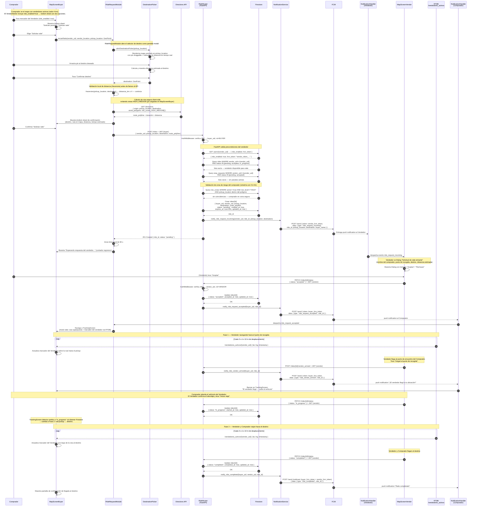
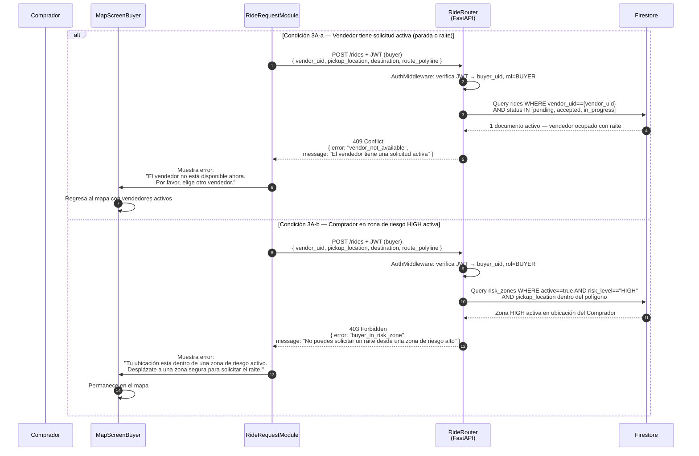
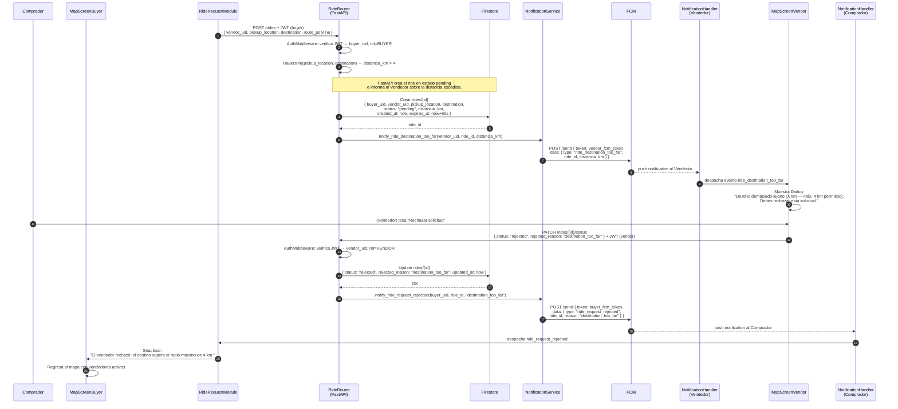
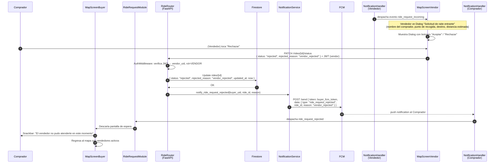
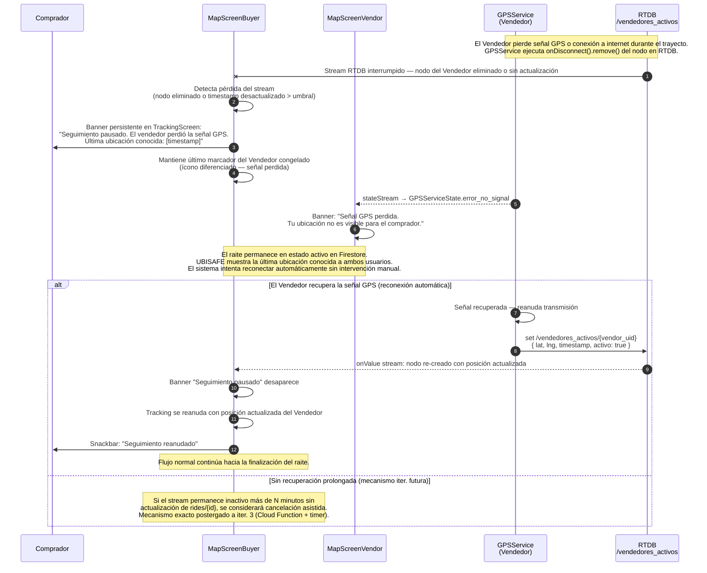
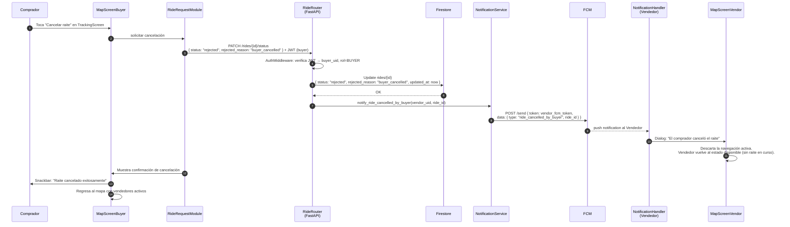
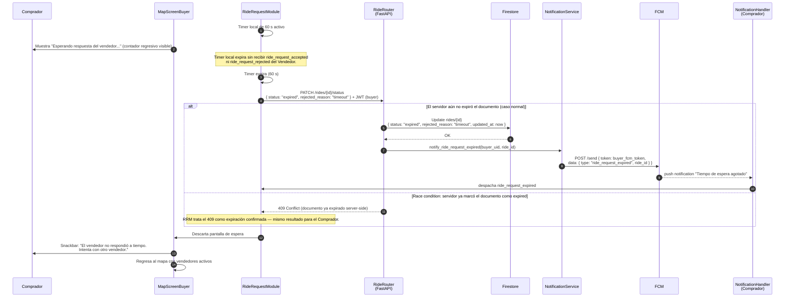

# SDD2 — Fase 4.A': Diagramas de Secuencia CU-04 (Solicitar Raite)
## Los Borbotones · Iteración 2 · **[iter. 2]**
### Sección 9 del SDD — Interaction Viewpoint (IEEE 1016-2009)
#### Actualizado: 24/04/2026

> **Nota de uso:** Este archivo contiene los diagramas de secuencia de CU-04 en formato Mermaid, siguiendo exactamente el mismo estilo y convenciones de `SDD_FASE4_UBISAFE.md`. Cada diagrama debe exportarse como imagen (Mermaid Live Editor, VS Code o similar) y pegarse en la sección §9 del .docx final, inmediatamente después de §8.4 (Auth).
>
> **Convención de nombres:** Se usan exactamente los nombres canónicos definidos en `SDD2_FASE2_UBISAFE.md`: `MapScreenBuyer`, `MapScreenVendor`, `RideRequestModule`, `DestinationPicker`, `RideRouter`, `NotificationService`, `NotificationHandler`, `FirestoreService`, `VendorTracker`, `GPSService`.
>
> **Archivos base leídos:** `SDD_FASE4_UBISAFE.md` (estilo y convenciones iter. 1) · `SDD2_FASE2_UBISAFE.md` (componentes y arquitectura iter. 2) · `SDD2_FASE3A_UBISAFE.md` (modelo `rides`, endpoints, ciclo de vida, handoff de Alexis).

---

## Índice

1. [§9.5 — CU-04: Solicitar Raite](#cu-04)
   - [9.5.A — Flujo Normal](#diagrama-95a)
   - [9.5.B — Condición 3A: Vendedor no disponible / zona peligrosa](#diagrama-95b)
   - [9.5.C — Condición 4A: Destino demasiado lejos](#diagrama-95c)
   - [9.5.D — Condición 6A: Vendedor rechaza la solicitud](#diagrama-95d)
   - [9.5.E — E1: Pérdida de conexión](#diagrama-95e)
   - [9.5.F — E2: Cancelación por el comprador](#diagrama-95f)
   - [9.5.G — E3: Tiempo de respuesta agotado (CA-04.3)](#diagrama-95g)

---

> **⚠ Precondición global de GPS.** CU-04 requiere GPS activo en ambos actores. Si el GPS no está disponible al iniciar el flujo del Comprador (selección de destino) o durante el tracking, aplica el mismo mecanismo `GpsRequiredEmptyState` descrito en §8 para CU-01/02/03. Esta verificación es reactiva y no interrumpe la sesión del usuario.

> **Nota de decisión de equipo — Timeout:** El SRS v2.1 (CA-04.3) establece 60 s. Este valor es uniforme con CU-01. Decisión registrada en `SDD2_FASE0_UBISAFE.md §A-P1` y reflejada en el campo `expires_at = created_at + 60s` del modelo `rides` (`SDD2_FASE3A_UBISAFE.md §3.A'.1`).

> **Nota de arquitectura — Cálculo de ruta:** En CU-01, el cálculo de ruta lo realizaba FastAPI server-side (Directions API llamado desde `StopRequestRouter`). En CU-04, esta responsabilidad se delega al **cliente Flutter** (`RideRequestModule`): consulta Directions API directamente usando las zonas de riesgo ya cargadas en `MapScreenBuyer`, y envía la `route_polyline` resultante en el `POST /rides`. FastAPI almacena la ruta recibida sin recalcularla. Esta diferencia es intencional y está documentada en `SDD2_FASE2_UBISAFE.md §5.3.3.6`.

---

## §9.5 — CU-04: Solicitar Raite {#cu-04}

### Descripción

CU-04 extiende el dominio **Dispatching** de iteración 1 con el flujo de acompañamiento de persona en vehículo. Involucra dos actores simultáneos (Comprador y Vendedor) y cuatro capas técnicas: la App Flutter, la API FastAPI (`RideRouter`), Cloud Firestore (colección `rides`) y FCM. La navegación en tiempo real reutiliza el stream RTDB ya disponible del radar de visibilidad (CU-02), lo que evita duplicar infraestructura de localización.

**Diferencias clave respecto a CU-01 (Parada a Puerta):**

| Aspecto | CU-01 Parada | CU-04 Raite |
|---|---|---|
| Selección de destino | No aplica (el comprador indica dónde está) | Comprador elige un destino en el mapa (`DestinationPicker`) |
| Cálculo de ruta | Server-side por FastAPI | **Client-side** por `RideRequestModule` vía Directions API |
| Pre-condición extra | — | `users.ride_enabled == true` en el Vendedor |
| Fases del viaje | 1 fase (vendor → buyer) | 2 fases: vendor → pickup, luego vendor+buyer → destino |
| Estados del ciclo | `pending / accepted / rejected / completed / expired` | `pending / accepted / in_progress / completed / rejected / expired` |
| Colección Firestore | `stop_requests` | `rides` |

Los siete diagramas documentados cubren:
- **9.5.A — Flujo Normal:** Solicitud → Vendedor acepta → navega al pickup → Comprador aborda → viaje → confirmación.
- **9.5.B — Condición 3A:** Vendedor no disponible (raite o parada activa) o zona de solicitud peligrosa.
- **9.5.C — Condición 4A:** Destino a más de 4 km del pickup → UBISAFE notifica al Vendedor → Vendedor rechaza.
- **9.5.D — Condición 6A:** Vendedor rechaza manualmente la solicitud.
- **9.5.E — E1:** Pérdida de conexión GPS/internet durante el raite activo.
- **9.5.F — E2:** Cancelación por el Comprador antes del encuentro.
- **9.5.G — E3:** Tiempo de espera agotado (60 s sin respuesta del Vendedor).

---

### Diagrama 9.5.A — Flujo Normal {#diagrama-95a}

> Cubre el camino exitoso completo: desde que el Comprador toca el marcador del Vendedor hasta la confirmación de llegada al destino. Incluye la separación explícita entre la llegada del Vendedor al punto de recogida (`POST /rides/{id}/vendor_arrived`) y el inicio del viaje propiamente dicho (`PATCH → in_progress`), en coherencia con el SRS v2.1 paso 10 del Flujo Normal: *"Al subir el comprador, el vendedor inicia el viaje"*.

---

### Diagrama 9.5.B — Condición 3A: Vendedor no disponible / zona peligrosa {#diagrama-95b}

> Cubre los dos escenarios definidos por el SRS v2.1 bajo Condición 3A: (a) el Vendedor tiene una solicitud activa (parada o raite en curso), y (b) la ubicación del Comprador está dentro de una zona de riesgo HIGH activa. En ambos casos UBISAFE detecta la condición server-side y notifica al Comprador con el motivo específico.
>
> **Pre-estado:** El Comprador ha seleccionado destino, la ruta fue calculada y confirmó "Solicitar raite". `RideRequestModule` envía `POST /rides`.

---

### Diagrama 9.5.C — Condición 4A: Destino demasiado lejos {#diagrama-95c}

> El SRS v2.1 especifica: *"UBISAFE detecta que el destino tentativo está a una distancia considerable (más de 4 km desde el punto de recogida hasta el destino) y notifica de esto al vendedor. El vendedor rechaza. UBISAFE notifica al comprador que el vendedor rechazó."* La solicitud alcanza el servidor; FastAPI detecta la distancia, crea el `ride` en estado `pending` y notifica al Vendedor con la distancia excedida. El Vendedor rechaza explícitamente. El Comprador recibe notificación del rechazo con motivo `destination_too_far`.
>
> **Pre-estado:** El Comprador confirmó un destino a más de 4 km del punto de recogida. `RideRequestModule` envía `POST /rides`.

---

### Diagrama 9.5.D — Condición 6A: Vendedor rechaza la solicitud {#diagrama-95d}

> El Vendedor recibe la solicitud de raite en estado normal (`ride_request_incoming`) y decide rechazarla manualmente. UBISAFE notifica al Comprador que la solicitud fue rechazada.
>
> **Pre-estado:** `POST /rides` fue exitoso. `rides/{id}.status == "pending"`. El Vendedor recibió el push notification `ride_request_incoming`.

---

### Diagrama 9.5.E — E1: Pérdida de conexión {#diagrama-95e}

> El SRS v2.1 E1 establece: *"UBISAFE muestra la última ubicación conocida. Se notifica a ambos usuarios. El sistema intenta reconectar automáticamente."* El modelo reutiliza la infraestructura RTDB con `onDisconnect().remove()` ya presente en CU-01/02 para detectar la pérdida y congelar el marcador del Vendedor en la última posición conocida.
>
> **Pre-estado:** `rides/{id}.status == "accepted"` o `"in_progress"`. Comprador en `TrackingScreen` con stream RTDB activo. El Vendedor pierde señal GPS o conexión a internet.

---

### Diagrama 9.5.F — E2: Cancelación por el comprador {#diagrama-95f}

> El SRS v2.1 E2 establece: *"El comprador cancela antes del encuentro. UBISAFE notifica al vendedor. El vendedor vuelve al estado de 'disponible'."* El Comprador inicia el `PATCH` a `rejected` con `rejected_reason: "buyer_cancelled"`. El Vendedor es notificado y queda disponible para nuevas solicitudes.
>
> **Pre-estado:** `rides/{id}.status == "accepted"`. El Vendedor está navegando hacia el punto de recogida. El Comprador decide cancelar antes del encuentro.

---

### Diagrama 9.5.G — E3: Tiempo de respuesta agotado (CA-04.3) {#diagrama-95g}

> El SRS v2.1 CA-04.3 establece: *"Dado que el vendedor no responde, cuando transcurran 60 segundos desde la solicitud, entonces UBISAFE cancela automáticamente la petición y notifica al comprador."* El cliente inicia el `PATCH` de expiración al vencer el timer local. Se incluye el manejo de race condition por si el servidor ya marcó el documento antes de recibir el `PATCH` del cliente.
>
> **Pre-estado:** `POST /rides` fue exitoso. `rides/{id}.status == "pending"`. `expires_at = created_at + 60s`. El Vendedor no responde.

---

## Notas de implementación [iter. 2]

> Esta sección va al pie de §9 en el SDD final, como complemento a las notas de §8.

### Eventos FCM de CU-04 — Tabla de resumen

Los 8 eventos FCM de CU-04 amplían el `NotificationHandler` (que tenía 3 eventos en iter. 1). Con iter. 2, el total sube a **11 eventos** (3 iter. 1 + 8 iter. 2):

| Evento FCM | Dirección | Disparado en | Receptor | Acción en la app |
|---|---|---|---|---|
| `ride_request_incoming` | FastAPI → Vendedor | `POST /rides` (buyer crea) | `NotificationHandler` (Vendedor) | `MapScreenVendor` muestra Dialog de raite entrante |
| `ride_request_accepted` | FastAPI → Comprador | `PATCH /rides/{id}/status → accepted` | `NotificationHandler` (Comprador) | `RideRequestModule` navega a `TrackingScreen` |
| `ride_request_rejected` | FastAPI → Comprador | `PATCH /rides/{id}/status → rejected` (Cond. 4A, 6A) | `NotificationHandler` (Comprador) | `RideRequestModule` descarta pantalla, vuelve al mapa |
| `ride_request_expired` | FastAPI → Comprador | `PATCH /rides/{id}/status → expired` (E3) | `NotificationHandler` (Comprador) | `RideRequestModule` descarta pantalla, vuelve al mapa |
| `ride_destination_too_far` | FastAPI → Vendedor | `POST /rides` con distancia > 4 km (Cond. 4A) | `NotificationHandler` (Vendedor) | `MapScreenVendor` muestra Dialog de rechazo por distancia |
| `ride_vendor_arrived` | FastAPI → Comprador | `POST /rides/{id}/vendor_arrived` | `NotificationHandler` (Comprador) | Banner en `TrackingScreen`: "El vendedor llegó" |
| `ride_cancelled_by_buyer` | FastAPI → Vendedor | `PATCH /rides/{id}/status → rejected` por buyer (E2) | `NotificationHandler` (Vendedor) | Dialog: "El comprador canceló el raite" |
| `ride_completed` | FastAPI → Buyer + Vendor | `PATCH /rides/{id}/status → completed` | `NotificationHandler` (ambos) | Pantalla de confirmación de llegada al destino |

> **Nota para Alexis:** El endpoint `POST /rides/{id}/vendor_arrived` es nuevo en esta fase — no cambia el `status` en Firestore, solo dispara el FCM `ride_vendor_arrived` al Comprador. Debe agregarse al `RideRouter` con validación JWT (rol=VENDOR) y verificación de que `rides/{id}.status == "accepted"`.

### Reutilización de TrackingScreen

La pantalla `TrackingScreen` (originalmente de CU-01) se reutiliza para el seguimiento del raite sin cambio estructural, tal como se indica en `SDD2_FASE2_UBISAFE.md §11.1`. La pantalla recibe un parámetro `mode: "stop" | "ride"` que ajusta el texto del encabezado y el comportamiento de los botones de confirmación. En modo `ride`:
- **Fase 1** (`accepted`): ruta hasta el pickup + marcador del Vendedor en movimiento.
- **Fase 2** (`in_progress`): ruta hasta el destino del Comprador. El cambio de fase es detectado por un **listener Firestore** sobre `rides/{id}.status`, no por FCM, garantizando consistencia ante fallos de entrega push.

### Consistencia con el modelo de datos (SDD2_FASE3A)

| Diagrama | Campos `rides` usados | Transición de estado |
|---|---|---|
| 9.5.A | `status`, `accepted_at`, `started_at`, `completed_at` | `pending → accepted → in_progress → completed` |
| 9.5.B | `status` | Ninguna (error antes de crear el documento) |
| 9.5.C | `status`, `rejected_reason: "destination_too_far"` | `pending → rejected` |
| 9.5.D | `status`, `rejected_reason: "vendor_rejected"` | `pending → rejected` |
| 9.5.E | `status: "accepted" / "in_progress"` — sin cambio durante pérdida GPS | — |
| 9.5.F | `status`, `rejected_reason: "buyer_cancelled"` | `accepted → rejected` |
| 9.5.G | `status`, `rejected_reason: "timeout"`, `expires_at` | `pending → expired` |

---

## Checklist de cobertura CU-04 — Fase 4.A'

| Criterio SRS | Diagrama que lo cubre | ✅/⚠️ |
|---|---|---|
| CA-04.1: Notificación al vendedor < 5 s | 9.5.A — FCM `ride_request_incoming` tras `POST /rides` | ✅ |
| CA-04.2: Ruta segura evitando zonas de riesgo alto | 9.5.A — Directions API client-side con `avoid_polygons` | ✅ |
| CA-04.3: Timeout 60 s → cancela y notifica al comprador | 9.5.G — timer local + `PATCH expired` + FCM | ✅ |
| CA-04.4: Pérdida de conexión → última ubicación conocida | 9.5.E — TrackingScreen congela último marcador, reconexión automática | ✅ |
| Flujo Normal paso 10: comprador aborda → vendedor inicia viaje | 9.5.A — `POST /vendor_arrived` (llegada) separado de `PATCH in_progress` (inicio del viaje tras abordaje) | ✅ |
| Condición 3A: Vendedor no disponible / zona peligrosa | 9.5.B — Condición 3A-a y 3A-b | ✅ |
| Condición 4A: Destino > 4 km → notifica al vendedor → vendedor rechaza | 9.5.C — `POST /rides` → FCM `ride_destination_too_far` → Vendedor rechaza → Comprador notificado | ✅ |
| Condición 6A: Vendedor rechaza manualmente | 9.5.D | ✅ |
| E1: Pérdida de conexión — última ubicación, ambos notificados, reconexión automática | 9.5.E | ✅ |
| E2: Cancelación por el comprador — vendedor notificado, queda disponible | 9.5.F | ✅ |
| Pre-condición: `ride_enabled` del vendedor | 9.5.A — FastAPI verifica `users/{vendor_uid}.ride_enabled` | ✅ |
| Pre-condición: vendedor disponible | 9.5.A — FastAPI query `rides` + `stop_requests` activos | ✅ |
| Pre-condición: comprador fuera de zona HIGH | 9.5.A — query `risk_zones` | ✅ |
| Post-condición éxito: raite registrado como activo | 9.5.A — `rides/{id}.status = in_progress / completed` | ✅ |
| Post-condición fracaso: vendedor disponible para otros usuarios | 9.5.C, 9.5.D, 9.5.F, 9.5.G — status `rejected`/`expired` libera al vendedor | ✅ |
| Post-condición fracaso: UBISAFE notifica al comprador el motivo | 9.5.B (error inline), 9.5.C, 9.5.D, 9.5.F, 9.5.G — FCM con `reason` | ✅ |

**Resultado: todos los RF/CA de CU-04 tienen cobertura en los diagramas de secuencia. ✅**

---

## Historial del archivo

| Versión | Fecha | Autor | Descripción |
|---|---|---|---|
| V1.0 | 24/04/2026 | Miguel Rivera (con asistencia de Claude) | Fase 4.A' inicial: diagramas 9.5.A, 9.5.B, 9.5.C con flujo normal, 4 condiciones alternativas y 2 excepciones combinadas. |
| V2.0 | 24/04/2026 | Miguel Rivera (con asistencia de Claude) | Correcciones de consistencia SRS v2.1: Condición 4A corregida (actor Vendedor); excepciones renombradas E1/E2/E3; `in_progress` separado de `vendor_arrived`; diagramas CU-05 y CU-06 agregados temporalmente. |
| V3.0 | 24/04/2026 | Miguel Rivera (con asistencia de Claude) | Reestructuración completa: CU-05 y CU-06 removidos (corresponden a otra fase). CU-04 expandido a 7 diagramas de secuencia independientes (9.5.A–G): flujo normal + 3 condiciones alternativas individuales + 3 excepciones individuales. Checklist y tabla FCM actualizados. |

---

*Fase 4.A' completada. Output: `SDD2_FASE4A_UBISAFE.md`. Compartir a Alexis al finalizar para consolidación.*
*Actualizado: 24/04/2026 — Los Borbotones / UBISAFE Iteración 2*
