# SDD2_FASE4B_UBISAFE.md
## Fase 4.B' — Diagramas de Secuencia CU-05 + CU-06
## Los Borbotones · UBISAFE · Iteración 2 · Sección §9 del SDD
### Interaction Viewpoint (IEEE 1016-2009)

> **Nota de uso:** Cada flujo del SRS (flujo normal, flujo alternativo, flujo de excepción) tiene su propio diagrama Mermaid. Exportar cada diagrama como imagen (Mermaid Live Editor, Miro, o extensión VS Code) e insertar en §9 del .docx. Los textos descriptivos van inmediatamente antes de cada diagrama.
>
> **Convención de nombres canónicos:** `CommunityReportModule`, `ReportValidationModule`, `MapScreenBuyer`, `MapScreenVendor`, `NotificationHandler`, `GPSService` (Flutter); `CommunityReportRouter`, `ReportValidationRouter`, `FirestoreService`, `NotificationService` (FastAPI); `aggregateDuplicateReports` (Cloud Function); `community_reports` (Firestore).
>
> **Base:** `SRS v2.1` (flujos CU-05, CU-06) · `SDD_FASE4_UBISAFE.md` (estilo iter. 1) · `SDD2_FASE2_UBISAFE.md` · `SDD2_FASE3B_UBISAFE.md`

---

## Índice

**§9.6 — CU-05: Reportar Foco de Infección**

1. [9.6.A — Flujo Normal](#96a)
2. [9.6.B — Condición 5A: Usuario fuera del radio](#96b)
3. [9.6.C — Condición 7A: Alta densidad → agrupación](#96c)
4. [9.6.D — E1: Pérdida de conexión](#96d)
5. [9.6.E — E2: Error en geolocalización (GPS apagado)](#96e)

**§9.7 — CU-06: Verificar Reportes Comunitarios**

6. [9.7.A — Flujo Normal (umbral no alcanzado)](#97a)
7. [9.7.B — Condición 4A: Usuario ya validó previamente](#97b)
8. [9.7.C — Condición 8A: Reporte confirmado por alta confiabilidad](#97c)
9. [9.7.D — Condición 8B: Reporte descartado por baja confiabilidad](#97d)
10. [9.7.E — E1: Pérdida de conexión](#97e)
11. [9.7.F — E2: Reporte ya no disponible](#97f)

---

> **⚠ Precondiciones globales CU-05 y CU-06 (SRS v2.1)**
>
> - **Cuenta activa:** el usuario (Comprador o Vendedor) debe estar autenticado. `AuthMiddleware` rechaza con `401` si el JWT es inválido o expiró.
> - **GPS activo y permiso concedido:** CU-05 requiere ubicación actual para autocapturar la posición del reporte. Si el GPS no está disponible, `GPSService` emite estado de error y `CommunityReportModule` bloquea el formulario (ver E2 → Diagrama 9.6.E).
> - **Radio de proximidad CU-05:** la posición del usuario debe estar a ≤ 4 km del punto a reportar (mismo punto GPS). Validación en FastAPI con Haversine.
> - **Radio de proximidad CU-06:** el usuario debe estar a ≤ 4 km del reporte que desea validar. FastAPI valida con Haversine.
> - **Reporte no verificado (CU-06):** el usuario no debe haber validado previamente el mismo reporte (ver Condición 4A → Diagrama 9.7.B).

---

## §9.6 — CU-05: Reportar Foco de Infección

### Descripción

El CU-05 permite que cualquier usuario autenticado reporte un foco de infección sanitaria (`animal_muerto` / `zona_sucia`) desde su posición GPS actual. El reporte inicia con estado `pending_validation` y requiere validación colectiva antes de confirmarse (ver CU-06). No bloquea rutas de vendedores — es puramente informativo.

El flujo involucra: App Flutter, API FastAPI, Cloud Firestore, FCM, y de forma asíncrona post-respuesta, Cloud Functions para detección de duplicados.

**Flujos cubiertos (5 diagramas):**

| Diagrama | Tipo | Trigger |
|---|---|---|
| 9.6.A | Flujo Normal | Reporte válido, ubicación dentro del radio, GPS activo |
| 9.6.B | Alternativo — Cond. 5A | Usuario intenta reportar fuera del radio de 4 km |
| 9.6.C | Alternativo — Cond. 7A | Reporte duplicado del mismo tipo a ≤ 100 m |
| 9.6.D | Excepción — E1 | Pérdida de conexión durante el envío |
| 9.6.E | Excepción — E2 | GPS no disponible o permiso no concedido |

---

### Diagrama 9.6.A — Flujo Normal {#96a}

El usuario reporta un foco de infección con GPS activo y dentro del radio de 4 km. FastAPI registra el reporte con estado `pending_validation`, notifica a usuarios cercanos vía FCM, y Cloud Functions se dispara asincrónicamente para verificar si hay duplicados. Al no encontrar duplicados, el reporte queda como canónico y se muestra en todos los mapas.

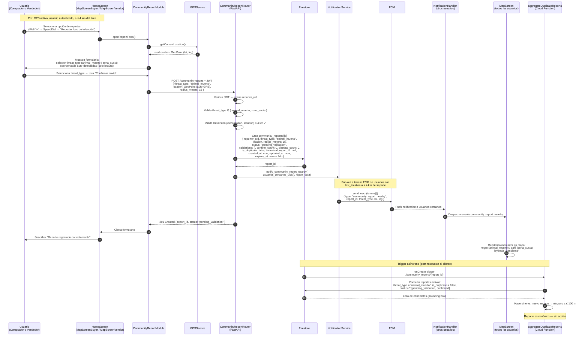

---

### Diagrama 9.6.B — Condición 5A: Usuario fuera del radio {#96b}

El usuario intenta reportar desde una ubicación a más de 4 km del área del foco. FastAPI detecta la violación de radio con Haversine y rechaza el registro con `400 Bad Request`. El sistema notifica al usuario del motivo del fallo. El reporte no se registra.

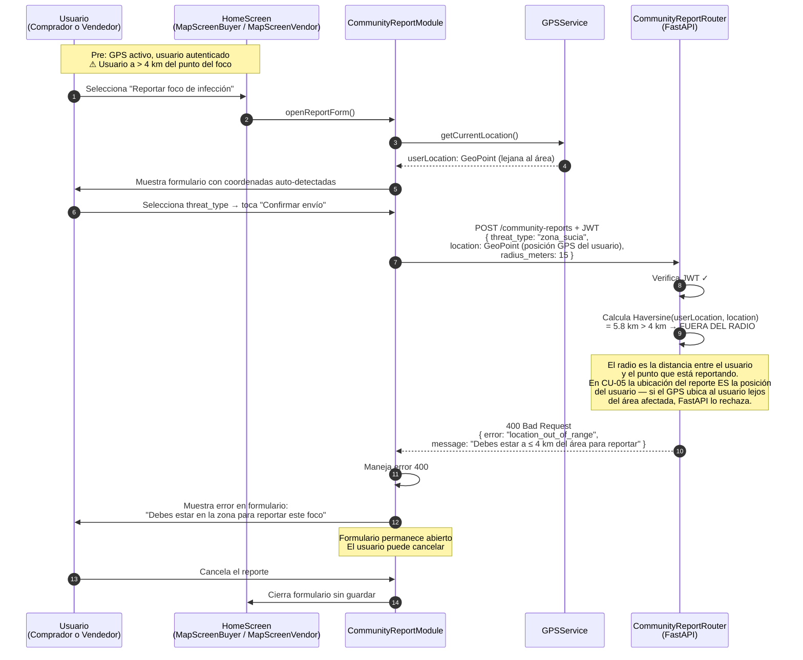

---

### Diagrama 9.6.C — Condición 7A: Alta densidad de reportes similares (agrupación) {#96c}

El usuario reporta un foco del mismo tipo que otro reporte activo a menos de 100 m. FastAPI crea el documento normalmente (el cliente recibe `201 Created`). Asincrónicamente, `aggregateDuplicateReports` detecta el reporte canónico y marca el nuevo como duplicado. Flutter agrupa visualmente el reporte duplicado bajo el pin canónico, mostrando un contador de reportes cercanos.

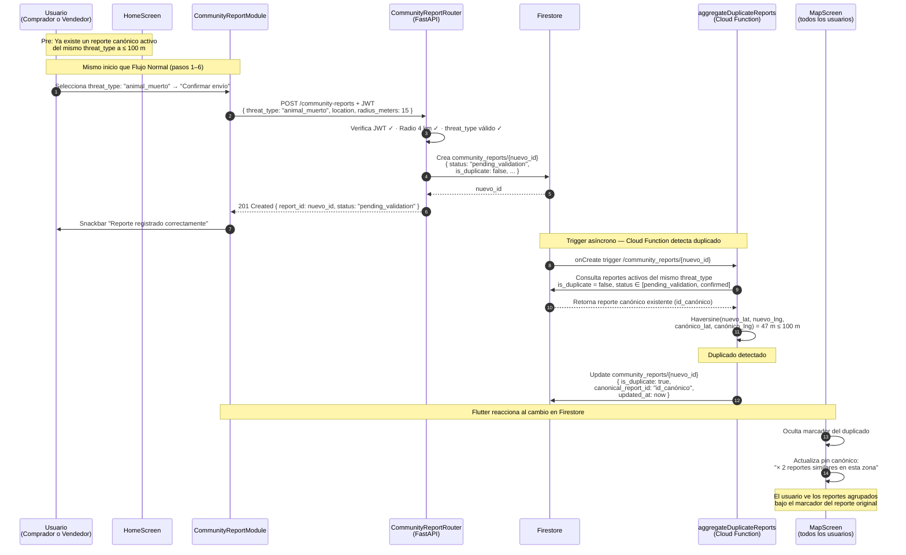

---

### Diagrama 9.6.D — E1: Pérdida de conexión {#96d}

El usuario intenta enviar el reporte pero la conexión falla. UBISAFE almacena temporalmente el payload en memoria y reintenta el envío automáticamente con backoff exponencial (hasta 3 intentos). Si se recupera la conexión, el flujo continúa como el Flujo Normal. Si los 3 intentos fallan, el sistema notifica al usuario del fallo y descarta el payload.

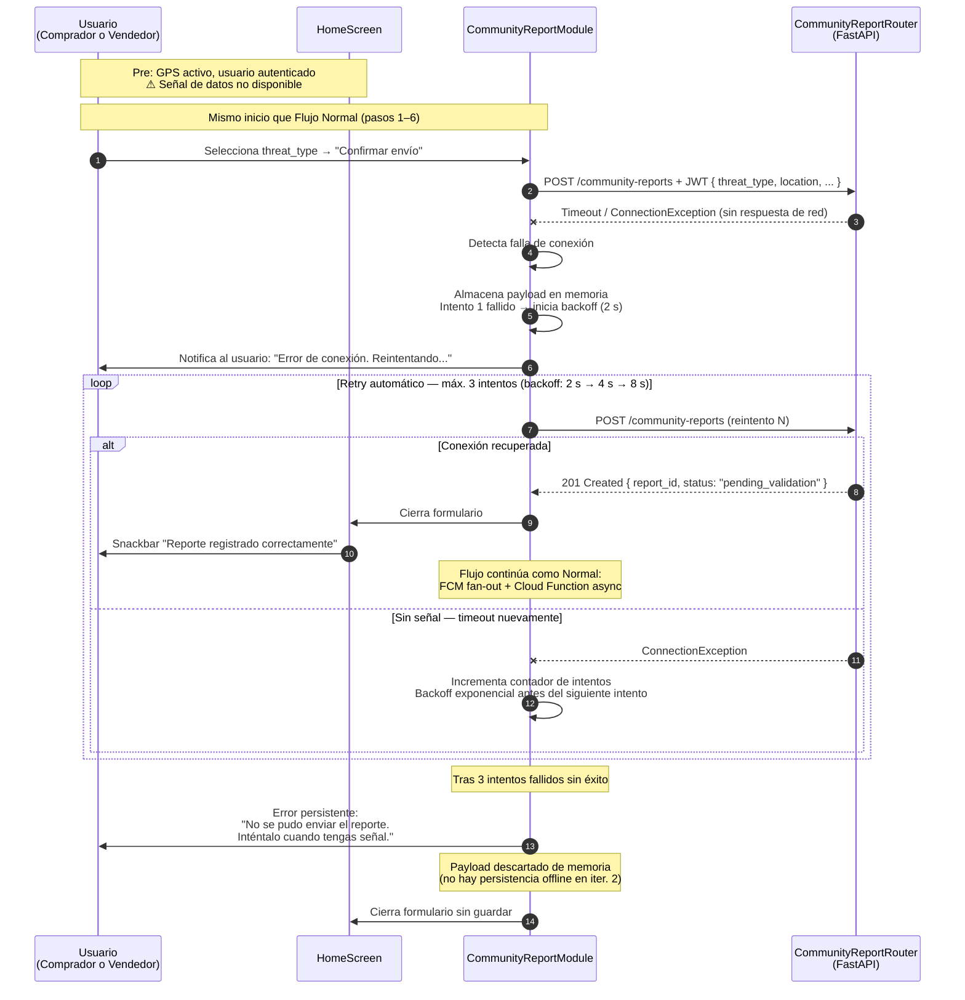

---

### Diagrama 9.6.E — E2: Error en geolocalización (GPS apagado) {#96e}

El usuario intenta reportar un foco pero el GPS del dispositivo no está activo o el permiso de ubicación no fue concedido. UBISAFE detecta la falla de geolocalización, bloquea el formulario, y solicita al usuario que active su GPS. El sistema espera reactivamente a que el GPS se active antes de permitir continuar.

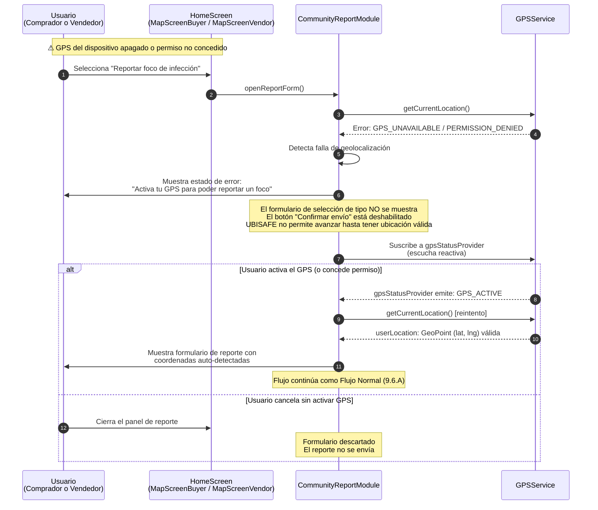

---

## §9.7 — CU-06: Verificar Reportes Comunitarios

### Descripción

El CU-06 permite que cualquier usuario autenticado valide (confirme o refute) un reporte comunitario de foco de infección creado por otra persona mediante CU-05. El sistema usa votación simple binaria con umbral de 3 votos en cualquier dirección para cambiar el estado del reporte (ADR #6).

**Reglas de negocio clave:** (1) el usuario no puede validar su propio reporte, (2) solo puede votar una vez por reporte, (3) el reporte debe estar en estado `pending_validation`, (4) el usuario debe estar a ≤ 4 km del reporte.

**Flujos cubiertos (6 diagramas):**

| Diagrama | Tipo | Trigger |
|---|---|---|
| 9.7.A | Flujo Normal | Voto registrado, umbral NOT alcanzado → sigue `pending_validation` |
| 9.7.B | Alternativo — Cond. 4A | Usuario ya participó previamente en la validación |
| 9.7.C | Alternativo — Cond. 8A | `confirm_count` alcanza umbral → estado `confirmed` |
| 9.7.D | Alternativo — Cond. 8B | `dismiss_count` alcanza umbral → estado `dismissed` |
| 9.7.E | Excepción — E1 | Pérdida de conexión al enviar el voto |
| 9.7.F | Excepción — E2 | Reporte ya no disponible (eliminado o cambiado de estado) |

---

### Diagrama 9.7.A — Flujo Normal (umbral no alcanzado) {#97a}

El usuario selecciona un reporte activo, ve sus detalles y emite su voto. FastAPI registra la validación y actualiza los contadores. El umbral de 3 votos **no** se alcanza, por lo que el estado permanece en `pending_validation`. UBISAFE notifica a los usuarios cercanos sobre la actualización del reporte.

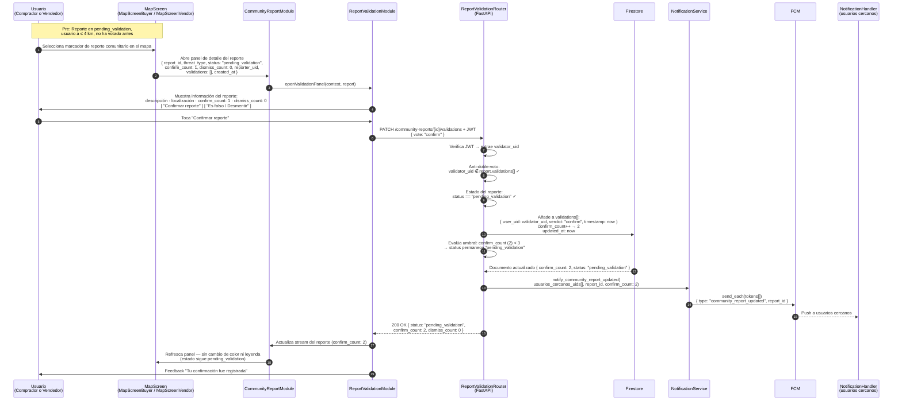

---

### Diagrama 9.7.B — Condición 4A: Usuario ya validó previamente {#97b}

UBISAFE detecta que el usuario ya participó en la validación del reporte (ya emitió un voto anteriormente). El sistema bloquea una nueva interacción en el cliente y notifica al usuario que ya participó. Si por condición de carrera el voto llega al servidor, FastAPI también lo rechaza con `409 Conflict`.

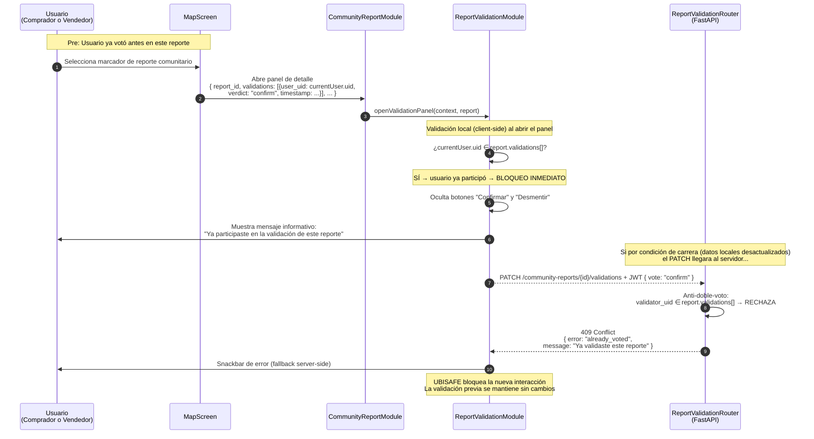

---

### Diagrama 9.7.C — Condición 8A: Reporte confirmado por alta confiabilidad {#97c}

UBISAFE detecta que el reporte ha alcanzado el umbral mínimo de confirmaciones (`confirm_count ≥ 3`). El sistema actualiza el estado del reporte a `confirmed`, notifica a los compradores/vendedores cercanos, y actualiza el marcador en todos los mapas con el indicador visual de "Validado".

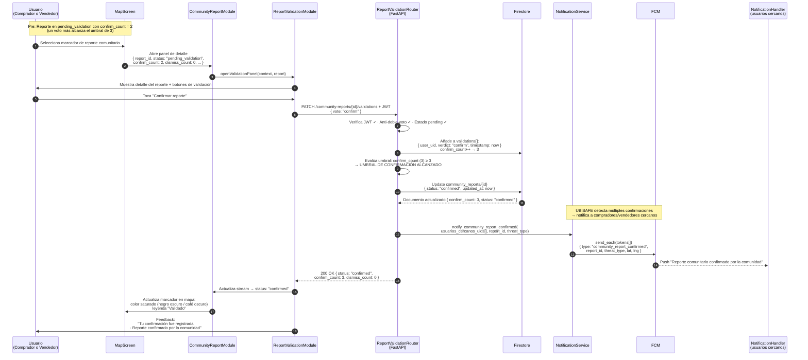

---

### Diagrama 9.7.D — Condición 8B: Reporte descartado por baja confiabilidad {#97d}

UBISAFE detecta que el reporte ha recibido suficientes rechazos (`dismiss_count ≥ 3`). El sistema actualiza el estado a `dismissed`, va atenuando la visibilidad del marcador en el mapa y notifica a los compradores/vendedores cercanos sobre el descarte.

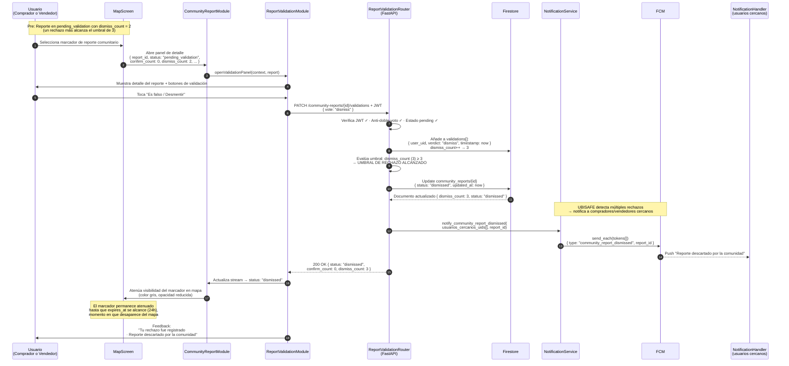

---

### Diagrama 9.7.E — E1: Pérdida de conexión {#97e}

El usuario intenta votar sobre un reporte pero la conexión falla. UBISAFE almacena temporalmente la acción, notifica al usuario del fallo y reintenta la sincronización automáticamente.

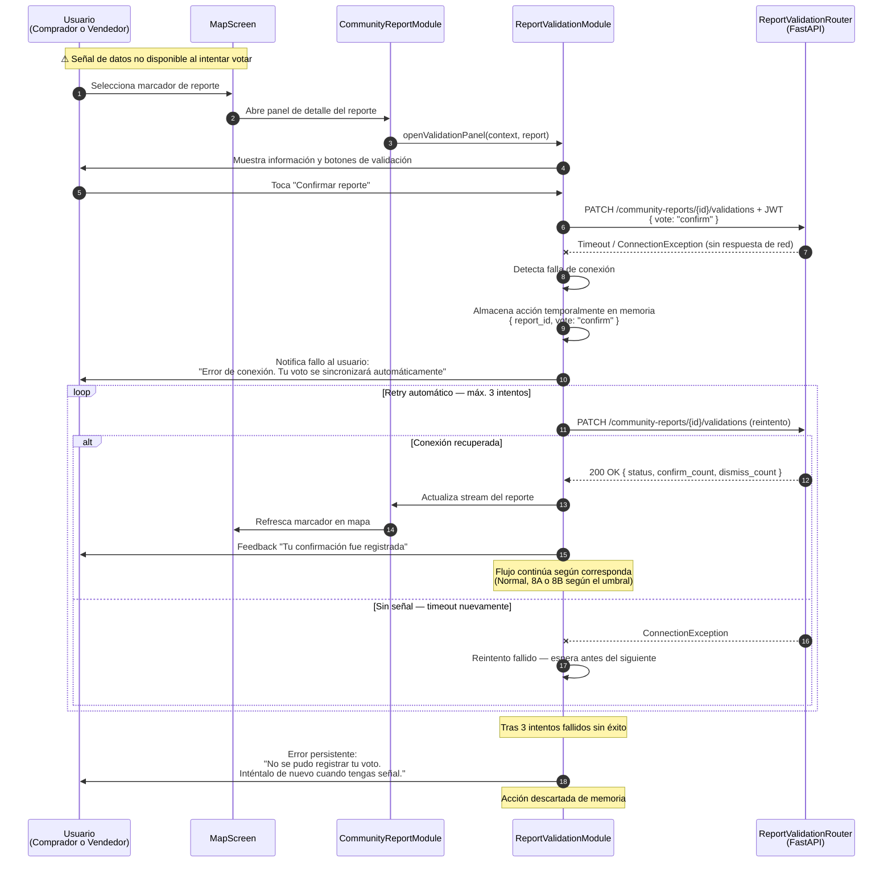

---

### Diagrama 9.7.F — E2: Reporte ya no disponible {#97f}

El reporte que el usuario quiere validar ha sido eliminado o cambió de estado durante la interacción (otro usuario lo confirmó/descartó mientras tanto). UBISAFE cancela la acción, notifica al usuario y actualiza el marcador al estado real del reporte.

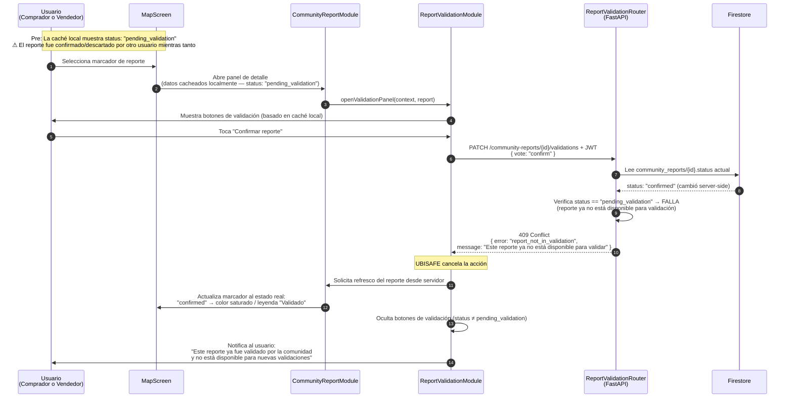

---

## Notas de implementación

### Métodos nuevos de NotificationService implícitos en iter. 2

Los Diagramas 9.7.A, 9.7.C y 9.7.D incluyen llamadas a `NotificationService` para eventos de validación que **no estaban en el diseño de Fase 2'**. Deben añadirse a `NotificationService` y `ReportValidationRouter`:

| Método nuevo | Diagrama | Evento FCM |
|---|---|---|
| `notify_community_report_updated(uids, report_id)` | 9.7.A | `community_report_updated` |
| `notify_community_report_confirmed(uids, report_id, threat_type)` | 9.7.C | `community_report_confirmed` |
| `notify_community_report_dismissed(uids, report_id)` | 9.7.D | `community_report_dismissed` |

**Total de métodos en NotificationService tras este ajuste:** 11 (4 iter.1 + 4 raite iter.2 + 3 validación iter.2)

### GPS reactivo en CU-05 E2

`CommunityReportModule` suscribe a `gpsStatusProvider` (Riverpod) al detectar GPS no disponible. Cuando el stream emite `GPS_ACTIVE`, el módulo reintenta `getCurrentLocation()` y habilita el formulario automáticamente sin que el usuario tenga que hacer nada adicional. Este comportamiento es consistente con `GpsRequiredEmptyState` (ya implementado en iter. 1).

### Bloqueo de voto propio (regla de negocio — no en SRS CU-06)

Además de la Condición 4A, la arquitectura (ADR #6) impide que el reportante vote su propio reporte. `ReportValidationModule` verifica `report.reporter_uid === currentUser.uid` antes de mostrar los botones. Si llega al servidor, `ReportValidationRouter` responde `403 Forbidden`. Esta restricción no tiene diagrama propio porque no es un flujo explícito en el SRS — es una precondición de negocio documentada en ADR #6 y en las reglas de validación de `ReportValidationRouter` (§5.3.5.4).

---

## Cobertura completa de flujos SRS v2.1

### CU-05

| Flujo SRS | Diagrama | Cubierto |
|---|---|---|
| Flujo Normal | 9.6.A | ✅ |
| Condición 5A: usuario fuera del radio | 9.6.B | ✅ |
| Condición 7A: alta densidad → agrupación | 9.6.C | ✅ |
| E1: Pérdida de conexión | 9.6.D | ✅ |
| E2: Error en geolocalización | 9.6.E | ✅ |

**Criterios de aceptación:**

| CA | Verificación | Diagrama | ✅ |
|---|---|---|---|
| CA-05.1: registro en ≤ 10 s | POST → Firestore write sin bloqueos | 9.6.A | ✅ |
| CA-05.2: rechazo fuera del radio | FastAPI Haversine > 4 km → 400 | 9.6.B | ✅ |
| CA-05.3: agrupación visual de duplicados | Cloud Function marca is_duplicate, Flutter agrupa | 9.6.C | ✅ |
| CA-05.4: almacenamiento + retry ante pérdida | Payload en memoria + backoff exponencial | 9.6.D | ✅ |

### CU-06

| Flujo SRS | Diagrama | Cubierto |
|---|---|---|
| Flujo Normal | 9.7.A | ✅ |
| Condición 4A: usuario ya validó | 9.7.B | ✅ |
| Condición 8A: confirmado por alta confiabilidad | 9.7.C | ✅ |
| Condición 8B: descartado por baja confiabilidad | 9.7.D | ✅ |
| E1: Pérdida de conexión | 9.7.E | ✅ |
| E2: Reporte ya no disponible | 9.7.F | ✅ |

**Criterios de aceptación:**

| CA | Verificación | Diagrama | ✅ |
|---|---|---|---|
| CA-06.1: registro en ≤ 10 s | PATCH → Firestore update sin bloqueos | 9.7.A | ✅ |
| CA-06.2: confirm_count ≥ 3 → confirmed | FastAPI evalúa umbral → actualiza status | 9.7.C | ✅ |
| CA-06.3: dismiss_count ≥ 3 → dismissed | FastAPI evalúa umbral → actualiza status | 9.7.D | ✅ |

---

## Handoff a Alexis / Miguel (integración al .docx)

1. Cada diagrama va en su propia subsección de §9 del SDD: exportar de Mermaid Live Editor como PNG o SVG.
2. El texto descriptivo encima de cada diagrama va en el .docx antes de la imagen.
3. **Nueva entrada en §9 del SDD:** §9.6 (CU-05, 5 diagramas) y §9.7 (CU-06, 6 diagramas).
4. **Actualización a SDD2_FASE2 (nota para Miguel):** `ReportValidationRouter` ahora también llama a `NotificationService` con 3 métodos nuevos. Incluir en la descripción de §5.3.5.4.
5. **En §13 Historial:** entrada V3.0 debe mencionar: "§9.6 (CU-05: 5 flujos) y §9.7 (CU-06: 6 flujos) — Interaction Viewpoint iter. 2. 11 diagramas total."

---

## Historial del archivo

| Versión | Fecha | Autor | Descripción |
|---|---|---|---|
| V1.0 | 24/04/2026 | Alexis Córdova (con Claude) | Fase 4.B' inicial: 4 diagramas (flujos combinados) |
| V2.0 | 25/04/2026 | Alexis Córdova (con Claude) | Revisión completa con SRS v2.1: 11 diagramas, un diagrama por flujo. CU-05: +9.6.B (Cond5A), +9.6.C (Cond7A), +9.6.D (E1), +9.6.E (E2). CU-06: +9.7.B (Cond4A), +9.7.C (Cond8A), +9.7.D (Cond8B), +9.7.E (E1), +9.7.F (E2). Separados 9.7.A (normal) de condiciones 8A/8B. Añadidos 3 métodos FCM a NotificationService. |

---

*Fase 4.B' — V2.0 completada. Output: `SDD2_FASE4B_UBISAFE.md`.*  
*Compartir con Miguel para revisión cruzada y coherencia con Fase 4.A' (CU-04).*  
*Generado: 25/04/2026 — Los Borbotones / UBISAFE Iteración 2*
