# SDD2 — Fase 5D': Diagrama de Navegación Extendido [iter. 2]
## CU-04 · CU-05 · CU-06 añadidos al grafo de navegación
### UBISAFE · Los Borbotones · 25/04/2026

> **Propósito:** Extender el `graph TD` de navegación del SDD iter. 1 (§10 de `SDD_FASE5_UBISAFE.md`) con los nodos correspondientes a CU-04 (Solicitar raite), CU-05 (Reportar foco de infección) y CU-06 (Verificar reportes comunitarios). Se añade también la nueva entrada del Drawer para CU-06.
>
> **Archivos base leídos:**
> - `SDD_FASE5_UBISAFE.md` §10.3 (diagrama Mermaid original, iter. 1)
> - `BB_SRS_V2.1.md` (flujos normal, alternativo y de excepción de CU-04, CU-05, CU-06)
> - `SDD2_FASE5B_UBISAFE.md` (wireframes pantallas nuevas — rutas go_router)
> - `SDD2_FASE5Balt_UBISAFE.md` (wireframes extensiones — W-07 ext, W-14b, W-18 ext)
>
> **Responsable:** 🟦 Alexis · Paralelizable con Fase 5C'
>
> **Convención de marcado:** Los nodos nuevos de iter. 2 se etiquetan con `[iter. 2]` en su texto. Los nodos de iter. 1 se conservan íntegros (sin modificar IDs).

---

## §10.3 [iter. 1 + iter. 2] — Diagrama de Navegación Extendido

> **Nota de integración al .docx:** Esta sección reemplaza al §10.3 original del SDD. Todos los nodos de iter. 1 se mantienen. Los nodos nuevos de iter. 2 están marcados en su etiqueta con `[iter. 2]` y estilizados con colores diferenciados (índigo para CU-04, violeta para CU-05, verde oscuro para CU-06).

```mermaid
graph TD
    %% ============================================================
    %% INICIO / SPLASH
    %% ============================================================
    Start((Apertura App)) --> Splash[Splash Screen]
    Splash --> SessionCheck{"¿Sesión activa?\nauthStateChanges"}

    %% ============================================================
    %% SIN SESIÓN — BIENVENIDA Y AUTH
    %% ============================================================
    SessionCheck -- No --> Welcome[Pantalla de Bienvenida]

    %% Sub-flujo: Registro
    Welcome -- "No tengo cuenta" --> SignUpData["SignUp — Datos\nnombre + teléfono"]
    SignUpData --> SignUpRole["SignUp — Selección de Rol\nBUYER / VENDOR"]
    SignUpRole --> AuthCreate["Firebase Auth\ncreateUserWithEmailAndPassword"]
    AuthCreate --> SyncNew["POST /auth/sync-profile\n+ PATCH /auth/device-token"]
    SyncNew --> RoleRoute

    %% Sub-flujo: Login
    Welcome -- "Tengo cuenta" --> LoginScreen[Pantalla de Login]
    LoginScreen --> AuthLogin{"Firebase Auth\nsignIn"}
    AuthLogin -- "Inválidas" --> LoginError["Error inline:\nCredenciales incorrectas"]
    LoginError --> LoginScreen
    AuthLogin -- "Válidas" --> SyncExist["POST /auth/sync-profile\n+ PATCH /auth/device-token"]
    SyncExist --> RoleRoute

    %% Sesión activa al inicio
    SessionCheck -- Sí --> ReadRole["Leer users/{uid}.role\ndesde Firestore"]
    ReadRole --> RoleRoute

    %% ============================================================
    %% ROUTING POR ROL
    %% ============================================================
    RoleRoute{Verificar Rol}
    RoleRoute -- BUYER --> HomeC
    RoleRoute -- VENDOR --> HomeV

    %% ============================================================
    %% DRAWER — NAVEGACIÓN GLOBAL
    %% Accesible sin GPS (desde HomeC, HomeV y EmptyStateGps)
    %% ============================================================
    HomeC -- "Ícono menú" --> Drawer["Drawer\nMenú Lateral"]
    HomeV -- "Ícono menú" --> Drawer
    EmptyStateGps -- "Ícono menú" --> Drawer

    Drawer --> Profile[Mi Perfil]
    Drawer --> History[Historial de Actividad]
    Drawer -- "Cerrar Sesión" --> SignOut["firebase.signOut()"]
    SignOut --> Welcome

    %% [iter. 2] CU-06: Nueva entrada en Drawer
    Drawer --> ActiveReports["[iter. 2] Lista Reportes Activos\n/community-reports"]

    %% ============================================================
    %% EMPTY STATE GPS — COMPONENTE COMPARTIDO
    %% GpsRequiredEmptyState: pantalla bloqueante cuando
    %%   GPS del sistema apagado O permiso denegado
    %% ============================================================
    EmptyStateGps["GpsRequiredEmptyState\nActiva el GPS o concede el permiso\nCTA dinámico según caso"]
    EmptyStateGps -.->|"GPS activado / permiso concedido"| HomeC
    EmptyStateGps -.->|"GPS activado / permiso concedido"| HomeV

    %% ============================================================
    %% FLUJO COMPRADOR — BUYER
    %% ============================================================
    HomeC["Home Comprador\nMapa — Radar de Seguridad\n[iter. 2] + focos de infección en mapa"]
    HomeC --> GPSCheck{"¿GPS activo?"}
    GPSCheck -- No --> EmptyStateGps
    GPSCheck -- Sí --> MapViewC["Mapa activo:\nVendedores en radio 4 km\n[iter. 2] + polígonos community_reports"]

    %% ──────────────────────────────────────────────────────────────
    %% CU-01 (iter. 1) + CU-04 [iter. 2]: Solicitar parada / raite
    %% ──────────────────────────────────────────────────────────────
    MapViewC --> SelectVendor["Toca marcador del vendedor"]

    %% [iter. 2] Bottom Sheet ahora tiene dos variantes según rideEnabled
    SelectVendor --> VendorSheet["[iter. 2] Bottom Sheet Vendedor\nVariante A (solo parada)\nVariante B (parada + raite)"]

    %% Rama CU-01: Solicitar parada (sin cambio respecto a iter. 1)
    VendorSheet -- "Solicitar parada\nPOST /stops" --> WaitScreen["Esperando respuesta\ndel vendedor — 60s"]
    WaitScreen -- "Vendedor acepta" --> TrackingScreen["Pantalla de Seguimiento\nen Tiempo Real — RTDB stream"]
    WaitScreen -- "Vendedor rechaza" --> RejectFeedback["Snackbar:\nEl vendedor no pudo atenderte"]
    WaitScreen -- "Timeout 60s" --> TimeoutFeedback["Snackbar:\nTiempo de espera agotado"]
    RejectFeedback --> MapViewC
    TimeoutFeedback --> MapViewC
    TrackingScreen --> ArrivalConfirm["FCM: ¡El vendedor llegó!"]
    ArrivalConfirm --> HomeC

    %% [iter. 2] Rama CU-04: Solicitar raite — solo si rideEnabled: true
    VendorSheet -- "[iter. 2] Solicitar raite\n(solo si rideEnabled: true)" --> GPSCheckRide{"¿GPS activo?\n[iter. 2] (raite)"}
    GPSCheckRide -- No --> EmptyStateGps
    GPSCheckRide -- Sí --> RideRequestScreen["[iter. 2] Pantalla Solicitud de Raite\n/ride/request · DestinationPicker"]
    RideRequestScreen --> DestinoPicker["Seleccionar destino\nPlaces Autocomplete\n+ validación ≤ 4 km del vendedor"]
    DestinoPicker -- "Destino > 4 km\n(Condición 4A)" --> DestError["Error inline:\nDestino muy lejos\nbotón Confirmar deshabilitado"]
    DestError --> DestinoPicker
    DestinoPicker -- "Confirmar solicitud\nPOST /rides · status: pending" --> WaitRide["[iter. 2] Esperando respuesta\ndel vendedor — 15s (CA-04.3)"]
    WaitRide -- "Vendedor acepta" --> RideTracking["[iter. 2] Navegación Raite\nSeguimiento en Tiempo Real"]
    WaitRide -- "Vendedor rechaza\n(Condición 6A)" --> RideRejectFB["Snackbar:\nRaite rechazado"]
    WaitRide -- "Timeout 15s\n(CA-04.3)" --> RideTimeoutFB["Snackbar:\nTiempo de espera agotado"]
    WaitRide -- "Vendedor no disponible\n(Condición 3A)" --> RideUnavailFB["Snackbar:\nVendedor no disponible"]
    RideRejectFB --> MapViewC
    RideTimeoutFB --> MapViewC
    RideUnavailFB --> MapViewC
    RideTracking --> RideCompleteC["[iter. 2] Llegada al destino\nServicio completado — notificación"]
    RideCompleteC --> HomeC

    %% ──────────────────────────────────────────────────────────────
    %% CU-03 (iter. 1) + CU-05 [iter. 2]: FAB expandible — Comprador
    %% FAB '+' ahora despliega dos mini-FABs al pulsarlo
    %% ──────────────────────────────────────────────────────────────
    HomeC -- "FAB +" --> FABExpandC{"[iter. 2] FAB Expandible\n¿Tipo de reporte?\n(mini-FABs)"}

    %% Opción A: Riesgo de tránsito (CU-03, sin cambio)
    FABExpandC -- "Riesgo de tránsito" --> GPSCheckFAB_C{"¿GPS activo?\n(CU-03 Comprador)"}
    GPSCheckFAB_C -- No --> EmptyStateGps
    GPSCheckFAB_C -- Sí --> RiskFormC["CU-03: Bottom Sheet\nReportar Riesgo de Tránsito\nPOST /risk-zones"]
    RiskFormC --> RiskSuccessC["Snackbar:\nZona de riesgo reportada"]
    RiskSuccessC --> HomeC

    %% Opción B: Foco de infección [iter. 2] (CU-05, compartido con Vendedor)
    FABExpandC -- "[iter. 2] Foco de infección" --> GPSCheckFAB_CU05{"¿GPS activo?\n[iter. 2] (CU-05)"}

    %% ============================================================
    %% FLUJO VENDEDOR — VENDOR
    %% ============================================================
    HomeV["Home Vendedor\nMapa — Navegación y Riesgos\n[iter. 2] + focos de infección en mapa"]
    HomeV --> GPSCheck_V{"¿GPS activo?"}
    GPSCheck_V -- No --> EmptyStateGps
    GPSCheck_V -- Sí --> VisibilityToggle["Toggle:\nActivar Visibilidad"]

    %% CU-02: Radar de visibilidad (sin cambio)
    VisibilityToggle --> PopupConfirm{"PopupConfirm:\n¿Iniciar transmisión?"}
    PopupConfirm -- No --> HomeV
    PopupConfirm -- Sí --> VisibilityFeedback["Feedback:\nAhora eres Visible ✓\nGPSService.startTransmission()"]
    VisibilityFeedback --> MapViewV["Mapa Activo:\nEscuchando solicitudes de parada y raite"]

    %% CU-01: Atender solicitud de parada — Vendedor (sin cambio)
    MapViewV -- "FCM: stop_request_incoming" --> IncomingDialog["Dialog:\nSolicitud de Parada Entrante — 60s"]
    IncomingDialog -- Rechazar --> MapViewV
    IncomingDialog -- Aceptar --> GPSCheck_Req{"¿GPS activo?\n(aceptar parada)"}
    GPSCheck_Req -- No --> EmptyStateGps
    GPSCheck_Req -- Sí --> SafeNav["Navegación Segura:\nEvitando Zonas de Riesgo\nDirections API"]
    SafeNav --> DeliveryConfirm["Confirmar Entrega\nPATCH /stops/{id} completed"]
    DeliveryConfirm --> MapViewV

    %% [iter. 2] CU-04: Atender solicitud de raite — Vendedor
    MapViewV -- "[iter. 2] FCM: ride_request_incoming\n(solo si rideEnabled: true)" --> RideIncomingDialog["[iter. 2] Dialog:\nSolicitud de Raite Entrante — 15s"]
    RideIncomingDialog -- Rechazar --> MapViewV
    RideIncomingDialog -- "Timeout 15s\n(CA-04.3)" --> MapViewV
    RideIncomingDialog -- Aceptar --> GPSCheck_RideV{"¿GPS activo?\n[iter. 2] (aceptar raite)"}
    GPSCheck_RideV -- No --> EmptyStateGps
    GPSCheck_RideV -- Sí --> SafeNavRide["[iter. 2] Navegación Raite:\nHacia punto de recogida del comprador"]
    SafeNavRide --> RidePickup["[iter. 2] Comprador aborda\nIniciar trayecto al destino"]
    RidePickup --> RideArrivalV["[iter. 2] Confirmar llegada al destino\nPATCH /rides/{id} completed"]
    RideArrivalV --> MapViewV

    %% Desactivar radar (sin cambio)
    MapViewV -- "Toggle OFF" --> DeactivateToggle["GPSService.stopTransmission()\nNodo RTDB eliminado"]
    DeactivateToggle --> HomeV

    %% ──────────────────────────────────────────────────────────────
    %% CU-03 (iter. 1) + CU-05 [iter. 2]: FAB expandible — Vendedor
    %% ──────────────────────────────────────────────────────────────
    HomeV -- "FAB +" --> FABExpandV{"[iter. 2] FAB Expandible\n¿Tipo de reporte?\n(mini-FABs)"}

    %% Opción A: Riesgo de tránsito (CU-03, sin cambio)
    FABExpandV -- "Riesgo de tránsito" --> GPSCheckFAB_V{"¿GPS activo?\n(CU-03 Vendedor)"}
    GPSCheckFAB_V -- No --> EmptyStateGps
    GPSCheckFAB_V -- Sí --> RiskFormV["CU-03: Bottom Sheet\nReportar Riesgo de Tránsito\nPOST /risk-zones"]
    RiskFormV --> RiskSuccessV["Snackbar:\nZona de riesgo reportada"]
    RiskSuccessV --> HomeV

    %% Opción B: Foco de infección [iter. 2] (CU-05, mismo nodo compartido)
    FABExpandV -- "[iter. 2] Foco de infección" --> GPSCheckFAB_CU05

    %% ============================================================
    %% [iter. 2] CU-05: Reportar foco de infección — Nodo compartido
    %% Accesible desde HomeC (via FABExpandC) y HomeV (via FABExpandV)
    %% ============================================================
    GPSCheckFAB_CU05{"¿GPS activo?\n[iter. 2] (CU-05)"} -- No --> EmptyStateGps
    GPSCheckFAB_CU05 -- Sí --> InfectionForm["[iter. 2] CU-05: Bottom Sheet\nReportar Foco de Infección\nSeleccionar tipo · radio fijo 15 m"]
    InfectionForm -- "Enviar reporte\nPOST /community-reports\nstatus: pending_validation" --> InfectionSuccess["[iter. 2] Foco reportado\n✓ Pendiente de validación comunitaria"]
    InfectionSuccess -.->|"Cierra bottom sheet → regresa a Home"| HomeC
    InfectionSuccess -.->|"Cierra bottom sheet → regresa a Home"| HomeV

    %% ============================================================
    %% [iter. 2] CU-06: Verificar reportes comunitarios
    %% Entrada: Drawer → Lista → Detalle + Validación
    %% ============================================================
    ActiveReports --> ReportDetail["[iter. 2] Detalle + Validación de Reporte\n/community-reports/:id\nVer info + mapa + contadores"]

    %% Flujo de validación (in-place, sin navegación adicional)
    ReportDetail -- "[iter. 2] Confirmar\nPATCH /community-reports/{id}/validations\nvote: confirm" --> VoteCast["[iter. 2] Validación registrada\ncontadores actualizados"]
    ReportDetail -- "[iter. 2] Desmentir\nPATCH /community-reports/{id}/validations\nvote: dismiss" --> VoteCast
    VoteCast -- "Umbral confirmaciones alcanzado\n(CA-06.2: 3 confirma.)" --> ConfirmedReport["[iter. 2] Reporte Confirmado ✓\nBanner verde · estado updated"]
    VoteCast -- "Umbral rechazos alcanzado\n(CA-06.3: 3 rechazos)" --> DismissedReport["[iter. 2] Reporte Descartado\nVisibilidad reducida · expires"]
    VoteCast --> ReportDetail
    ConfirmedReport -.->|"Atrás"| ActiveReports
    DismissedReport -.->|"Atrás"| ActiveReports
    ReportDetail -.->|"Atrás"| ActiveReports

    %% Casos especiales — in-place, sin navegación
    ReportDetail -- "[iter. 2] Reporte propio\n(reporter_uid == current_uid)" --> OwnReportBlock["[iter. 2] Banner: No puedes validar\ntu propio reporte\nbotones deshabilitados"]
    ReportDetail -- "[iter. 2] Ya votó\n(Condición 4A)" --> AlreadyVoted["[iter. 2] Botones deshabilitados\nMostrando voto previo"]

    %% ============================================================
    %% ESTILOS — IDENTIDAD VISUAL
    %% ============================================================

    %% Iter. 1 — nodos Comprador (azul)
    style HomeC fill:#E3F2FD,stroke:#1565C0,stroke-width:2px
    style MapViewC fill:#E3F2FD,stroke:#1565C0,stroke-width:1px
    style TrackingScreen fill:#E3F2FD,stroke:#1565C0,stroke-width:1px
    style WaitScreen fill:#E3F2FD,stroke:#1565C0,stroke-width:1px

    %% Iter. 1 — nodos Vendedor (verde)
    style HomeV fill:#F1F8E9,stroke:#2E7D32,stroke-width:2px
    style MapViewV fill:#F1F8E9,stroke:#2E7D32,stroke-width:1px
    style SafeNav fill:#F1F8E9,stroke:#2E7D32,stroke-width:1px

    %% Iter. 1 — CU-03 (naranja)
    style RiskFormC fill:#FFF3E0,stroke:#E65100,stroke-width:2px
    style RiskFormV fill:#FFF3E0,stroke:#E65100,stroke-width:2px

    %% Iter. 1 — Drawer y pantallas globales (gris)
    style Drawer fill:#F5F5F5,stroke:#616161,stroke-width:1px
    style Profile fill:#F5F5F5,stroke:#616161,stroke-width:1px
    style History fill:#F5F5F5,stroke:#616161,stroke-width:1px
    style EmptyStateGps fill:#FFF8E1,stroke:#F57C00,stroke-width:2px

    %% [iter. 2] CU-04 — Raite (índigo)
    style VendorSheet fill:#E8EAF6,stroke:#3949AB,stroke-width:2px
    style RideRequestScreen fill:#E8EAF6,stroke:#3949AB,stroke-width:2px
    style WaitRide fill:#E8EAF6,stroke:#3949AB,stroke-width:1px
    style RideTracking fill:#E8EAF6,stroke:#3949AB,stroke-width:1px
    style SafeNavRide fill:#E8EAF6,stroke:#3949AB,stroke-width:1px
    style RideIncomingDialog fill:#E8EAF6,stroke:#3949AB,stroke-width:2px
    style RidePickup fill:#E8EAF6,stroke:#3949AB,stroke-width:1px
    style RideArrivalV fill:#E8EAF6,stroke:#3949AB,stroke-width:1px
    style RideCompleteC fill:#E8EAF6,stroke:#3949AB,stroke-width:1px

    %% [iter. 2] CU-05 — Foco de infección (violeta)
    style InfectionForm fill:#F3E5F5,stroke:#7B1FA2,stroke-width:2px
    style InfectionSuccess fill:#F3E5F5,stroke:#7B1FA2,stroke-width:1px

    %% [iter. 2] CU-06 — Reportes comunitarios (verde oscuro)
    style ActiveReports fill:#E8F5E9,stroke:#1B5E20,stroke-width:2px
    style ReportDetail fill:#E8F5E9,stroke:#1B5E20,stroke-width:2px
    style VoteCast fill:#E8F5E9,stroke:#1B5E20,stroke-width:1px
    style ConfirmedReport fill:#E8F5E9,stroke:#1B5E20,stroke-width:1px
    style DismissedReport fill:#FAFAFA,stroke:#9E9E9E,stroke-width:1px

    %% Clases de compuertas GPS
    classDef gpsGate fill:#FFF3E0,stroke:#E65100,stroke-width:1px,stroke-dasharray:4
    class GPSCheck,GPSCheck_V,GPSCheckFAB_C,GPSCheckFAB_V,GPSCheck_Req gpsGate

    classDef gpsGateIter2 fill:#EDE7F6,stroke:#512DA8,stroke-width:1px,stroke-dasharray:4
    class GPSCheckRide,GPSCheckFAB_CU05,GPSCheck_RideV gpsGateIter2
```

---

## §10.4 [iter. 1 + iter. 2] — Cobertura de casos de uso

> **Verificación (Paso 5D'.4):** Cada CU del SRS v2.1 debe aparecer en al menos un diagrama de secuencia, un diagrama de componentes y una pantalla de UI. Este checklist confirma la cobertura en el diagrama de navegación.

### Cobertura iter. 1 (sin cambios)

| CU / Flujo | Cubierto | Nodos clave |
|---|---|---|
| **Auth — Registro** | ✅ | SignUpData → SignUpRole → AuthCreate → SyncNew |
| **Auth — Login** | ✅ | LoginScreen → AuthLogin → SyncExist |
| **Auth — Sesión activa** | ✅ | SessionCheck → ReadRole → RoleRoute |
| **CU-01 — Flujo normal (Comprador)** | ✅ | SelectVendor → VendorSheet → WaitScreen → TrackingScreen |
| **CU-01 — Vendedor rechaza** | ✅ | WaitScreen → RejectFeedback → MapViewC |
| **CU-01 — Timeout 60s** | ✅ | WaitScreen → TimeoutFeedback → MapViewC |
| **CU-01 — Flujo Vendedor acepta** | ✅ | IncomingDialog → SafeNav → DeliveryConfirm |
| **CU-01 — Flujo Vendedor rechaza** | ✅ | IncomingDialog → MapViewV |
| **CU-02 — Activar radar** | ✅ | VisibilityToggle → PopupConfirm → VisibilityFeedback → MapViewV |
| **CU-02 — Cancelar activación** | ✅ | PopupConfirm (No) → HomeV |
| **CU-02 — Desactivar radar** | ✅ | MapViewV (Toggle OFF) → DeactivateToggle → HomeV |
| **CU-03 — Comprador** | ✅ | HomeC (FAB+) → FABExpandC → RiskFormC → RiskSuccessC |
| **CU-03 — Vendedor** | ✅ | HomeV (FAB+) → FABExpandV → RiskFormV → RiskSuccessV |
| **Drawer — Perfil / Historial** | ✅ | Drawer → Profile / History |
| **Drawer — Logout** | ✅ | Drawer → SignOut → Welcome |
| **GPS apagado — mapa Comprador** | ✅ | GPSCheck (No) → EmptyStateGps |
| **GPS apagado — mapa Vendedor** | ✅ | GPSCheck_V (No) → EmptyStateGps |
| **GPS apagado — FAB Comprador** | ✅ | GPSCheckFAB_C (No) → EmptyStateGps |
| **GPS apagado — FAB Vendedor** | ✅ | GPSCheckFAB_V (No) → EmptyStateGps |
| **GPS apagado — Aceptar parada** | ✅ | GPSCheck_Req (No) → EmptyStateGps |

### Cobertura iter. 2 — Nuevos CU ✅

| CU / Flujo | Cubierto | Nodos clave |
|---|---|---|
| **CU-04 — Solicitar raite (Comprador, flujo normal)** | ✅ | VendorSheet → RideRequestScreen → DestinoPicker → WaitRide → RideTracking → RideCompleteC |
| **CU-04 — Destino > 4 km (Condición 4A)** | ✅ | DestinoPicker → DestError → DestinoPicker |
| **CU-04 — Vendedor rechaza (Condición 6A)** | ✅ | WaitRide → RideRejectFB → MapViewC |
| **CU-04 — Timeout 15s (CA-04.3)** | ✅ | WaitRide → RideTimeoutFB → MapViewC |
| **CU-04 — Vendedor no disponible (Condición 3A)** | ✅ | WaitRide → RideUnavailFB → MapViewC |
| **CU-04 — Atender raite (Vendedor, flujo normal)** | ✅ | MapViewV → RideIncomingDialog → SafeNavRide → RidePickup → RideArrivalV |
| **CU-04 — Vendedor rechaza raite** | ✅ | RideIncomingDialog (Rechazar) → MapViewV |
| **CU-04 — Timeout dialog Vendedor (CA-04.3)** | ✅ | RideIncomingDialog (Timeout 15s) → MapViewV |
| **CU-04 — GPS apagado al aceptar raite** | ✅ | GPSCheck_RideV (No) → EmptyStateGps |
| **CU-04 — Toggle rideEnabled en Perfil** | ✅ | Drawer → Profile (W-19 ext tiene SwitchListTile — cubierto en wireframes) |
| **CU-05 — Reportar foco (Comprador, flujo normal)** | ✅ | FABExpandC → InfectionForm → InfectionSuccess → HomeC |
| **CU-05 — Reportar foco (Vendedor, flujo normal)** | ✅ | FABExpandV → InfectionForm → InfectionSuccess → HomeV |
| **CU-05 — GPS apagado (E2)** | ✅ | GPSCheckFAB_CU05 (No) → EmptyStateGps |
| **CU-06 — Lista de reportes** | ✅ | Drawer → ActiveReports → ReportDetail |
| **CU-06 — Confirmar reporte (flujo normal)** | ✅ | ReportDetail → VoteCast (confirm) → actualización in-place |
| **CU-06 — Desmentir reporte (flujo normal)** | ✅ | ReportDetail → VoteCast (dismiss) → actualización in-place |
| **CU-06 — Umbral confirmaciones alcanzado (CA-06.2)** | ✅ | VoteCast → ConfirmedReport |
| **CU-06 — Umbral rechazos alcanzado (CA-06.3)** | ✅ | VoteCast → DismissedReport |
| **CU-06 — Ya votó previamente (Condición 4A)** | ✅ | ReportDetail → AlreadyVoted |
| **CU-06 — Propio reporte** | ✅ | ReportDetail → OwnReportBlock |
| **Drawer — nueva entrada Reportes activos** | ✅ | Drawer → ActiveReports |
| **FAB expandible (CU-03 + CU-05)** | ✅ | HomeC/HomeV → FABExpandC/V → rama tránsito o rama infección |

### ⚠️ Flujos fuera del alcance del diagrama de navegación

Los siguientes flujos del SRS v2.1 están cubiertos en **diagramas de secuencia** (Fase 4') y **wireframes** (Fase 5B'/5B.alt') pero no generan nodos de navegación independientes (son estados internos de una pantalla):

| Flujo | Cubierto en |
|---|---|
| CU-05 — Alta densidad de reportes (Condición 7A, agrupación) | Fase 4.B' (secuencia), Fase 3.B' (BD) |
| CU-05 — Pérdida de conexión con retry (E1) | Fase 4.B' (secuencia) |
| CU-04 — Pérdida de conexión a mitad del raite (E1) | Fase 4.A' (secuencia) |
| CU-04 — Cancelación por el comprador (E2) | Fase 4.A' (secuencia) |
| CU-06 — Reporte ya no disponible (E2) | Fase 4.B' (secuencia) |

---

## §10.5 — Descripción de nuevos nodos [iter. 2]

### Nodos de CU-04 — Solicitar raite

| ID nodo | Tipo | Descripción | Ruta go_router |
|---|---|---|---|
| `VendorSheet` | Pantalla (Bottom Sheet) | Bottom Sheet del vendedor extendido. Variante A (rideEnabled: false): solo botón "Solicitar parada". Variante B (rideEnabled: true): botones "Solicitar parada" y "Solicitar raite". Reemplaza y extiende `RequestSheet` de iter. 1. | — (overlay) |
| `RideRequestScreen` | Pantalla | Pantalla nueva. Patrón DestinationPicker: mapa fullscreen + bottom sheet con buscador de destino, validación ≤ 4 km, y botón "Confirmar solicitud". | `/ride/request` |
| `DestinoPicker` | Estado interno | Estado de interacción dentro de RideRequestScreen: búsqueda de dirección con Places Autocomplete y pin draggable. | — |
| `WaitRide` | Estado interno | Estado de espera de respuesta del vendedor tras POST /rides. Timeout de 15 s (CA-04.3). | — |
| `RideTracking` | Pantalla | Seguimiento en tiempo real del raite activo. Muestra posiciones de comprador y vendedor durante el trayecto. | Estado de HomeC / TrackingScreen extendido |
| `RideIncomingDialog` | Componente (Dialog) | Dialog exclusivo para solicitudes de raite (`W-14b`). Muestra recogida + destino + distancia total + countdown de 15 s. Color de urgencia: `warning-700`. | — (overlay sobre HomeV) |
| `SafeNavRide` | Estado interno | Navegación del vendedor hacia el punto de recogida del comprador, evitando zonas de riesgo. Reutiliza lógica de `SafeNav` de iter. 1. | Estado de MapViewV |

### Nodos de CU-05 — Reportar foco de infección

| ID nodo | Tipo | Descripción | Ruta go_router |
|---|---|---|---|
| `FABExpandC` / `FABExpandV` | Componente (FAB) | FAB "+" ahora despliega dos mini-FABs: "Riesgo de tránsito" (CU-03) y "Foco de infección" (CU-05). La elección determina el flujo siguiente. | — (overlay sobre HomeC / HomeV) |
| `GPSCheckFAB_CU05` | Compuerta GPS | Verificación de GPS compartida entre Comprador y Vendedor antes de abrir el bottom sheet de CU-05. Si GPS inactivo → EmptyStateGps. | — |
| `InfectionForm` | Pantalla (Bottom Sheet) | `CommunityReportBottomSheet` — pantalla nueva. Selección de tipo de foco (animal muerto / zona sucia), preview en mapa, botón enviar. Radio fijo: 15 m. | — (overlay modal) |
| `InfectionSuccess` | Estado interno | Confirmación de éxito tras POST /community-reports. Se cierra automáticamente en 2 s y regresa al Home de origen. | — |

### Nodos de CU-06 — Verificar reportes comunitarios

| ID nodo | Tipo | Descripción | Ruta go_router |
|---|---|---|---|
| `ActiveReports` | Pantalla | Lista de reportes activos (`pending_validation` + `confirmed`) con filtros por estado. Entrada desde Drawer. | `/community-reports` |
| `ReportDetail` | Pantalla | Detalle del reporte + mapa (220dp) + componente `VotingIndicator` (full) + botones Confirmar/Desmentir. | `/community-reports/:id` |
| `VoteCast` | Acción in-place | Resultado del voto (PATCH .../validations). Actualiza contadores y `ReportStatusChip` sin salir de la pantalla. | — |
| `ConfirmedReport` | Estado interno | Banner verde "Reporte validado por la comunidad" dentro de ReportDetail. Se muestra cuando `confirm_count ≥ umbral`. | — |
| `DismissedReport` | Estado interno | Banner gris "Reporte descartado" dentro de ReportDetail. Se muestra cuando `dismiss_count ≥ umbral`. | — |
| `OwnReportBlock` | Estado interno | Banner gris "No puedes validar tu propio reporte" dentro de ReportDetail. Botones permanentemente deshabilitados. | — |
| `AlreadyVoted` | Estado interno | Estado de ReportDetail cuando el usuario ya participó en la validación (Condición 4A). | — |

---

## §10.6 — Cambios al diagrama respecto a iter. 1

| Elemento de iter. 1 | Cambio en iter. 2 | Impacto en el grafo |
|---|---|---|
| `SelectVendor --> RequestSheet` | `SelectVendor --> VendorSheet` con rama doble (parada / raite) | Nodo `RequestSheet` absorbido en `VendorSheet`; nueva rama hacia `RideRequestScreen` |
| `HomeC -- "FAB +" --> GPSCheckFAB_C` | `HomeC -- "FAB +" --> FABExpandC --> GPSCheckFAB_C (o GPSCheckFAB_CU05)` | FAB pasa por nodo de elección antes de la compuerta GPS |
| `HomeV -- "FAB +" --> GPSCheckFAB_V` | `HomeV -- "FAB +" --> FABExpandV --> GPSCheckFAB_V (o GPSCheckFAB_CU05)` | Mismo patrón que Comprador |
| `Drawer` (3 entradas) | `Drawer` (4 entradas: + `ActiveReports`) | Nueva arista Drawer → ActiveReports |
| `MapViewV` recibe solo `stop_request_incoming` | `MapViewV` recibe también `ride_request_incoming` | Nueva arista hacia `RideIncomingDialog` |
| Estilos: 4 colores (azul, verde, naranja, gris) | 7 colores: + índigo (CU-04), violeta (CU-05), verde oscuro (CU-06) | Clases CSS ampliadas |

---

## Notas para integración al .docx

1. **Insertar como §10 [iter. 1 + iter. 2]** — reemplazar el §10.3 original por el diagrama extendido de esta sección.
2. El diagrama Mermaid se exporta como imagen (PNG o SVG) desde cualquier editor compatible (VS Code + Mermaid Preview, mermaid.live, o Typora).
3. §10.4 y §10.5 se insertan como tablas de texto después del diagrama, dentro de la misma sección §10.
4. La leyenda de estilos ampliada (7 colores) debe reemplazar la original (4 colores) si existe como figura aparte.
5. Coordinar con Miguel: los nodos `RideTracking`, `SafeNavRide` y `VoteCast` deben coincidir con los nombres canónicos usados en los diagramas de secuencia de Fase 4.A' y 4.B'.

---

## Historial

| Versión | Fecha | Autor | Descripción |
|---|---|---|---|
| V1.0 | 25/04/2026 | Alexis Córdova (con Claude Cowork) | Fase 5D' completa. Diagrama extendido con CU-04 (raite: 9 nodos), CU-05 (foco de infección: 4 nodos compartidos), CU-06 (reportes comunitarios: 7 nodos). FAB expandible. Nueva entrada en Drawer. 22 flujos nuevos verificados contra SRS v2.1. |

---

*Fase 5D' completada: 25/04/2026 — Los Borbotones / UBISAFE Iteración 2*
*Responsable: 🟦 Alexis Córdova*
