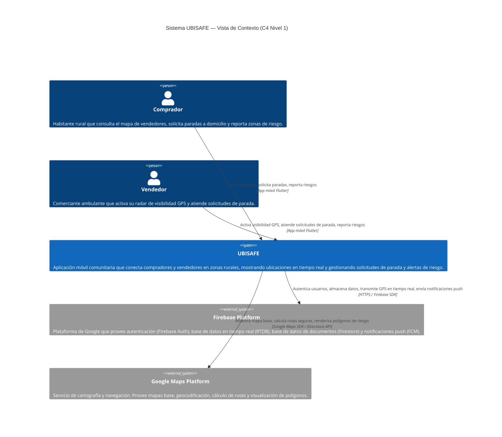
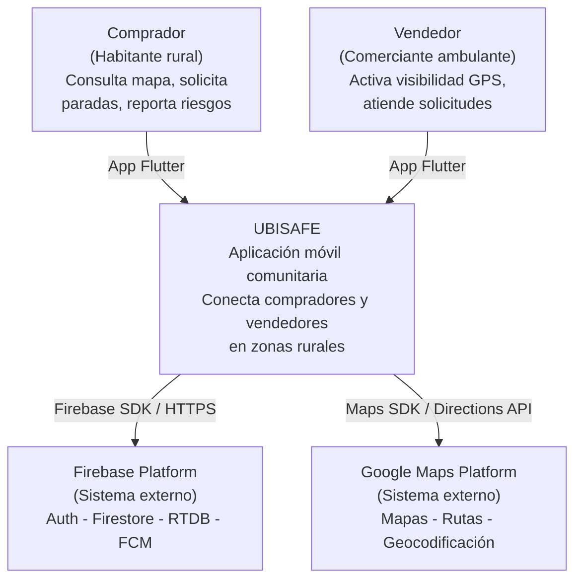
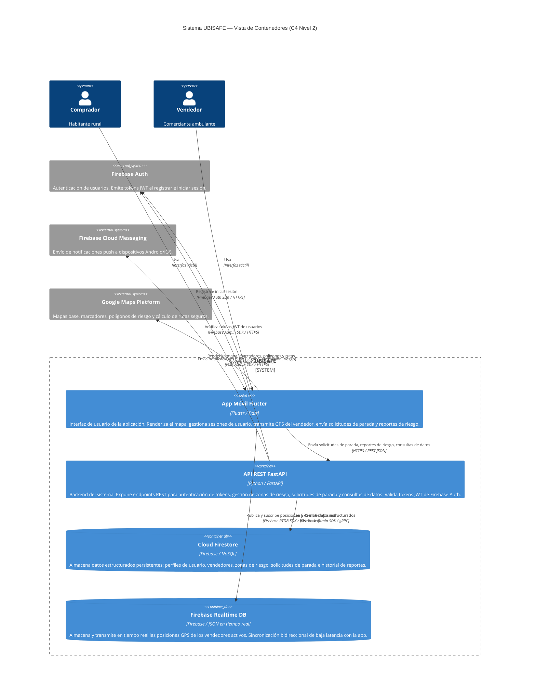
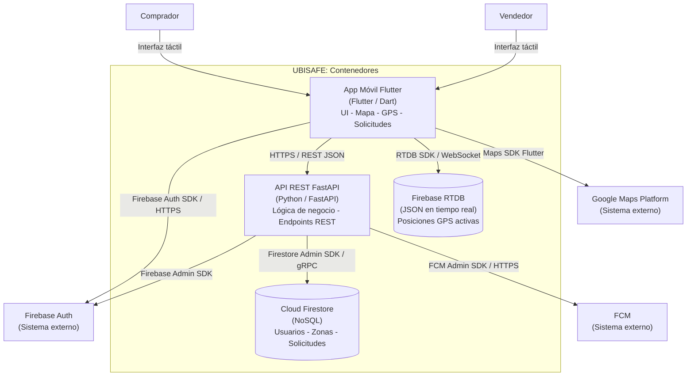

# SDD UBISAFE — Fase 1: Arquitectura de Alto Nivel (C4 L1-L2)
## Los Borbotones · Iteración 1
### Outputs listos para integrar al documento final

---

# PASO 1.1 — SECCIÓN 3: VISTA DE CONTEXTO (C4 NIVEL 1)

> **Nota de integración:** Esta es la Sección 3 del SDD. Pegar después de la Sección 2 (Stakeholders y Concerns).
> El diagrama Mermaid se renderiza en Miro o cualquier editor compatible y se exporta como imagen .png para insertar en el .docx.

---

## 3. Vista de Contexto del Sistema (C4 Nivel 1)

Esta sección presenta el **diagrama de contexto** de UBISAFE, el primer nivel del modelo C4. El objetivo de esta vista es mostrar el sistema como una caja negra y describir qué actores humanos interactúan con él y qué sistemas externos utiliza.

### 3.1. Descripción general

UBISAFE es una aplicación móvil comunitaria que permite a **compradores** (habitantes rurales) localizar **vendedores** ambulantes en tiempo real, solicitar paradas a domicilio y reportar zonas de riesgo georreferenciadas. El sistema depende de servicios externos de geolocalización, autenticación y notificaciones push.

### 3.2. Diagrama C4 Nivel 1 — Contexto



> **Nota de diagrama:** Para renderizar el diagrama C4 en Mermaid se requiere Mermaid v10.3+ con soporte para la librería C4. Si el editor no soporta la sintaxis C4 nativa, usar el diagrama equivalente en `flowchart TD` que se incluye a continuación como alternativa.

### 3.2.1. Diagrama alternativo (flowchart) — para editores sin soporte C4 nativo



### 3.3. Actores del sistema

| Actor         | Tipo           | Descripción                                                                                                                                                                   |
| ------------- | -------------- | ----------------------------------------------------------------------------------------------------------------------------------------------------------------------------- |
| **Comprador** | Usuario humano | Habitante rural que usa la app para localizar vendedores cercanos, solicitar que un vendedor se detenga en su domicilio y reportar zonas de riesgo en su comunidad.           |
| **Vendedor**  | Usuario humano | Comerciante ambulante que activa su localización GPS para aparecer en el mapa comunitario, recibe y atiende solicitudes de parada a puerta, y puede reportar zonas de riesgo. |

### 3.4. Sistemas externos

| Sistema                  | Proveedor  | Servicios utilizados                                                                                                                 | Protocolo                               |
| ------------------------ | ---------- | ------------------------------------------------------------------------------------------------------------------------------------ | --------------------------------------- |
| **Firebase Platform**    | Google LLC | Firebase Authentication, Cloud Firestore, Firebase Realtime Database (RTDB), Firebase Cloud Messaging (FCM)                          | Firebase SDK (REST + WebSocket interno) |
| **Google Maps Platform** | Google LLC | Maps SDK for Flutter (visualización de mapa base, marcadores, polígonos), Directions API (cálculo de rutas evitando zonas de riesgo) | Google Maps SDK / REST API              |

---

# PASO 1.2 — SECCIÓN 4: VISTA DE CONTENEDORES (C4 NIVEL 2)

> **Nota de integración:** Esta es la Sección 4 del SDD. Pegar después de la Sección 3.

---

## 4. Vista de Contenedores (C4 Nivel 2)

Esta sección descompone el sistema UBISAFE en sus **contenedores** principales, es decir, las unidades de software que pueden ser desplegadas de forma independiente. Cada contenedor se comunica con otros a través de protocolos bien definidos.

### 4.1. Diagrama C4 Nivel 2 — Contenedores



### 4.1.1. Diagrama alternativo (flowchart) — para editores sin soporte C4 nativo



---

# PASO 1.3 — SECCIÓN 4.2: DESCRIPCIÓN DE CONTENEDORES

> **Nota de integración:** Este texto es la Sección 4.2 del SDD, que complementa el diagrama anterior con descripciones detalladas de cada contenedor.

---

## 4.2. Descripción de contenedores

### 4.2.1. App Móvil Flutter

| Atributo                      | Detalle                                                                                                                                                                                                                              |
| ----------------------------- | ------------------------------------------------------------------------------------------------------------------------------------------------------------------------------------------------------------------------------------ |
| **Nombre**                    | App Móvil UBISAFE                                                                                                                                                                                                                    |
| **Tecnología**                | Flutter 3.x / Dart 3.x                                                                                                                                                                                                               |
| **Plataforma objetivo**       | Android (API 29+); iOS como objetivo futuro                                                                                                                                                                                          |
| **Responsabilidad principal** | Es el único punto de contacto entre el usuario final (comprador o vendedor) y el sistema. Gestiona la autenticación, la visualización del mapa interactivo, la transmisión GPS del vendedor y la recepción de solicitudes de parada. |

**Responsabilidades detalladas:**

El contenedor de la app móvil se encarga de autenticar al usuario mediante Firebase Auth SDK (registro, login, recuperación de sesión con tokens JWT), renderizar el mapa interactivo de Google Maps con marcadores de vendedores activos y polígonos de zonas de riesgo, y transmitir la posición GPS del vendedor directamente a Firebase RTDB cuando el radar de visibilidad está activo. Además, envía solicitudes HTTP al API FastAPI para operaciones de negocio como crear solicitudes de parada (CU-01), registrar reportes de riesgo (CU-03) y consultar datos históricos. También recibe y muestra notificaciones push de FCM (llegada de solicitudes, aceptación/rechazo, alertas de riesgo).

**Protocolos de comunicación:**

- Con Firebase Auth: Firebase Auth SDK (interno, HTTPS)
- Con API FastAPI: HTTPS / REST con cuerpo JSON; cabecera `Authorization: Bearer <JWT>`
- Con Firebase RTDB: Firebase RTDB SDK (WebSocket persistente para sincronización en tiempo real)
- Con Google Maps Platform: Google Maps SDK for Flutter (bindings nativos + HTTP para Directions API)

---

### 4.2.2. API REST FastAPI

| Atributo                      | Detalle                                                                                                                                                                                                                         |
| ----------------------------- | ------------------------------------------------------------------------------------------------------------------------------------------------------------------------------------------------------------------------------- |
| **Nombre**                    | API REST UBISAFE                                                                                                                                                                                                                |
| **Tecnología**                | Python 3.11+ / FastAPI 0.110+                                                                                                                                                                                                   |
| **Despliegue**                | Firebase Hosting (Cloud Run o similar en tier gratuito)                                                                                                                                                                         |
| **Responsabilidad principal** | Ejecutar la lógica de negocio del sistema que requiere validación, autorización y acceso a datos estructurados. Actúa como intermediario entre la app móvil y los servicios de Firebase cuando se necesita lógica centralizada. |

**Responsabilidades detalladas:**

La API valida los tokens JWT emitidos por Firebase Auth en cada request protegido, garantizando que solo usuarios autenticados accedan a los recursos del sistema (RNF-05). Gestiona el ciclo de vida de las solicitudes de parada: recepción, asignación al vendedor correspondiente, confirmación o rechazo. Registra y consulta las zonas de riesgo activo en Firestore, incluyendo la lógica de prioridad de niveles (Alto, Medio, Bajo) y la expiración automática de reportes. Envía notificaciones push a través de FCM Admin SDK cuando ocurren eventos críticos: una nueva solicitud de parada llega al vendedor, el vendedor acepta o rechaza, o una nueva zona de riesgo es registrada en el área del usuario.

**Protocolos de comunicación:**

- Recibe desde la app: HTTPS / REST JSON; autenticación mediante JWT en cabecera `Authorization`
- Con Firebase Auth Admin SDK: HTTPS (verificación de tokens)
- Con Cloud Firestore: Firestore Admin SDK / gRPC (operaciones CRUD sobre colecciones)
- Con FCM: FCM Admin SDK / HTTPS (envío de mensajes a tokens de dispositivo)

---

### 4.2.3. Cloud Firestore

| Atributo                      | Detalle                                                                                                                                                                                                                   |
| ----------------------------- | ------------------------------------------------------------------------------------------------------------------------------------------------------------------------------------------------------------------------- |
| **Nombre**                    | Cloud Firestore                                                                                                                                                                                                           |
| **Tecnología**                | Firebase Cloud Firestore (NoSQL orientado a documentos)                                                                                                                                                                   |
| **Responsabilidad principal** | Almacenar de forma persistente todos los datos estructurados del sistema que no requieren sincronización en tiempo real: perfiles de usuario, datos de vendedores, solicitudes de parada, zonas de riesgo y su historial. |

**Responsabilidades detalladas:**

Firestore actúa como la fuente de verdad del sistema para datos de largo plazo. Almacena los perfiles de usuarios (compradores y vendedores) con sus metadatos de rol, los registros de solicitudes de parada con sus estados (pendiente, aceptada, rechazada, completada), las zonas de riesgo activo con su geometría (coordenadas del polígono), nivel de severidad, fecha de reporte y fecha de expiración, y el historial de posiciones GPS consolidadas una vez que el vendedor desactiva su radar.

**Acceso desde otros contenedores:**

- Escrito y leído por: API FastAPI (vía Firestore Admin SDK)
- Solo lectura directa desde app en casos específicos (perfiles de usuario, según reglas de seguridad Firestore)

---

### 4.2.4. Firebase Realtime Database (RTDB)

| Atributo                      | Detalle                                                                                                                                                                                                           |
| ----------------------------- | ----------------------------------------------------------------------------------------------------------------------------------------------------------------------------------------------------------------- |
| **Nombre**                    | Firebase Realtime Database                                                                                                                                                                                        |
| **Tecnología**                | Firebase RTDB (base de datos JSON sincronizada en tiempo real)                                                                                                                                                    |
| **Responsabilidad principal** | Almacenar y sincronizar en tiempo real las posiciones GPS de los vendedores activos con latencia mínima. Esta base de datos es la que alimenta el mapa de compradores con actualizaciones de ubicación continuas. |

**Responsabilidades detalladas:**

RTDB mantiene un árbol JSON en `/vendedores_activos/{vendedor_uid}` que se actualiza cada vez que el vendedor transmite su posición GPS (con coordenadas `lat`, `lng`, `timestamp` y estado `activo`). Todos los compradores que tienen la app abierta se suscriben mediante WebSocket a estas actualizaciones y reciben los cambios de posición en tiempo real, sin necesidad de encuestas HTTP periódicas. Cuando el vendedor desactiva su radar, el nodo RTDB se elimina (o marca como inactivo) y la app deja de mostrar el marcador en el mapa.

**Acceso desde otros contenedores:**

- Escrito directamente por: App Flutter del Vendedor (Firebase RTDB SDK — sin pasar por FastAPI para minimizar latencia)
- Leído en tiempo real por: App Flutter del Comprador (suscripción WebSocket vía Firebase RTDB SDK)
- FastAPI no interactúa con RTDB en la Iteración 1 (ver ADR #2)

---

### 4.2.5. Firebase Auth (sistema externo)

| Atributo            | Detalle                                                                                                                                                |
| ------------------- | ------------------------------------------------------------------------------------------------------------------------------------------------------ |
| **Nombre**          | Firebase Authentication                                                                                                                                |
| **Tipo**            | Sistema externo (BaaS — Backend as a Service)                                                                                                          |
| **Responsabilidad** | Gestionar el registro e inicio de sesión de usuarios. Emitir tokens JWT firmados que la app y la API utilizan para autenticar y autorizar operaciones. |

**Flujo de autenticación:** La app invoca Firebase Auth SDK para registrar o iniciar sesión. Firebase Auth emite un token JWT de corta duración (1 hora) que la app adjunta en el encabezado `Authorization` de cada request a FastAPI. FastAPI verifica el token usando Firebase Admin SDK sin contactar al usuario directamente, garantizando stateless authentication.

---

### 4.2.6. Firebase Cloud Messaging — FCM (sistema externo)

| Atributo            | Detalle                                                          |
| ------------------- | ---------------------------------------------------------------- |
| **Nombre**          | Firebase Cloud Messaging                                         |
| **Tipo**            | Sistema externo (BaaS)                                           |
| **Responsabilidad** | Entregar notificaciones push a dispositivos Android registrados. |

**Eventos que generan notificaciones:** nueva solicitud de parada recibida por el vendedor, confirmación o rechazo de una solicitud recibida por el comprador, nueva zona de riesgo registrada en el área del usuario (radio configurable).

---

### 4.2.7. Google Maps Platform (sistema externo)

| Atributo            | Detalle                                                                                                                                       |
| ------------------- | --------------------------------------------------------------------------------------------------------------------------------------------- |
| **Nombre**          | Google Maps Platform                                                                                                                          |
| **Tipo**            | Sistema externo (API de terceros)                                                                                                             |
| **Responsabilidad** | Proveer el mapa base interactivo, capacidades de renderizado de marcadores y polígonos, y cálculo de rutas que evitan zonas de riesgo activo. |

**Servicios utilizados en Iteración 1:**

- **Maps SDK for Flutter:** Renderizado del mapa base, marcadores de vendedores y compradores, polígonos de zonas de riesgo con colores según nivel de severidad.
- **Directions API:** Cálculo de la ruta óptima desde la posición del vendedor hasta el domicilio del comprador, excluyendo zonas de riesgo Alto (polígonos de exclusión).

---

# PASO 1.4 — ADR #1: MONOLITO FASTAPI VS. MICROSERVICIOS

> **Nota de integración:** Este ADR forma parte de la Sección 10 del SDD (Decisiones Arquitectónicas). Pegar en la Sección 10.1.

---

## 10.1. ADR #1 — Arquitectura de Backend: Monolito FastAPI vs. Microservicios

### Contexto

El sistema UBISAFE requiere un backend que exponga endpoints REST para gestionar solicitudes de parada, zonas de riesgo, verificación de tokens y envío de notificaciones push. El equipo de desarrollo (Los Borbotones) está compuesto por **3 personas** con experiencia en Python y desarrollo móvil, y el alcance de la Iteración 1 cubre únicamente **3 casos de uso** (CU-01, CU-02, CU-03) más el flujo de autenticación.

Se evaluaron dos enfoques arquitectónicos para el backend:

| Opción                  | Descripción                                                                                                                                                                                                                   |
| ----------------------- | ----------------------------------------------------------------------------------------------------------------------------------------------------------------------------------------------------------------------------- |
| **A) Monolito FastAPI** | Una sola aplicación FastAPI con routers organizados por dominio (auth, stops, risk_zones, notifications). Desplegada como un único servicio.                                                                                  |
| **B) Microservicios**   | Múltiples servicios independientes (un servicio por dominio): `auth-service`, `stop-service`, `risk-service`, `notification-service`. Cada uno con su propio despliegue y comunicación entre servicios vía HTTP o mensajería. |

### Fuerzas en tensión

| Fuerza                               | Impacto en la decisión                                                                                                                                                                         |
| ------------------------------------ | ---------------------------------------------------------------------------------------------------------------------------------------------------------------------------------------------- |
| **Tamaño del equipo**                | 3 desarrolladores. Una arquitectura de microservicios requeriría mantener 4+ repositorios, pipelines CI/CD separados y contratos de API entre servicios — overhead prohibitivo para el equipo. |
| **Alcance de la iteración**          | Solo 3 CU en iteración 1. La complejidad de microservicios no está justificada para este volumen de funcionalidad.                                                                             |
| **Restricciones de infraestructura** | El proyecto opera en el tier gratuito de Firebase / Cloud Run (SRS §2.4). Múltiples servicios multiplicarían el consumo de recursos y los costos.                                              |
| **Velocidad de entrega**             | TSP exige entregas por iteración. Un monolito permite iterar más rápido sin la latencia de coordinación entre servicios.                                                                       |
| **Extensibilidad futura**            | Las iteraciones 2-3 añadirán CU-04 a CU-09. Un monolito bien modularizado puede evolucionar a microservicios en el futuro si la carga lo justifica.                                            |

### Decisión

**Se elige la Opción A: Monolito FastAPI** para la Iteración 1.

La aplicación FastAPI se organiza internamente con una estructura modular por dominio (routers separados por área de negocio) que facilita una futura extracción a microservicios si el sistema escala más allá de las iteraciones académicas. La modularización interna mitiga el principal riesgo de un monolito: el acoplamiento excesivo.

### Estructura interna del monolito (referencia)

```
api/
├── main.py                  # Entry point, registro de routers
├── routers/
│   ├── auth.py              # Verificación de tokens JWT
│   ├── stops.py             # CU-01: Solicitudes de parada
│   ├── risk_zones.py        # CU-03: Gestión de zonas de riesgo
│   └── notifications.py     # Envío de notificaciones FCM
├── services/
│   ├── firebase_admin.py    # Inicialización Firebase Admin SDK
│   └── fcm_service.py       # Lógica de envío FCM
├── models/
│   └── schemas.py           # Modelos Pydantic (request/response)
└── dependencies.py          # Inyección de dependencias (auth middleware)
```

### Consecuencias

**Positivas:**
- Un solo repositorio de backend, pipeline CI/CD unificado, despliegue simplificado.
- Menor latencia entre componentes internos (llamadas a función, no HTTP entre servicios).
- Curva de aprendizaje reducida: el equipo solo gestiona un contexto de ejecución.
- Más fácil depurar y hacer pruebas de integración en un solo proceso.

**Negativas / Riesgos mitigados:**
- Si el sistema escala significativamente (muchos usuarios concurrentes), el monolito podría convertirse en un cuello de botella. *Mitigación: diseño modular que facilita extracción futura de microservicios.*
- Un fallo en cualquier módulo puede afectar a toda la API. *Mitigación: manejo explícito de errores por router y pruebas unitarias por módulo.*

**Revisión programada:** Al inicio de la Iteración 2 se evaluará si el volumen de CU adicionales (CU-04 a CU-09) justifica desacoplar algún dominio en un servicio independiente.

---

# PASO 1.5 — ADR #2: GPS VÍA FASTAPI VS. DIRECTO A FIREBASE RTDB

> **Nota de integración:** Este ADR forma parte de la Sección 10 del SDD. Pegar en la Sección 10.2.

---

## 10.2. ADR #2 — Transmisión de GPS en Tiempo Real: vía FastAPI vs. directo a Firebase RTDB

### Contexto

El caso de uso **CU-02 (Activar radar de visibilidad)** requiere que la app del vendedor transmita su posición GPS al mapa comunitario con **latencia mínima** y de forma continua mientras el vendedor está activo. Los compradores deben ver la posición del vendedor actualizarse en tiempo real en su mapa.

Se evaluaron dos rutas de transmisión de posición GPS:

| Opción                               | Descripción                                                                                                                                 |
| ------------------------------------ | ------------------------------------------------------------------------------------------------------------------------------------------- |
| **A) App → FastAPI → Firebase RTDB** | La app del vendedor envía cada actualización GPS a FastAPI mediante un endpoint REST. FastAPI valida y reenvía la posición a Firebase RTDB. |
| **B) App → Firebase RTDB (directo)** | La app del vendedor escribe directamente en Firebase RTDB sin pasar por FastAPI. Las reglas de seguridad de RTDB controlan el acceso.       |

### Fuerzas en tensión

| Fuerza | Opción A (vía FastAPI) | Opción B (directo a RTDB) |
|---|---|---|
| **Latencia** | Alta: cada actualización GPS hace un round-trip HTTP a FastAPI + escritura a RTDB ≈ 200-500ms adicionales | Baja: escritura directa a RTDB con WebSocket persistente ≈ 30-80ms |
| **Carga en FastAPI** | Alta: si el vendedor transmite cada 3 segundos, FastAPI recibe ~1,200 req/hora/vendedor activo | Nula: FastAPI no interviene en la transmisión GPS |
| **Lógica de negocio en GPS** | No requerida en Iter. 1: la posición GPS es un dato simple (lat, lng, timestamp) sin transformación | Las reglas de RTDB son suficientes para validar que solo el propietario del nodo puede escribir |
| **Seguridad** | FastAPI valida JWT antes de escribir | RTDB Rules validan que `auth.uid === $vendedor_uid` (equivalente) |
| **Consumo de cuota Firebase** | Doble: RTDB + FastAPI en hosting | Simple: solo RTDB |
| **Experiencia del usuario** | Posición en mapa con retraso perceptible en conexiones lentas | Posición en mapa casi en tiempo real (objetivo del CU-02) |

### Decisión

**Se elige la Opción B: Transmisión GPS directa desde la App al Firebase RTDB**, sin pasar por FastAPI.

Esta decisión es coherente con el patrón arquitectónico de Firebase: RTDB está diseñado específicamente para sincronización de datos en tiempo real con latencia sub-100ms. FastAPI interviene únicamente en operaciones que requieren lógica de negocio centralizada (validaciones complejas, escrituras en Firestore, envío de FCM). La posición GPS cruda no requiere dicha lógica en Iteración 1.

### Estructura de datos en RTDB (referencia)

```json
{
  "vendedores_activos": {
    "{vendedor_uid}": {
      "lat": 19.4326,
      "lng": -99.1332,
      "timestamp": 1712345678,
      "activo": true
    }
  }
}
```

**Regla de seguridad RTDB (referencia):**
```json
{
  "rules": {
    "vendedores_activos": {
      "$vendedor_uid": {
        ".write": "auth !== null && auth.uid === $vendedor_uid",
        ".read": "auth !== null"
      }
    }
  }
}
```

### Consecuencias

**Positivas:**
- Latencia de transmisión GPS reducida a ≈ 30-80ms (WebSocket persistente de Firebase RTDB).
- Cero carga adicional en el servidor FastAPI por actualizaciones de posición.
- Arquitectura más simple: cada componente hace lo que mejor sabe hacer.
- El mapa del comprador se actualiza de forma fluida, cumpliendo el objetivo de UX del CU-02.

**Negativas / Riesgos mitigados:**
- La lógica de autorización de escritura GPS queda en las reglas de RTDB en lugar de en FastAPI. *Mitigación: las reglas de RTDB con `auth.uid` son equivalentes en seguridad a la validación JWT de FastAPI para este caso de uso específico.*
- Si en iteraciones futuras se requiere validar la posición GPS (ej. detección de GPS spoofing o agregación de estadísticas), será necesario introducir FastAPI o Cloud Functions en este flujo. *Mitigación: la arquitectura modular de la app permite añadir esta capa sin refactorizar el resto del sistema.*

**Revisión programada:** Si en Iteración 2 se implementa detección de anomalías en posición GPS (CU potencial), se reevaluará pasar la transmisión GPS por una Cloud Function intermedia.

---

## Resumen de cobertura — Fase 1

| Paso | Output generado                                                                 | Sección del SDD | Marcos cubiertos                                                                     |
| ---- | ------------------------------------------------------------------------------- | --------------- | ------------------------------------------------------------------------------------ |
| 1.1  | Diagrama C4 Nivel 1 (Contexto) + actores + sistemas externos                    | Sección 3       | F1: Context Viewpoint · F2: modelo C4 · F3: diagramas claros                         |
| 1.2  | Diagrama C4 Nivel 2 (Contenedores) + relaciones y protocolos                    | Sección 4.1     | F1: Composition Viewpoint · F2: componentes y relaciones · F3: diagramas claros      |
| 1.3  | Texto descriptivo de 7 contenedores/sistemas con responsabilidades y protocolos | Sección 4.2     | F1: Composition Viewpoint · F2: componentes y relaciones · F3: detalles consistentes |
| 1.4  | ADR #1: Monolito FastAPI vs. microservicios                                     | Sección 10.1    | F1: Rationale Viewpoint · F2: relaciones justificadas                                |
| 1.5  | ADR #2: GPS directo a RTDB vs. vía FastAPI                                      | Sección 10.2    | F1: Rationale Viewpoint · F2: relaciones justificadas                                |

**Fase 1 completada. Lista para avanzar a Fase 2 (C4 L3 — Componentes internos).**

---

*Documento generado: 16/04/2026 — Los Borbotones / UBISAFE Iteración 1*
