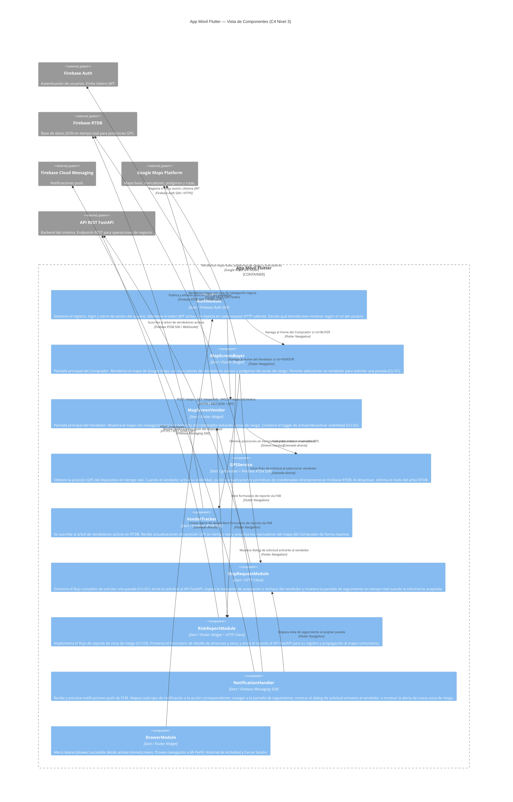
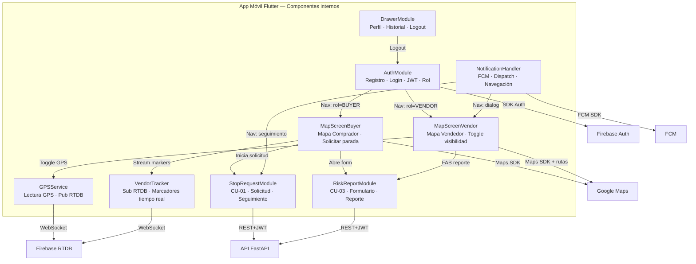
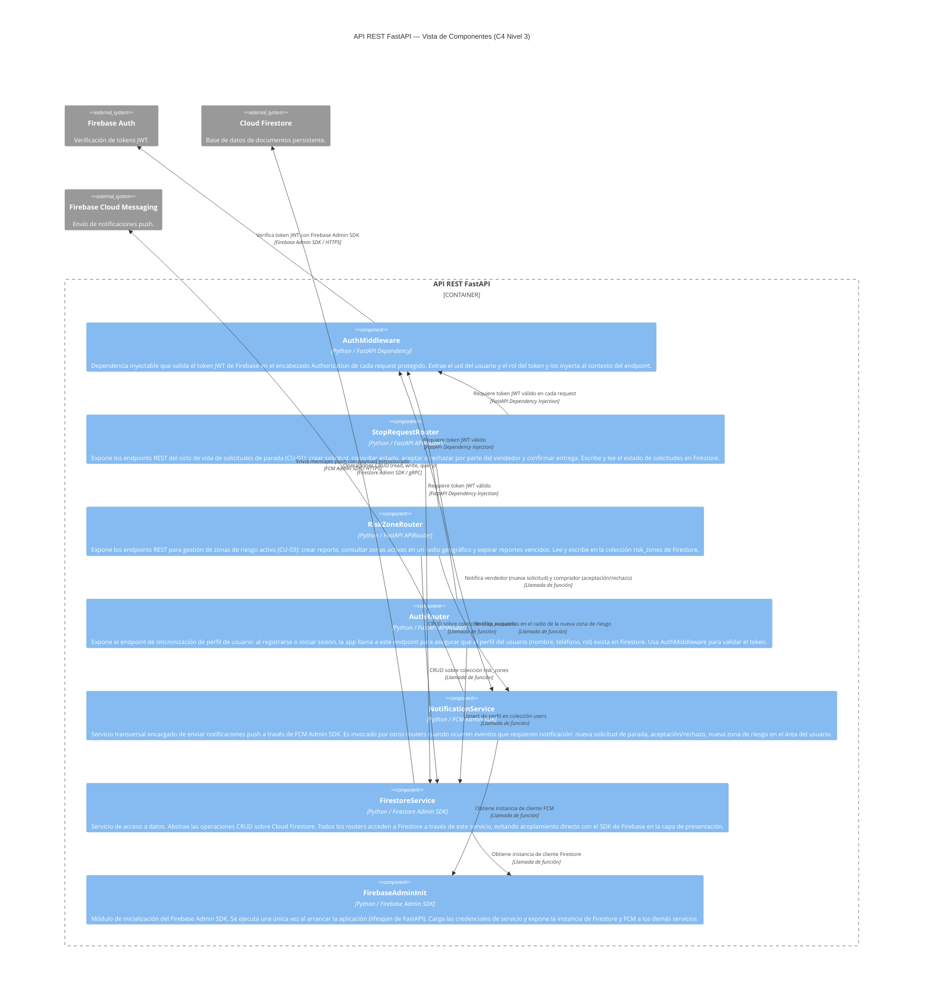
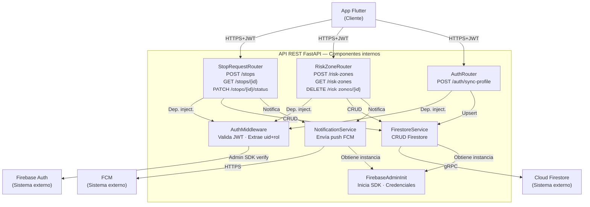

# SDD UBISAFE — Fase 2: Arquitectura de Detalle (C4 Nivel 3)
## Los Borbotones · Iteración 1
### Outputs listos para integrar al documento final

---

# PASO 2.1 — SECCIÓN 5: VISTA DE COMPONENTES — APP FLUTTER (C4 NIVEL 3)

> **Nota de integración:** Esta es la Sección 5 del SDD. Pegar después de la Sección 4 (Vista de Contenedores).
> El diagrama Mermaid se renderiza en Miro o editor compatible y se exporta como imagen .png para insertar en el .docx.

---

## 5. Vista de Componentes — App Móvil Flutter (C4 Nivel 3)

Esta sección descompone el contenedor **App Móvil Flutter** en sus componentes internos principales, describiendo las responsabilidades de cada módulo y las relaciones entre ellos y con los sistemas externos.

### 5.1. Diagrama C4 Nivel 3 — Componentes internos de la App Flutter



### 5.1.1. Diagrama alternativo (flowchart) — para editores sin soporte C4 nativo



---

# PASO 2.2 — SECCIÓN 5.2: VISTA DE COMPONENTES — API FASTAPI (C4 NIVEL 3)

> **Nota de integración:** Esta es la Sección 5.2 del SDD, subsección de la Sección 5. Pegar inmediatamente después del diagrama de la App Flutter.

---

## 5.2. Vista de Componentes — API REST FastAPI (C4 Nivel 3)

Esta sección descompone el contenedor **API REST FastAPI** en sus componentes internos: routers por dominio de negocio, servicios transversales y dependencias compartidas.

### 5.2.1. Diagrama C4 Nivel 3 — Componentes internos de la API FastAPI



### 5.2.2. Diagrama alternativo (flowchart) — para editores sin soporte C4 nativo



---

# PASO 2.3 — SECCIÓN 5.3: DESCRIPCIÓN DE COMPONENTES

> **Nota de integración:** Esta es la Sección 5.3 del SDD. Pegar inmediatamente después de los diagramas C4 L3.

---

## 5.3. Descripción de componentes

### 5.3.1. Componentes internos — App Móvil Flutter

---

#### 5.3.1.1. AuthModule

| Atributo | Detalle |
|---|---|
| **Nombre** | AuthModule |
| **Tipo** | Servicio / Módulo de estado global |
| **Tecnología** | Dart · Firebase Auth SDK · Flutter Navigation |
| **Responsabilidad principal** | Gestionar el ciclo completo de identidad del usuario: registro, login, recuperación de sesión persistente y cierre de sesión. Determinar la pantalla de inicio según el rol del usuario autenticado. |

**Responsabilidades detalladas:**

El AuthModule implementa los flujos de registro (datos personales + selección de rol → Firestore vía API) y login (credenciales → Firebase Auth SDK → token JWT). Mantiene el token JWT activo en memoria e implementa el mecanismo de refresco automático del token antes de su expiración (1 hora). Al detectar una sesión activa al iniciar la app, redirige directamente al Home correspondiente (MapScreenBuyer o MapScreenVendor) según el campo `rol` almacenado en el perfil del usuario en Firestore. Al cerrar sesión, invalida el token local y navega a la Pantalla de Bienvenida.

**Interfaces expuestas:**

- `login(email, password) → Future<UserCredential>` — Inicia sesión con email y contraseña.
- `register(name, phone, role, email, password) → Future<void>` — Registra usuario en Firebase Auth y sincroniza perfil en Firestore vía API.
- `logout() → Future<void>` — Cierra sesión y limpia estado local.
- `getCurrentToken() → Future<String>` — Devuelve el JWT actual, refrescándolo si está próximo a expirar.
- `Stream<User?> authStateChanges` — Stream reactivo que emite cambios en el estado de autenticación.

**Dependencias:** Firebase Auth SDK, API AuthRouter (`POST /auth/sync-profile`), Flutter Navigation.

---

#### 5.3.1.2. MapScreenBuyer

| Atributo | Detalle |
|---|---|
| **Nombre** | MapScreenBuyer |
| **Tipo** | Widget / Pantalla principal |
| **Tecnología** | Dart · Flutter · Google Maps SDK for Flutter |
| **Responsabilidad principal** | Pantalla raíz del flujo del Comprador. Visualiza el mapa interactivo con vendedores activos en un radio de 4 km, polígonos de zonas de riesgo y la ubicación propia del comprador. Punto de entrada para CU-01 y CU-03. |

**Responsabilidades detalladas:**

MapScreenBuyer obtiene la posición GPS del comprador mediante el servicio de geolocalización del dispositivo y centra el mapa en ella. Consume el stream reactivo del VendorTracker para actualizar los marcadores de vendedores en tiempo real. Renderiza los polígonos de zonas de riesgo activo (consultados al API FastAPI al iniciar la pantalla) con colores semánticos según nivel de severidad. Al tocar el marcador de un vendedor, inicia el flujo de StopRequestModule. El FAB naranja abre el RiskReportModule para CU-03. El botón de menú abre el DrawerModule. Si el GPS del dispositivo está desactivado, muestra el empty state con aviso.

**Interfaces expuestas:** Pantalla Flutter navegable; no expone métodos públicos directos. Recibe dependencias por inyección (VendorTracker stream, StopRequestModule, RiskReportModule).

**Dependencias:** VendorTracker, StopRequestModule, RiskReportModule, DrawerModule, Google Maps SDK for Flutter, API FastAPI (`GET /risk-zones`).

---

#### 5.3.1.3. MapScreenVendor

| Atributo | Detalle |
|---|---|
| **Nombre** | MapScreenVendor |
| **Tipo** | Widget / Pantalla principal |
| **Tecnología** | Dart · Flutter · Google Maps SDK for Flutter · Directions API |
| **Responsabilidad principal** | Pantalla raíz del flujo del Vendedor. Muestra el mapa con la posición del vendedor, el botón de activar/desactivar visibilidad y el diálogo de solicitudes entrantes. Punto de entrada para CU-02. |

**Responsabilidades detalladas:**

MapScreenVendor controla el estado de visibilidad del vendedor mediante el toggle que activa o desactiva el GPSService. Al activarse, muestra el feedback visual "Ahora eres visible" y escucha las solicitudes entrantes de parada (vía NotificationHandler). Al recibir una solicitud, presenta el diálogo emergente con opciones de aceptar o rechazar. Si acepta, obtiene la ruta segura desde Google Maps Directions API (evitando polígonos de riesgo Alto) y la renderiza en el mapa como la vista de "Navegación Segura". Renderiza también los polígonos de riesgo activo para contextualizar la navegación. El FAB naranja permite reportar riesgos (CU-03).

**Interfaces expuestas:** Pantalla Flutter navegable. Expone `acceptStopRequest(requestId)` y `rejectStopRequest(requestId)` invocados desde el diálogo de solicitud entrante.

**Dependencias:** GPSService, StopRequestModule, RiskReportModule, DrawerModule, NotificationHandler, Google Maps SDK for Flutter, Directions API.

---

#### 5.3.1.4. GPSService

| Atributo | Detalle |
|---|---|
| **Nombre** | GPSService |
| **Tipo** | Servicio de fondo |
| **Tecnología** | Dart · geolocator package · Firebase RTDB SDK |
| **Responsabilidad principal** | Leer la posición GPS del dispositivo del vendedor a intervalos regulares y publicarla directamente en Firebase RTDB cuando el radar de visibilidad está activo. |

**Responsabilidades detalladas:**

GPSService encapsula la interacción con el hardware GPS del dispositivo. Cuando el vendedor activa su visibilidad, inicia un stream de posición GPS con una frecuencia de actualización de 3 segundos y una distancia mínima de desplazamiento de 10 metros (para evitar escrituras redundantes). Cada actualización escribe en el nodo `/vendedores_activos/{vendedor_uid}` de Firebase RTDB los campos `lat`, `lng`, `timestamp` y `activo: true`. Al desactivar la visibilidad (o al cerrar la app), elimina el nodo del árbol RTDB y detiene el stream GPS. Maneja el caso de pérdida de señal GPS: si no obtiene posición en 10 segundos, mantiene la última posición conocida y emite un evento de error a la UI.

**Interfaces expuestas:**

- `startTransmission(vendorUid) → void` — Activa el stream GPS y la escritura en RTDB.
- `stopTransmission(vendorUid) → Future<void>` — Detiene el stream y elimina el nodo RTDB.
- `Stream<GPSServiceState> stateStream` — Emite estados: `active`, `inactive`, `error_no_signal`.

**Dependencias:** geolocator package, Firebase RTDB SDK (escritura directa sin pasar por FastAPI — ver ADR #2).

---

#### 5.3.1.5. VendorTracker

| Atributo | Detalle |
|---|---|
| **Nombre** | VendorTracker |
| **Tipo** | Servicio reactivo |
| **Tecnología** | Dart · Firebase RTDB SDK |
| **Responsabilidad principal** | Mantener una vista actualizada en tiempo real de todos los vendedores activos en el mapa del Comprador, suscribiéndose al árbol de RTDB. |

**Responsabilidades detalladas:**

VendorTracker abre una conexión WebSocket persistente a Firebase RTDB y se suscribe a cambios en el nodo `/vendedores_activos`. Filtra los vendedores dentro del radio de 4 km desde la posición del comprador (cálculo de distancia Haversine en el cliente). Convierte cada nodo del árbol RTDB en un objeto `VendorMarker` con coordenadas y metadatos para el mapa. Emite el stream de marcadores a MapScreenBuyer. Cuando un vendedor desaparece del árbol (desactiva su visibilidad), el marcador correspondiente se elimina del mapa. Gestiona la desconexión: si la app pierde conexión, mantiene los últimos marcadores conocidos y muestra indicador de "datos no actualizados".

**Interfaces expuestas:**

- `Stream<List<VendorMarker>> vendorStream` — Stream de lista de vendedores activos actualizado en tiempo real.
- `dispose() → void` — Cierra la suscripción RTDB.

**Dependencias:** Firebase RTDB SDK (suscripción de lectura), modelo `VendorMarker`.

---

#### 5.3.1.6. StopRequestModule

| Atributo | Detalle |
|---|---|
| **Nombre** | StopRequestModule |
| **Tipo** | Módulo de flujo / caso de uso |
| **Tecnología** | Dart · HTTP Client (dio package) · Flutter Navigation |
| **Responsabilidad principal** | Gestionar el flujo completo del Caso de Uso CU-01 desde el lado del Comprador: crear la solicitud de parada, escuchar la respuesta del vendedor y mostrar el seguimiento en tiempo real. |

**Responsabilidades detalladas:**

Al ser invocado desde MapScreenBuyer (selección de un vendedor), StopRequestModule crea una solicitud de parada enviando `POST /stops` al API FastAPI con el `vendorId`, la posición del comprador y el timestamp. Mantiene el estado de la solicitud en escucha mediante polling o notificación push (NotificationHandler). Si el vendedor acepta, navega a la pantalla de seguimiento en tiempo real que muestra la posición del vendedor actualizándose (usando VendorTracker) y la distancia estimada al domicilio. Si el vendedor rechaza, regresa a MapScreenBuyer con un mensaje de feedback. Implementa el timeout de 60 segundos: si el vendedor no responde, cancela la solicitud automáticamente.

**Interfaces expuestas:**

- `createStopRequest(vendorId, buyerLocation) → Future<StopRequest>` — Crea y retorna la solicitud.
- `cancelStopRequest(requestId) → Future<void>` — Cancela una solicitud pendiente.
- `Stream<StopRequestStatus> requestStatusStream(requestId)` — Stream del estado de la solicitud.

**Dependencias:** API FastAPI (`POST /stops`, `GET /stops/{id}`, `PATCH /stops/{id}/status`), NotificationHandler, VendorTracker, AuthModule (JWT).

---

#### 5.3.1.7. RiskReportModule

| Atributo | Detalle |
|---|---|
| **Nombre** | RiskReportModule |
| **Tipo** | Módulo de flujo / caso de uso |
| **Tecnología** | Dart · Flutter · HTTP Client |
| **Responsabilidad principal** | Implementar el flujo de reporte de zona de riesgo activo (CU-03): capturar la ubicación del reporte, el tipo de amenaza y el nivel de riesgo, y enviarlo al API FastAPI. |

**Responsabilidades detalladas:**

RiskReportModule presenta una bottom sheet con el formulario de reporte: tipo de amenaza (campo de texto libre), nivel de riesgo (selector: Alto / Medio / Bajo), coordenadas del incidente (auto-completadas con la posición GPS actual, editables) y opcionalmente un radio de afectación. Al confirmar, envía `POST /risk-zones` al API FastAPI con el payload estructurado. Muestra confirmación visual de éxito o error. El módulo es accesible desde ambas HomeScreens a través del FAB naranja (ícono `add`), siendo transversal a ambos flujos (Comprador y Vendedor).

**Interfaces expuestas:**

- `openReportForm(context, currentLocation) → Future<void>` — Abre el formulario de reporte como bottom sheet modal.

**Dependencias:** API FastAPI (`POST /risk-zones`), GPSService (posición actual), AuthModule (JWT).

---

#### 5.3.1.8. NotificationHandler

| Atributo | Detalle |
|---|---|
| **Nombre** | NotificationHandler |
| **Tipo** | Servicio de fondo |
| **Tecnología** | Dart · Firebase Messaging SDK (FCM) |
| **Responsabilidad principal** | Recibir notificaciones push de FCM en primer plano (foreground), segundo plano (background) y cuando la app está cerrada (terminated). Mapear cada tipo de notificación a la acción de navegación correspondiente. |

**Responsabilidades detalladas:**

NotificationHandler inicializa el FCM SDK al arrancar la app y registra el token de dispositivo en el perfil del usuario en Firestore (vía API) para que FastAPI pueda enviarle notificaciones. Maneja tres tipos de eventos FCM: (1) `stop_request_incoming` → muestra el diálogo de solicitud entrante en MapScreenVendor; (2) `stop_request_accepted` / `stop_request_rejected` → navega a la pantalla de seguimiento o regresa al mapa en MapScreenBuyer; (3) `risk_zone_alert` → muestra una alerta de zona de riesgo cercana en la HomeScreen activa. Gestiona el refresco del token FCM y actualiza el perfil en Firestore cuando el token cambia.

**Interfaces expuestas:**

- `initialize() → Future<void>` — Inicializa FCM y registra token.
- `Stream<RemoteMessage> foregroundMessages` — Stream de mensajes en primer plano.

**Dependencias:** Firebase Messaging SDK, API FastAPI (`PATCH /auth/device-token`), Flutter Navigation.

---

#### 5.3.1.9. DrawerModule

| Atributo | Detalle |
|---|---|
| **Nombre** | DrawerModule |
| **Tipo** | Widget de navegación |
| **Tecnología** | Dart · Flutter |
| **Responsabilidad principal** | Proveer el menú lateral de navegación global accesible desde ambas HomeScreens. |

**Responsabilidades detalladas:**

DrawerModule renderiza el Drawer de Flutter con las opciones: Mi Perfil (navega a pantalla de edición de perfil), Historial de Actividad (navega a pantalla de historial de solicitudes y reportes) y Cerrar Sesión (invoca `AuthModule.logout()` y navega a la Pantalla de Bienvenida). Muestra el nombre y el rol del usuario en el encabezado del drawer.

**Interfaces expuestas:** Widget Flutter sin métodos públicos. Recibe el contexto de navegación y las callbacks necesarias por inyección.

**Dependencias:** AuthModule, Flutter Navigation.

---

### 5.3.2. Componentes internos — API REST FastAPI

---

#### 5.3.2.1. FirebaseAdminInit

| Atributo | Detalle |
|---|---|
| **Nombre** | FirebaseAdminInit |
| **Tipo** | Módulo de inicialización |
| **Tecnología** | Python · Firebase Admin SDK |
| **Responsabilidad principal** | Inicializar el Firebase Admin SDK una única vez al arrancar la aplicación y exponer las instancias de cliente de Firestore y FCM a los demás módulos. |

**Responsabilidades detalladas:**

FirebaseAdminInit se ejecuta durante el evento `lifespan` de FastAPI (inicio de la aplicación). Carga las credenciales de cuenta de servicio desde una variable de entorno (`FIREBASE_SERVICE_ACCOUNT_JSON`) o archivo de credenciales. Inicializa la app Firebase Admin con `firebase_admin.initialize_app()`. Expone funciones `get_firestore_client()` y `get_fcm_client()` que devuelven las instancias singleton de los clientes. Si la inicialización falla (credenciales incorrectas), la app no arranca y emite un error crítico en los logs.

**Interfaces expuestas:**

- `get_firestore_client() → firestore.Client` — Retorna el cliente Firestore Admin.
- `get_fcm_client() → messaging` — Retorna el módulo FCM Admin.

**Dependencias:** Firebase Admin SDK, variables de entorno de despliegue.

---

#### 5.3.2.2. AuthMiddleware

| Atributo | Detalle |
|---|---|
| **Nombre** | AuthMiddleware |
| **Tipo** | FastAPI Dependency |
| **Tecnología** | Python · FastAPI Depends · Firebase Admin SDK |
| **Responsabilidad principal** | Validar el token JWT de Firebase Auth en el encabezado `Authorization: Bearer <token>` de cada request a endpoints protegidos. Inyectar el `uid` y el `rol` del usuario al contexto del endpoint. |

**Responsabilidades detalladas:**

AuthMiddleware es una función de dependencia de FastAPI invocada automáticamente en cada endpoint que la declara. Extrae el token del encabezado HTTP, llama a `firebase_admin.auth.verify_id_token(token)` para validar firma, expiración y emisor del JWT. Si el token es válido, retorna un objeto `AuthContext` con `uid` y `claims` del usuario (incluyendo el rol). Si el token es inválido o ha expirado, lanza `HTTPException(401)`. Si el token es válido pero el usuario no tiene el rol requerido para el endpoint (ej. un Comprador intenta aceptar una solicitud de parada), lanza `HTTPException(403)`.

**Interfaces expuestas:**

- `async def get_current_user(token: str = Depends(oauth2_scheme)) → AuthContext` — Dependencia inyectable que retorna el contexto de autenticación.

**Dependencias:** Firebase Admin SDK (`auth.verify_id_token`), FirebaseAdminInit.

---

#### 5.3.2.3. AuthRouter

| Atributo | Detalle |
|---|---|
| **Nombre** | AuthRouter |
| **Tipo** | FastAPI APIRouter |
| **Prefijo de ruta** | `/auth` |
| **Responsabilidad principal** | Sincronizar el perfil del usuario en Firestore durante el registro y el primer inicio de sesión. Actualizar el token FCM del dispositivo. |

**Endpoints expuestos:**

| Método | Ruta | Descripción |
|---|---|---|
| `POST` | `/auth/sync-profile` | Crea o actualiza el perfil del usuario (nombre, teléfono, rol, uid) en la colección `users` de Firestore. Protegido con AuthMiddleware. |
| `PATCH` | `/auth/device-token` | Actualiza el campo `fcm_token` del perfil del usuario en Firestore para habilitar notificaciones push. Protegido con AuthMiddleware. |

**Dependencias:** AuthMiddleware, FirestoreService (colección `users`).

---

#### 5.3.2.4. StopRequestRouter

| Atributo | Detalle |
|---|---|
| **Nombre** | StopRequestRouter |
| **Tipo** | FastAPI APIRouter |
| **Prefijo de ruta** | `/stops` |
| **Responsabilidad principal** | Exponer los endpoints REST del ciclo de vida completo de una solicitud de parada (CU-01). |

**Endpoints expuestos:**

| Método | Ruta | Descripción |
|---|---|---|
| `POST` | `/stops` | Crea una nueva solicitud de parada. Requiere rol=BUYER. Guarda en Firestore con estado `pending` y envía notificación FCM al vendedor. |
| `GET` | `/stops/{stop_id}` | Consulta el estado actual de una solicitud. Accesible por el comprador que la creó o el vendedor asignado. |
| `PATCH` | `/stops/{stop_id}/status` | Actualiza el estado de la solicitud: `accepted`, `rejected`, `completed`. Requiere rol=VENDOR para aceptar/rechazar; rol=VENDOR para confirmar entrega. Envía notificación FCM al comprador al cambiar estado. |

**Dependencias:** AuthMiddleware, FirestoreService (colección `stop_requests`), NotificationService.

---

#### 5.3.2.5. RiskZoneRouter

| Atributo | Detalle |
|---|---|
| **Nombre** | RiskZoneRouter |
| **Tipo** | FastAPI APIRouter |
| **Prefijo de ruta** | `/risk-zones` |
| **Responsabilidad principal** | Gestionar el ciclo de vida de las zonas de riesgo activo (CU-03): creación, consulta geográfica y expiración. |

**Endpoints expuestos:**

| Método | Ruta | Descripción |
|---|---|---|
| `POST` | `/risk-zones` | Registra una nueva zona de riesgo con tipo de amenaza, nivel (Alto/Medio/Bajo), coordenadas y radio. Calcula expiración automática (24 horas por defecto). Guarda en Firestore y envía alertas FCM a usuarios en el radio afectado. |
| `GET` | `/risk-zones` | Consulta zonas de riesgo activas. Acepta parámetros `lat`, `lng`, `radius_km` para filtrar por proximidad geográfica. |
| `DELETE` | `/risk-zones/{zone_id}` | Expira (soft-delete) una zona de riesgo. Solo accesible por el usuario que la creó o un rol administrador (iter. futura). |

**Dependencias:** AuthMiddleware, FirestoreService (colección `risk_zones`), NotificationService.

---

#### 5.3.2.6. NotificationService

| Atributo | Detalle |
|---|---|
| **Nombre** | NotificationService |
| **Tipo** | Servicio transversal |
| **Tecnología** | Python · Firebase Admin SDK (FCM) |
| **Responsabilidad principal** | Abstraer el envío de notificaciones push a dispositivos Android a través de FCM. Provee métodos tipados para cada evento de negocio que requiere notificación. |

**Responsabilidades detalladas:**

NotificationService encapsula la construcción y envío de mensajes FCM con `firebase_admin.messaging.send()`. Define métodos semánticos por evento de negocio: `notify_stop_request_incoming`, `notify_stop_request_accepted`, `notify_stop_request_rejected`, `notify_risk_zone_alert`. Cada método construye el payload FCM apropiado (título, cuerpo, datos adicionales para la navegación en la app) y lo envía al token FCM del destinatario registrado en su perfil de Firestore. Gestiona el caso de tokens FCM inválidos o expirados: captura `UnregisteredError` de FCM y elimina el token obsoleto del perfil en Firestore.

**Interfaces expuestas:**

- `notify_stop_request_incoming(vendor_uid, stop_request_data) → None`
- `notify_stop_request_accepted(buyer_uid, stop_request_data) → None`
- `notify_stop_request_rejected(buyer_uid, reason) → None`
- `notify_risk_zone_alert(user_uids: List[str], risk_zone_data) → None`

**Dependencias:** Firebase Admin SDK (FCM), FirestoreService (lectura de `fcm_token` por uid), FirebaseAdminInit.

---

#### 5.3.2.7. FirestoreService

| Atributo | Detalle |
|---|---|
| **Nombre** | FirestoreService |
| **Tipo** | Servicio de acceso a datos (Data Access Layer) |
| **Tecnología** | Python · Firestore Admin SDK / gRPC |
| **Responsabilidad principal** | Centralizar y abstraer todas las operaciones de lectura y escritura sobre Cloud Firestore, desacoplando los routers del SDK de Firebase. |

**Responsabilidades detalladas:**

FirestoreService provee métodos CRUD sobre las colecciones del sistema: `users`, `stop_requests` y `risk_zones`. Maneja la serialización/deserialización de documentos Firestore a modelos Pydantic. Implementa consultas geográficas simples para zonas de riesgo (filtrado por bounding box de coordenadas). Gestiona errores del SDK de Firestore y los convierte en excepciones de dominio comprensibles para los routers (ej. `DocumentNotFoundError`, `FirestoreWriteError`).

**Interfaces expuestas:**

- `get_user(uid) → UserProfile`
- `upsert_user(uid, data) → UserProfile`
- `create_stop_request(data) → StopRequest`
- `get_stop_request(stop_id) → StopRequest`
- `update_stop_request_status(stop_id, status) → StopRequest`
- `create_risk_zone(data) → RiskZone`
- `get_active_risk_zones(lat, lng, radius_km) → List[RiskZone]`
- `expire_risk_zone(zone_id) → None`

**Dependencias:** Firebase Admin SDK (Firestore client), FirebaseAdminInit, modelos Pydantic del sistema.

---

# PASO 2.4 — SECCIÓN 11: ESTRUCTURA DEL PROYECTO

> **Nota de integración:** Esta es la Sección 11 del SDD. Pegar en la sección de "Estructura del Proyecto", después de las secciones de diagramas de secuencia y diseño de interfaces.

---

## 11. Estructura del Proyecto

Esta sección describe la organización de carpetas y módulos de los dos componentes de software del sistema: la aplicación móvil Flutter y la API REST FastAPI. El propósito de esta sección es proporcionar un mapa de referencia para el equipo de desarrollo que relacione la estructura de archivos con los componentes descritos en la Sección 5 (C4 Nivel 3).

> **Nota:** Esta descripción representa la estructura objetivo para la Iteración 1. La estructura real puede variar ligeramente durante la implementación, pero los módulos principales y sus responsabilidades se mantienen.

---

### 11.1. Estructura del proyecto Flutter (App Móvil)

La app Flutter sigue una arquitectura de **Feature-First** combinada con una capa de servicios transversales. Cada feature encapsula su pantalla, su lógica de negocio (bloc/provider) y sus modelos locales.

```
ubisafe_app/
├── lib/
│   ├── main.dart                        # Entry point. Inicializa Firebase, NotificationHandler y Router.
│   │
│   ├── core/                            # Módulos transversales reutilizables
│   │   ├── auth/
│   │   │   └── auth_module.dart         # AuthModule: login, registro, JWT, authStateChanges
│   │   ├── gps/
│   │   │   └── gps_service.dart         # GPSService: lectura GPS y transmisión a RTDB
│   │   ├── notifications/
│   │   │   └── notification_handler.dart # NotificationHandler: FCM init, dispatch
│   │   ├── api/
│   │   │   └── api_client.dart          # Cliente HTTP (dio) con interceptor de JWT
│   │   └── design_system/
│   │       ├── colors.dart              # Design tokens: paleta de colores
│   │       ├── typography.dart          # Design tokens: estilos tipográficos
│   │       ├── spacing.dart             # Design tokens: espaciados
│   │       └── theme.dart               # ThemeData de Flutter con todos los tokens
│   │
│   ├── features/
│   │   ├── auth/                        # Feature: Autenticación
│   │   │   ├── screens/
│   │   │   │   ├── welcome_screen.dart  # Pantalla de Bienvenida
│   │   │   │   ├── login_screen.dart    # Pantalla de Login
│   │   │   │   └── signup_screen.dart   # Pantalla de Registro (datos + rol)
│   │   │   └── widgets/
│   │   │
│   │   ├── map_buyer/                   # Feature: Home del Comprador (CU-01)
│   │   │   ├── screens/
│   │   │   │   ├── map_screen_buyer.dart     # MapScreenBuyer: mapa principal del comprador
│   │   │   │   └── tracking_screen.dart      # Pantalla de seguimiento en tiempo real
│   │   │   ├── services/
│   │   │   │   └── vendor_tracker.dart       # VendorTracker: suscripción RTDB
│   │   │   └── models/
│   │   │       └── vendor_marker.dart
│   │   │
│   │   ├── map_vendor/                  # Feature: Home del Vendedor (CU-02)
│   │   │   ├── screens/
│   │   │   │   └── map_screen_vendor.dart    # MapScreenVendor: mapa principal del vendedor
│   │   │   └── widgets/
│   │   │       └── visibility_toggle.dart    # Widget de activar/desactivar visibilidad
│   │   │
│   │   ├── stop_request/               # Feature: Solicitud de parada (CU-01)
│   │   │   ├── services/
│   │   │   │   └── stop_request_module.dart  # StopRequestModule: ciclo de vida de solicitud
│   │   │   └── models/
│   │   │       └── stop_request.dart
│   │   │
│   │   ├── risk_report/                # Feature: Reporte de riesgo (CU-03)
│   │   │   ├── screens/
│   │   │   │   └── risk_form_bottom_sheet.dart # RiskReportModule: formulario de reporte
│   │   │   └── models/
│   │   │       └── risk_zone.dart
│   │   │
│   │   └── profile/                    # Feature: Perfil e historial
│   │       ├── screens/
│   │       │   ├── profile_screen.dart
│   │       │   └── history_screen.dart
│   │       └── widgets/
│   │           └── drawer_module.dart  # DrawerModule: menú lateral
│   │
│   └── router/
│       └── app_router.dart             # Definición de rutas con go_router
│
├── pubspec.yaml                        # Dependencias del proyecto
└── android/                            # Configuración nativa Android
```

**Paquetes principales (pubspec.yaml):**

| Paquete | Versión aprox. | Propósito |
|---|---|---|
| `firebase_core` | ^2.x | Inicialización de Firebase |
| `firebase_auth` | ^4.x | Firebase Auth SDK |
| `firebase_database` | ^10.x | Firebase RTDB SDK |
| `firebase_messaging` | ^14.x | FCM SDK |
| `cloud_firestore` | ^4.x | Firestore SDK (lectura directa de perfiles) |
| `google_maps_flutter` | ^2.x | Google Maps SDK for Flutter |
| `geolocator` | ^10.x | Acceso al GPS del dispositivo |
| `dio` | ^5.x | Cliente HTTP con interceptores |
| `go_router` | ^12.x | Navegación declarativa |

---

### 11.2. Estructura del proyecto FastAPI (API REST)

La API FastAPI sigue el patrón de **Router + Service + Schema**, con separación clara entre la capa de presentación (routers), la lógica de negocio (services) y los modelos de datos (schemas).

```
ubisafe_api/
├── main.py                              # Entry point: crea app FastAPI, registra routers, lifespan
│
├── routers/                             # Capa de presentación: endpoints REST por dominio
│   ├── auth.py                          # AuthRouter: /auth/sync-profile, /auth/device-token
│   ├── stops.py                         # StopRequestRouter: /stops y /stops/{id}
│   └── risk_zones.py                    # RiskZoneRouter: /risk-zones
│
├── services/                            # Capa de negocio: lógica y acceso a Firebase
│   ├── firebase_admin_init.py           # FirebaseAdminInit: inicialización SDK, get_firestore/fcm
│   ├── firestore_service.py             # FirestoreService: CRUD sobre colecciones Firestore
│   └── notification_service.py         # NotificationService: envío de mensajes FCM
│
├── schemas/                             # Modelos Pydantic: request, response y dominio
│   ├── user.py                          # UserProfile, SyncProfileRequest, DeviceTokenRequest
│   ├── stop_request.py                  # StopRequest, CreateStopRequestBody, UpdateStatusBody
│   └── risk_zone.py                     # RiskZone, CreateRiskZoneBody
│
├── dependencies.py                      # AuthMiddleware: get_current_user (FastAPI Depends)
│
├── .env                                 # Variables de entorno (no commitear)
│   # FIREBASE_SERVICE_ACCOUNT_JSON=...
│   # GOOGLE_MAPS_API_KEY=...
│
├── requirements.txt                     # Dependencias del proyecto
└── Dockerfile                           # Imagen Docker para despliegue
```

**Dependencias principales (requirements.txt):**

| Paquete | Versión aprox. | Propósito |
|---|---|---|
| `fastapi` | >=0.110 | Framework web API |
| `uvicorn[standard]` | >=0.27 | Servidor ASGI de producción |
| `firebase-admin` | >=6.x | Firebase Admin SDK (Auth, Firestore, FCM) |
| `pydantic` | >=2.x | Validación de esquemas request/response |
| `python-jose` | >=3.x | Manejo de JWT (complementario al SDK) |
| `httpx` | >=0.26 | Cliente HTTP asíncrono (tests de integración) |

---

## Resumen de cobertura — Fase 2

| Paso | Output generado | Sección del SDD | Marcos cubiertos |
|---|---|---|---|
| 2.1 | Diagrama C4 Nivel 3 — App Flutter (9 componentes) con diagramas C4Component + flowchart alternativo | Sección 5.1 | F1: Composition Viewpoint (detalle) · F2: detalles de componentes · F3: diagramas claros |
| 2.2 | Diagrama C4 Nivel 3 — API FastAPI (7 componentes) con diagramas C4Component + flowchart alternativo | Sección 5.2 | F1: Composition Viewpoint (detalle) · F2: detalles de componentes · F3: diagramas claros |
| 2.3 | Texto descriptivo de 16 componentes: responsabilidad, interfaces expuestas, dependencias, endpoints | Sección 5.3 | F1: Detailed Design Viewpoint · F2: consistencia · F3: detalles de componentes |
| 2.4 | Estructura de carpetas de Flutter y FastAPI con tabla de paquetes principales | Sección 11 | F1: Detailed Design Viewpoint simplificado · F3: consistencia y contexto de implementación |

**Fase 2 completada. Lista para avanzar a Fase 3 (Diseño de Base de Datos) o Fase 4 (Diagramas de Secuencia) — ambas son paralelizables según el plan.**

---

*Documento generado: 17/04/2026 — Los Borbotones / UBISAFE Iteración 1*
