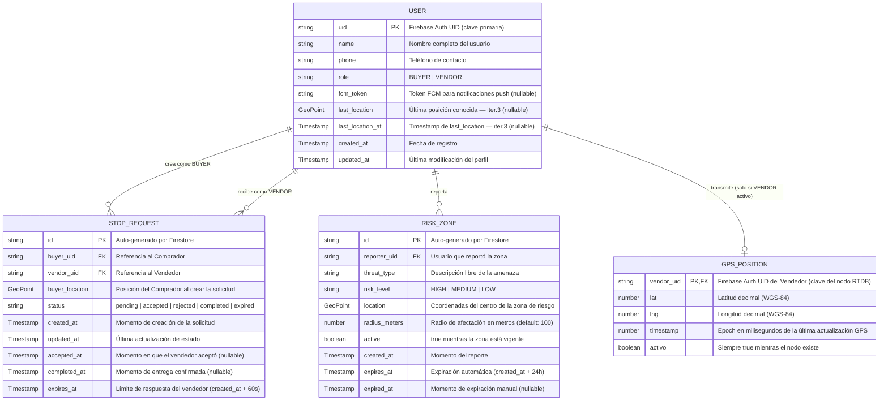
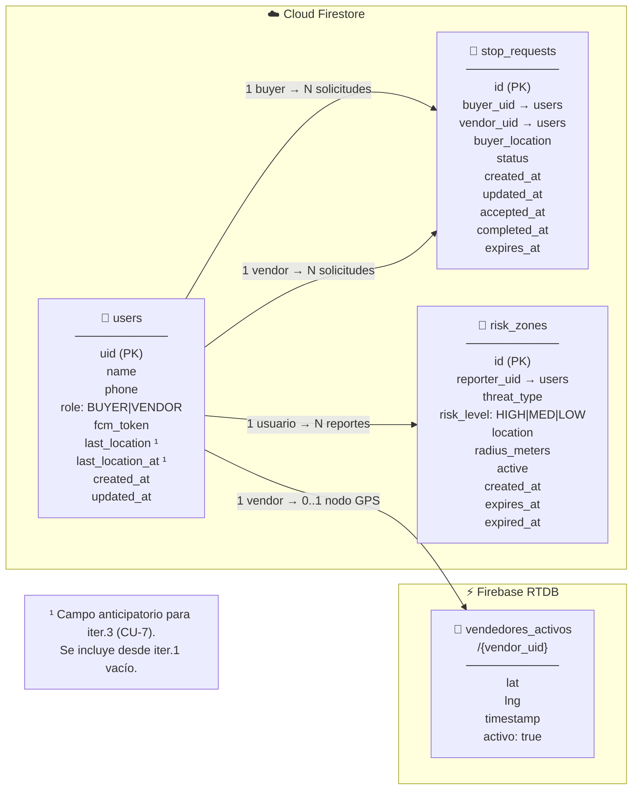

# SDD UBISAFE — Fase 3: Diseño de Base de Datos
## Los Borbotones · Iteración 1
### Outputs listos para integrar al documento final

> **Nota de integración:** Este documento contiene el contenido completo de la **Sección 7 (Diseño de Base de Datos)** y el **ADR #3** del SDD. Los diagramas Mermaid se renderizan en Miro o editor compatible y se exportan como imagen .png para insertar en el .docx.
>
> **[V2]** Incluye los pasos 3.5, 3.6 y 3.7 incorporados en la revisión del 17/04/2026.

---

# PASO 3.1 — SECCIÓN 7.1: MODELO DE DATOS CONCEPTUAL (DIAGRAMA ER)

> **Nota de integración:** Esta es la Sección 7.1 del SDD. Pegar al inicio de la Sección 7 (Diseño de Base de Datos), antes de los esquemas de colecciones detallados.

---

## 7. Diseño de Base de Datos

UBISAFE utiliza una estrategia de **persistencia políglota** (ver ADR #3 en §3 del SDD): Cloud Firestore para datos estructurados y persistentes, y Firebase Realtime Database (RTDB) para posiciones GPS en tiempo real. Esta sección documenta el modelo de datos de ambas bases de datos y las decisiones de diseño que justifican esta arquitectura.

---

## 7.1. Modelo de Datos Conceptual

El siguiente diagrama muestra las entidades principales del sistema y sus relaciones. La distinción entre Comprador y Vendedor no se modela como subtipos separados, sino como valores del campo `role` dentro de la entidad `User`, simplificando el esquema para la Iteración 1.

> **Nota de lectura:** Las entidades `User`, `StopRequest` y `RiskZone` residen en **Cloud Firestore**. La entidad `GPSPosition` reside en **Firebase RTDB** y tiene una naturaleza efímera (existe solo mientras el vendedor está activo).

### 7.1.1. Diagrama ER — Modelo Conceptual



### 7.1.2. Diagrama alternativo (flowchart) — para editores sin soporte erDiagram nativo



---

# PASO 3.2 — SECCIÓN 7.2: ESQUEMA DETALLADO DE FIRESTORE

> **Nota de integración:** Esta es la Sección 7.2 del SDD. Pegar después del diagrama ER (§7.1).

---

## 7.2. Esquema de Cloud Firestore

Cloud Firestore almacena los datos estructurados y persistentes del sistema. En la Iteración 1, el esquema comprende **tres colecciones de nivel raíz**: `users`, `stop_requests` y `risk_zones`.

> **Principio de diseño:** Se favorece la desnormalización moderada (duplicar campos clave como `buyer_uid`/`vendor_uid` dentro de `stop_requests`) para evitar lecturas adicionales en los flujos más frecuentes. Firestore no soporta JOINs; cada documento debe ser autocontenido para su caso de uso principal.

---

### 7.2.1. Colección `users`

**Ruta:** `/users/{uid}`

La clave del documento es el **UID de Firebase Auth** del usuario, garantizando unicidad y eliminando la necesidad de un campo de clave separado consultable.

| Campo              | Tipo                | Requerido | Descripción                                                                                                                                                                                   |
| ------------------ | ------------------- | --------- | --------------------------------------------------------------------------------------------------------------------------------------------------------------------------------------------- |
| `uid`              | `string`            | ✅         | Firebase Auth UID. Coincide con el ID del documento. Almacenado también como campo para facilitar consultas y exportaciones.                                                                  |
| `name`             | `string`            | ✅         | Nombre completo del usuario.                                                                                                                                                                  |
| `phone`            | `string`            | ✅         | Número de teléfono de contacto (formato libre, validado en cliente).                                                                                                                          |
| `role`             | `string`            | ✅         | Rol del usuario: `BUYER` (Comprador / Habitante Rural) o `VENDOR` (Vendedor / Comerciante). Inmutable una vez registrado en iter. 1.                                                          |
| `fcm_token`        | `string \| null`    | —         | Token de registro FCM del dispositivo actual. Se actualiza en cada inicio de sesión y cuando FCM rota el token. `null` si el usuario nunca habilitó notificaciones.                           |
| `last_location`    | `GeoPoint \| null`  | —         | **[V2 — anticipatorio iter. 3]** Última posición GPS conocida del usuario. En iter. 1 se actualiza únicamente para vendedores en foreground (mismo umbral que RTDB: 10 metros). Ver §7.2.1.1. |
| `last_location_at` | `Timestamp \| null` | —         | **[V2 — anticipatorio iter. 3]** Timestamp de la última actualización de `last_location`.                                                                                                     |
| `created_at`       | `Timestamp`         | ✅         | Fecha y hora de registro del usuario. Se establece en `POST /auth/sync-profile`.                                                                                                              |
| `updated_at`       | `Timestamp`         | ✅         | Última modificación del perfil. Se actualiza en cada escritura del documento.                                                                                                                 |

**Ejemplo de documento:**

```json
{
  "uid": "abc123XYZ",
  "name": "María García",
  "phone": "+52 33 1234 5678",
  "role": "VENDOR",
  "fcm_token": "fHq8kT2..._APA91b",
  "last_location": { "_latitude": 20.6739, "_longitude": -103.4439 },
  "last_location_at": { "_seconds": 1713456789, "_nanoseconds": 0 },
  "created_at": { "_seconds": 1713200000, "_nanoseconds": 0 },
  "updated_at": { "_seconds": 1713456789, "_nanoseconds": 0 }
}
```

#### 7.2.1.1. Nota sobre `last_location` en Iteración 1

El campo `last_location` se incluye en el esquema desde la Iteración 1 para facilitar la implementación del fan-out geográfico en la Iteración 3 (CU-7 — Alerta de zona de riesgo a usuarios cercanos), evitando una migración de esquema posterior. Sin embargo, su comportamiento en Iteración 1 es conservador:

- Se actualiza **solo cuando el vendedor está en foreground** y su posición cambia más de 10 metros.
- **No se actualiza en background** para evitar consumo excesivo de batería.
- Los compradores **no actualizan** este campo en Iteración 1.
- Su valor puede ser `null` o estar desactualizado en Iteración 1 sin afectar ningún CU activo.

---

### 7.2.2. Colección `stop_requests`

**Ruta:** `/stop_requests/{request_id}`

Cada documento representa una solicitud de parada del ciclo completo CU-01. El `request_id` es auto-generado por Firestore.

| Campo            | Tipo                | Requerido | Descripción                                                                                                                                                                                          |
| ---------------- | ------------------- | --------- | ---------------------------------------------------------------------------------------------------------------------------------------------------------------------------------------------------- |
| `id`             | `string`            | ✅         | ID auto-generado por Firestore. Coincide con el ID del documento.                                                                                                                                    |
| `buyer_uid`      | `string`            | ✅         | UID del Comprador que creó la solicitud (referencia a `users/{uid}`).                                                                                                                                |
| `vendor_uid`     | `string`            | ✅         | UID del Vendedor destinatario de la solicitud (referencia a `users/{uid}`).                                                                                                                          |
| `buyer_location` | `GeoPoint`          | ✅         | Posición GPS del Comprador en el momento de crear la solicitud. Usada por el Vendedor para navegar hacia el domicilio.                                                                               |
| `status`         | `string`            | ✅         | Estado actual de la solicitud. Valores posibles: `pending` → `accepted` → `completed`; `pending` → `rejected`; `pending` → `expired`.                                                                |
| `created_at`     | `Timestamp`         | ✅         | Momento en que el Comprador creó la solicitud (`POST /stops`).                                                                                                                                       |
| `updated_at`     | `Timestamp`         | ✅         | Última actualización del estado.                                                                                                                                                                     |
| `accepted_at`    | `Timestamp \| null` | —         | Momento en que el Vendedor aceptó la solicitud (`PATCH /stops/{id}/status` → `accepted`). `null` en los demás estados.                                                                               |
| `completed_at`   | `Timestamp \| null` | —         | Momento en que el Vendedor confirmó la entrega (`PATCH /stops/{id}/status` → `completed`). `null` en los demás estados.                                                                              |
| `expires_at`     | `Timestamp`         | ✅         | Límite de tiempo para la respuesta del Vendedor. Se calcula como `created_at + 60 segundos`. Si el Vendedor no responde antes de `expires_at`, la app del Comprador cancela la solicitud localmente. |

**Ciclo de vida del campo `status`:**

```
     POST /stops
         │
         ▼
      [pending]
         │
    ┌────┴─────────────────────┐
    │                          │
    ▼                          ▼
[accepted]              [rejected]
    │
    ▼
[completed]

  + [expired]  ← generado client-side si el vendor no responde antes de expires_at
```

**Ejemplo de documento (solicitud aceptada):**

```json
{
  "id": "stop_8fGkP2Xq",
  "buyer_uid": "def456ABC",
  "vendor_uid": "abc123XYZ",
  "buyer_location": { "_latitude": 20.6750, "_longitude": -103.4410 },
  "status": "accepted",
  "created_at": { "_seconds": 1713456800, "_nanoseconds": 0 },
  "updated_at": { "_seconds": 1713456845, "_nanoseconds": 0 },
  "accepted_at": { "_seconds": 1713456845, "_nanoseconds": 0 },
  "completed_at": null,
  "expires_at": { "_seconds": 1713456860, "_nanoseconds": 0 }
}
```

---

### 7.2.3. Colección `risk_zones`

**Ruta:** `/risk_zones/{zone_id}`

Cada documento representa un reporte de zona de riesgo activo del ciclo CU-03. El `zone_id` es auto-generado por Firestore.

| Campo           | Tipo                | Requerido | Descripción                                                                                                                                                                     |
| --------------- | ------------------- | --------- | ------------------------------------------------------------------------------------------------------------------------------------------------------------------------------- |
| `id`            | `string`            | ✅         | ID auto-generado por Firestore. Coincide con el ID del documento.                                                                                                               |
| `reporter_uid`  | `string`            | ✅         | UID del usuario que reportó la zona (referencia a `users/{uid}`). Puede ser Comprador o Vendedor (CU-03 es transversal).                                                        |
| `threat_type`   | `string`            | ✅         | Descripción libre del tipo de amenaza (ej: `"robo"`, `"accidente de tránsito"`, `"vía bloqueada"`). Texto capturado en el formulario.                                           |
| `risk_level`    | `string`            | ✅         | Nivel de riesgo de la zona: `HIGH` (Alto), `MEDIUM` (Medio) o `LOW` (Bajo). Determina el color del polígono en el mapa y el comportamiento del algoritmo de ruta segura.        |
| `location`      | `GeoPoint`          | ✅         | Coordenadas del centro geográfico de la zona de riesgo.                                                                                                                         |
| `radius_meters` | `number`            | ✅         | Radio de afectación de la zona en metros. Valor por defecto: `100`. Editable por el usuario en el formulario (iter. futura).                                                    |
| `active`        | `boolean`           | ✅         | `true` mientras la zona está vigente. Se establece en `false` al expirar (manual o automáticamente). **Todas las consultas de `GET /risk-zones` filtran por `active == true`**. |
| `created_at`    | `Timestamp`         | ✅         | Momento en que se registró el reporte (`POST /risk-zones`).                                                                                                                     |
| `expires_at`    | `Timestamp`         | ✅         | Expiración automática de la zona, calculada como `created_at + 24 horas`. La API evalúa este campo para marcar zonas como inactivas.                                            |
| `expired_at`    | `Timestamp \| null` | —         | Momento en que la zona fue expirada manualmente (`DELETE /risk-zones/{id}`). `null` si expiró de forma automática o sigue activa.                                               |

**Nota sobre consultas geográficas:** Firestore no soporta consultas geoespaciales nativas (radio/círculo). En Iteración 1, `GET /risk-zones` recibe `lat`, `lng` y `radius_km` y el `RiskZoneRouter` aplica un filtro de **bounding box** (rango de latitud/longitud) para obtener candidatos, seguido de un **cálculo Haversine en Python** para filtrar el resultado exacto. Esta es una deuda técnica declarada: para iter. 3 se evaluará Geo-hashing o la librería `geofirestore`.

**Ejemplo de documento:**

```json
{
  "id": "rz_9mKpQ4Yr",
  "reporter_uid": "abc123XYZ",
  "threat_type": "robo con violencia",
  "risk_level": "HIGH",
  "location": { "_latitude": 20.6741, "_longitude": -103.4451 },
  "radius_meters": 150,
  "active": true,
  "created_at": { "_seconds": 1713457000, "_nanoseconds": 0 },
  "expires_at": { "_seconds": 1713543400, "_nanoseconds": 0 },
  "expired_at": null
}
```

---

### 7.2.4. Reglas de Seguridad de Firestore

Las siguientes reglas definen quién puede leer y escribir en cada colección. Se expresan en el lenguaje de reglas de Firestore (`.rules`).

```
rules_version = '2';
service cloud.firestore {
  match /databases/{database}/documents {

    // ─── FUNCIÓN DE UTILIDAD ───────────────────────────────────────────────
    // Verifica si el request viene de un usuario autenticado
    function isAuthenticated() {
      return request.auth != null;
    }

    // Verifica si el usuario autenticado es el dueño del documento
    function isOwner(uid) {
      return isAuthenticated() && request.auth.uid == uid;
    }

    // ─── COLECCIÓN: users ──────────────────────────────────────────────────
    match /users/{uid} {
      // Lectura: solo el propio usuario puede leer su perfil
      // (FastAPI lee perfiles mediante Admin SDK — las reglas no aplican al Admin SDK)
      allow read: if isOwner(uid);

      // Escritura: solo el propio usuario puede crear/actualizar su perfil
      // (La creación inicial la hace el Admin SDK en FastAPI; esta regla
      //  protege escrituras directas desde el cliente — p.ej. actualización de fcm_token)
      allow write: if isOwner(uid);
    }

    // ─── COLECCIÓN: stop_requests ──────────────────────────────────────────
    match /stop_requests/{requestId} {
      // Lectura: solo el comprador o el vendedor involucrados en la solicitud
      allow read: if isAuthenticated()
                  && (resource.data.buyer_uid == request.auth.uid
                      || resource.data.vendor_uid == request.auth.uid);

      // Escritura: solo usuarios autenticados pueden crear/actualizar solicitudes
      // La lógica de negocio (rol requerido, validaciones) la aplica FastAPI
      // antes de que el Admin SDK escriba en Firestore
      allow write: if isAuthenticated();
    }

    // ─── COLECCIÓN: risk_zones ─────────────────────────────────────────────
    match /risk_zones/{zoneId} {
      // Lectura: cualquier usuario autenticado puede consultar zonas activas
      allow read: if isAuthenticated();

      // Creación: cualquier usuario autenticado puede reportar una zona
      allow create: if isAuthenticated();

      // Actualización/borrado: solo el reporter puede expirar su propia zona
      // (El borrado lógico lo ejecuta FastAPI con Admin SDK, esta regla
      //  protege escrituras directas desde el cliente)
      allow update, delete: if isAuthenticated()
                            && resource.data.reporter_uid == request.auth.uid;
    }

  }
}
```

> **Nota importante:** FastAPI utiliza el **Firebase Admin SDK**, el cual opera con privilegios de administrador y **no está sujeto** a las reglas de seguridad de Firestore. Las reglas anteriores protegen contra escrituras directas desde la app cliente Flutter que salten el API. La lógica de autorización de negocio (rol, propiedad del recurso, validaciones) se aplica en FastAPI mediante `AuthMiddleware`.

---

# PASO 3.3 — SECCIÓN 7.3: ESQUEMA DE FIREBASE REALTIME DATABASE

> **Nota de integración:** Esta es la Sección 7.3 del SDD. Pegar después del esquema de Firestore (§7.2).

---

## 7.3. Esquema de Firebase Realtime Database (RTDB)

Firebase RTDB almacena exclusivamente las **posiciones GPS en tiempo real** de los vendedores activos. Su estructura es un árbol JSON minimalista, optimizado para escrituras de alta frecuencia (cada 3 segundos) y suscripciones reactivas de baja latencia.

> **Justificación de su uso:** Ver ADR #3 (§3 del SDD). RTDB es superior a Firestore para este caso por latencia de escritura (< 100 ms vs. ~200–500 ms), precio por operación y soporte nativo de presencia (`.info/connected`).

### 7.3.1. Estructura del árbol JSON

```
/ (raíz)
└── vendedores_activos/
    ├── {vendor_uid_1}/
    │   ├── lat: (number)      ← Latitud decimal en grados (WGS-84)
    │   ├── lng: (number)      ← Longitud decimal en grados (WGS-84)
    │   ├── timestamp: (number)← Epoch en milisegundos (Date.now() en cliente)
    │   └── activo: (boolean)  ← Siempre `true` mientras el nodo existe
    │
    ├── {vendor_uid_2}/
    │   ├── lat: 20.6741
    │   ├── lng: -103.4451
    │   ├── timestamp: 1713457123456
    │   └── activo: true
    │
    └── ... (un nodo por cada vendedor activo)
```

### 7.3.2. Ejemplo de árbol poblado

```json
{
  "vendedores_activos": {
    "abc123XYZ": {
      "lat": 20.6739,
      "lng": -103.4439,
      "timestamp": 1713457200000,
      "activo": true
    },
    "ghi789JKL": {
      "lat": 20.6712,
      "lng": -103.4480,
      "timestamp": 1713457198000,
      "activo": true
    }
  }
}
```

### 7.3.3. Descripción de campos

| Campo       | Tipo JSON | Descripción                                                                                                                                                                                                                                                        |
| ----------- | --------- | ------------------------------------------------------------------------------------------------------------------------------------------------------------------------------------------------------------------------------------------------------------------ |
| `lat`       | `number`  | Latitud en grados decimales. Precisión: 6 decimales (~11 cm de resolución). Rango: -90 a 90.                                                                                                                                                                       |
| `lng`       | `number`  | Longitud en grados decimales. Precisión: 6 decimales. Rango: -180 a 180.                                                                                                                                                                                           |
| `timestamp` | `number`  | Época Unix en milisegundos del momento en que el cliente tomó la lectura GPS. No es el timestamp del servidor; el cliente lo genera con `DateTime.now().millisecondsSinceEpoch`.                                                                                   |
| `activo`    | `boolean` | Siempre `true` mientras el nodo existe. Su presencia o ausencia en el árbol es el indicador de visibilidad: si el nodo existe → vendedor activo; si no existe → vendedor inactivo. No se establece explícitamente a `false`; el nodo se **elimina** al desactivar. |

### 7.3.4. Ciclo de vida de un nodo GPS

```
Vendedor activa radar
        │
        ▼
GPSService.startTransmission(vendorUid)
        │
        ├──→ Escribe /vendedores_activos/{uid}  ← cada 3s o ≥10m de desplazamiento
        │         { lat, lng, timestamp, activo: true }
        │
Vendedor desactiva radar
   (o cierra app / pierde conexión)
        │
        ▼
GPSService.stopTransmission(vendorUid)
        │
        └──→ Elimina /vendedores_activos/{uid}  ← el nodo desaparece del árbol
```

> **Mecanismo de presencia (Disconnect Handler):** El `GPSService` configura un **`onDisconnect().remove()`** en Firebase RTDB al activar la transmisión. Esto garantiza que si la app se cierra inesperadamente (crash, corte de red) sin llamar a `stopTransmission()`, el servidor de RTDB elimina automáticamente el nodo del vendedor cuando detecta la desconexión. Este mecanismo evita que vendedores "fantasma" aparezcan en el mapa de compradores.

### 7.3.5. Reglas de Seguridad de RTDB

```json
{
  "rules": {
    "vendedores_activos": {
      "$vendor_uid": {
        // Solo el propio vendedor puede escribir su nodo GPS
        ".write": "auth != null && auth.uid === $vendor_uid",

        // Cualquier usuario autenticado puede leer los nodos (para mostrar el mapa)
        ".read": "auth != null",

        // Validación de estructura del nodo
        ".validate": "newData.hasChildren(['lat', 'lng', 'timestamp', 'activo'])",

        "lat": {
          ".validate": "newData.isNumber() && newData.val() >= -90 && newData.val() <= 90"
        },
        "lng": {
          ".validate": "newData.isNumber() && newData.val() >= -180 && newData.val() <= 180"
        },
        "timestamp": {
          ".validate": "newData.isNumber() && newData.val() > 0"
        },
        "activo": {
          ".validate": "newData.isBoolean() && newData.val() === true"
        }
      }
    }
  }
}
```

### 7.3.6. Consideraciones de performance y costo

| Parámetro                            | Valor                                         | Impacto                                                                     |
| ------------------------------------ | --------------------------------------------- | --------------------------------------------------------------------------- |
| Frecuencia de escritura por vendedor | 1 escritura / 3 segundos (en movimiento)      | ~20 escrituras/minuto/vendedor activo                                       |
| Tamaño del nodo                      | ~80 bytes (4 campos numéricos/booleanos)      | Costo de almacenamiento y transferencia negligible                          |
| Suscriptores simultáneos por nodo    | N compradores en radio de 4 km                | Fan-out manejable en iter. 1 (población rural, pocos usuarios concurrentes) |
| Costo en Firebase Spark (gratis)     | 1 GB almacenamiento · 10 GB/mes transferencia | Suficiente para iter. 1; revisar en iter. 3 con escala real                 |

---

# PASO 3.4 — ADR #3: FIRESTORE + RTDB (PERSISTENCIA POLÍGLOTA)

> **Nota de integración:** Este ADR forma parte de la **Sección 3 (Decisiones Arquitectónicas)** del SDD. Se consolidará junto con ADR #1, #2 y #4 en la Fase 6.

---

## ADR #3 — Persistencia políglota: Cloud Firestore + Firebase Realtime Database

**Estado:** Aceptado · Iteración 1

**Fecha:** 18/04/2026

**Participantes:** Equipo Los Borbotones (Alexis Córdova — PM/Arquitecto, equipo de desarrollo)

---

### Contexto

UBISAFE necesita almacenar dos categorías de datos con requerimientos radicalmente distintos:

**Categoría A — Datos estructurados y persistentes:**
- Perfiles de usuario (nombre, teléfono, rol, token FCM)
- Solicitudes de parada (estado del ciclo de vida CU-01)
- Zonas de riesgo (reportes CU-03, geometría, nivel de riesgo)

Características requeridas: consistencia fuerte, consultas flexibles, reglas de seguridad por documento, persistencia indefinida, latencia de escritura tolerable (~200–500 ms).

**Categoría B — Posiciones GPS en tiempo real:**
- Coordenadas del vendedor activo, actualización cada 3 segundos
- Ciclo de vida efímero: existe mientras el vendedor transmite y se elimina al desactivar
- Fan-out a compradores suscritos (N lectores por cada escritura de vendedor)

Características requeridas: latencia ultra-baja (< 100 ms), escrituras de alta frecuencia a bajo costo, suscripciones reactivas tipo push, soporte de presencia (detección de desconexión).

**Opciones evaluadas:**

| Opción                                         | Fortalezas                                        | Debilidades                                                                                                                                                |
| ---------------------------------------------- | ------------------------------------------------- | ---------------------------------------------------------------------------------------------------------------------------------------------------------- |
| **Solo Cloud Firestore**                       | Un único sistema a gestionar                      | Latencia de escritura ~200–500 ms (demasiado para GPS); costo por operación más alto para escrituras de alta frecuencia; soporte de presencia más complejo |
| **Solo Firebase RTDB**                         | Latencia ultra-baja; presencia nativa             | No soporta consultas complejas; modelo de datos plano (JSON); reglas de seguridad más limitadas; no escala bien para datos estructurados y complejos       |
| **Firestore + RTDB (elegida)**                 | Cada base de datos optimizada para su caso de uso | Dos SDKs a gestionar; dos conjuntos de reglas de seguridad                                                                                                 |
| **Firestore + backend Redis/WebSocket propio** | Control total                                     | Infraestructura adicional que el equipo no puede mantener; complejidad operacional alta                                                                    |

---

### Decisión

Se adopta **persistencia políglota**: Cloud Firestore para datos estructurados/persistentes y Firebase Realtime Database para posiciones GPS en tiempo real.

**Distribución de responsabilidades:**

| Base de datos   | Colecciones / Nodos                    | Acceso                                          |
| --------------- | -------------------------------------- | ----------------------------------------------- |
| Cloud Firestore | `users`, `stop_requests`, `risk_zones` | App Flutter (SDK cliente) · FastAPI (Admin SDK) |
| Firebase RTDB   | `/vendedores_activos/{uid}`            | App Flutter (SDK cliente directo — ver ADR #2)  |

Ambas bases de datos pertenecen al mismo proyecto Firebase, lo que simplifica la administración de credenciales y el uso del Firebase Admin SDK en FastAPI.

---

### Consecuencias

**Positivas:**
- **Rendimiento óptimo para GPS:** RTDB ofrece latencia de escritura < 100 ms y sincronización WebSocket nativa, eliminando la necesidad de polling para el mapa en tiempo real.
- **Presencia automática:** El mecanismo `onDisconnect()` de RTDB elimina nodos GPS de vendedores que cierran la app inesperadamente, sin lógica adicional en el servidor.
- **Costo controlado:** Ambas bases de datos tienen tier gratuito generoso (Firebase Spark), adecuado para iter. 1.
- **Sin infraestructura adicional:** Ambas son servicios administrados de Firebase; el equipo no opera ni dimensiona servidores de base de datos.
- **Cohesión en el proyecto Firebase:** Un único proyecto, un único conjunto de credenciales de Admin SDK, facturación unificada.

**Negativas / Deudas técnicas:**
- **Dos SDKs en Flutter:** La app importa tanto `firebase_database` (RTDB) como `cloud_firestore` (Firestore). Esto aumenta ligeramente el tamaño del bundle Android y la superficie de configuración.
- **Dos conjuntos de reglas de seguridad:** Las reglas de Firestore (lenguaje `.rules` basado en CEL) y las reglas de RTDB (JSON) tienen sintaxis y semántica distintas. El equipo debe mantener ambas.
- **Ausencia de historial GPS en iter. 1:** Al usar RTDB como almacenamiento efímero (el nodo se elimina al desactivar), no se conserva el historial de posiciones del vendedor. Esto es aceptable para iter. 1 (ningún CU lo requiere) pero implica que los análisis de rutas o auditorías futuras no tendrán datos históricos de iter. 1. Ver §7.4 (Estrategia de consolidación GPS) para la decisión sobre iter. 2+.
- **Consultas geográficas limitadas en Firestore:** Firestore no soporta consultas por radio. En iter. 1 se usa bounding box + Haversine en Python (deuda técnica declarada; ver ADR futuro para iter. 3).

---

# PASOS 3.5–3.7 [V2] — SECCIÓN 7.4: DECISIONES ANTICIPATORIAS

> **Nota de integración:** Esta es la Sección 7.4 del SDD, subsección de la Sección 7. Pegar al final del capítulo de base de datos. Contiene tres decisiones derivadas de la revisión arquitectónica del 17/04/2026.

---

## 7.4. Decisiones de diseño anticipatorias [V2]

Esta sección documenta tres decisiones de diseño de base de datos que, si bien no son estrictamente requeridas por los 3 CU de Iteración 1, se toman ahora para facilitar la evolución hacia las Iteraciones 2 y 3 sin necesidad de migraciones de esquema disruptivas.

---

### 7.4.1. Estrategia de consolidación GPS → Firestore [Paso 3.5]

**Pregunta de diseño:** Cuando un vendedor desactiva su radar de visibilidad, el nodo RTDB se elimina (ver §7.3.4). ¿Se debe consolidar el historial de posiciones GPS en Firestore antes de eliminarlo?

**Opciones evaluadas:**

| Opción                                   | Descripción                                                                                                                    | Ventajas                                             | Desventajas                                                                    |
| ---------------------------------------- | ------------------------------------------------------------------------------------------------------------------------------ | ---------------------------------------------------- | ------------------------------------------------------------------------------ |
| **Cloud Function (trigger RTDB)**        | Al eliminar `/vendedores_activos/{uid}`, una Cloud Function consolida el historial en una colección `gps_history` de Firestore | Automático, desacoplado                              | Cloud Functions no están en el stack de iter. 1; añade complejidad operacional |
| **Job en FastAPI**                       | FastAPI hace polling periódico a RTDB y copia posiciones a Firestore                                                           | Control total en nuestro backend                     | Polling es ineficiente; FastAPI no tiene visibilidad del desactivado del radar |
| **No consolidar en iter. 1 ✅ (elegida)** | El nodo RTDB se elimina sin consolidación. No se guarda historial GPS.                                                         | Máxima simplicidad; ningún CU de iter. 1 lo requiere | No habrá datos históricos GPS de iter. 1 disponibles en iteraciones futuras    |

**Decisión: No consolidar GPS en Iteración 1.**

**Justificación:** Ninguno de los 3 CU de Iteración 1 (CU-01, CU-02, CU-03) requiere historial de posiciones GPS. La implementación de consolidación añadiría complejidad (Cloud Functions o polling) que el equipo no puede absorber en este sprint. Se declara como **deuda técnica anticipada**: si en Iteración 2 o 3 se requiere historial GPS (ej. auditoría de rutas, análisis de patrones de movilidad), se implementará un `onDisconnect` con escritura previa a Firestore o una Cloud Function.

**Impacto en el documento:** El campo `last_location` en `users` (ver §7.4.2) **sí** persiste la última posición conocida del vendedor en Firestore, lo que mitiga parcialmente la ausencia de historial para casos de uso simples de iter. 3.

---

### 7.4.2. Decisión sobre `users.last_location` [Paso 3.6]

**Pregunta de diseño:** ¿El esquema de `users` debe incluir los campos `last_location` y `last_location_at` desde Iteración 1?

**Contexto:** En Iteración 3, el CU-7 (Alerta de zona de riesgo a usuarios cercanos) requerirá identificar qué usuarios están geográficamente cerca de una nueva zona de riesgo para enviarles una notificación push. Esto requiere consultar la última posición conocida de cada usuario.

Si no se incluyen estos campos ahora, en Iteración 3 habrá que:
1. Ejecutar una migración de esquema en Firestore (añadir campos a documentos existentes).
2. Construir lógica para poblar los campos retroactivamente (solo posible hacia el futuro).

**Decisión: Incluir `last_location` y `last_location_at` en `users` desde Iteración 1**, con comportamiento conservador:

| Aspecto                                       | Decisión                                                                                  | Justificación                                                                                                       |
| --------------------------------------------- | ----------------------------------------------------------------------------------------- | ------------------------------------------------------------------------------------------------------------------- |
| **¿Quién actualiza el campo?**                | Solo el **Vendedor**, solo en **foreground**                                              | Los compradores no transmiten GPS activamente en iter. 1. Forzar actualizaciones en background drenaría la batería. |
| **¿Cuándo se actualiza?**                     | Cuando `GPSService` emite una nueva posición (mismo umbral: ≥10 metros de desplazamiento) | Reutiliza la lógica existente del GPSService; sin trabajo adicional                                                 |
| **¿Se usa en iter. 1?**                       | No. El campo es `nullable` y puede estar `null` sin afectar CU-01, CU-02 ni CU-03         | Inclusión puramente anticipatoria                                                                                   |
| **Comportamiento si el vendor cierra la app** | El campo mantiene el último valor (no se borra)                                           | Útil para iter. 3: refleja "dónde estaba la última vez que usó la app"                                              |
|                                               |                                                                                           |                                                                                                                     |

**Impacto en el esquema:** Los campos `last_location: GeoPoint | null` y `last_location_at: Timestamp | null` ya están incluidos en la tabla de `users` (§7.2.1) y en el ejemplo de documento JSON, marcados como `[V2 — anticipatorio iter. 3]`.

---

### 7.4.3. Colecciones previstas para iteraciones futuras [Paso 3.7]

Las siguientes colecciones **no se diseñan en esta sección** ni entran al SDD de Iteración 1. Se listan únicamente como referencia de evolución del esquema, para que el equipo las tenga presentes al modelar sus entidades en iteraciones posteriores.

| Colección           | Iteración | CU relacionados  | Descripción                                                                                                                                                                  |
| ------------------- | --------- | ---------------- | ---------------------------------------------------------------------------------------------------------------------------------------------------------------------------- |
| `community_reports` | Iter. 2   | CU-6, CU-8       | Reportes de la comunidad con evidencia (fotos, descripciones). Reusa parte del modelo de `risk_zones` pero con campos adicionales (media, categorías, estado de moderación). |
| `reputation_events` | Iter. 2   | CU-5, CU-6, CU-8 | Registro de eventos que suman o restan puntos al vendedor (solicitud completada, reporte validado, cancelación). Vinculado al sistema de reputación.                         |
| `subscriptions`     | Iter. 3   | CU-9             | Relaciones de suscripción entre compradores y vendedores específicos (alertas personalizadas).                                                                               |
| `vendor_catalog`    | Iter. 3   | CU-9             | Catálogo de productos/servicios que ofrece cada vendedor.                                                                                                                    |
| `verifications`     | Iter. 3   | CU-7             | Solicitudes de verificación de identidad del vendedor.                                                                                                                       |

> **Nota para el equipo:** Al diseñar las colecciones de Iteración 2, considerar que `community_reports` podría evolucionar de `risk_zones` (herencia conceptual) o coexistir como colección separada. La decisión arquitectónica correspondiente se documentará en un nuevo ADR (anticipado como ADR #7 en el plan maestro).

---

## Resumen de cobertura — Fase 3

| Paso     | Output generado                                                                                                                                                                                | Sección del SDD       | Marcos cubiertos                                                                |
| -------- | ---------------------------------------------------------------------------------------------------------------------------------------------------------------------------------------------- | --------------------- | ------------------------------------------------------------------------------- |
| 3.1      | Diagrama ER con 4 entidades (User, StopRequest, RiskZone, GPSPosition), sus campos y relaciones. Diagrama erDiagram Mermaid + flowchart alternativo.                                           | §7.1                  | F1: Information Viewpoint · F2: diseño de BD consistente · F3: diagramas claros |
| 3.2      | Esquema completo de Firestore: 3 colecciones (`users`, `stop_requests`, `risk_zones`), tabla de campos con tipos y descripción, ejemplos JSON, ciclo de vida de `status`, reglas de seguridad. | §7.2                  | F1: Information Viewpoint · F2: BD consistente · F3: BD consistente             |
| 3.3      | Estructura JSON de RTDB: árbol `/vendedores_activos`, descripción de campos, ciclo de vida del nodo GPS, reglas de seguridad, consideraciones de performance y costo.                          | §7.3                  | F1: Information Viewpoint · F2: BD consistente · F3: BD consistente             |
| 3.4      | ADR #3: Justificación de Firestore + RTDB (persistencia políglota). Opciones evaluadas, decisión, consecuencias positivas y negativas.                                                         | §3 (ADRs)             | F1: Rationale Viewpoint · F2: componentes justificados                          |
| 3.5 [V2] | Decisión: no consolidar GPS en iter. 1. Opciones evaluadas (Cloud Function, polling FastAPI, sin consolidación). Deuda técnica declarada.                                                      | §7.4.1                | F1: Rationale Viewpoint · F3: consistencia                                      |
| 3.6 [V2] | Decisión: incluir `last_location` + `last_location_at` en `users` desde iter. 1 con comportamiento conservador. Campo ya incluido en esquema §7.2.1.                                           | §7.4.2                | F1: Information Viewpoint · F3: consistencia                                    |
| 3.7 [V2] | Listado de 5 colecciones previstas para iter. 2-3: `community_reports`, `reputation_events`, `subscriptions`, `vendor_catalog`, `verifications`.                                               | §7.4.3 = §2.5 del SDD | F2: iteración correspondiente · F3: contenidos de iteración                     |

**Fase 3 completada. Avanzar a Fase 4 (Diagramas de Secuencia) o Fase 5 (Interfaces de Usuario) — ambas son paralelizables según el plan maestro.**

---

*Documento generado: 18/04/2026 — Los Borbotones / UBISAFE Iteración 1 — Fase 3 completa (pasos 3.1–3.7)*
