# SDD UBISAFE — Fase 4: Diagramas de Secuencia
## Los Borbotones · Iteración 1
### Sección 8 del SDD — Interaction Viewpoint (IEEE 1016-2009)

> **Nota de uso:** Este archivo contiene los diagramas de secuencia en formato Mermaid. Cada diagrama debe exportarse como imagen (Mermaid Live Editor, Miro, o extensión VS Code) y pegarse en la sección §8 del .docx final. Los textos descriptivos van inmediatamente antes de cada diagrama en el documento.
>
> **Convención de nombres:** Se usan exactamente los nombres canónicos del Apéndice de Consistencia (definidos en Fase 2): `AuthModule`, `GPSService`, `VendorTracker`, `MapScreenBuyer`, `MapScreenVendor`, `StopRequestModule`, `RiskReportModule`, `NotificationHandler`, `StopRequestRouter`, `RiskZoneRouter`, `AuthRouter`, `FirestoreService`, `NotificationService`.

---

## Índice

1. [§8.1 — CU-01: Solicitar Parada a Puerta](#cu-01)
   - [8.1.A — Flujo Normal (Vendedor acepta) — *corregido*](#diagrama-81a)
   - [8.1.B — Flujo Alternativo (Vendedor rechaza)](#diagrama-81b)
   - [8.1.B2 — Flujo Alternativo 2A (Vendedor en zona bloqueada) — *nuevo*](#diagrama-81b2)
   - [8.1.C — Excepción (Timeout 60 s)](#diagrama-81c)
   - [8.1.D — Excepción E1 (Pérdida de conexión durante tracking) — *nuevo*](#diagrama-81d)
2. [§8.2 — CU-02: Activar Radar de Visibilidad](#cu-02)
   - [8.2.A — Flujo Normal (Radar activo)](#diagrama-82a)
   - [8.2.B — Flujo Alternativo (Señal GPS débil) — *corregido*](#diagrama-82b)
   - [8.2.C — Excepción E1 (Conexión perdida) — *corregido*](#diagrama-82c)
   - [8.2.D — Excepción E2 (Batería baja) — *nuevo*](#diagrama-82d)
3. [§8.3 — CU-03: Bloquear zonas por riesgo activo](#cu-03)
   - [8.3.A — Flujo Normal (Nivel HIGH) — *corregido*](#diagrama-83a)
   - [8.3.B — Flujo Alternativo (MEDIUM / LOW) — *corregido*](#diagrama-83b)
   - [8.3.C — Excepción (Reporte duplicado)](#diagrama-83c)
   - [8.3.E — Cruce de zona de riesgo durante CU-01 — *nuevo*](#diagrama-83e)
4. [§8.4 — Auth: Registro y Login](#auth)

---

> **⚠ Precondición global de GPS.** Todos los casos de uso documentados en esta sección (CU-01, CU-02, CU-03) asumen que el dispositivo tiene el permiso de ubicación concedido y el GPS activo. Si cualquiera de estas dos condiciones falla al intentar acceder a una pantalla GPS-dependiente, la pantalla renderiza el componente `GpsRequiredEmptyState` (descrito en §5.3.6.5) en lugar del flujo normal, y el caso de uso no se ejecuta hasta que la precondición se resuelva. Esta verificación es reactiva: si el usuario activa el GPS sin salir de la pantalla, el componente se auto-resuelve. **Excepción:** los flujos accesibles desde el Drawer (Perfil, Historial, Cerrar Sesión) no requieren esta precondición y son accesibles en modo limitado.

---

## §8.1 — CU-01: Solicitar Parada a Puerta {#cu-01}

### Descripción

El caso de uso CU-01 involucra dos actores simultáneos (Comprador y Vendedor) y tres contenedores intermedios: la API FastAPI, Firestore, y FCM. El flujo crea un documento `stop_requests` con tiempo de expiración de 60 segundos y coordina la respuesta del Vendedor mediante notificación push. Una vez aceptada, el Comprador visualiza la posición del Vendedor en tiempo real desde RTDB a través del componente `VendorTracker`.

Los tres flujos documentados son:
- **Normal:** Vendedor acepta → seguimiento en tiempo real → entrega confirmada
- **Alternativo:** Vendedor rechaza → Comprador regresa al mapa
- **Excepción:** Timeout de 60 s sin respuesta → solicitud expirada

---

### Diagrama 8.1.A — Flujo Normal (Vendedor acepta) {#diagrama-81a}

> **Correcciones aplicadas (H-02, H-05):** Se agregó validación de zona de riesgo del comprador antes del `POST /stops` y el cálculo de ruta óptima tras la aceptación del vendedor.

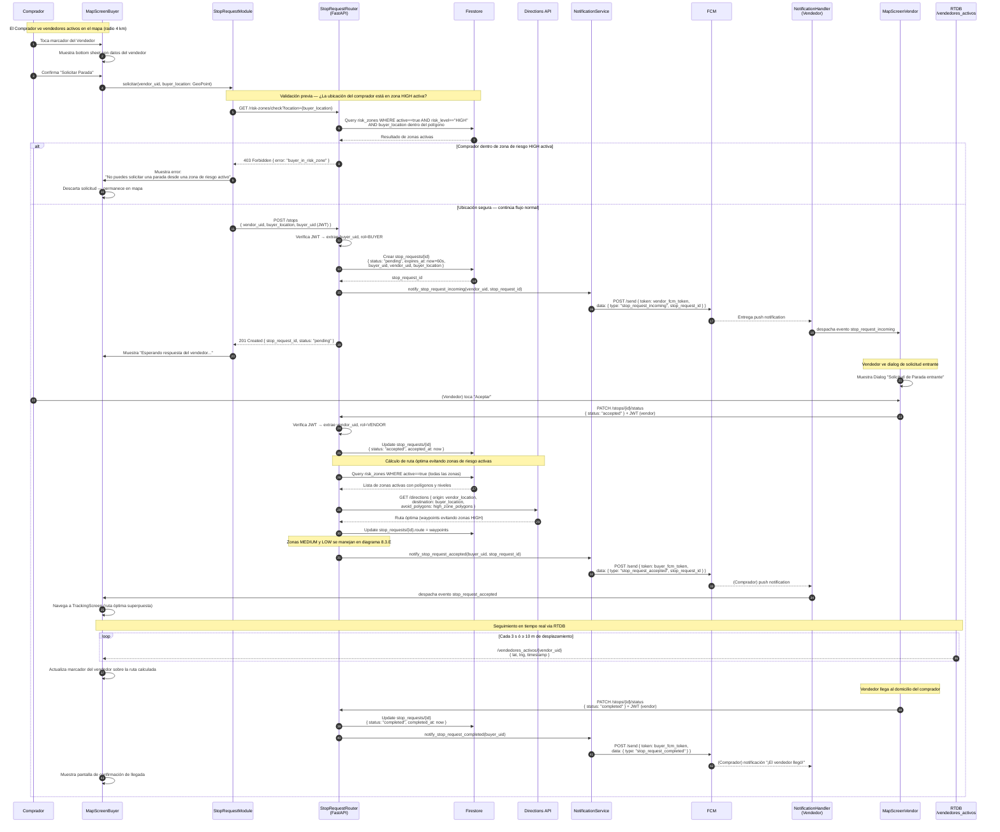

---

### Diagrama 8.1.B — Flujo Alternativo (Vendedor rechaza) {#diagrama-81b}

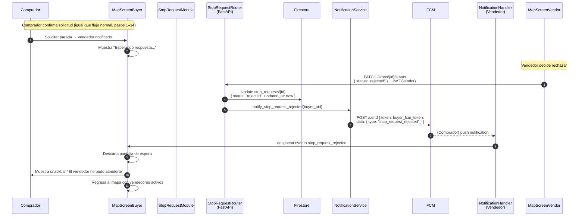

---

### Diagrama 8.1.C — Excepción (Timeout: 60 s sin respuesta) {#diagrama-81c}

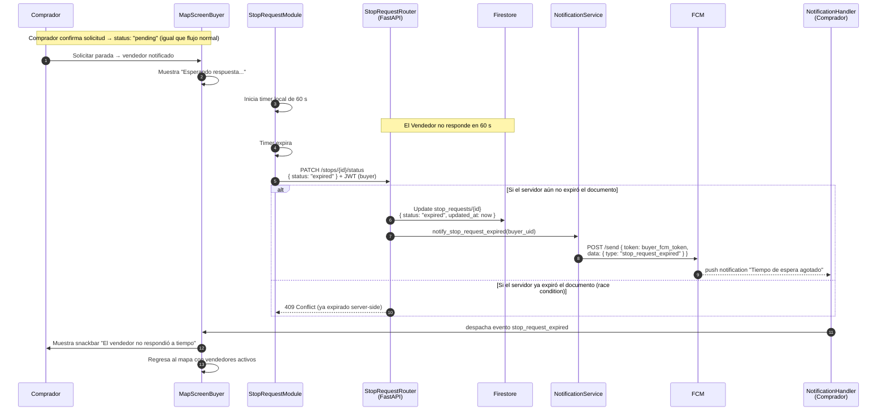

---

### Diagrama 8.1.B2 — Flujo Alternativo 2A (Vendedor en zona bloqueada) {#diagrama-81b2}

> **Nuevo (H-04):** El comprador toca el marcador de un vendedor que se encuentra dentro de una zona HIGH activa. El sistema bloquea la opción "Solicitar Parada" antes de enviar cualquier request al backend. Flujo distinto al rechazo voluntario (8.1.B).

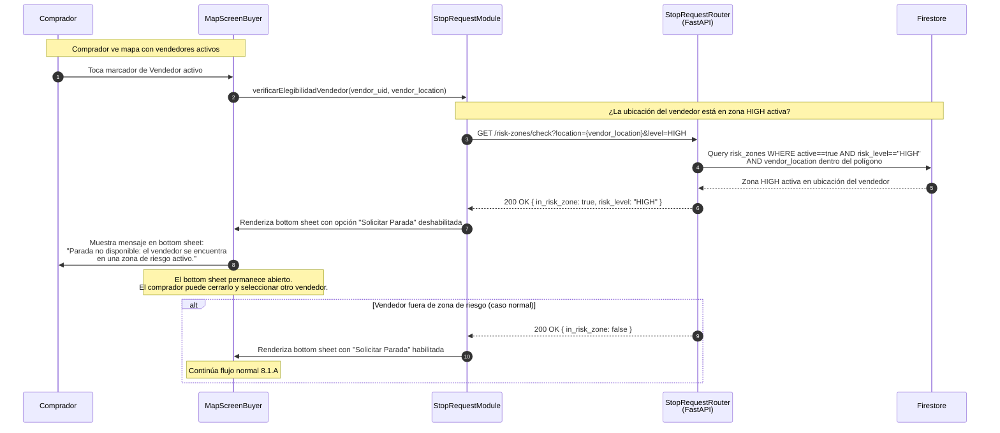

---

### Diagrama 8.1.D — Excepción E1 (Pérdida de conexión durante tracking) {#diagrama-81d}

> **Nuevo (H-12):** El vendedor pierde la conexión mientras el comprador está en TrackingScreen con una solicitud en estado `accepted`. El stream RTDB se interrumpe, el sistema muestra la última ubicación conocida y pausa el seguimiento sin cancelar la solicitud.

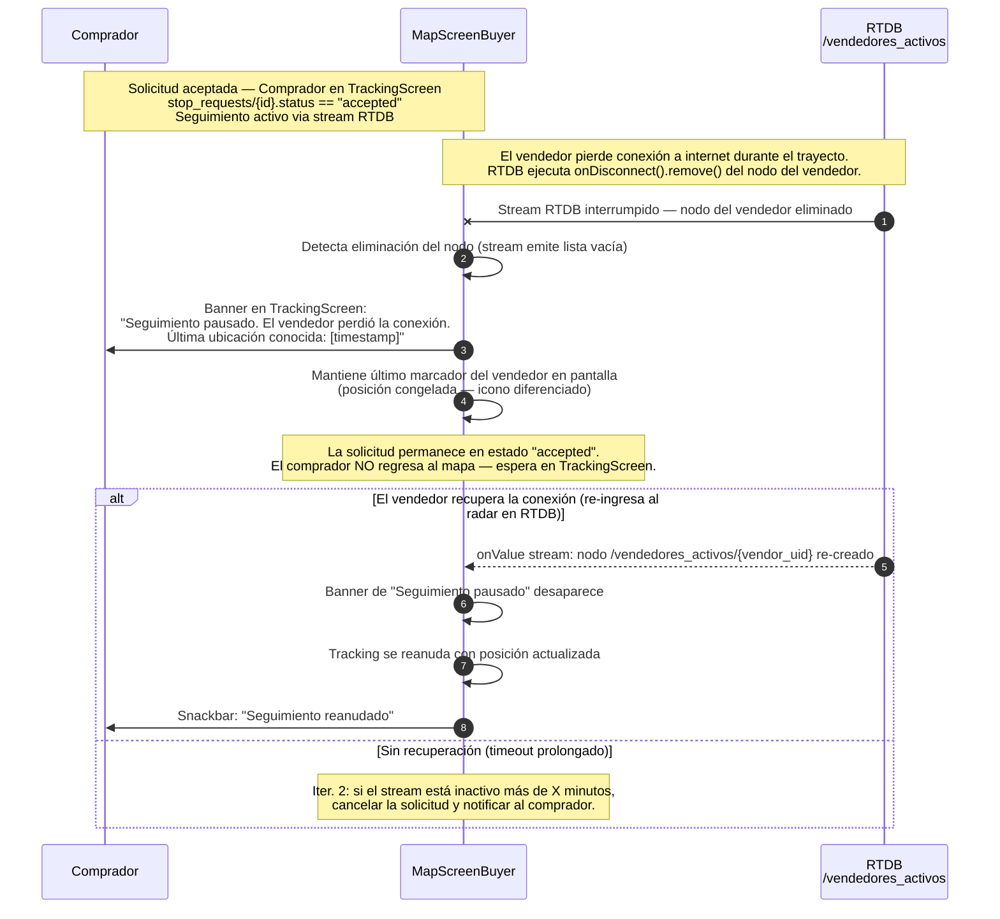

---

## §8.2 — CU-02: Activar Radar de Visibilidad {#cu-02}

### Descripción

El CU-02 es el único caso de uso de iteración 1 en el que la App Flutter escribe **directamente** en Firebase RTDB sin pasar por la API FastAPI (decisión documentada en ADR #2). El `GPSService` se encarga de iniciar el stream GPS del dispositivo, publicar la posición cada 3 segundos o cuando el desplazamiento es ≥10 metros, y registrar un `onDisconnect().remove()` para garantizar que el nodo se elimine si la aplicación se cierra inesperadamente.

Los cuatro flujos documentados son:
- **Normal:** Vendedor activa radar → GPS transmite → Comprador ve marcador en mapa
- **Alternativo:** Señal GPS débil → estado de error → retry automático cada 40 s → recuperación
- **Excepción E1:** Conexión a internet cae → alerta local al vendedor → RTDB ejecuta `onDisconnect()` → nodo eliminado
- **Excepción E2:** Batería baja → frecuencia reducida a 60 s → indicador de baja precisión en mapa del comprador

---

### Diagrama 8.2.A — Flujo Normal (Radar activo) {#diagrama-82a}

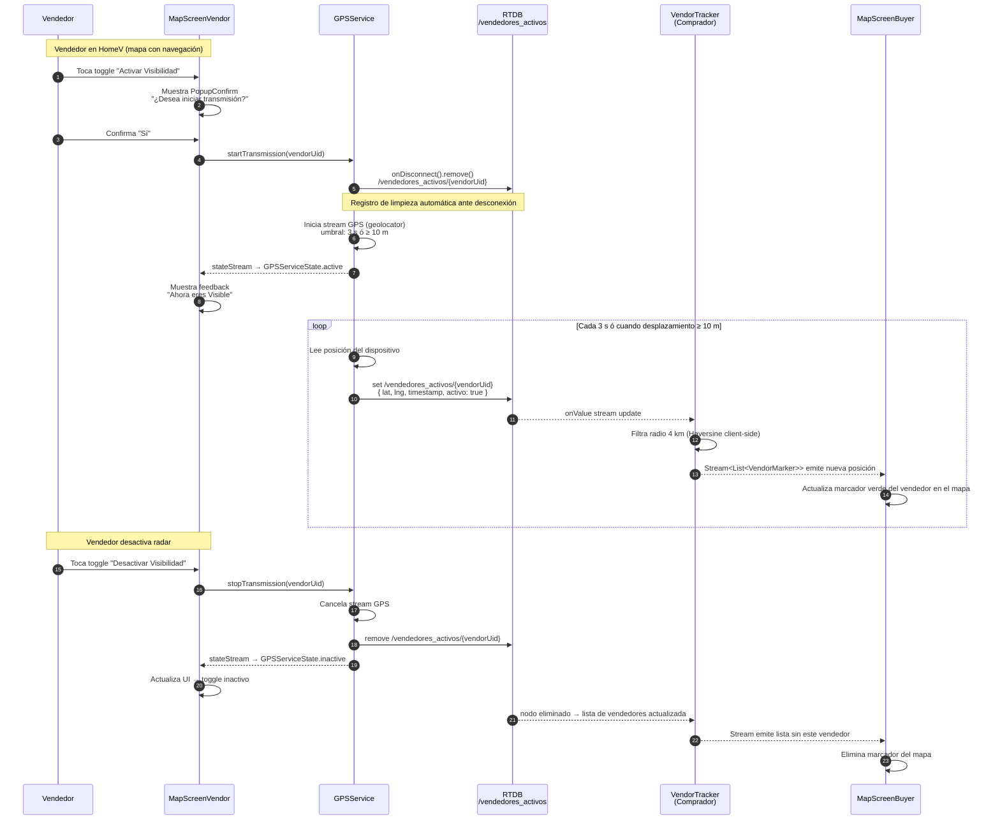

---

### Diagrama 8.2.B — Flujo Alternativo (Señal GPS débil) {#diagrama-82b}

> **Correcciones aplicadas (H-09, H-10):** Intervalo de retry corregido de 5 s a **40 s**. Se agrega representación del lado del comprador: etiqueta "Última ubicación conocida" cuando el timestamp supera 40 s sin actualización.

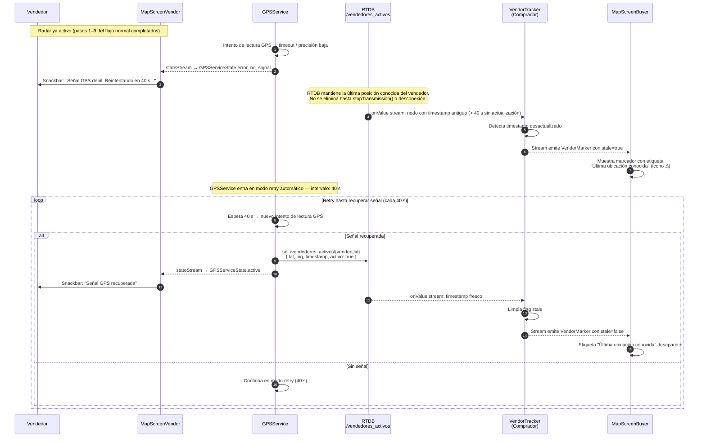

---

### Diagrama 8.2.C — Excepción E1 (Conexión perdida / App cerrada inesperadamente) {#diagrama-82c}

> **Correcciones aplicadas (H-06):** Se agrega alerta local al vendedor antes de que `onDisconnect` ejecute el `remove`. Se diferencia el comportamiento según si la app sigue activa (solo cayó la red) o si la app fue cerrada.

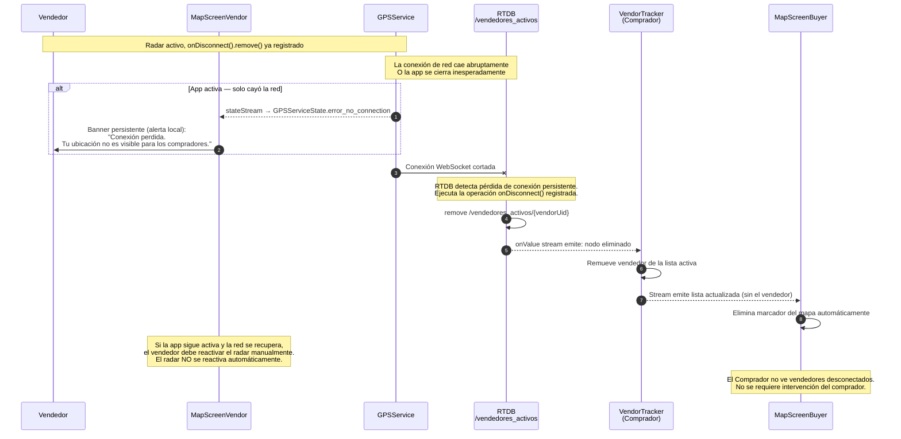

---

### Diagrama 8.2.D — Excepción E2 (Batería baja) {#diagrama-82d}

> **Nuevo (H-07):** Cuando el dispositivo entra en modo de ahorro de energía crítico, `GPSService` reduce la frecuencia de 3 s a 60 s, notifica al vendedor y propaga el flag `low_battery: true` hasta el marcador del comprador. Si el dispositivo se apaga, aplica el flujo 8.2.C.

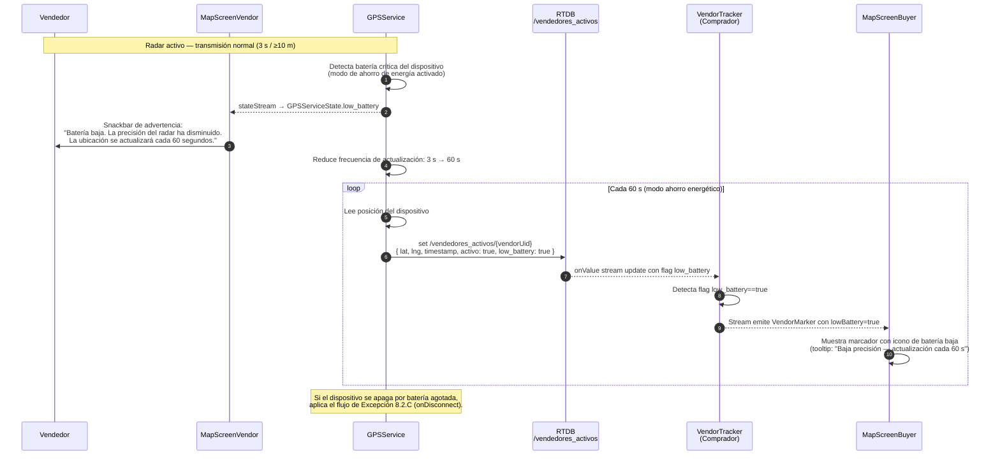

---

## §8.3 — CU-03: Bloquear zonas por riesgo activo {#cu-03}

### Descripción

El CU-03 es **transversal**: tanto el Comprador como el Vendedor pueden reportar desde sus respectivos HomeScreens mediante el FAB naranja (+). El `RiskReportModule` presenta un bottom sheet, captura los datos (tipo de amenaza, nivel de riesgo, coordenadas auto-detectadas) y hace `POST /risk-zones`. La API calcula `expires_at = now + 24h`, persiste en Firestore y notifica a todos los usuarios activos vía FCM. La zona aparece como polígono coloreado en los mapas de todos los usuarios.

Los tres flujos documentados son:
- **Normal:** Reporte HIGH → persiste → alerta FCM masiva → polígono en todos los mapas
- **Alternativo:** Reporte MEDIUM o LOW → mismo flujo, diferente color de polígono
- **Excepción:** Reporte duplicado en zona ya activa → 409 Conflict → usuario corrige

---

### Diagrama 8.3.A — Flujo Normal (Nivel HIGH) {#diagrama-83a}

> **Correcciones aplicadas (H-03 parcial):** Se agrega validación geográfica del reportante (radio 4 km) antes de crear el documento en Firestore, cubriendo la pre-condición del SRS y el criterio CA-03.3.

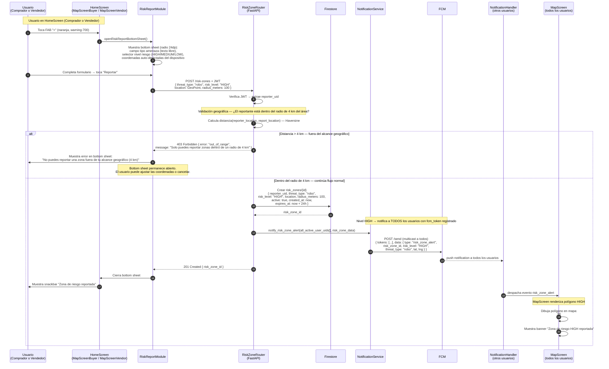

---

### Diagrama 8.3.B — Flujo Alternativo (Nivel MEDIUM o LOW) {#diagrama-83b}

> **Correcciones aplicadas (H-03, H-11):** FCM diferenciado por nivel — MEDIUM notifica a todos los usuarios; LOW notifica solo a usuarios en radio ≤ 5 km. Se elimina la nota incorrecta de "ruta evita polígono" para ambos niveles. El comportamiento de cruce de zona (MEDIUM: confirmación / LOW: informativo) se modela en el diagrama 8.3.E.

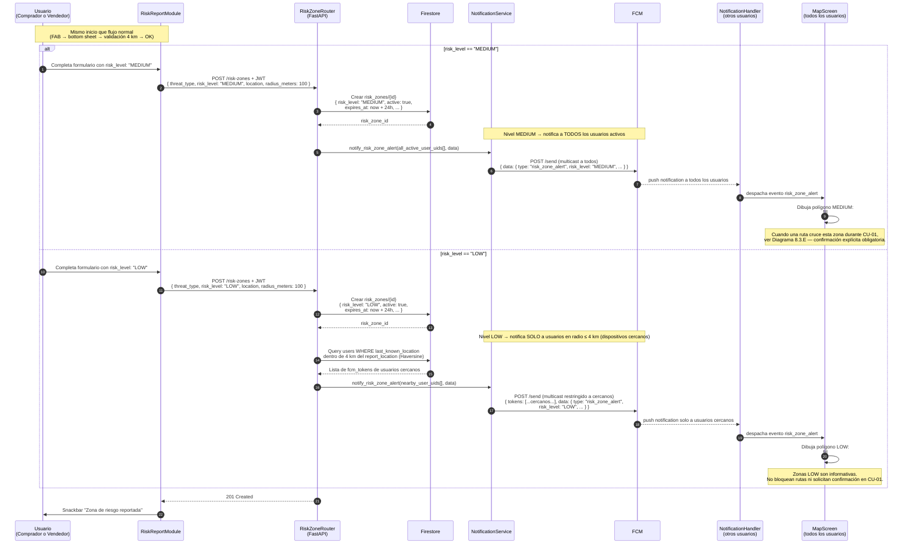

---

### Diagrama 8.3.C — Excepción (Reporte duplicado en zona activa) {#diagrama-83c}

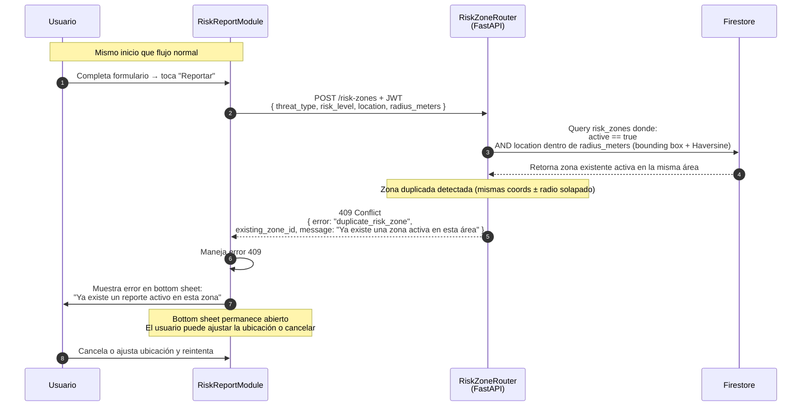

---

### Diagrama 8.3.E — Cruce de zona de riesgo durante CU-01 {#diagrama-83e}

> **Nuevo (H-08, H-11):** Diagrama transversal CU-01 / CU-03. Modela qué hace el sistema cuando la ruta del vendedor cruza una zona activa. Punto de entrada: inmediatamente después del cálculo de ruta en 8.1.A (tras el `PATCH accepted`). HIGH → rerouting automático; MEDIUM → confirmación explícita del vendedor; LOW → snackbar informativo.

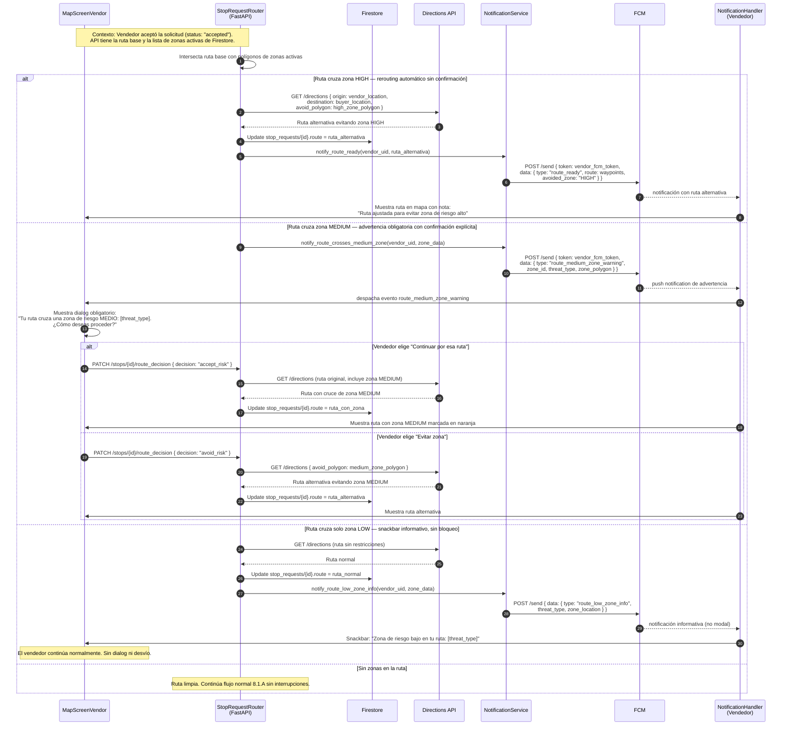

---

## §8.4 — Auth: Registro y Login {#auth}

### Descripción

El flujo de autenticación combina Firebase Auth (para credenciales y emisión de JWT) con la API FastAPI (para persistir el perfil en Firestore y registrar el token FCM). El `AuthModule` es el componente Flutter responsable del ciclo completo. Hay dos sub-flujos: **Registro** (nuevo usuario) y **Login** (usuario existente). En ambos casos, al terminar, `go_router` redirige al Home correspondiente según el rol (`BUYER` → MapScreenBuyer, `VENDOR` → MapScreenVendor).

---

### Diagrama 8.4.A — Sub-flujo: Registro (Sign Up)

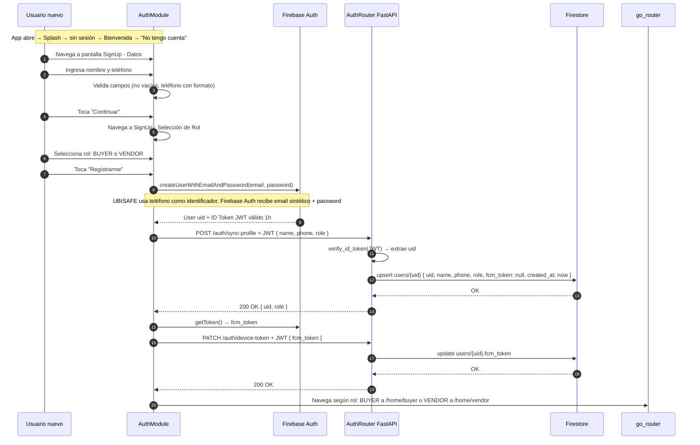

---

### Diagrama 8.4.B — Sub-flujo: Login

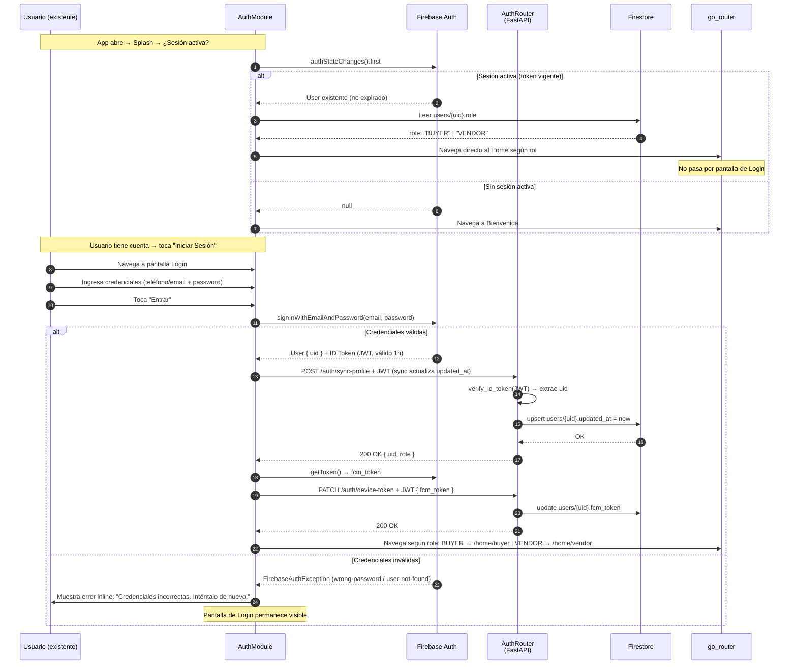

---

## Notas de implementación para el equipo

> Esta sección va al pie de §8 en el SDD final.

### Manejo de JWT expirado durante una sesión activa

El JWT de Firebase Auth tiene vigencia de **1 hora**. El cliente Flutter (a través de `dio` + interceptor configurado en `core/api_client.dart`) debe refrescar el token automáticamente antes de cada request usando `user.getIdToken(forceRefresh: false)`. Si el token expiró, Firebase Auth SDK lo renueva en background sin que el usuario lo note. Solo se requiere re-autenticación explícita si la sesión fue revocada manualmente.

### Consistencia de `fcm_token`

El token FCM puede rotar (Firebase lo renueva periódicamente). `NotificationHandler` debe escuchar el callback `FirebaseMessaging.onTokenRefresh` y llamar a `PATCH /auth/device-token` cada vez que ocurra una rotación.

### Timeout del lado del servidor (CU-01)

La expiración de `stop_requests` a los 60 s no está implementada con un job programado en iter. 1. El cliente inicia el PATCH con `status: expired`. En iter. 2 se evaluará agregar una Cloud Function con trigger por tiempo para expirar documentos server-side sin depender del cliente.

---

*Fase 4 generada el 18/04/2026 — Los Borbotones / UBISAFE Iteración 1.*
