# SDD UBISAFE — Fase 5: Diseño de Interfaces de Usuario
## Los Borbotones · Iteración 1
### Secciones §8 (Design System + UI) · §9 (Secuencias/Nav) · §10 (Diagrama de Navegación)

> **Nota de uso:** Este archivo documenta progresivamente los outputs de la Fase 5 del plan SDD. Se actualiza al terminar cada sub-fase (5D → 5A → 5B → 5C). Los diagramas Mermaid deben exportarse como imagen para el .docx final; los wireframes HTML se abren en navegador y se exportan como captura de pantalla.
>
> **Sub-fases:**
> - [§10 — Diagrama de Navegación (5D)](#sección-10--diagrama-de-navegación) ✅ Completo
> - [§8.1 — Design System (5A)](#sección-81--design-system) ✅ Completo
> - [§8.2–8.17 — Wireframes (5B)](#sección-82--wireframes-de-baja-fidelidad) ✅ Completo (Grupos 1–4 ✅)
> - [§8.18+ — Mockups de alta fidelidad (5C)](#sección-818--mockups-de-alta-fidelidad) ✅ Completo (7 prompts Claude Design · 1 Figma)

---

## ÍNDICE

1. [§10 — Diagrama de Navegación](#sección-10--diagrama-de-navegación)
2. [§8.1 — Design System](#sección-81--design-system)
3. [§8.2 — Wireframes de baja fidelidad](#sección-82--wireframes-de-baja-fidelidad)
4. [§8.18 — Mockups de alta fidelidad](#sección-818--mockups-de-alta-fidelidad)

---

## Sección §10 — Diagrama de Navegación

> **Nota de integración:** Esta es la Sección 10 del SDD (Interface Viewpoint — complemento). Pegar después de §9 (Diagramas de Secuencia). El diagrama Mermaid se exporta como imagen y se inserta en el .docx.
>
> **Base:** Construido desde cero a partir de los flujos confirmados en los diagramas de secuencia (Fase 4: §8.1–§8.4). El diagrama previo del knowledge source quedó obsoleto tras la reestructuración arquitectónica del 17/04/2026.

---

### 10.1. Descripción del diagrama

El diagrama de navegación documenta el flujo completo de pantallas de UBISAFE para la Iteración 1, cubriendo los tres casos de uso funcionales (CU-01, CU-02, CU-03) y el flujo de autenticación (registro y login). El diagrama está organizado en cinco zonas:

- **Auth:** Splash, sesión activa/inactiva, registro (2 pasos) y login con validación de credenciales.
- **Routing por rol:** Punto de convergencia que dirige a Comprador o Vendedor según el campo `role` en Firestore.
- **Flujo Comprador (azul):** Home con mapa, estado GPS, solicitud de parada (CU-01) y reporte de riesgo (CU-03).
- **Flujo Vendedor (verde):** Home con mapa, activación de radar (CU-02), atención de solicitudes (CU-01) y reporte de riesgo (CU-03).
- **Navegación global (Drawer):** Perfil, historial y cierre de sesión, accesibles desde ambos homes.

Las pantallas de Comprador se distinguen con fondo azul claro (`#E3F2FD`, `primary-50`). Las pantallas de Vendedor con fondo verde claro (`#F1F8E9`, `secondary-50`). Los elementos de CU-03 (reporte de riesgo) en naranja (`#FFF3E0`, `warning-50`) por ser transversales a ambos roles. El componente compartido `GpsRequiredEmptyState` aparece en ámbar (`#FFF8E1`) como pantalla bloqueante cuando el GPS no está disponible; es transversal a HomeC, HomeV, el FAB+ de reporte y el flujo de aceptación de solicitud del Vendedor.

**Política de GPS como precondición global:** todas las pantallas con funcionalidad de mapa, transmisión de ubicación, cálculo de ruta o filtrado por proximidad requieren GPS activo y permiso de ubicación concedido. Las pantallas del Drawer (Perfil, Historial, Cerrar Sesión) son la excepción: accesibles en modo limitado, sin GPS.

**Nota sobre estados vs. pantallas:** Los nodos `Mapa activo — Vendedores en radio 4 km` (MapViewC) y `Mapa Activo — Escuchando solicitudes` (MapViewV) que aparecen en el diagrama **no son rutas independientes** en go_router. Son **estados UI** de `HomeComprador` (`/home/buyer`) y `HomeVendedor` (`/home/vendor`) respectivamente. El cambio entre ellos es gestionado por los providers de Riverpod (`gpsStateProvider`, `vendorMarkersProvider`) sin disparar ninguna navegación. Se representan como nodos separados en el diagrama únicamente para documentar las transiciones de estado de forma visual.

---

### 10.2. Pantallas identificadas en este diagrama

| #   | Pantalla / Estado                       | Tipo                                          | Rol    |
| --- | --------------------------------------- | --------------------------------------------- | ------ |
| 1   | Splash Screen                           | Pantalla                                      | Ambos  |
| 2   | Pantalla de Bienvenida                  | Pantalla                                      | Ambos  |
| 3   | Login                                   | Pantalla                                      | Ambos  |
| 4   | SignUp — Datos (nombre, teléfono)       | Pantalla                                      | Ambos  |
| 5   | SignUp — Selección de Rol               | Pantalla                                      | Ambos  |
| 6   | Home Comprador (mapa con radar)         | Pantalla principal                            | BUYER  |
| 7   | Home Vendedor (mapa con navegación)     | Pantalla principal                            | VENDOR |
| 8   | Empty State GPS (GpsRequiredEmptyState) | Pantalla bloqueante compartida                | Ambos  |
| 9   | Esperando respuesta del vendedor        | Estado UI de Home C (misma ruta /home/buyer)  | BUYER  |
| 10  | Pantalla de Seguimiento en Tiempo Real  | Pantalla                                      | BUYER  |
| 11  | Notificación de llegada (confirmación)  | Overlay / snackbar                            | BUYER  |
| 12  | Dialog: Solicitud de Parada Entrante    | Dialog sobre Home V                           | VENDOR |
| 13  | PopupConfirm: ¿Iniciar transmisión?     | Dialog sobre Home V                           | VENDOR |
| 14  | Feedback: "Ahora eres Visible"          | Overlay / snackbar                            | VENDOR |
| 15  | Mapa Activo Vendedor (escuchando)       | Estado UI de Home V (misma ruta /home/vendor) | VENDOR |
| 16  | Navegación Segura (ruta activa)         | Estado UI de Home V (misma ruta /home/vendor) | VENDOR |
| 17  | CU-03: Bottom Sheet Reportar Riesgo     | Bottom sheet                                  | Ambos  |
| 18  | Drawer — Menú Lateral                   | Overlay                                       | Ambos  |
| 19  | Mi Perfil                               | Pantalla                                      | Ambos  |
| 20  | Historial de Actividad                  | Pantalla                                      | Ambos  |

---

### 10.3. Diagrama Mermaid

```mermaid
graph TD
    %% ============================================================
    %% INICIO / SPLASH
    %% ============================================================
    Start((Apertura App)) --> Splash[Splash Screen]
    Splash --> SessionCheck{"¿Sesión activa?\nauthStateChanges"}

    %% ============================================================
    %% SIN SESIÓN — BIENVENIDA Y AUTH
    %% ============================================================
    SessionCheck -- No --> Welcome[Pantalla de Bienvenida]

    %% Sub-flujo: Registro (Sign Up)
    Welcome -- "No tengo cuenta" --> SignUpData["SignUp — Datos\nnombre + teléfono"]
    SignUpData --> SignUpRole["SignUp — Selección de Rol\nBUYER / VENDOR"]
    SignUpRole --> AuthCreate["Firebase Auth\ncreateUserWithEmailAndPassword"]
    AuthCreate --> SyncNew["POST /auth/sync-profile\n+ PATCH /auth/device-token"]
    SyncNew --> RoleRoute

    %% Sub-flujo: Login
    Welcome -- "Tengo cuenta" --> LoginScreen[Pantalla de Login]
    LoginScreen --> AuthLogin{"Firebase Auth\nsignIn"}
    AuthLogin -- "Inválidas" --> LoginError["Error inline:\nCredenciales incorrectas"]
    LoginError --> LoginScreen
    AuthLogin -- "Válidas" --> SyncExist["POST /auth/sync-profile\n+ PATCH /auth/device-token"]
    SyncExist --> RoleRoute

    %% Sesión activa (startup directo)
    SessionCheck -- Sí --> ReadRole["Leer users/{uid}.role\ndesde Firestore"]
    ReadRole --> RoleRoute

    %% ============================================================
    %% ROUTING POR ROL
    %% ============================================================
    RoleRoute{Verificar Rol}
    RoleRoute -- BUYER --> HomeC
    RoleRoute -- VENDOR --> HomeV

    %% ============================================================
    %% DRAWER — NAVEGACIÓN GLOBAL
    %% MODO LIMITADO: accesible sin GPS (desde HomeC, HomeV y EmptyStateGps)
    %% ============================================================
    HomeC -- "Ícono menú" --> Drawer["Drawer\nMenú Lateral"]
    HomeV -- "Ícono menú" --> Drawer
    EmptyStateGps -- "Ícono menú" --> Drawer
    Drawer --> Profile[Mi Perfil]
    Drawer --> History[Historial de Actividad]
    Drawer -- "Cerrar Sesión" --> SignOut["firebase.signOut()"]
    SignOut --> Welcome

    %% ============================================================
    %% EMPTY STATE GPS — COMPONENTE COMPARTIDO
    %% GpsRequiredEmptyState: pantalla bloqueante completa cuando
    %%   · Permiso de ubicación del SO denegado, O
    %%   · GPS del sistema apagado
    %% CTA dinámico según caso (conceder permiso / abrir ajustes)
    %% ============================================================
    EmptyStateGps["GpsRequiredEmptyState\nActiva el GPS o concede el permiso\nCTA dinámico según caso"]
    EmptyStateGps -.->|"GPS activado / permiso concedido"| HomeC
    EmptyStateGps -.->|"GPS activado / permiso concedido"| HomeV

    %% ============================================================
    %% FLUJO COMPRADOR — BUYER
    %% ============================================================
    HomeC["Home Comprador\nMapa — Radar de Seguridad"]
    HomeC --> GPSCheck{"¿GPS activo?"}
    GPSCheck -- No --> EmptyStateGps
    GPSCheck -- Sí --> MapViewC["Mapa activo:\nVendedores en radio 4 km"]

    %% CU-01: Solicitar parada
    MapViewC --> SelectVendor["Toca marcador\ndel vendedor"]
    SelectVendor --> RequestSheet["Bottom sheet:\nConfirmar solicitud\nPOST /stops"]
    RequestSheet --> WaitScreen["Esperando respuesta\ndel vendedor 60s"]

    WaitScreen -- "Vendedor acepta" --> TrackingScreen["Pantalla de Seguimiento\nen Tiempo Real\nRTDB stream"]
    WaitScreen -- "Vendedor rechaza" --> RejectFeedback["Snackbar:\nEl vendedor no pudo atenderte"]
    WaitScreen -- "Timeout 60s" --> TimeoutFeedback["Snackbar:\nTiempo de espera agotado"]
    RejectFeedback --> MapViewC
    TimeoutFeedback --> MapViewC
    TrackingScreen --> ArrivalConfirm["Notificación FCM:\n¡El vendedor llegó!"]
    ArrivalConfirm --> HomeC

    %% CU-03: Reportar riesgo (Comprador) — GPS requerido
    HomeC -- "FAB +" --> GPSCheckFAB_C{"¿GPS activo?\n(FAB +)"}
    GPSCheckFAB_C -- No --> EmptyStateGps
    GPSCheckFAB_C -- Sí --> RiskFormC["CU-03: Bottom Sheet\nReportar Riesgo"]
    RiskFormC --> RiskSuccessC["Snackbar:\nZona de riesgo reportada"]
    RiskSuccessC --> HomeC

    %% ============================================================
    %% FLUJO VENDEDOR — VENDOR
    %% ============================================================
    HomeV["Home Vendedor\nMapa — Navegación y Riesgos"]
    HomeV --> GPSCheck_V{"¿GPS activo?"}
    GPSCheck_V -- No --> EmptyStateGps
    GPSCheck_V -- Sí --> VisibilityToggle["Toggle:\nActivar Visibilidad"]

    %% CU-02: Activar radar de visibilidad
    VisibilityToggle --> PopupConfirm{"PopupConfirm:\n¿Iniciar transmisión?"}
    PopupConfirm -- No --> HomeV
    PopupConfirm -- Sí --> VisibilityFeedback["Feedback:\nAhora eres Visible ✓\nGPSService.startTransmission()"]
    VisibilityFeedback --> MapViewV["Mapa Activo:\nEscuchando solicitudes"]

    %% CU-01: Atender solicitud (Vendedor) — GPS requerido para aceptar
    MapViewV -- "FCM:" --> IncomingDialog["Dialog:\nSolicitud de Parada Entrante"]
    IncomingDialog -- Rechazar --> MapViewV
    IncomingDialog -- Aceptar --> GPSCheck_Req{"¿GPS activo?\n(aceptar solicitud)"}
    GPSCheck_Req -- No --> EmptyStateGps
    GPSCheck_Req -- Sí --> SafeNav["Navegación Segura:\nEvitando Zonas de Riesgo\nDirections API"]
    SafeNav --> DeliveryConfirm["Confirmar Entrega\nPATCH /stops/{id}/status\n completed"]
    DeliveryConfirm --> MapViewV

    %% Desactivar radar
    MapViewV -- "Toggle OFF" --> DeactivateToggle["GPSService.stopTransmission()\nNodo RTDB eliminado"]
    DeactivateToggle --> HomeV

    %% CU-03: Reportar riesgo (Vendedor) — GPS requerido
    HomeV -- "FAB +" --> GPSCheckFAB_V{"¿GPS activo?\n(FAB +)"}
    GPSCheckFAB_V -- No --> EmptyStateGps
    GPSCheckFAB_V -- Sí --> RiskFormV["CU-03: Bottom Sheet\nReportar Riesgo"]
    RiskFormV --> RiskSuccessV["Snackbar:\nZona de riesgo reportada"]
    RiskSuccessV --> HomeV

    %% ============================================================
    %% ESTILOS — IDENTIDAD VISUAL
    %% ============================================================
    style HomeC fill:#E3F2FD,stroke:#1565C0,stroke-width:2px
    style MapViewC fill:#E3F2FD,stroke:#1565C0,stroke-width:1px
    style TrackingScreen fill:#E3F2FD,stroke:#1565C0,stroke-width:1px
    style WaitScreen fill:#E3F2FD,stroke:#1565C0,stroke-width:1px
    style HomeV fill:#F1F8E9,stroke:#2E7D32,stroke-width:2px
    style MapViewV fill:#F1F8E9,stroke:#2E7D32,stroke-width:1px
    style SafeNav fill:#F1F8E9,stroke:#2E7D32,stroke-width:1px
    style RiskFormC fill:#FFF3E0,stroke:#E65100,stroke-width:2px
    style RiskFormV fill:#FFF3E0,stroke:#E65100,stroke-width:2px
    style Drawer fill:#F5F5F5,stroke:#616161,stroke-width:1px
    style Profile fill:#F5F5F5,stroke:#616161,stroke-width:1px
    style History fill:#F5F5F5,stroke:#616161,stroke-width:1px
    style EmptyStateGps fill:#FFF8E1,stroke:#F57C00,stroke-width:2px
    classDef gpsGate fill:#FFF3E0,stroke:#E65100,stroke-width:1px,stroke-dasharray:4
    class GPSCheck,GPSCheck_V,GPSCheckFAB_C,GPSCheckFAB_V,GPSCheck_Req gpsGate
```



---

### 10.4. Cobertura de casos de uso

| CU / Flujo                           | Cubierto en el diagrama | Nodos clave                                                     |
| ------------------------------------ | ----------------------- | --------------------------------------------------------------- |
| **Auth — Registro**                  | ✅                       | SignUpData → SignUpRole → AuthCreate → SyncNew                  |
| **Auth — Login**                     | ✅                       | LoginScreen → AuthLogin → SyncExist                             |
| **Auth — Sesión activa**             | ✅                       | SessionCheck → ReadRole → RoleRoute                             |
| **CU-01 — Flujo normal (Comprador)** | ✅                       | SelectVendor → WaitScreen → TrackingScreen → ArrivalConfirm     |
| **CU-01 — Vendedor rechaza**         | ✅                       | WaitScreen → RejectFeedback → MapViewC                          |
| **CU-01 — Timeout**                  | ✅                       | WaitScreen → TimeoutFeedback → MapViewC                         |
| **CU-01 — Flujo Vendedor (acepta)**  | ✅                       | IncomingDialog → SafeNav → DeliveryConfirm                      |
| **CU-01 — Flujo Vendedor (rechaza)** | ✅                       | IncomingDialog → MapViewV                                       |
| **CU-02 — Activar radar**            | ✅                       | VisibilityToggle → PopupConfirm → VisibilityFeedback → MapViewV |
| **CU-02 — Cancelar activación**      | ✅                       | PopupConfirm (No) → HomeV                                       |
| **CU-02 — Desactivar radar**         | ✅                       | MapViewV (Toggle OFF) → DeactivateToggle → HomeV                |
| **CU-03 — Comprador**                | ✅                       | HomeC (FAB+) → RiskFormC → RiskSuccessC                         |
| **CU-03 — Vendedor**                 | ✅                       | HomeV (FAB+) → RiskFormV → RiskSuccessV                         |
| **Drawer — Perfil / Historial**      | ✅                       | Drawer → Profile / History                                      |
| **Drawer — Logout**                  | ✅                       | Drawer → SignOut → Welcome                                      |
| **GPS apagado — HomeC (mapa Comprador)**       | ✅ | GPSCheck (No) → EmptyStateGps ↩ HomeC                         |
| **GPS apagado — HomeV (mapa Vendedor)**        | ✅ | GPSCheck_V (No) → EmptyStateGps ↩ HomeV                       |
| **GPS apagado — FAB+ Comprador (CU-03)**       | ✅ | GPSCheckFAB_C (No) → EmptyStateGps                            |
| **GPS apagado — FAB+ Vendedor (CU-03)**        | ✅ | GPSCheckFAB_V (No) → EmptyStateGps                            |
| **GPS apagado — Aceptar solicitud (Vendedor)** | ✅ | GPSCheck_Req (No) → EmptyStateGps                             |
| **Drawer y pantallas — modo limitado**         | ✅ | HomeC/HomeV/EmptyStateGps → Drawer → Profile/History/Logout   |

---

*Paso 5D completado: 18/04/2026. Corrección Cambio #2 (GPS como precondición global) aplicada: 20/04/2026 — Los Borbotones / UBISAFE Iteración 1*

---

## Sección §8.1 — Design System

> **Nota de integración:** Esta es la Sección 8.1 del SDD (Interface Viewpoint — sistema de diseño visual). Pegar antes de los wireframes (§8.2+). El contenido fue generado en Fase 0 paso 0.3 (`SDD_FASE0_UBISAFE.md §7.1`) y se consolida aquí como sección definitiva del SDD, sin modificaciones. La única adición respecto a Fase 0 es el componente `GpsRequiredEmptyState` (§8.1.5, ítem nuevo) derivado del Cambio #2 (GPS como precondición global, 20/04/2026).
>
> **Fuente canónica:** `SDD_FASE0_UBISAFE.md §7.1` — no duplicar en el .docx; usar esta sección como la versión definitiva.

---

### 8.1.1. Paleta de Colores

El sistema de diseño de UBISAFE sigue una dirección visual de **seguridad y confianza**, utilizando una paleta de azules y verdes que transmite protección, calma y pertenencia comunitaria. El diseño prioriza la accesibilidad para adultos mayores conforme a RNF-02.

#### Colores primarios

| Token               | Nombre          | Hex       | Uso                                                 |
| ------------------- | --------------- | --------- | --------------------------------------------------- |
| `color-primary-900` | Azul profundo   | `#0D47A1` | Texto sobre fondo claro, énfasis máximo             |
| `color-primary-700` | Azul base       | `#1565C0` | Color de marca principal, AppBar, botones primarios |
| `color-primary-500` | Azul medio      | `#1E88E5` | Estados hover, íconos activos                       |
| `color-primary-100` | Azul claro      | `#BBDEFB` | Bordes de selección, fondos de input activos        |
| `color-primary-50`  | Azul superficie | `#E3F2FD` | Fondo de pantallas del Comprador, tarjetas          |

#### Colores secundarios

| Token                 | Nombre           | Hex       | Uso                                           |
| --------------------- | ---------------- | --------- | --------------------------------------------- |
| `color-secondary-700` | Verde base       | `#2E7D32` | Indicadores "vendedor activo", confirmaciones |
| `color-secondary-500` | Verde medio      | `#43A047` | Marcadores de vendedor en el mapa             |
| `color-secondary-100` | Verde claro      | `#C8E6C9` | Fondos de notificaciones de éxito             |
| `color-secondary-50`  | Verde superficie | `#F1F8E9` | Fondo de pantallas del Vendedor               |

#### Colores semánticos

| Token               | Nombre             | Hex       | Uso                                                |
| ------------------- | ------------------ | --------- | -------------------------------------------------- |
| `color-danger-700`  | Rojo riesgo        | `#C62828` | Zonas de riesgo Alto (polígonos), errores críticos |
| `color-danger-500`  | Rojo base          | `#E53935` | Mensajes de error, botones destructivos            |
| `color-warning-700` | Naranja riesgo     | `#E65100` | Zonas de riesgo Medio, FAB "+" (CU-03)             |
| `color-warning-500` | Naranja base       | `#F57C00` | Etiquetas de riesgo Medio, badges                  |
| `color-warning-50`  | Naranja superficie | `#FFF8E1` | Fondo del `GpsRequiredEmptyState`                  |
| `color-info-500`    | Azul info          | `#0277BD` | Zonas de riesgo Bajo, mensajes informativos        |
| `color-success-500` | Verde éxito        | `#388E3C` | Confirmaciones de acción                           |

#### Colores neutros

| Token               | Nombre              | Hex       | Uso                                   |
| ------------------- | ------------------- | --------- | ------------------------------------- |
| `color-neutral-900` | Texto principal     | `#212121` | Texto de cuerpo, encabezados          |
| `color-neutral-600` | Texto secundario    | `#616161` | Subtítulos, labels, texto de soporte  |
| `color-neutral-400` | Texto deshabilitado | `#9E9E9E` | Elementos inactivos, placeholders     |
| `color-neutral-200` | Borde               | `#E0E0E0` | Divisores, bordes de inputs inactivos |
| `color-neutral-100` | Fondo               | `#F5F5F5` | Fondo general de la app               |
| `color-neutral-0`   | Superficie          | `#FFFFFF` | Tarjetas, modales, bottom sheets      |

#### Colores del mapa

| Token                  | Elemento                       | Color / Opacidad           |
| ---------------------- | ------------------------------ | -------------------------- |
| `map-risk-high-fill`   | Zona riesgo Alto               | `#C62828` al 35%           |
| `map-risk-high-stroke` | Borde zona riesgo Alto         | `#C62828` 100%             |
| `map-risk-medium-fill` | Zona riesgo Medio              | `#F57C00` al 30%           |
| `map-risk-low-fill`    | Zona riesgo Bajo               | `#0277BD` al 25%           |
| `map-vendor-active`    | Marcador vendedor activo       | `#43A047`                  |
| `map-vendor-inactive`  | Marcador vendedor desconectado | `#9E9E9E`                  |
| `map-buyer-location`   | Ubicación del comprador        | `#1565C0` (punto pulsante) |

---

### 8.1.2. Tipografía

**Familia:** Inter (Google Fonts, licencia OFL) — legibilidad optimizada para pantallas pequeñas y condiciones de baja visión.

| Token            | Uso                                      | Peso         | Tamaño | Interlineado |
| ---------------- | ---------------------------------------- | ------------ | ------ | ------------ |
| `text-display`   | Títulos de pantalla (splash, bienvenida) | Bold 700     | 24sp   | 32sp         |
| `text-heading-1` | Encabezados de sección                   | SemiBold 600 | 20sp   | 28sp         |
| `text-heading-2` | Subtítulos de tarjetas                   | SemiBold 600 | 18sp   | 24sp         |
| `text-body-1`    | Texto principal                          | Regular 400  | 16sp   | 24sp         |
| `text-body-2`    | Texto de soporte                         | Regular 400  | 14sp   | 20sp         |
| `text-button`    | Etiquetas de botones                     | SemiBold 600 | 16sp   | 20sp         |
| `text-label`     | Labels de inputs, chips                  | Medium 500   | 14sp   | 18sp         |
| `text-caption`   | Texto auxiliar, timestamps               | Regular 400  | 12sp   | 16sp         |

**Regla de accesibilidad (RNF-02):** ningún texto funcional menor a 14sp. Textos de acción crítica (botones primarios, mensajes de error) mínimo 16sp.

---

### 8.1.3. Espaciado — Sistema de 8px Grid

| Token         | Valor | Uso típico                                                |
| ------------- | ----- | --------------------------------------------------------- |
| `spacing-xs`  | 4dp   | Separación entre ícono y texto en chips                   |
| `spacing-sm`  | 8dp   | Padding interno de chips, separación pequeña              |
| `spacing-md`  | 16dp  | Padding horizontal de tarjetas                            |
| `spacing-lg`  | 24dp  | Padding horizontal de pantallas (margen lateral estándar) |
| `spacing-xl`  | 32dp  | Separación entre bloques de contenido                     |
| `spacing-xxl` | 48dp  | Margen superior de pantallas con imagen hero              |

---

### 8.1.4. Componentes Base

#### Botones

| Variante       | Alto | Radio | Color fondo                              | Uso                                                      |
| -------------- | ---- | ----- | ---------------------------------------- | -------------------------------------------------------- |
| **Primario**   | 52dp | 12dp  | `color-primary-700`                      | Acción principal (Solicitar parada, Activar visibilidad) |
| **Secundario** | 52dp | 12dp  | Transparente + borde `color-primary-700` | Acción alternativa (Cancelar, Ver más)                   |
| **Peligro**    | 52dp | 12dp  | `color-danger-500`                       | Acciones destructivas (Cerrar sesión)                    |
| **Ghost**      | 44dp | 8dp   | Transparente                             | Acciones de bajo énfasis (links textuales)               |

#### Inputs / Campos de texto

| Propiedad | Valor |
|---|---|
| Alto | 56dp |
| Radio de esquinas | 12dp |
| Borde inactivo | `color-neutral-200`, 1dp |
| Borde activo/focus | `color-primary-700`, 2dp |
| Borde error | `color-danger-500`, 2dp |

#### Tarjetas (Cards)

| Propiedad | Valor |
|---|---|
| Radio de esquinas | 16dp |
| Elevación | 2dp |
| Padding interno | 16dp |
| Fondo | `color-neutral-0` |

#### FAB — Botón "+" de reporte de riesgo (CU-03)

| Propiedad | Valor |
|---|---|
| Tamaño | 56dp × 56dp |
| Radio | 16dp |
| Color | `color-warning-700` (`#E65100`) |
| Ícono | `add` Material Icons Outlined, blanco, 24dp |
| Posición | Bottom-right, margen 16dp |

#### Bottom Sheets

| Propiedad | Valor |
|---|---|
| Radio superior | 24dp |
| Handle visual | 4dp × 32dp, `color-neutral-200`, centrado, margin-top 12dp |
| Padding interno | 24dp horizontal, 20dp vertical |

#### Modales / Dialogs

| Propiedad | Valor |
|---|---|
| Radio | 20dp |
| Margen horizontal | 24dp desde bordes |
| Padding interno | 24dp |
| Overlay | Negro al 50% |

#### GpsRequiredEmptyState *(componente nuevo — Cambio #2, 20/04/2026)*

Pantalla bloqueante completa que se muestra cuando el GPS no está activo o el permiso de ubicación no fue concedido. Es un componente compartido (`shared/`) que reutilizan HomeComprador, HomeVendedor, el FAB+ de CU-03 y el flujo de aceptación de solicitud del Vendedor.

| Propiedad | Valor |
|---|---|
| Fondo | `color-warning-50` (`#FFF8E1`) |
| Ícono central | `gps_off` Material Icons Outlined, 64dp, `color-warning-700` |
| Título | `text-heading-1`, `color-neutral-900` |
| Cuerpo | `text-body-1`, `color-neutral-600` |
| Botón CTA | Primario "Activar GPS" → abre configuración del sistema |

**Variantes de copy por contexto:**

| Contexto | Título | Cuerpo |
|---|---|---|
| HomeComprador | "El GPS está apagado" | "Activa tu ubicación para ver los vendedores cercanos." |
| HomeVendedor | "El GPS está apagado" | "Necesitas el GPS activo para iniciar tu radar de visibilidad." |
| FAB+ CU-03 | "El GPS está apagado" | "Activa tu ubicación para georreferenciar el reporte." |
| Aceptar solicitud | "El GPS está apagado" | "Necesitas GPS activo para navegar al domicilio del comprador." |

---

### 8.1.5. Iconografía

**Biblioteca:** Material Design Icons — estilo **Outlined** (estados inactivos) / **Filled** (estados activos/seleccionados).

| Contexto | Ícono | Tamaño |
|---|---|---|
| Menú lateral (drawer) | `menu` | 24dp |
| Perfil de usuario | `person_outline` / `person` | 24dp |
| Historial | `history` | 24dp |
| Cerrar sesión | `logout` | 24dp |
| Activar visibilidad | `visibility` / `visibility_off` | 24dp |
| Reportar riesgo (FAB) | `add` | 24dp |
| Ubicación actual | `my_location` | 24dp |
| Vendedor (marcador mapa) | `storefront` | 28dp |
| Zona de riesgo | `warning_amber` | 20dp (badge sobre polígono) |
| GPS activo | `gps_fixed` | 20dp |
| GPS inactivo / apagado | `gps_off` | 20dp (también 64dp en GpsRequiredEmptyState) |
| Seguimiento en tiempo real | `directions_run` | 24dp |
| Confirmación / éxito | `check_circle_outline` | 24dp |
| Error / rechazo | `cancel` | 24dp |

---

### 8.1.6. Design Tokens — Referencia de implementación (Dart)

```dart
// Colores primarios
static const Color primary700 = Color(0xFF1565C0);
static const Color primary50  = Color(0xFFE3F2FD);

// Colores secundarios
static const Color secondary700 = Color(0xFF2E7D32);
static const Color secondary500 = Color(0xFF43A047);
static const Color secondary50  = Color(0xFFF1F8E9);

// Semánticos
static const Color danger500  = Color(0xFFE53935);
static const Color warning700 = Color(0xFFE65100);
static const Color warning500 = Color(0xFFF57C00);
static const Color warning50  = Color(0xFFFFF8E1); // GpsRequiredEmptyState
static const Color info500    = Color(0xFF0277BD);
static const Color success500 = Color(0xFF388E3C);

// Neutros
static const Color textPrimary   = Color(0xFF212121);
static const Color textSecondary = Color(0xFF616161);
static const Color textDisabled  = Color(0xFF9E9E9E);
static const Color border        = Color(0xFFE0E0E0);
static const Color background    = Color(0xFFF5F5F5);
static const Color surface       = Color(0xFFFFFFFF);

// Espaciados
static const double spacingXS  = 4.0;
static const double spacingSM  = 8.0;
static const double spacingMD  = 16.0;
static const double spacingLG  = 24.0;
static const double spacingXL  = 32.0;
static const double spacingXXL = 48.0;

// Radios
static const double radiusSM  = 8.0;
static const double radiusMD  = 12.0;
static const double radiusLG  = 16.0;
static const double radiusXL  = 20.0;
static const double radiusXXL = 24.0;
```

---

*Paso 5A completado: 21/04/2026 — Los Borbotones / UBISAFE Iteración 1*

---

## Sección §8.2 — Wireframes de Baja Fidelidad

> **Nota de uso:** Los wireframes están diseñados como referencia de implementación Flutter, no solo como bocetos visuales. Cada wireframe incluye layout ASCII, widgets Flutter sugeridos, tokens exactos, interacciones esperadas y notas de accesibilidad. No están pensados para integrarse directamente al .docx final, pero sí sirven de guía directa al momento de codificar cada pantalla.
>
> **Grupos:**
> - [Grupo 1 — Auth](#grupo-1--autenticación-w-01-a-w-05) ✅ Completo
> - [Grupo 2 — Flujo Comprador](#grupo-2--flujo-comprador) ✅ Completo
> - [Grupo 3 — Flujo Vendedor](#grupo-3--flujo-vendedor) ✅ Completo
> - [Grupo 4 — Transversales](#grupo-4--transversales) ✅ Completo

---

### Grupo 1 — Autenticación (W-01 a W-05)

---

#### W-01 — Splash Screen

**Ruta go_router:** ninguna (pantalla transitoria, no registrada como ruta)
**Widget raíz:** `SplashScreen extends StatefulWidget`

```
┌─────────────────────────┐
│ ░░░░░░░░░░░░░░░░░░░░░░░ │  ← SystemChrome: status bar blanca sobre primary-700
│                         │
│                         │
│                         │
│                         │
│          🛡             │  ← Icon shield, 80dp, blanco
│        UBISAFE          │  ← Text, text-display Bold, blanco, centrado
│                         │
│   Tu comunidad, segura  │  ← Text, text-body-1, blanco 80% opacidad
│                         │
│                         │
│                         │
│                         │
│                         │
│           ◌             │  ← CircularProgressIndicator, blanco, 24dp
│                         │
└─────────────────────────┘
  Fondo: Scaffold(backgroundColor: primary-700 #1565C0)
```

**Propiedades visuales:**
- `backgroundColor`: `Color(0xFF1565C0)` (primary-700), pantalla completa
- Ícono: `Icons.shield_outlined`, 80dp, `Colors.white`
- `'UBISAFE'`: `TextStyle(fontSize: 24, fontWeight: FontWeight.w700, color: Colors.white)`
- Tagline: `TextStyle(fontSize: 16, color: Colors.white.withOpacity(0.8))`
- Indicador: `CircularProgressIndicator(color: Colors.white, strokeWidth: 2)`, 24dp, con `SizedBox(height: 48)` de separación

**Layout Flutter sugerido:**
```dart
Scaffold(
  backgroundColor: AppColors.primary700,
  body: Center(
    child: Column(
      mainAxisAlignment: MainAxisAlignment.center,
      children: [
        Icon(Icons.shield_outlined, size: 80, color: Colors.white),
        SizedBox(height: 16),
        Text('UBISAFE', style: AppTextStyles.display.copyWith(color: Colors.white)),
        SizedBox(height: 8),
        Text('Tu comunidad, segura',
            style: AppTextStyles.body1.copyWith(color: Colors.white70)),
        SizedBox(height: 48),
        CircularProgressIndicator(color: Colors.white, strokeWidth: 2),
      ],
    ),
  ),
)
```

**Comportamiento:**
- `initState()` → escucha `FirebaseAuth.instance.authStateChanges().first`
- Usuario existe → lee `users/{uid}.role` de Firestore → `context.go('/home/buyer')` o `/home/vendor`
- Sin usuario → `context.go('/welcome')`
- Sin timeout explícito: la navegación ocurre en cuanto `authStateChanges` resuelve

**Accesibilidad:** `SystemChrome.setSystemUIOverlayStyle(SystemUiOverlayStyle.light)` para que los íconos de status bar (batería, señal) sean visibles en blanco sobre el fondo azul oscuro.

---

#### W-02 — Pantalla de Bienvenida

**Ruta go_router:** `/welcome`
**Widget raíz:** `WelcomeScreen extends StatelessWidget`

```
┌─────────────────────────┐
│ ░░░░░░░░░░░░░░░░░░░░░░░ │  ← status bar oscura (dark icons sobre fondo claro)
├─────────────────────────┤
│                         │
│       🛡  UBISAFE       │  ← Row: Icon 28dp + Text heading-2, primary-700
│                         │
│  ┌─────────────────────┐│
│  │                     ││  ← Container, 200dp alto
│  │                     ││    color: primary-50 (#E3F2FD)
│  │   [ ILUSTRACIÓN ]   ││    borde: dashed, neutral-200
│  │   mapa · gente ·    ││    Text centrado 'Ilustración — iter. 2'
│  │      comunidad      ││    (placeholder, sin imagen en iter. 1)
│  │                     ││
│  └─────────────────────┘│
│                         │
│  Conecta con tu         │  ← Text, text-heading-1, neutral-900
│  barrio de forma segura │
│                         │
│  Encuentra vendedores   │  ← Text, text-body-2, neutral-600
│  cerca y reporta        │
│  riesgos en tu          │
│  comunidad.             │
│                         │
│  ┌─────────────────────┐│
│  │   Iniciar sesión    ││  ← ElevatedButton Primario, full-width
│  └─────────────────────┘│    52dp alto, radio 12dp, primary-700
│                         │
│  ┌─────────────────────┐│
│  │    Crear cuenta     ││  ← OutlinedButton Secundario, full-width
│  └─────────────────────┘│    52dp alto, borde primary-700 1dp
│                         │
└─────────────────────────┘
  Fondo: neutral-100 (#F5F5F5)
  Padding horizontal: spacing-lg (24dp)
```

**Comportamiento:**
- "Iniciar sesión" → `context.go('/login')`
- "Crear cuenta" → `context.go('/signup/data')`
- Sin AppBar. `SystemUiOverlayStyle.dark` para status bar visible sobre fondo claro.
- Toda la pantalla en `SingleChildScrollView` para manejar pantallas pequeñas.

**Nota iter. 2:** el placeholder de ilustración se reemplaza con `Lottie.asset(...)` o `Image.asset(...)` sin cambiar el layout — solo sustituir el `Container`.

---

#### W-03 — Login

**Ruta go_router:** `/login`
**Widget raíz:** `LoginScreen extends ConsumerStatefulWidget`
**Estados:** normal | error inline | cargando

```
┌─────────────────────────┐
│ ░░░░░░░░░░░░░░░░░░░░░░░ │
├─────────────────────────┤
│ ←                       │  ← AppBar minimal: solo back arrow
│                         │    elevation 0, backgroundColor: neutral-100
│  Bienvenido de nuevo    │  ← Text, text-heading-1, neutral-900
│  Ingresa tus datos      │  ← Text, text-body-2, neutral-600
│                         │
│  ┌─────────────────────┐│  ← TextFormField
│  │ Teléfono            ││    labelText: 'Teléfono'
│  │ +52 ___________     ││    prefixText: '+52 '
│  └─────────────────────┘│    keyboardType: phone, maxLength: 10
│                         │    inputFormatters: [FilteringTextInputFormatter.digitsOnly]
│  ┌─────────────────────┐│  ← TextFormField
│  │ Contraseña       👁 ││    obscureText: _isObscure (bool state)
│  │ ••••••••••••••••    ││    suffixIcon: IconButton(Icons.visibility /
│  └─────────────────────┘│      Icons.visibility_off), toggle _isObscure
│                         │    minLength: 6
│  ✕ Credenciales         │  ← [solo estado error] Row:
│    incorrectas.         │    Icon(Icons.cancel, color: danger500, size: 16)
│    Inténtalo de nuevo.  │    + Text, text-body-2, danger-500
│                         │    Aparece bajo el campo contraseña
│  ┌─────────────────────┐│  ← ElevatedButton Primario, full-width
│  │       Entrar        ││    Estado cargando: CircularProgressIndicator
│  └─────────────────────┘│      blanco en lugar del label, onPressed: null
│                         │
│   ¿Olvidaste tu         │  ← TextButton Ghost, primary-700, centrado
│     contraseña?         │    iter. 1: muestra SnackBar 'Próximamente'
│                         │
└─────────────────────────┘
  Fondo: neutral-100
```

**Propiedades visuales:**
- Inputs: 56dp alto, radio 12dp, borde inactivo `neutral-200` 1dp, focus `primary-700` 2dp, error `danger-500` 2dp
- Error inline con `Semantics(liveRegion: true)` para anuncio automático en TalkBack
- Botón deshabilitado durante carga: `ElevatedButton(onPressed: null)` → Flutter aplica estilo disabled automáticamente

**Comportamiento detallado:**
1. Validación client-side antes de llamar Firebase:
   - Teléfono: `phone.length == 10 && RegExp(r'^\d+$').hasMatch(phone)`
   - Contraseña: `password.length >= 6`
2. Si validación pasa → construye email sintético `${phone}@ubisafe.app` → llama `FirebaseAuth.signInWithEmailAndPassword(email, password)`
3. Éxito: `POST /auth/sync-profile` + `PATCH /auth/device-token` → navega a home según rol
4. Cualquier `FirebaseAuthException` → activa error inline (no distingue wrong-password vs user-not-found por seguridad)
5. "¿Olvidaste tu contraseña?" → `ScaffoldMessenger.showSnackBar('Próximamente')` — funcionalidad no implementada en iter. 1

**Accesibilidad:**
- `TextFormField` con `labelText` para que TalkBack anuncie el campo correctamente
- Toggle visibilidad: `Semantics(label: isObscure ? "Mostrar contraseña" : "Ocultar contraseña")`
- Error inline: `Semantics(liveRegion: true)` → se anuncia al aparecer sin que el usuario navegue al elemento

---

#### W-04 — SignUp — Datos

**Ruta go_router:** `/signup/data`
**Widget raíz:** `SignUpDataScreen extends StatefulWidget`

```
┌─────────────────────────┐
│ ░░░░░░░░░░░░░░░░░░░░░░░ │
├─────────────────────────┤
│ ←   Crear cuenta        │  ← AppBar: IconButton back + título text-heading-2
│                         │
│  ●━━━━━━━━○             │  ← Step indicator: Row de 2 dots + línea
│  Datos    Rol           │    ●: primary-700 filled  ○: neutral-200
│                         │    Text caption bajo cada dot, neutral-600
│  ┌─────────────────────┐│  ← TextFormField
│  │ Nombre completo     ││    textCapitalization: TextCapitalization.words
│  │ ___________________  ││    validator: no vacío, mínimo 2 chars
│  └─────────────────────┘│    autofocus: true
│                         │
│  ┌─────────────────────┐│  ← TextFormField
│  │ Teléfono            ││    prefixText: '+52 '
│  │ +52 ___________     ││    keyboardType: phone, maxLength: 10
│  └─────────────────────┘│    inputFormatters: digitsOnly
│                         │
│  ┌─────────────────────┐│  ← TextFormField
│  │ Contraseña       👁 ││    obscureText: _isObscure
│  │ ••••••••••••••••    ││    validator: min 6 chars
│  └─────────────────────┘│    suffixIcon: toggle show/hide
│                         │
│  ┌─────────────────────┐│  ← TextFormField
│  │ Confirmar        👁 ││    validator: debe coincidir exactamente
│  │ contraseña          ││    con el campo Contraseña
│  └─────────────────────┘│    mismo toggle show/hide independiente
│                         │
│  ┌─────────────────────┐│  ← ElevatedButton Primario, full-width
│  │      Continuar      ││    fijo al fondo con Spacer() en Column
│  └─────────────────────┘│    o padding bottom 24dp + resizeToAvoidBottomInset
└─────────────────────────┘
  Fondo: neutral-100
  Wrap: SingleChildScrollView para manejar teclado
```

**Comportamiento:**
- "Continuar": valida ambos campos → almacena `{name, phone}` en `SignUpNotifier` (Riverpod `StateNotifierProvider`) → `context.go('/signup/role')`
- No se llama a Firebase todavía en este paso
- Back → `context.pop()` regresa a `/welcome`, los datos del state se descartan

**Step indicator:** componente reutilizable `StepIndicator(currentStep: 1, totalSteps: 2)`. Se recomienda extraerlo como widget propio en `lib/features/identity/auth/widgets/`.

---

#### W-05 — SignUp — Selección de Rol

**Ruta go_router:** `/signup/role`
**Widget raíz:** `SignUpRoleScreen extends ConsumerStatefulWidget`

```
┌─────────────────────────┐
│ ░░░░░░░░░░░░░░░░░░░░░░░ │
├─────────────────────────┤
│ ←   Crear cuenta        │
│                         │
│  ●━━━━━━━━●             │  ← Paso 2/2: ambos dots en primary-700
│  Datos    Rol           │
│                         │
│  ¿Quién eres?           │  ← Text, text-heading-1, neutral-900
│  Elige tu rol en la     │  ← Text, text-body-2, neutral-600
│  comunidad.             │
│                         │
│  ┌──────────┐ ┌────────┐│  ← Row, gap: spacing-md (16dp)
│  │  [✓]    │ │        ││    Cada card: Expanded → InkWell → Container
│  │   🛒    │ │   🚲   ││    height: 140dp, padding: 16dp, radius: 16dp
│  │         │ │        ││
│  │COMPRADOR│ │VENDEDOR││  ESTADO INACTIVO:
│  │         │ │        ││    border: Border.all(color: neutral200, width: 1)
│  │ Busca y │ │ Vende  ││    backgroundColor: surface (blanco)
│  │solicita │ │en tu   ││
│  │vendedor.│ │ruta.   ││  ESTADO ACTIVO (seleccionado):
│  └──────────┘ └────────┘│    border: Border.all(color: primary700, width: 2)
│                         │    backgroundColor: primary-50 (#E3F2FD)
│                         │    ✓ en Positioned(top:8, right:8):
│                         │      Icon(check_circle, primary700, 20dp)
│  ┌─────────────────────┐│  ← ElevatedButton Primario
│  │     Registrarme     ││    DESHABILITADO: onPressed: null si rol == null
│  └─────────────────────┘│    → Flutter aplica color neutral-400 automáticamente
└─────────────────────────┘
  Fondo: neutral-100
```

**Propiedades visuales:**
- Ícono Comprador: `Icons.shopping_cart_outlined`, 40dp, `primary-700`
- Ícono Vendedor: `Icons.directions_bike_outlined`, 40dp, `primary-700`
- Nombre rol: `text-heading-2`, `neutral-900`
- Descripción: `text-body-2`, `neutral-600`, 2 líneas máx con `overflow: TextOverflow.ellipsis`
- Check de selección: `Stack` con `Positioned(top: 8, right: 8)` → `Icon(Icons.check_circle, color: primary700, size: 20)`

**Comportamiento:**
1. `selectedRole` en `SignUpNotifier` (mismo provider de W-04): `null | 'BUYER' | 'VENDOR'`
2. Tap en card → `ref.read(signUpProvider.notifier).setRole(role)` → rebuild
3. "Registrarme" habilitado solo cuando `selectedRole != null`
4. Al pulsar:
   - `FirebaseAuth.createUserWithEmailAndPassword('${phone}@ubisafe.app', password)`
   - `POST /auth/sync-profile` con `{name, phone, role}`
   - `PATCH /auth/device-token` con FCM token
   - `context.go('/home/buyer')` o `/home/vendor`

**Decisión pendiente de implementación:** W-04 no captura contraseña en este wireframe. El equipo debe elegir entre: (a) agregar campo de contraseña en W-04, o (b) derivar contraseña del teléfono con función determinista. Documentar en primer sprint de implementación antes de codificar Auth.

**Accesibilidad:**
- Cards con `Semantics(label: 'Rol Comprador', selected: isSelected, button: true)`
- TalkBack anunciará "Rol Comprador, seleccionado" o "Rol Comprador, no seleccionado"
- Botón deshabilitado: `Semantics(enabled: false)` — aplicado automáticamente con `onPressed: null`

---

*Grupo 1 — Auth completado: 21/04/2026 — Los Borbotones / UBISAFE Iteración 1*

---

### Grupo 2 — Flujo Comprador (W-06 a W-10)

---

#### W-06 — Home Comprador · Estado A (GPS apagado)

**Ruta go_router:** `/home/buyer` (misma ruta que Estado B)
**Widget raíz:** `HomeCompradorScreen extends ConsumerWidget`
**Cuándo aparece:** `gpsStateProvider` == `GPSServiceState.inactive` o permiso de ubicación denegado

```
┌─────────────────────────┐
│ ░░░░░░░░░░░░░░░░░░░░░░░ │  ← status bar blanca sobre primary-700
├─────────────────────────┤
│ ☰  UBISAFE          🔔  │  ← AppBar: primary-700, íconos blancos
│                         │    ☰ → Drawer | 🔔 → notificaciones (iter. 2)
│                         │
│                         │
│                         │
│         📵              │  ← Icon(Icons.gps_off, size: 64, color: warning700)
│                         │
│    El GPS está          │  ← Text, text-heading-1, neutral-900, centrado
│    apagado              │
│                         │
│  Activa tu ubicación    │  ← Text, text-body-1, neutral-600, centrado
│  para ver los           │
│  vendedores cercanos.   │
│                         │
│  ┌─────────────────────┐│  ← ElevatedButton Primario, full-width
│  │    Activar GPS      ││    onPressed: openAppSettings()
│  └─────────────────────┘│    (package: permission_handler)
│                         │
└─────────────────────────┘
  Fondo del cuerpo: warning-50 (#FFF8E1)
  AppBar: primary-700 (siempre visible para acceso al Drawer)
```

**Propiedades visuales:**
- `Scaffold.backgroundColor`: `warning50`
- Cuerpo: `Center → Column(mainAxisAlignment: center)` con padding horizontal `spacing-lg`
- Ícono: `Icons.gps_off`, 64dp, `warning700`
- Título: `text-heading-1`, `textPrimary`
- Descripción: `text-body-1`, `textSecondary`, `textAlign: center`
- Botón: full-width, 52dp, radio 12dp, `primary700`

**Comportamiento:**
- `openAppSettings()` (del paquete `permission_handler`) abre la config del sistema donde el usuario activa ubicación
- Al regresar a la app, el `gpsStateProvider` re-evalúa. Si GPS y permiso están activos → Widget reconstruye → muestra Estado B automáticamente
- El AppBar siempre visible: el usuario puede abrir el Drawer sin GPS (modo limitado)

---

#### W-06b — Home Comprador · Estado B (GPS activo)

**Ruta go_router:** `/home/buyer`
**Cuándo aparece:** `gpsStateProvider` == `GPSServiceState.active`
**⚠️ Este estado tiene Wireframe HTML interactivo:** `wireframe_home_comprador.html`

```
┌─────────────────────────┐
│ ░░░░░░░░░░░░░░░░░░░░░░░ │  ← status bar (light, blanca sobre AppBar azul)
├─────────────────────────┤
│ ☰  UBISAFE          🔔  │  ← AppBar overlay, primary-700 92% opacidad
│▓▓▓▓▓▓▓▓▓▓▓▓▓▓▓▓▓▓▓▓▓▓▓│    backdrop-filter: blur(8px)
│  [MAPA GOOGLE MAPS]     │
│                         │  ← GoogleMap widget full-screen
│   (V)         (!)       │    (V) Marcador vendedor: círculo verde #43A047
│                         │    (!) Zona de riesgo: polígono coloreado
│      ⦿                  │    ⦿  Mi ubicación: punto azul pulsante
│   (V)    [!HIGH]        │
│                         │    Al tocar (V) → abre W-07 (BottomSheet)
│                         │
│                         │
│                      [+]│  ← FAB warning-700, bottom-right, 56dp, radio 16dp
└─────────────────────────┘    onPressed: verifica GPS → abre RiskFormBottomSheet
  Mapa full-screen como base (GoogleMap widget)
  AppBar overlay sobre el mapa (position: Stack)
```

**Layout Flutter sugerido:**
```dart
Scaffold(
  body: Stack(
    children: [
      // Mapa full-screen
      GoogleMap(
        myLocationEnabled: true,
        markers: vendorMarkers,     // desde vendorMarkersProvider
        polygons: riskPolygons,     // desde activeRiskZonesProvider
        initialCameraPosition: CameraPosition(
          target: userLatLng,
          zoom: 15,
        ),
      ),
      // AppBar overlay
      Positioned(
        top: 0, left: 0, right: 0,
        child: ClipRect(
          child: BackdropFilter(
            filter: ImageFilter.blur(sigmaX: 8, sigmaY: 8),
            child: AppBar(
              backgroundColor: AppColors.primary700.withOpacity(0.92),
              elevation: 0,
              leading: IconButton(icon: Icon(Icons.menu), onPressed: () => scaffoldKey.currentState?.openDrawer()),
              title: Text('UBISAFE'),
              actions: [IconButton(icon: Icon(Icons.notifications_outlined), onPressed: () {})],
            ),
          ),
        ),
      ),
      // FAB
      Positioned(
        bottom: 32, right: 16,
        child: FloatingActionButton(
          backgroundColor: AppColors.warning700,
          shape: RoundedRectangleBorder(borderRadius: BorderRadius.circular(16)),
          child: Icon(Icons.add, color: Colors.white),
          onPressed: _onFabPressed,
        ),
      ),
    ],
  ),
)
```

**Marcadores de vendedor (Riverpod):**
- `vendorMarkersProvider` escucha `VendorTracker` → `StreamProvider<List<VendorMarker>>`
- Cada `VendorMarker` se convierte en un `Marker` de `google_maps_flutter` con `BitmapDescriptor` custom (círculo verde + ícono)
- `onTap` del Marker → `showModalBottomSheet(context, builder: W-07)`

**Polígonos de riesgo:**
- `activeRiskZonesProvider` → `FutureProvider<List<RiskZone>>`
- Cada `RiskZone` se convierte en un `Circle` (no `Polygon` en iter. 1, el radio es fijo `radius_meters`) con fill y stroke según `risk_level`

---

#### W-07 — Bottom Sheet: Confirmar Solicitud de Parada

**Tipo:** `ModalBottomSheet` sobre HomeC Estado B (no es una ruta)
**Aparece cuando:** el Comprador toca un marcador de vendedor en el mapa
**Widget:** `StopRequestBottomSheet extends StatelessWidget`

```
┌─────────────────────────┐
│         MAPA            │  ← HomeC Estado B visible debajo
│      (oscurecido)       │    Modal barrier: negro 50% opacidad
│                         │
│  ╔═════════════════════╗│
│  ║  ━━━━━━━━━━         ║│  ← Handle: 4×32dp, neutral-200, centrado
│  ║                     ║│    Bottom sheet: radio 24dp, superficie blanca
│  ║  🛒  Vendedor #1    ║│  ← Row: Avatar 48dp (primary-50 bg) + info
│  ║      📍 450 m       ║│    nombre: text-heading-2
│  ║      🟢 Activo      ║│    distancia: text-body-2, neutral-600
│  ║                     ║│    badge "Activo": fondo secondary-100, texto secondary-700
│  ║  ─────────────────  ║│  ← Divider, neutral-200
│  ║                     ║│
│  ║  ┌─────────────────┐║│  ← ElevatedButton Primario
│  ║  │Solicitar parada ║│║    onPressed → StopRequestModule.solicitar()
│  ║  │    aquí   →     │║│                → POST /stops
│  ║  └─────────────────┘║│
│  ║                     ║│
│  ║      Cancelar       ║│  ← TextButton Ghost, primary-700
│  ║                     ║│    onPressed → Navigator.pop(context)
│  ╚═════════════════════╝│
└─────────────────────────┘
  Radio superior: 24dp
  Padding: 24dp horizontal, 20dp vertical
```

**Propiedades visuales:**
- Handle: `Container(width: 32, height: 4, color: neutral200)`, `margin: EdgeInsets.only(bottom: 20)`
- Avatar vendedor: `CircleAvatar(radius: 24, backgroundColor: primary50)` + `Icon(Icons.storefront_outlined, color: primary700)`
- Badge "Activo": `Chip` con `backgroundColor: secondary100`, `labelStyle: TextStyle(color: secondary700, fontSize: 12)`
- Botón primario: 52dp, full-width, `primary700`, texto `'Solicitar parada aquí'`
- Ghost: `TextButton` con `'Cancelar'`, centrado

**Comportamiento:**
- "Solicitar parada aquí":
  1. `Navigator.pop(context)` cierra el bottom sheet
  2. `StopRequestModule.solicitar(vendorUid, buyerLocation)` → `POST /stops`
  3. Respuesta 201 → HomeC pasa al estado W-08 (WaitScreen)
  4. Respuesta error → `ScaffoldMessenger.showSnackBar('Error al enviar solicitud')`
- "Cancelar" → cierra bottom sheet, regresa al mapa

---

#### W-08 — Estado Esperando Respuesta del Vendedor

**Tipo:** estado UI dentro de HomeC Estado B (misma ruta `/home/buyer`)
**Cuándo:** tras `POST /stops` exitoso, mientras `stop_request.status == 'pending'`
**Widget:** `WaitingVendorOverlay` en `Stack` sobre el mapa

```
┌─────────────────────────┐
│ ░░░░░░░░░░░░░░░░░░░░░░░ │
├─────────────────────────┤
│ ☰  UBISAFE          🔔  │  ← AppBar igual que Estado B
│▓▓▓▓▓▓▓▓▓▓▓▓▓▓▓▓▓▓▓▓▓▓▓│
│  [MAPA — semi oscurecido│  ← GoogleMap sigue activo pero con overlay
│   scrim negro 40%]      │    el marker del vendedor seleccionado permanece
│                         │
│                         │
│  ╔═════════════════════╗│  ← Card flotante, radio 16dp, superficie blanca
│  ║ ⏳ Esperando...     ║│    elevación 4dp, margen 16dp
│  ║                     ║│
│  ║ Vendedor #1         ║│  ← text-heading-2, neutral-900
│  ║ ha recibido tu      ║│  ← text-body-2, neutral-600
│  ║ solicitud           ║│
│  ║                     ║│
│  ║ ⏱ 00:45            ║│  ← Countdown Timer: 60s → 0
│  ║ Tiempo restante     ║│    text-heading-1, primary-700
│  ║                     ║│    CountdownBuilder o AnimatedBuilder
│  ║ ┌─────────────────┐ ║│  ← OutlinedButton Secundario (borde danger-500)
│  ║ │ Cancelar        │ ║│    texto danger-500
│  ║ └─────────────────┘ ║│    onPressed → PATCH /stops/{id} status:expired
│  ╚═════════════════════╝│                → regresa a Estado B
└─────────────────────────┘
  Mapa visible pero con ColorFiltered o Opacity overlay
```

**Propiedades visuales:**
- Scrim sobre el mapa: `ColoredBox(color: Colors.black.withOpacity(0.4))` en `Stack`
- Card: `Card(elevation: 4, shape: RoundedRectangleBorder(borderRadius: BorderRadius.circular(16)))`, `margin: EdgeInsets.all(16)`
- Timer: `text-heading-1` bold, `primary700`. Implementar con `CountdownTimerController` o `StreamBuilder` sobre un `Stream.periodic`
- Botón cancelar: `OutlinedButton.styleFrom(side: BorderSide(color: danger500), foregroundColor: danger500)`

**Comportamiento:**
- Timer cuenta regresiva de 60s
- Escucha `NotificationHandler` para evento `stop_request_accepted` → navega a W-09
- Escucha `NotificationHandler` para evento `stop_request_rejected` → muestra snackbar + regresa a Estado B
- Timer llega a 0 → `PATCH /stops/{id}/status: expired` + snackbar + regresa a Estado B
- "Cancelar" (el Comprador cancela voluntariamente) → mismo flujo que timeout
- El mapa sigue activo durante la espera (el marcador del vendedor aún se ve)

---

#### W-09 — Pantalla de Seguimiento en Tiempo Real (TrackingScreen)

**Ruta go_router:** `/tracking/:stopId`
**Widget raíz:** `TrackingScreen extends ConsumerStatefulWidget`
**Cuándo:** FCM `stop_request_accepted` → `NotificationHandler` → `context.go('/tracking/$stopId')`

```
┌─────────────────────────┐
│ ░░░░░░░░░░░░░░░░░░░░░░░ │
├─────────────────────────┤
│ ←  Seguimiento en vivo  │  ← AppBar: back arrow + título
│                         │    backgroundColor: primary-700
│▓▓▓▓▓▓▓▓▓▓▓▓▓▓▓▓▓▓▓▓▓▓▓│
│  [MAPA TRACKING]        │  ← GoogleMap ~60% de la pantalla
│                         │
│   (V)~~~~~⦿            │  ← Polilínea animada: vendedor → comprador
│                         │    (V) marcador verde = posición vendor (RTDB)
│                         │    ⦿  marcador azul = mi ubicación (buyer)
│                         │    ~~~~~ ruta calculada por Directions API
│                         │
│▓▓▓▓▓▓▓▓▓▓▓▓▓▓▓▓▓▓▓▓▓▓▓│
│  ╔═════════════════════╗│  ← Card info: radio 16dp, padding 16dp
│  ║  🛒  Vendedor #1   ║│    fixed al fondo (DraggableScrollableSheet
│  ║  ───────────────   ║│    o simplemente Positioned bottom)
│  ║  📍  450 m         ║│  ← Distancia real-time (recalcula con RTDB)
│  ║  ⏱  ~4 min        ║│  ← ETA estimada (Directions API)
│  ║                    ║│
│  ║  🟢 En camino      ║│  ← Status badge secondary-700
│  ╚════════════════════╝│
└─────────────────────────┘
  Mapa ocupa ~60% superior
  Info card ocupa ~40% inferior (o como bottom sheet fijo)
```

**Propiedades visuales:**
- Mapa: `GoogleMap`, altura ~60% de pantalla, zoom 15, cámara sigue al vendedor
- Polilínea: `Polyline(color: primary700, width: 4, points: routePoints)`
- Marcador vendedor: mismo estilo que HomeC Estado B (verde), se actualiza con RTDB stream
- Info card: `Card(elevation: 2)`, radio 16dp
- Distancia: `text-heading-2`, `neutral-900`
- ETA: `text-body-1`, `neutral-600`
- Badge "En camino": `Chip(backgroundColor: secondary100, label: Text("En camino", style: TextStyle(color: secondary700)))`

**Comportamiento:**
- `VendorTracker` stream → actualiza posición del marcador del vendedor en tiempo real
- `Directions API` → recalcula ruta y ETA cada 15s (o cuando el vendedor se mueve >50m)
- Escucha `NotificationHandler` para `stop_request_completed` → muestra W-10 (overlay de llegada)
- Back arrow: navega a `/home/buyer` (la solicitud sigue activa en Firestore, no se cancela)

---

#### W-10 — Confirmación de Llegada

**Tipo:** `BottomSheet` modal sobre TrackingScreen (no es ruta)
**Cuándo:** FCM `stop_request_completed` → `NotificationHandler` → `showModalBottomSheet`

```
┌─────────────────────────┐
│         MAPA            │  ← TrackingScreen visible debajo
│      (oscurecido)       │
│                         │
│  ╔═════════════════════╗│
│  ║  ━━━━━━━━━━         ║│  ← Handle
│  ║                     ║│
│  ║       ✅            ║│  ← Icon(check_circle_outline)
│  ║                     ║│    64dp, success-500 (#388E3C)
│  ║  ¡El vendedor       ║│  ← text-heading-1, neutral-900, centrado
│  ║  llegó!             ║│
│  ║                     ║│
│  ║  Vendedor #1 está   ║│  ← text-body-1, neutral-600, centrado
│  ║  en tu domicilio.   ║│
│  ║  ¡Disfruta tu       ║│
│  ║  compra!            ║│
│  ║                     ║│
│  ║  ┌─────────────────┐║│
│  ║  │      ¡Listo!    │║│  ← ElevatedButton Primario
│  ║  └─────────────────┘║│    onPressed → context.go('/home/buyer')
│  ╚═════════════════════╝│
└─────────────────────────┘
  isDismissible: false (el usuario debe tocar "¡Listo!")
```

**Propiedades visuales:**
- Ícono: `Icons.check_circle_outline`, 64dp, `success500`
- Título: `text-heading-1`, `textPrimary`, `textAlign: center`
- Descripción: `text-body-1`, `textSecondary`, `textAlign: center`
- Botón: full-width, 52dp, `primary700`, texto `'¡Listo!'`
- `isDismissible: false` — el usuario no puede hacer swipe-down para cerrarlo

**Comportamiento:**
- El bottom sheet es no-dismissible: el usuario **debe** tocar "¡Listo!"
- "¡Listo!" → `context.go('/home/buyer')` (vuelve a HomeC Estado B, el mapa de vendedores)
- Nota: el `stop_request` en Firestore ya tiene `status: 'completed'` por el PATCH del Vendedor

---

*Grupo 2 — Flujo Comprador completado: 21/04/2026 — Los Borbotones / UBISAFE Iteración 1*
*Wireframe HTML interactivo: `wireframe_home_comprador.html`*

---

### Grupo 3 — Flujo Vendedor (W-11 a W-16)

---

#### W-11 — Home Vendedor · Estado A (GPS apagado)

**Ruta go_router:** `/home/vendor` (misma ruta que Estados B y C)
**Cuándo aparece:** GPS inactivo o permiso de ubicación denegado al abrir la app
**Componente:** `GpsRequiredEmptyState` (mismo componente compartido que W-06 del Comprador)

```
┌─────────────────────────┐
│ ░░░░░░░░░░░░░░░░░░░░░░░ │
├─────────────────────────┤
│ ☰  UBISAFE          🔔  │  ← AppBar: secondary-700 (#2E7D32), íconos blancos
│                         │    mismo comportamiento que HomeC: Drawer accesible
│                         │
│                         │
│         📵              │  ← Icon(Icons.gps_off, size: 64, color: warning700)
│                         │
│    El GPS está          │  ← text-heading-1, neutral-900, centrado
│    apagado              │
│                         │
│  Necesitas el GPS       │  ← text-body-1, neutral-600, centrado
│  activo para iniciar    │    (copy variant Vendedor, ver §8.1.4)
│  tu radar de            │
│  visibilidad.           │
│                         │
│  ┌─────────────────────┐│  ← ElevatedButton Primario
│  │    Activar GPS      ││    onPressed: openAppSettings()
│  └─────────────────────┘│
│                         │
└─────────────────────────┘
  Fondo: warning-50 (#FFF8E1)
  AppBar: secondary-700 (verde, a diferencia del azul del Comprador)
```

**Diferencias respecto a W-06 (Comprador):**
- `AppBar.backgroundColor`: `secondary700` (verde) en lugar de `primary700` (azul)
- Copy del cuerpo: variante Vendedor del `GpsRequiredEmptyState` (ver §8.1.4)
- Todo lo demás es idéntico: mismo componente, misma lógica de `openAppSettings()`

---

#### W-11b — Home Vendedor · Estado B (GPS activo · Radar inactivo)

**Ruta go_router:** `/home/vendor`
**Cuándo aparece:** GPS activo, permiso concedido, pero `GPSService` no ha iniciado transmisión (`gpsStateProvider` → `inactive`)
**Este es el estado inicial al abrir la app como Vendedor (cuando GPS está disponible)**

```
┌─────────────────────────┐
│ ░░░░░░░░░░░░░░░░░░░░░░░ │
├─────────────────────────┤
│ ☰  UBISAFE          🔔  │  ← AppBar: secondary-700, íconos blancos
│▓▓▓▓▓▓▓▓▓▓▓▓▓▓▓▓▓▓▓▓▓▓▓│
│  [MAPA GOOGLE MAPS]     │  ← GoogleMap full-screen (igual que HomeC)
│   fondo secondary-50    │    Muestra zona local del vendedor
│                         │    Sin marcadores propios de vendedor
│   [!]                   │    (!) Zonas de riesgo activas visibles
│                         │
│                         │
│                         │
│                         │    No hay polilínea de ruta (radar inactivo)
│                         │
│─────────────────────────│
│  ┌─────────────────────┐│  ← BottomBar fija o Card en Positioned(bottom)
│  │  👁  Activar        ││    height: 72dp, fondo surface (blanco)
│  │     Visibilidad     ││    elevación 4dp (sombra hacia arriba)
│  └─────────────────────┘│    ElevatedButton Primario full-width
│                      [+]│    FAB warning-700, bottom-right, 56dp
└─────────────────────────┘
  Mapa full-screen como base, barra de acción en la parte baja
```

**Propiedades visuales:**
- AppBar igual que en Estado A pero sobre mapa (overlay con `backdrop-filter`)
- Barra inferior: `Container(height: 72, color: surface, padding: EdgeInsets.all(12))` con sombra `BoxShadow(blurRadius: 8, offset: Offset(0, -2))`
- Botón "Activar Visibilidad": ícono `Icons.visibility_outlined` + texto, full-width, 48dp, `secondary700`
- El mapa muestra `myLocationEnabled: false` en este estado (el vendedor no transmite aún)

**Comportamiento:**
- "Activar Visibilidad" → verifica GPS activo → muestra W-12 (PopupConfirm)
- FAB "+" → verifica GPS → abre `RiskFormBottomSheet` (CU-03)
- No hay stream RTDB activo en este estado

---

#### W-12 — PopupConfirm: ¿Iniciar transmisión?

**Tipo:** `AlertDialog` sobre HomeV Estado B (no es ruta)
**Aparece cuando:** el Vendedor toca "Activar Visibilidad"

```
┌─────────────────────────┐
│         MAPA            │  ← HomeV Estado B visible debajo
│   (semi-oscurecido)     │    Barrier: negro 50%
│                         │
│  ╔═════════════════════╗│  ← AlertDialog
│  ║                     ║│    radio: 20dp (radiusXL)
│  ║  👁  ¿Iniciar       ║│  ← ícono visibility 32dp, secondary-700
│  ║     transmisión?    ║│    title: text-heading-2, neutral-900
│  ║                     ║│
│  ║  Comenzarás a       ║│  ← content: text-body-1, neutral-600
│  ║  aparecer en el     ║│
│  ║  mapa de            ║│
│  ║  compradores        ║│
│  ║  cercanos.          ║│
│  ║                     ║│
│  ║  ┌────────────────┐ ║│  ← ElevatedButton Primario (secondary-700)
│  ║  │  Sí, activar   │ ║│    onPressed → GPSService.startTransmission()
│  ║  └────────────────┘ ║│                → W-13 (feedback)
│  ║                     ║│
│  ║      Cancelar       ║│  ← TextButton Ghost
│  ╚═════════════════════╝│    onPressed → Navigator.pop(context)
└─────────────────────────┘
  barrierDismissible: true (tap fuera cancela)
```

**Propiedades visuales:**
- `AlertDialog(shape: RoundedRectangleBorder(borderRadius: BorderRadius.circular(20)))`
- Ícono: `Icons.visibility_outlined`, 32dp, `secondary700`, centrado sobre el título
- Botón primario: `secondary700` en lugar del `primary700` habitual (acción del Vendedor)
- Ghost: texto `neutral600`, no usa `primary700` para no confundir con la acción del Comprador

**Comportamiento:**
- "Sí, activar":
  1. `Navigator.pop(context)` cierra el dialog
  2. `GPSService.startTransmission(vendorUid)` → registra `onDisconnect().remove()` + inicia stream GPS
  3. Muestra W-13 (SnackBar feedback)
  4. `gpsStateProvider` → `active` → HomeV pasa a Estado C
- "Cancelar" / tap fuera → `Navigator.pop(context)`, vuelve a Estado B

---

#### W-13 — Feedback: "Ahora eres Visible"

**Tipo:** `SnackBar` + cambio visual del toggle en HomeV (no es ruta ni pantalla nueva)
**Cuándo:** inmediatamente después de que `GPSService.startTransmission()` completa

```
┌─────────────────────────┐
│ ░░░░░░░░░░░░░░░░░░░░░░░ │
├─────────────────────────┤
│ ☰  UBISAFE          🔔  │  ← AppBar secondary-700
│▓▓▓▓▓▓▓▓▓▓▓▓▓▓▓▓▓▓▓▓▓▓▓│
│  [MAPA — Estado C]      │  ← Ya en Estado C, mapa activo
│                         │
│                         │
│                         │
│                         │
│                         │
│                         │
│  ┌─────────────────────┐│  ← SnackBar temporal (3s)
│  │ ✓ Ahora eres Visible│││    backgroundColor: secondary-700
│  └─────────────────────┘│    leadingIcon: check_circle
│─────────────────────────│    Aparece en la parte inferior
│  ● Eres Visible    [🔴] │  ← Barra inferior actualizada:
│                      [+]│    ● verde pulsante + texto "Eres Visible"
└─────────────────────────┘    [🔴] botón para desactivar (secondary/danger)
```

**Propiedades visuales:**
- `SnackBar(backgroundColor: secondary700, duration: Duration(seconds: 3))` con `SnackBarAction` si se desea
- La barra inferior cambia: botón "Activar Visibilidad" se reemplaza por un indicador `Row`: `Icon(Icons.circle, color: secondary500, size: 12)` + `Text("Eres Visible", style: secondary700)` + `TextButton("Desactivar", danger500)`
- El punto verde puede tener animación sutil (`AnimatedOpacity` pulsante)

**Comportamiento:**
- El SnackBar se autodestruye en 3s
- El indicador "Eres Visible" permanece en la barra inferior mientras `gpsStateProvider == active`
- "Desactivar" → `GPSService.stopTransmission(vendorUid)` → nodo RTDB eliminado → vuelve a Estado B

---

#### W-11c — Home Vendedor · Estado C (Radar activo / MapViewV)

**Ruta go_router:** `/home/vendor`
**Cuándo:** `gpsStateProvider == active`, GPS transmitiendo a RTDB
**⚠️ Este estado tiene Wireframe HTML interactivo:** `wireframe_home_vendedor.html`

```
┌─────────────────────────┐
│ ░░░░░░░░░░░░░░░░░░░░░░░ │
├─────────────────────────┤
│ ☰  UBISAFE          🔔  │  ← AppBar: secondary-700, íconos blancos
│▓▓▓▓▓▓▓▓▓▓▓▓▓▓▓▓▓▓▓▓▓▓▓│
│  [MAPA GOOGLE MAPS]     │  ← GoogleMap full-screen
│                         │    Muestra posición actual del vendedor
│      ⊙  (yo)            │    ⊙ Marcador propio (verde oscuro secondary-700)
│                         │    (!) Zonas de riesgo activas
│   [!HIGH]               │    La cámara sigue al vendedor (camera follow)
│                         │
│                         │
│                         │
│─────────────────────────│
│  ● Eres Visible  [Desact]│  ← Barra inferior: indicador activo
│                      [+]│    [Desact] = TextButton danger-500
└─────────────────────────┘    [+] FAB warning-700 (CU-03)
  La escucha FCM stop_request_incoming está activa en background
```

**Componentes clave en este estado:**
- `GoogleMap` con `myLocationEnabled: true` + `cameraTargetBounds` siguiendo la posición del vendedor
- `NotificationHandler` escucha en background: `FirebaseMessaging.onMessage` → despacha al `MapScreenVendor` → muestra W-14
- La barra inferior es persistente (no FAB expandible): diferencia visual clara con HomeC

---

#### W-14 — Dialog: Solicitud de Parada Entrante

**Tipo:** `Dialog` custom (no `AlertDialog`) sobre HomeV Estado C
**Cuándo:** `NotificationHandler` recibe FCM `stop_request_incoming` → `MapScreenVendor` llama `showDialog`

```
┌─────────────────────────┐
│         MAPA            │  ← HomeV Estado C visible debajo
│   (semi-oscurecido)     │
│                         │
│  ╔═════════════════════╗│  ← Dialog custom, radio 20dp
│  ║  🔔 Nueva solicitud ║│  ← Row: ícono notifications_active (primary-700)
│  ║     de parada       ║│    + título text-heading-2, neutral-900
│  ║                     ║│
│  ║  📍 Calle Roble #12 ║│  ← Dirección aproximada del Comprador
│  ║     (zona conocida) ║│    text-body-1, neutral-900
│  ║                     ║│
│  ║  📏 450 m de aquí   ║│  ← Distancia calculada server-side
│  ║                     ║│    text-body-2, neutral-600
│  ║  ─────────────────  ║│
│  ║  ⏱ Responde en 00:45║│  ← Countdown 60s, text-heading-2, primary-700
│  ║                     ║│    AnimatedBuilder sobre CountdownTimer
│  ║  ┌────────────────┐ ║│  ← ElevatedButton Primario (secondary-700)
│  ║  │    Aceptar     │ ║│    onPressed → PATCH /stops/{id}/status: accepted
│  ║  └────────────────┘ ║│                → cierra dialog → Estado SafeNav
│  ║                     ║│
│  ║  ┌────────────────┐ ║│  ← OutlinedButton borde danger-500, texto danger-500
│  ║  │    Rechazar    │ ║│    onPressed → PATCH /stops/{id}/status: rejected
│  ║  └────────────────┘ ║│                → cierra dialog → vuelve a Estado C
│  ╚═════════════════════╝│
└─────────────────────────┘
  barrierDismissible: false (debe responder explícitamente)
```

**Propiedades visuales:**
- `Dialog(shape: RoundedRectangleBorder(borderRadius: BorderRadius.circular(20)), insetPadding: EdgeInsets.symmetric(horizontal: 24))`
- Ícono encabezado: `Icons.notifications_active`, 28dp, `primary700` (es una notificación entrante, no acción del Vendedor)
- Countdown: `text-heading-2`, `primary700`, actualizado cada segundo
- "Aceptar": `ElevatedButton`, `secondary700` (acción positiva del Vendedor)
- "Rechazar": `OutlinedButton.styleFrom(side: BorderSide(color: danger500), foregroundColor: danger500)`

**Comportamiento:**
- `barrierDismissible: false` — el Vendedor debe elegir explícitamente
- Timer de 60s: si llega a 0 → el dialog se cierra automáticamente, el `StopRequestModule` del Comprador detectará el timeout
- "Aceptar":
  1. `PATCH /stops/{id}/status: accepted` + `accepted_at: now`
  2. API envía FCM `stop_request_accepted` al Comprador
  3. `Navigator.pop(context)` cierra el dialog
  4. HomeV pasa al Estado W-15 (Navegación Segura)
- "Rechazar":
  1. `PATCH /stops/{id}/status: rejected`
  2. API envía FCM `stop_request_rejected` al Comprador
  3. `Navigator.pop(context)` → vuelve a Estado C (sigue escuchando)

---

#### W-15 — Navegación Segura + Confirmar Entrega

**Tipo:** estado UI dentro de HomeV Estado C (misma ruta `/home/vendor`)
**Cuándo:** Vendedor acepta la solicitud → `gpsStateProvider` ya activo → mapa cambia a modo navegación

```
┌─────────────────────────┐
│ ░░░░░░░░░░░░░░░░░░░░░░░ │
├─────────────────────────┤
│ ←  Navegando a cliente  │  ← AppBar: back arrow + título
│                         │    secondary-700, íconos blancos
│▓▓▓▓▓▓▓▓▓▓▓▓▓▓▓▓▓▓▓▓▓▓▓│
│  [MAPA NAVEGACIÓN]      │  ← GoogleMap, zoom 16 (más cerca que homeV)
│                         │    Modo navegación activo
│      ⊙ (yo)             │    ⊙ Posición actual del Vendedor
│       ╲                 │    ╲ Polilínea ruta (secondary-700, grosor 4dp)
│        ╲                │    Evita polígonos de riesgo HIGH
│         ★ (destino)     │    ★ Marcador destino: primary-700
│                         │
│                         │
│▓▓▓▓▓▓▓▓▓▓▓▓▓▓▓▓▓▓▓▓▓▓▓│
│  ╔═════════════════════╗│  ← Card info fija en la parte baja
│  ║  🛒 → 📍 Destino   ║│    radio 16dp, padding 16dp
│  ║  450 m · ~3 min    ║│    distancia + ETA (Directions API)
│  ║                    ║│    se actualiza cada 15s o ≥50m desplazamiento
│  ║  ┌────────────────┐║│  ← ElevatedButton Primario (secondary-700)
│  ║  │Confirmar entrega║│    Se HABILITA solo cuando el vendedor está
│  ║  └────────────────┘║│    dentro de ~50m del destino (GPS check)
│  ╚════════════════════╝│    onPressed → PATCH /stops/{id}/status: completed
└─────────────────────────┘
```

**Propiedades visuales:**
- Polilínea: `Polyline(color: secondary700, width: 4)`, puntos calculados por Directions API
- Marcador vendedor (propio): `BitmapDescriptor` custom, círculo `secondary700` con borde blanco
- Marcador destino: ícono `Icons.location_on`, `primary700`, 36dp
- Card inferior: `Card(elevation: 3)`, radio 16dp, ocupa ancho completo
- Distancia/ETA: `text-heading-2` / `text-body-1`, `neutral600`
- "Confirmar entrega": deshabilitado (`onPressed: null`) hasta que `distanciaAlDestino < 50m`

**Comportamiento:**
- La ruta se recalcula via `Directions API` cada 15s o cuando el Vendedor se desplaza ≥50m
- `Directions API` recibe `waypoints` que evitan los polígonos de riesgo HIGH activos
- "Confirmar entrega" (cuando habilitado):
  1. `PATCH /stops/{id}/status: completed` + `completed_at: now`
  2. API envía FCM `stop_request_completed` al Comprador (quien ve W-10)
  3. HomeV vuelve al Estado C (mapa activo, radar sigue transmitiendo, escuchando nuevas solicitudes)
- Back arrow: navega a Estado C sin cancelar la solicitud (el status sigue `accepted`)

---

*Grupo 3 — Flujo Vendedor completado: 21/04/2026 — Los Borbotones / UBISAFE Iteración 1*
*Wireframe HTML interactivo: `wireframe_home_vendedor.html`*

---

### Grupo 4 — Transversales

> ✅ **Completo** — Cuatro componentes/pantallas compartidas por ambos roles.

---

#### W-17 — RiskFormBottomSheet (CU-03)

**Tipo:** Modal bottom sheet — `showModalBottomSheet` con `isScrollControlled: true`
**Ruta:** Sin ruta propia. Se lanza sobre `/home/buyer` o `/home/vendor` al tocar el FAB+.
**Roles:** BUYER y VENDOR (idéntico para ambos)
**Precondición:** GPS activo (verificado antes de abrir; si no, muestra `GpsRequiredEmptyState`)

```
┌─────────────────────────┐
│ ░░░░░░░░░░░░░░░░░░░░░░░ │
│                         │
│        [mapa detrás, oscurecido overlay 0.45]
│                         │
│                         │
│                         │
│╔═════════════════════╗  │
│║   ▬▬  (handle)      ║  │  ← Container 32×4 dp, neutral-200, radius 2
│║                     ║  │
│║  Reportar zona      ║  │  ← Text, text-title-large, Bold
│║  de riesgo          ║  │
│║─────────────────────║  │  ← Divider 1dp neutral-200
│║                     ║  │
│║  Tipo de riesgo *   ║  │  ← Label, text-body-small, neutral-600
│║  ┌─────────────────┐║  │
│║  │ Selecciona...  ▼│║  │  ← DropdownButtonFormField, radius 8
│║  └─────────────────┘║  │    Items: Robo/Asalto · Accidente · Zona insegura
│║                     ║  │           Iluminación deficiente · Otro
│║  Descripción        ║  │  ← Label, text-body-small, neutral-600
│║  ┌─────────────────┐║  │
│║  │                 │║  │  ← TextFormField, maxLines:4, minLines:2
│║  │ (opcional)      │║  │    hintText: "Describe brevemente..."
│║  │                 │║  │    maxLength: 200
│║  └─────────────────┘║  │
│║                     ║  │
│║  📍 Ubicación       ║  │  ← Icon + Text, text-body-medium
│║  Lat -12.0464,      ║  │    Valor capturado en onOpen() del bottom sheet
│║  Lng -77.0428       ║  │    desde gpsStateProvider (NO editable)
│║  [● GPS activo]     ║  │    Chip color: secondary-50/secondary-700
│║                     ║  │
│║  ┌─────────────────┐║  │
│║  │  Enviar reporte │║  │  ← ElevatedButton, w:full, h:52dp
│║  └─────────────────┘║  │    warning-700 bg (#E65100), blanco texto
│║                     ║  │    disabled si "Tipo de riesgo" no seleccionado
│╚═════════════════════╝  │
└─────────────────────────┘
```

**Widgets Flutter:**
```
BottomSheet(
  shape: RoundedRectangleBorder(
    borderRadius: BorderRadius.vertical(top: Radius.circular(24)),
  ),
  child: Padding(
    padding: EdgeInsets.fromLTRB(24, 0, 24, 32)
      + MediaQuery.of(context).viewInsets,  // ← keyboard-safe
    child: Column(
      mainAxisSize: MainAxisSize.min,
      children: [
        _Handle(),             // 12 top margin, 32×4dp, neutral-200
        _Title(),              // "Reportar zona de riesgo", text-title-large
        Divider(height: 24),
        _TipoDropdown(),       // DropdownButtonFormField (requerido)
        SizedBox(height: 16),
        _DescripcionField(),   // TextFormField(maxLines:4, maxLength:200)
        SizedBox(height: 16),
        _UbicacionChip(),      // Lat/Lng readonly desde gpsStateProvider
        SizedBox(height: 24),
        _EnviarButton(),       // ElevatedButton warning-700, disabled logic
      ],
    ),
  ),
)
```

**Comportamiento:**
| Acción | Resultado |
|--------|-----------|
| FAB+ pressed (GPS activo) | `showModalBottomSheet` abre W-17 |
| FAB+ pressed (GPS inactivo) | Muestra `GpsRequiredEmptyState` en lugar del sheet |
| "Tipo de riesgo" sin selección | Botón "Enviar reporte" en estado `disabled` |
| Toca overlay externo | Sheet se cierra (dismissible, a diferencia de W-14) |
| "Enviar reporte" pressed | `POST /risk-zones` → SnackBar "Zona reportada. Gracias." |
| Error de red | SnackBar rojo "No se pudo enviar. Intenta de nuevo." |
| Éxito | Sheet se cierra · Mapa actualiza círculo de riesgo desde `activeRiskZonesProvider` |

**Tokens:**
- Handle: `neutral-200 #E0E0E0`, `24dp top margin`
- Título: `text-title-large`, `neutral-900`
- Border radius sheet: `24dp` top corners
- Botón enviar: bg `warning-700 #E65100`, texto blanco, `h:52dp`, `radius:12dp`
- Dropdown/TextFormField border: `neutral-300`, `radius:8dp`, `focusColor: warning-700`
- Chip GPS: bg `secondary-50 #F1F8E9`, texto `secondary-700 #2E7D32`

**Accesibilidad:**
- `Semantics(label: 'Tipo de riesgo, requerido')` en el dropdown
- `TextFormField` con `textInputAction: TextInputAction.done`
- Ubicación marcada como `readOnly: true` con `Semantics(label: 'Tu ubicación actual')`
- `autofocus: false` — el usuario selecciona el campo manualmente

---

#### W-18 — Drawer global (navegación lateral)

**Tipo:** `Drawer` nativo Flutter — se abre via `GlobalKey<ScaffoldState>`
**Ruta:** Sin ruta propia. Accessible desde `/home/buyer` y `/home/vendor`.
**Roles:** BUYER y VENDOR (color primario varía según rol)

```
┌─────────────────────────┐
│ ░░░░░░░░░░░░░░░░░░░░░░░ │
│╔═══════════════╗        │  ← DrawerHeader, h:160dp
│║               ║        │    bg: primary-700 (BUYER) / secondary-700 (VENDOR)
│║  👤           ║        │  ← Avatar circular placeholder 56dp, neutral-100
│║               ║        │
│║  Juan Pérez   ║        │  ← Text, text-title-medium, blanco
│║  +51 987654321║        │  ← Text, text-body-small, blanco 70%
│║  [Comprador]  ║        │  ← Chip rol: bg blanco 20%, texto blanco
│╠═══════════════╣        │  ← DrawerHeader bottom border
│║               ║        │
│║ 👤 Mi perfil  ║        │  ← ListTile, leading: Icon(person), text-body-large
│║               ║        │    onTap → Navigator.push /profile
│║ 📋 Historial  ║        │  ← ListTile, leading: Icon(history)
│║               ║        │    onTap → Navigator.push /history
│║───────────────║        │  ← Divider
│║               ║        │
│║ 🚪 Cerrar     ║        │  ← ListTile, leading: Icon(logout), color: error-700
│║    sesión     ║        │    onTap → showDialog(ConfirmLogout)
│║               ║        │
│╚═══════════════╝        │
│   (tap fuera = cierra)  │  ← overlay semitransparente resto de pantalla
└─────────────────────────┘
```

**Widgets Flutter:**
```dart
Drawer(
  child: ListView(
    padding: EdgeInsets.zero,
    children: [
      DrawerHeader(
        decoration: BoxDecoration(
          color: isVendor ? secondary700 : primary700,
        ),
        child: Column(
          crossAxisAlignment: CrossAxisAlignment.start,
          children: [
            CircleAvatar(radius: 28, child: Icon(Icons.person, size: 32)),
            SizedBox(height: 12),
            Text(userName, style: titleMedium.copyWith(color: Colors.white)),
            Text(userPhone, style: bodySmall.copyWith(color: Colors.white70)),
            SizedBox(height: 6),
            _RoleChip(isVendor),  // "Comprador" / "Vendedor"
          ],
        ),
      ),
      ListTile(
        leading: Icon(Icons.person_outline),
        title: Text('Mi perfil'),
        onTap: () { Navigator.pop(context); context.push('/profile'); },
      ),
      ListTile(
        leading: Icon(Icons.history),
        title: Text('Historial'),
        onTap: () { Navigator.pop(context); context.push('/history'); },
      ),
      Divider(),
      ListTile(
        leading: Icon(Icons.logout, color: errorColor),
        title: Text('Cerrar sesión', style: TextStyle(color: errorColor)),
        onTap: _showLogoutConfirm,
      ),
    ],
  ),
)
```

**Comportamiento:**
| Acción | Resultado |
|--------|-----------|
| Tap ☰ AppBar | `scaffoldKey.currentState!.openDrawer()` |
| Swipe desde borde izquierdo | Abre Drawer (Flutter default) |
| Tap "Mi perfil" | `pop()` Drawer + `push('/profile')` |
| Tap "Historial" | `pop()` Drawer + `push('/history')` |
| Tap "Cerrar sesión" | `pop()` Drawer + `showDialog(ConfirmLogout)` |
| ConfirmLogout → "Sí" | `FirebaseAuth.signOut()` + `go('/welcome')` |
| Tap overlay (fuera del Drawer) | Cierra Drawer (Flutter default) |

**Tokens:**
- DrawerHeader bg: `primary-700` (comprador) / `secondary-700` (vendedor)
- Ancho Drawer: `min(304dp, screenWidth * 0.82)` — Flutter default
- Avatar: `CircleAvatar` 56dp, bg `neutral-100`
- Rol chip: bg `rgba(255,255,255,0.2)`, texto blanco, `radius:12dp`
- "Cerrar sesión": `error-700 #C62828`
- `ListTile` height: `56dp`, leading icon: `24dp`

**Accesibilidad:**
- `Semantics(label: 'Menú de navegación, abierto')` en el Drawer
- Cada `ListTile` con `semanticsLabel` explícito
- Focus trap: al abrirse, el foco entra en el Drawer; al cerrarse, regresa al botón ☰

---

#### W-19 — Mi Perfil

**Ruta go_router:** `/profile`
**Widget raíz:** `ProfileScreen extends ConsumerWidget`
**Roles:** BUYER y VENDOR (misma pantalla, mismos datos)
**Fuente de datos:** `Firestore /users/{uid}` vía `userProfileProvider`

```
┌─────────────────────────┐
│ ░░░░░░░░░░░░░░░░░░░░░░░ │
│╔═══════════════════════╗│
│║ ← Mi Perfil           ║│  ← AppBar: título centrado, leading: BackButton
│╚═══════════════════════╝│    bg: primary-700 (buyer) / secondary-700 (vendor)
│                         │
│         👤              │  ← CircleAvatar, r:48dp, bg neutral-100
│                         │    (placeholder sin imagen — Iteración 1)
│                         │
│   Juan Pérez            │  ← Text, text-headline-small, Bold, neutral-900
│   [Comprador]           │  ← Chip rol, bg primary-50/secondary-50
│                         │
│─────────────────────────│  ← Divider
│                         │
│ Nombre completo         │  ← Label, text-body-small, neutral-500
│ Juan Pérez              │  ← Text, text-body-large, neutral-900
│                         │
│ Teléfono                │  ← Label, text-body-small, neutral-500
│ +51 987 654 321         │  ← Text, text-body-large, neutral-900
│                         │
│ Rol                     │  ← Label, text-body-small, neutral-500
│ Comprador               │  ← Text, text-body-large + Chip color rol
│                         │
│─────────────────────────│  ← Divider
│                         │
│ ┌─────────────────────┐ │
│ │  Cerrar sesión      │ │  ← OutlinedButton, color: error-700
│ └─────────────────────┘ │    onPressed → showDialog(ConfirmLogout)
│                         │
└─────────────────────────┘
```

**Widgets Flutter:**
```dart
Scaffold(
  appBar: AppBar(
    title: Text('Mi Perfil'),
    centerTitle: true,
    backgroundColor: isVendor ? secondary700 : primary700,
    leading: BackButton(color: Colors.white),
  ),
  body: userProfileProvider.when(
    loading: () => Center(child: CircularProgressIndicator()),
    error:   (e, _) => _ErrorState(e),
    data: (profile) => ListView(
      padding: EdgeInsets.all(24),
      children: [
        Center(child: CircleAvatar(radius: 48, child: Icon(Icons.person, size: 48))),
        SizedBox(height: 16),
        Center(child: Text(profile.name, style: headlineSmall)),
        Center(child: _RoleChip(profile.role)),
        Divider(height: 40),
        _InfoRow(label: 'Nombre completo', value: profile.name),
        _InfoRow(label: 'Teléfono', value: profile.phone),
        _InfoRow(label: 'Rol', value: profile.roleLabel),
        Divider(height: 40),
        OutlinedButton(
          style: OutlinedButton.styleFrom(
            foregroundColor: errorColor,
            side: BorderSide(color: errorColor),
            minimumSize: Size(double.infinity, 52),
            shape: RoundedRectangleBorder(borderRadius: BorderRadius.circular(12)),
          ),
          onPressed: _showLogoutConfirm,
          child: Text('Cerrar sesión'),
        ),
      ],
    ),
  ),
)
```

**Estados de la pantalla:**
| Estado | Qué muestra |
|--------|-------------|
| Cargando | `CircularProgressIndicator` centrado |
| Error Firestore | `Column(icon_error, Text('No se pudo cargar el perfil'), TextButton('Reintentar'))` |
| Datos cargados | Layout completo (avatar, nombre, teléfono, rol) |

**Comportamiento:**
| Acción | Resultado |
|--------|-----------|
| BackButton ← | `context.pop()` → regresa a `/home/buyer` o `/home/vendor` |
| "Cerrar sesión" → Confirmar | `FirebaseAuth.signOut()` + `context.go('/welcome')` |

**Tokens:**
- AppBar: `primary-700` o `secondary-700` según rol (ambas con texto blanco)
- Avatar placeholder: `neutral-100` bg, `neutral-400` icon
- Nombre: `text-headline-small` (24sp), `neutral-900`
- Label de campo: `text-body-small` (12sp), `neutral-500`
- Valor de campo: `text-body-large` (16sp), `neutral-900`
- Botón "Cerrar sesión": `error-700 #C62828` borde y texto, `h:52dp`, `radius:12dp`
- Separación entre campos: `SizedBox(height: 20)`

**Accesibilidad:**
- `Semantics(label: 'Foto de perfil, placeholder')` en `CircleAvatar`
- Cada `_InfoRow` con `semanticsLabel: '$label: $value'` combinado
- Contraste: neutral-500 sobre blanco → 4.6:1 ✅

---

#### W-20 — Historial de Actividad

**Ruta go_router:** `/history`
**Widget raíz:** `HistoryScreen extends ConsumerWidget`
**Roles:** BUYER y VENDOR (contenido diferente según rol)
**Fuente de datos:** `GET /stops?userId={uid}&role={role}` desde `historyProvider`

```
┌─────────────────────────┐
│ ░░░░░░░░░░░░░░░░░░░░░░░ │
│╔═══════════════════════╗│
│║ ← Historial           ║│  ← AppBar título centrado, BackButton
│╚═══════════════════════╝│    bg: primary-700 (buyer) / secondary-700 (vendor)
│                         │
│  [vista comprador]      │  ← Tab label o section header
│                         │
│ ┌──────────────────────┐│
│ │🛒  Vendedor #2       ││  ← Card · elevation 1 · radius 12
│ │    Solicitud aceptada ││    leading: Icon según resultado
│ │    Hace 2 horas      ││    trailing: Chip status color
│ │                [✅]  ││
│ └──────────────────────┘│
│                         │
│ ┌──────────────────────┐│
│ │🛒  Vendedor #1       ││  ← Card mismo estilo
│ │    Solicitud rechazada│
│ │    Ayer · 14:32      ││    Chip: rechazada → error-50/error-700
│ │                [✕]   ││
│ └──────────────────────┘│
│                         │
│ ┌──────────────────────┐│
│ │⚠️  Zona reportada    ││  ← Reporte de riesgo (CU-03) — mismo historial
│ │    Robo/Asalto       ││
│ │    Hace 3 días       ││
│ │                [📋]  ││
│ └──────────────────────┘│
│                         │
│  [sin más elementos]    │  ← Text, text-body-medium, neutral-400, centrado
│                         │
└─────────────────────────┘

[estado vacío]
┌─────────────────────────┐
│╔═══════════════════════╗│
│║ ← Historial           ║│
│╚═══════════════════════╝│
│                         │
│                         │
│         📋              │  ← Icon(history), 64dp, neutral-300
│                         │
│   Sin actividad aún     │  ← Text, text-title-medium, neutral-600
│   Tus solicitudes y     │  ← Text, text-body-medium, neutral-400
│   reportes aparecerán   │
│   aquí.                 │
│                         │
└─────────────────────────┘
```

**Widgets Flutter:**
```dart
Scaffold(
  appBar: AppBar(
    title: Text('Historial'),
    centerTitle: true,
    backgroundColor: isVendor ? secondary700 : primary700,
    leading: BackButton(color: Colors.white),
  ),
  body: historyProvider.when(
    loading: () => Center(child: CircularProgressIndicator()),
    error:   (e, _) => _ErrorState(e),
    data: (items) => items.isEmpty
      ? _EmptyState()    // ilustración + texto "Sin actividad aún"
      : ListView.builder(
          padding: EdgeInsets.symmetric(horizontal: 16, vertical: 12),
          itemCount: items.length,
          itemBuilder: (ctx, i) => _HistoryCard(items[i]),
        ),
  ),
)

// HistoryCard
Card(
  margin: EdgeInsets.only(bottom: 10),
  shape: RoundedRectangleBorder(borderRadius: BorderRadius.circular(12)),
  elevation: 1,
  child: ListTile(
    contentPadding: EdgeInsets.symmetric(horizontal: 16, vertical: 10),
    leading: _EventIcon(item.type),     // 🛒 stop | ⚠️ risk_zone
    title:  Text(item.title),           // "Vendedor #X" o "Zona reportada"
    subtitle: Column(
      crossAxisAlignment: CrossAxisAlignment.start,
      children: [
        Text(item.detail),              // status o tipo de riesgo
        SizedBox(height: 2),
        Text(item.relativeTime, style: bodySmall.copyWith(color: neutral500)),
      ],
    ),
    trailing: _StatusChip(item.status), // ✅ aceptada | ✕ rechazada | ⏱ expirada | 📋 reportada
  ),
)
```

**Tipos de item en historial:**

| Tipo | Ícono líder | Chip trailing | Color chip |
|------|-------------|---------------|------------|
| Stop aceptada | 🛒 | ✅ Aceptada | `success-50` / `success-700` |
| Stop rechazada | 🛒 | ✕ Rechazada | `error-50` / `error-700` |
| Stop expirada | 🛒 | ⏱ Expirada | `warning-50` / `warning-700` |
| Zona reportada | ⚠️ | 📋 Reportada | `neutral-100` / `neutral-700` |

**Comportamiento:**
| Acción | Resultado |
|--------|-----------|
| BackButton ← | `context.pop()` → regresa a Home |
| Pull to refresh | Re-ejecuta `ref.refresh(historyProvider)` → `GET /stops` |
| Tap en item | Iteración 1: sin detalle (no drill-down) |

**Estados de la pantalla:**
| Estado | Qué muestra |
|--------|-------------|
| Cargando | `CircularProgressIndicator` centrado |
| Error HTTP | Icon error + "No se pudo cargar el historial" + botón Reintentar |
| Lista vacía | Icon(history, 64dp) + "Sin actividad aún" + texto explicativo |
| Lista con items | `ListView.builder` con `_HistoryCard` |

**Tokens:**
- AppBar: `primary-700` o `secondary-700` según rol
- Card: `elevation:1`, `radius:12dp`, `margin-bottom:10dp`
- `ListTile` padding: `h:16, v:10`
- Chip status: `text-label-small` (11sp), `radius:10dp`, `padding: 4×10dp`
- Texto tiempo relativo: `text-body-small`, `neutral-500`
- Empty state icon: `64dp`, `neutral-300`
- Empty state título: `text-title-medium`, `neutral-600`

**Accesibilidad:**
- `Semantics(label: '${item.title}, ${item.detail}, ${item.relativeTime}')` por card
- `RefreshIndicator` con `semanticsLabel: 'Actualizar historial'`
- Empty state con `Semantics(label: 'Sin actividad aún')` en el ícono

---

## Sección §8.18 — Mockups de Alta Fidelidad

> ✅ **Prompts listos — Sub-fase 5C**
>
> **Metodología:** 7 pantallas vía Claude Design (web) · 1 pantalla vía conector Figma.
> **Instrucción:** Para cada prompt de Claude Design, abrir una nueva conversación en claude.ai → adjuntar `SDD_FASE5_UBISAFE.md` → pegar el prompt correspondiente.

---

### 8.18.0. Selección de pantallas y criterio

| # | Pantalla | Método | Sección SDD | Motivo de selección |
|---|----------|--------|-------------|---------------------|
| 1 | W-02 Bienvenida | Claude Design | §8.4 (W-02) | Pantalla hero — define primera impresión de marca |
| 2 | W-03 Login | Claude Design | §8.5 (W-03) | Pantalla de uso frecuente, crítica en conversión |
| 3 | W-04 SignUp — Datos | Claude Design | §8.6 (W-04) | Onboarding con campos sensibles (teléfono + contraseña) |
| 4 | W-05 SignUp — Rol | Claude Design | §8.7 (W-05) | Momento de decisión clave — cards lado a lado |
| 5 | W-11b HomeV Estado B | Claude Design | §8.13 (W-11b) | Pantalla mapa vendedor + CTA de activación |
| 6 | W-17 RiskFormBottomSheet | Claude Design | §8.19 (W-17) | Componente CU-03 transversal a ambos roles |
| 7 | W-20 Historial | Claude Design | §8.22 (W-20) | Lista con chips de estado — valida design system |
| 8 | W-19 Mi Perfil | **Figma** | §8.21 (W-19) | Pantalla simple: ideal para estrenar conector Figma |

---

### 8.18.1. Prompts para Claude Design

> **Instrucción de uso:** Cada prompt se usa de forma independiente en Claude Design. Adjuntar siempre el archivo `SDD_FASE5_UBISAFE.md` antes de enviar el prompt.

---

#### CD-01 — Pantalla de Bienvenida (W-02)

```
Eres un diseñador UI experto en apps Flutter mobile. Genera un mockup de alta fidelidad
para la pantalla de Bienvenida de UBISAFE (W-02).

Contexto: consulta el §8.4 (W-02 Bienvenida) y §8.1 (Design System) del documento adjunto.

ESPECIFICACIONES:
- Viewport: 390×844px (iPhone 14), orientación portrait
- Fondo: Scaffold con gradiente vertical desde primary-700 (#1565C0) en top hasta
  primary-900 (#0D47A1) en bottom (aprox. 60/40)
- Centro de pantalla (con padding horizontal 32px):
    · Ícono escudo: 96×96px, blanco, centrado
    · "UBISAFE" en tipografía Inter Bold 28sp, blanco, tracking 2px, debajo del ícono (mt: 16px)
    · Tagline: "Tu seguridad en cada calle" en Inter Regular 16sp, blanco al 80%, centrado (mt: 8px)
- Bottom section (padding bottom 48px + safe area):
    · Botón primario "Iniciar sesión": ancho completo (mx: 24px), altura 52px, fondo blanco,
      texto primary-700, Inter SemiBold 16sp, border-radius 12px
    · Botón ghost "Registrarse": ancho completo, altura 44px, sin fondo, borde blanco 1.5px,
      texto blanco, Inter Medium 15sp, border-radius 12px, mt: 12px
- Status bar: estilo light (íconos blancos), translúcido sobre el fondo
- NO incluir AppBar — pantalla fullscreen
- Mostrar el mockup dentro de un frame de teléfono realista (bezel oscuro, notch)
```

---

#### CD-02 — Login (W-03)

```
Eres un diseñador UI experto en apps Flutter mobile. Genera un mockup de alta fidelidad
para la pantalla de Login de UBISAFE (W-03).

Contexto: consulta el §8.5 (W-03 Login) y §8.1 (Design System) del documento adjunto.

ESPECIFICACIONES:
- Viewport: 390×844px, portrait
- AppBar: altura 56px, fondo primary-700 (#1565C0), título "Iniciar sesión" centrado,
  Inter SemiBold 18sp, blanco. Leading: ícono ← (BackButton blanco)
- Body (padding h:24px, top: 32px):
    · Sección header:
      - Ícono escudo 48px, primary-700
      - Texto "Bienvenido de vuelta" Inter Bold 22sp, neutral-900 (#212121), mt: 12px
      - Subtítulo "Ingresa con tu número de teléfono" Inter Regular 14sp, neutral-600, mt: 4px
    · Campos (mt: 32px, gap: 16px):
      - Campo "Número de teléfono": OutlinedTextField estilo Material3, label flotante,
        prefijo flag 🇵🇪 + "+51", keyboardType: phone. Border activo: primary-700
      - Campo "Contraseña": OutlinedTextField, label flotante, trailing: ícono ojo (toggle),
        texto oculto (bullets). Border activo: primary-700
    · Enlace "¿Olvidaste tu contraseña?": alineado a la derecha, primary-500, 13sp, mt: 8px
    · Botón "Iniciar sesión" (mt: 32px): ancho completo, h:52px, bg primary-700, texto blanco,
      Inter SemiBold 16sp, radius: 12px
    · Texto bottom: "¿No tienes cuenta? Registrarte" centrado — "Registrarte" en primary-700
      SemiBold. mt: 24px
- Mostrar en frame de teléfono realista. Teclado numérico visible en la mitad inferior
  (simulado, gris claro) para contextualizar el campo teléfono activo
```

---

#### CD-03 — SignUp — Datos personales (W-04)

```
Eres un diseñador UI experto en apps Flutter mobile. Genera un mockup de alta fidelidad
para la pantalla de Registro (Datos) de UBISAFE (W-04).

Contexto: consulta el §8.6 (W-04 SignUp Datos) y §8.1 (Design System) del documento adjunto.

ESPECIFICACIONES:
- Viewport: 390×844px, portrait
- AppBar: primary-700 (#1565C0), título "Crear cuenta" centrado, blanco, SemiBold 18sp,
  BackButton blanco
- Indicador de progreso (paso 1/2): LinearProgressIndicator al 50%, color: primary-500,
  bg: primary-100, justo bajo el AppBar
- Body (padding h:24px, top: 24px):
    · Header: texto "Cuéntanos sobre ti" Inter Bold 22sp neutral-900, subtítulo
      "Completa tus datos para registrarte" 14sp neutral-600, mt: 4px
    · Campos (mt: 28px, gap: 16px) — todos OutlinedTextField Material3:
      1. "Nombre completo" — label flotante, leadingIcon: persona, tipo: texto
      2. "Número de teléfono" — prefijo flag 🇵🇪 +51, tipo: phone
      3. "Contraseña" — trailing: ícono ojo, texto oculto
      4. "Confirmar contraseña" — trailing: ícono ojo, texto oculto
    · Nota informativa (mt: 16px): Container con fondo primary-50 (#E3F2FD),
      border-radius 8px, padding 12px. Ícono ℹ️ + texto "Tu número será tu usuario.
      Nunca compartiremos tu teléfono." 12sp neutral-600
    · Botón "Continuar" (mt: 24px): ancho completo, h:52px, bg primary-700,
      texto blanco, radius 12px
- Mostrar en frame de teléfono. El cuarto campo ("Confirmar contraseña") puede
  quedar ligeramente cortado abajo para indicar scroll
```

---

#### CD-04 — SignUp — Selección de Rol (W-05)

```
Eres un diseñador UI experto en apps Flutter mobile. Genera un mockup de alta fidelidad
para la pantalla de Selección de Rol de UBISAFE (W-05). Esta es una pantalla de decisión
clave: el usuario elige entre "Comprador" y "Vendedor".

Contexto: consulta el §8.7 (W-05 SignUp Rol) y §8.1 (Design System) del documento adjunto.

ESPECIFICACIONES:
- Viewport: 390×844px, portrait
- AppBar: primary-700, título "¿Cuál es tu rol?", blanco, SemiBold 18sp, BackButton blanco
- Indicador de progreso (paso 2/2): LinearProgressIndicator al 100%, color primary-500
- Body (padding h:16px, top: 32px):
    · Título "Selecciona cómo usarás UBISAFE" Inter Bold 20sp neutral-900, centrado
    · Subtítulo "Podrás cambiarlo más adelante" 14sp neutral-500, centrado, mt: 6px
    · Cards de rol (mt: 32px, gap: 14px, LADO A LADO en Row):
      Cada card ocupa ~(screenWidth/2 - 22px) de ancho, altura: 180px, radius: 16px,
      border: 2px neutral-200 (no seleccionado) / 2px primary-700 + shadow (seleccionado)
      
      Card COMPRADOR (estado: seleccionado/highlighted):
        - Fondo: primary-50 (#E3F2FD)
        - Ícono: 🛒 o Icons.shopping_cart, 48px, primary-700
        - Título: "Comprador" Inter SemiBold 16sp primary-700
        - Descripción: "Encuentra vendedores cerca de ti" 12sp neutral-600, centrado
        - Check: ícono ✓ en círculo primary-700, top-right 20px
        
      Card VENDEDOR (estado: no seleccionado):
        - Fondo: blanco (#FFFFFF)
        - Ícono: 🛍️ o Icons.storefront_outlined, 48px, neutral-400
        - Título: "Vendedor" Inter SemiBold 16sp neutral-700
        - Descripción: "Llega a compradores en tu zona" 12sp neutral-500, centrado
        - Sin check icon
    · Botón "Crear mi cuenta" (mt: 40px): ancho completo, h:52px, bg primary-700,
      texto blanco, radius 12px, SemiBold 16sp
    · Nota legal (mt: 12px): "Al continuar aceptas nuestros Términos de uso"
      11sp neutral-400, centrado. "Términos de uso" underline primary-500
- Frame de teléfono realista
```

---

#### CD-05 — Home Vendedor Estado B (W-11b)

```
Eres un diseñador UI experto en apps Flutter mobile. Genera un mockup de alta fidelidad
para la pantalla "Home Vendedor — Radar Inactivo" (Estado B) de UBISAFE (W-11b).
Esta es la pantalla que ve el vendedor cuando el GPS está activo pero aún no ha activado
su radar/visibilidad.

Contexto: consulta el §8.13 (W-11b HomeV Estado B) y §8.1 (Design System) del documento adjunto.

ESPECIFICACIONES:
- Viewport: 390×844px, portrait
- AppBar flotante sobre el mapa: secondary-700 (#2E7D32) al 93% opacidad, blur backdrop.
  Título "UBISAFE", blanco SemiBold 18sp. Leading: ☰ hamburger blanco. Trailing: 🔔 blanco
- Mapa (ocupa toda la pantalla de fondo):
    · Mapa urbano estilo Google Maps (calles, manzanas, parques). Paleta: fondo #E8EFE8,
      calles blancas, manzanas #D6E8D2/#C8DAC4
    · Marcador de ubicación del vendedor: punto verde (#2E7D32) 22px, borde blanco 3px,
      halo pulsante verde semitransparente. Label "Tú" en chip verde oscuro
    · Dos zonas de riesgo superpuestas: una HIGH (rojo, radio ~80px, ⚠️) y una MEDIUM
      (naranja, radio ~55px, ⚠️)
- Banner de estado (bajo el AppBar): chip centrado "● GPS activo · Radar desactivado"
  fondo neutral-800 al 85%, texto blanco, radius 20px
- Bottom bar fijo (sobre el mapa, en la parte inferior):
    · Fondo blanco, shadow top, altura 80px, padding h:16px
    · Botón "▶ Activar radar" ancho completo, h:52px, bg secondary-700 (#2E7D32),
      texto blanco Inter SemiBold 16sp, radius 12px, ícono radio_button_checked leading
- FAB naranja (+): bottom: 100px, right: 16px, 56px, radius 16px, bg warning-700 (#E65100)
- Frame de teléfono realista
```

---

#### CD-06 — RiskFormBottomSheet (W-17)

```
Eres un diseñador UI experto en apps Flutter mobile. Genera un mockup de alta fidelidad
para el componente "RiskFormBottomSheet" de UBISAFE (W-17). Muestra la pantalla del
Home Comprador (mapa) con el bottom sheet de reporte de zona de riesgo abierto encima.

Contexto: consulta el §8.19 (W-17 RiskFormBottomSheet) y §8.1 (Design System)
del documento adjunto.

ESPECIFICACIONES:
- Viewport: 390×844px, portrait
- Fondo (mapa oscurecido): mapa urbano visible pero cubierto por overlay rgba(0,0,0,0.45)
- Bottom sheet (parte inferior, ocupa ~65% de la pantalla):
    · Fondo blanco, border-radius top: 24px, shadow top
    · Handle: barra 32×4px, neutral-200, centrada, mt: 12px
    · Título "Reportar zona de riesgo" Inter Bold 18sp neutral-900, mt: 16px
    · Divider, mt: 16px
    · Label "Tipo de riesgo *" 12sp neutral-500, mt: 16px
    · DropdownButtonFormField: borde neutral-300 radius 8px, valor seleccionado: "Robo/Asalto"
      (mostrar como seleccionado), trailing: ▼
    · Label "Descripción" 12sp neutral-500, mt: 16px
    · TextFormField multiline (3 líneas visible): placeholder "Describe brevemente…"
      borde neutral-300 radius 8px, contador "47/200" en bottom-right
    · Chip de ubicación (mt: 16px): bg secondary-50 (#F1F8E9), borde secondary-200,
      ícono 📍 secondary-700, texto "Lat -12.0464, Lng -77.0428" 13sp secondary-700,
      radius 8px, padding h:12 v:8
    · Botón "Enviar reporte" (mt: 20px): ancho completo, h:52px, bg warning-700 (#E65100),
      texto blanco Inter SemiBold 16sp, radius 12px
- AppBar del Home visible en el recorte superior: secondary-700 (contexto comprador
  también aplica — usar primary-700 #1565C0 ya que el sheet lo pueden abrir ambos roles,
  mostrar versión comprador)
- Frame de teléfono realista
```

---

#### CD-07 — Historial de Actividad (W-20)

```
Eres un diseñador UI experto en apps Flutter mobile. Genera un mockup de alta fidelidad
para la pantalla de Historial de Actividad de UBISAFE (W-20). Muestra la vista del
comprador con 4 items en el historial (mix de stops y un reporte de riesgo).

Contexto: consulta el §8.22 (W-20 Historial) y §8.1 (Design System) del documento adjunto.

ESPECIFICACIONES:
- Viewport: 390×844px, portrait
- AppBar: primary-700 (#1565C0), título "Historial" centrado blanco SemiBold 18sp,
  BackButton blanco (←)
- Body (bg: neutral-50 #FAFAFA, padding h:16px, top: 12px):
  Lista de 4 cards en orden descendente (más reciente primero):
  
  Card 1 — Stop ACEPTADA:
    · Card blanca, radius 12px, elevation 1, margin-bottom 10px
    · Leading: círculo 40px bg primary-50, ícono 🛒 primary-700
    · Título: "Vendedor #2" Inter SemiBold 15sp neutral-900
    · Subtítulo: "Solicitud aceptada" 13sp neutral-600
    · Tiempo: "Hace 2 horas" 12sp neutral-400
    · Trailing chip: "✅ Aceptada" bg #E8F5E9 texto #2E7D32 SemiBold 11sp radius 10px

  Card 2 — Stop RECHAZADA:
    · Igual estructura
    · Leading: círculo 40px bg error-50 (#FFEBEE), ícono 🛒 error-700 (#C62828)
    · Título: "Vendedor #1" · Subtítulo: "Solicitud rechazada" · Tiempo: "Ayer · 14:32"
    · Trailing chip: "✕ Rechazada" bg #FFEBEE texto #C62828

  Card 3 — Stop EXPIRADA:
    · Leading: círculo 40px bg warning-50 (#FFF3E0), ícono 🛒 warning-700 (#E65100)
    · Título: "Vendedor #3" · Subtítulo: "Sin respuesta (expirada)" · Tiempo: "Hace 3 días"
    · Trailing chip: "⏱ Expirada" bg #FFF3E0 texto #E65100

  Card 4 — Zona REPORTADA:
    · Leading: círculo 40px bg neutral-100, ícono ⚠️ neutral-700
    · Título: "Zona de riesgo reportada" · Subtítulo: "Robo/Asalto" · Tiempo: "Hace 3 días"
    · Trailing chip: "📋 Reportada" bg neutral-100 texto neutral-700

- Frame de teléfono realista. Sin scroll (todo visible en pantalla)
```

---

### 8.18.2. Pantalla en Figma — W-19 Mi Perfil

> **Herramienta:** Conector Figma (MCP). Esta es la única pantalla de alta fidelidad que se trabajará directamente en el ecosistema Figma para familiarizarse con el flujo conector → Claude.

**Pantalla seleccionada:** W-19 — Mi Perfil (`/profile`)
**Motivo:** Layout estático y limpio (sin mapa, sin interacciones complejas), ideal para un primer uso del conector. Los datos son legibles, los componentes son estándar Material3.

**Flujo de trabajo con el conector Figma:**

```
1. Diseñar W-19 en Figma (manual o con el prompt CD-Figma de abajo)
2. Abrir el archivo en Figma → copiar el link del frame (Share → Copy link)
3. Traer el link de vuelta aquí → Claude extrae el diseño via conector
4. Claude genera: especificaciones de layout, tokens verificados vs. §8.1,
   snippets Dart/Flutter listos para implementar
```

**Prompt sugerido para diseñar W-19 en Figma (usar plugin Figma AI o diseño manual):**

```
Diseña la pantalla "Mi Perfil" para UBISAFE, app Flutter mobile (390×844px).

AppBar: fondo #1565C0 (primary-700), título "Mi Perfil" centrado, blanco,
Inter SemiBold 18sp. Ícono ← (back) blanco a la izquierda.

Cuerpo (bg blanco, padding 24px):
  · CircleAvatar 96px centrado: fondo #F5F5F5, ícono persona 48px #9E9E9E
  · Nombre "Juan Pérez" Inter Bold 22sp #212121, centrado, mt: 16px
  · Chip "Comprador": bg #E3F2FD, texto #1565C0 SemiBold 12sp, radius 12px,
    padding 4×12px, centrado, mt: 6px
  · Divider mt: 24px
  · Filas de información (mt: 24px, gap: 20px):
      Label 12sp #9E9E9E uppercase · Valor 16sp #212121 Medium
      "NOMBRE COMPLETO" → "Juan Pérez"
      "TELÉFONO" → "+51 987 654 321"
      "ROL" → "Comprador"
  · Divider mt: 24px
  · OutlinedButton "Cerrar sesión" (mt: 24px): ancho completo, h:52px,
    borde 1.5px #C62828, texto #C62828 SemiBold 16sp, radius 12px

Tipografía: Inter. Exportar como frame "W-19_Perfil" a 2x.
```

**Qué hace el conector una vez que compartes el link:**
- `get_design_context` → extrae componentes, capas, espaciados
- `get_screenshot` → captura el frame como imagen para revisar visualmente
- `get_variable_defs` → lee variables/tokens de color si están definidos en el archivo
- Con eso, Claude genera el widget Flutter de `ProfileScreen` con valores exactos

---

*Archivo actualizado: 21/04/2026 — Los Borbotones / UBISAFE Iteración 1*