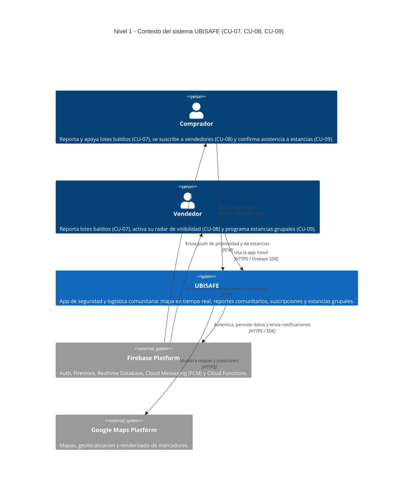
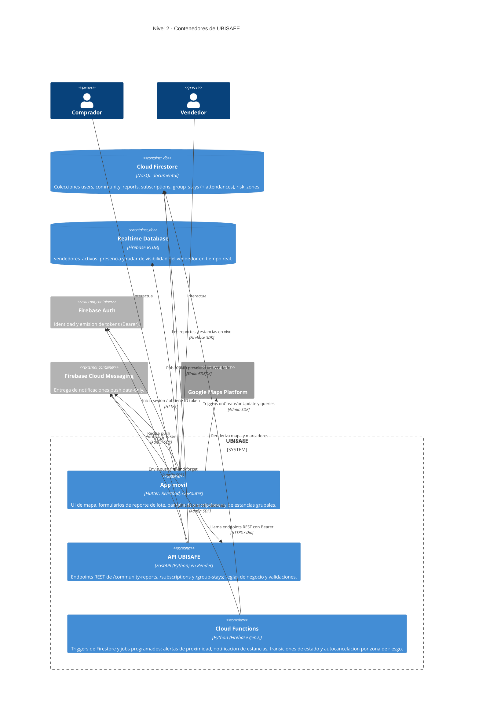
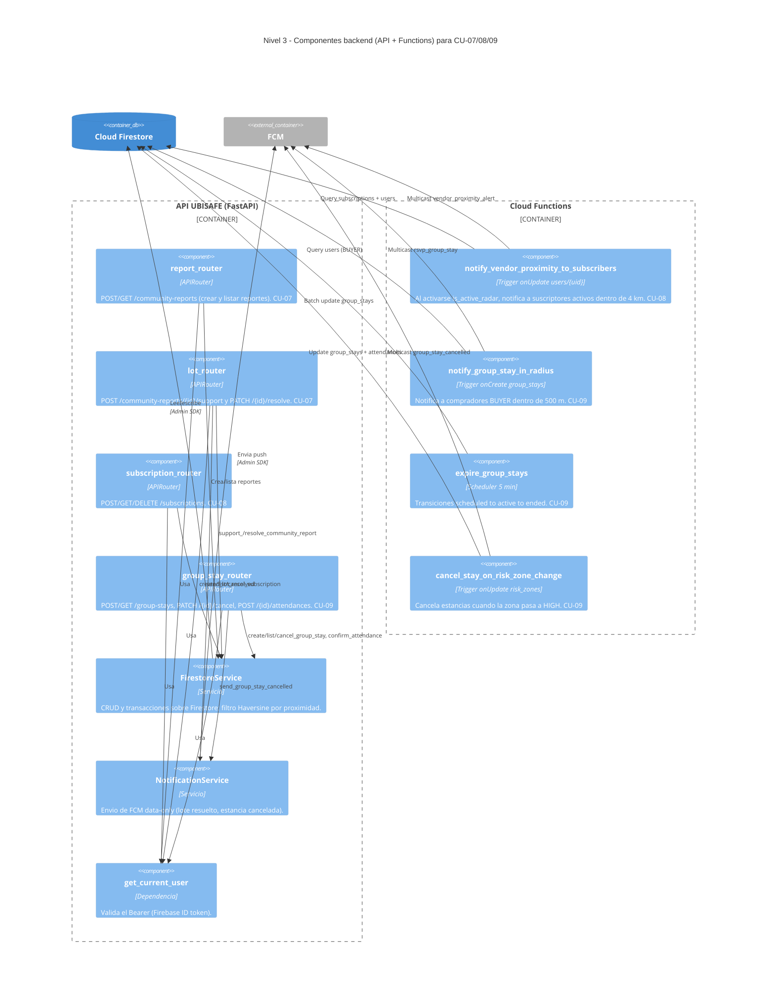
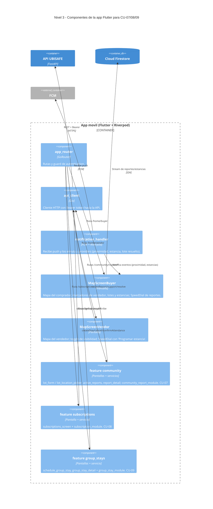

# 01 — Arquitectura C4 (Niveles 1 a 3)

Diagramas C4 de UBISAFE centrados en **CU-07 (lotes baldíos)**, **CU-08 (suscripción a
vendedor)** y **CU-09 (estancia grupal)**. Se incluyen los niveles 1 (Contexto),
2 (Contenedores) y 3 (Componentes), según lo solicitado.

---

## Nivel 1 — Diagrama de Contexto

Muestra a UBISAFE como un único sistema, sus usuarios y los servicios externos de los que
depende.

---

## Nivel 2 — Diagrama de Contenedores

Descompone UBISAFE en sus contenedores ejecutables y de datos. El backend FastAPI atiende
la lógica de CU-07/08/09; Firestore es la base de datos principal; las Cloud Functions
ejecutan las notificaciones reactivas y las transiciones programadas.

> **Notas de implementación**
> - El registro de routers de la API está en `ubisafe_api/main.py`.
> - El acceso HTTP de la app se centraliza en `ubisafe_app/lib/core/api/api_client.dart` (Dio + interceptor de token).
> - Despliegue de la API: `render.yaml` + `ubisafe_api/Dockerfile`.
> - Cloud Functions: `functions/main.py`.

---

## Nivel 3 — Diagrama de Componentes (CU-07, CU-08, CU-09)

Detalla los componentes internos relevantes a los tres casos de uso, distribuidos entre la
API FastAPI, las Cloud Functions y la app Flutter.

### 3.1 — API FastAPI + Cloud Functions

### 3.2 — App Flutter

> **Mapa rápido de componentes ↔ archivos**
> - `report_router` → `ubisafe_api/modules/community/report_router.py`
> - `lot_router` → `ubisafe_api/modules/community/lot_router.py`
> - `subscription_router` → `ubisafe_api/modules/shared/subscription_router.py`
> - `group_stay_router` → `ubisafe_api/modules/dispatching/group_stay_router.py`
> - `FirestoreService` / `NotificationService` → `ubisafe_api/modules/shared/`
> - Cloud Functions → `functions/main.py`
> - App: `ubisafe_app/lib/features/{community,shared/subscriptions,dispatching/group_stays}/`
