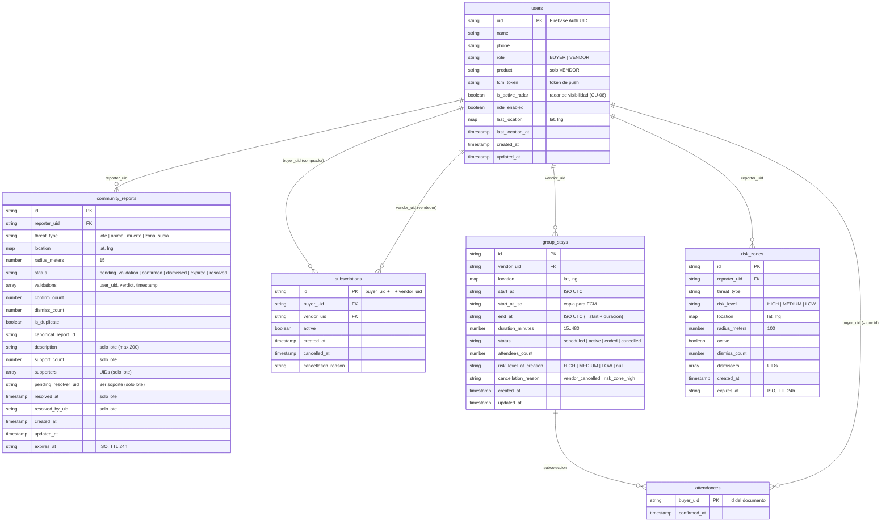

# 02 — Esquema de Base de Datos

UBISAFE usa **Cloud Firestore** (NoSQL documental) como base de datos principal y
**Firebase Realtime Database (RTDB)** para la presencia en tiempo real del vendedor.

> **Nota sobre Firestore.** Firestore no tiene tablas ni claves foráneas reales. En el
> `erDiagram` siguiente, cada **colección** se modela como una entidad y las **referencias
> por UID** (p. ej. `reporter_uid`, `buyer_uid`) como relaciones lógicas. Las reglas están en
> `firestore.rules`; los índices compuestos en `firestore.indexes.json`.

Las colecciones marcadas con ★ son las centrales de CU-07/08/09; `risk_zones` y la RTDB
`vendedores_activos` se incluyen porque participan como contexto en CU-09 y CU-08.

---

## Diagrama entidad-relación (colecciones)

---

## Detalle por colección

### ★ `community_reports` — CU-07 (lotes baldíos)
Reportes comunitarios. Un lote baldío es un documento con `threat_type = "lote"`. Los demás
tipos (`animal_muerto`, `zona_sucia`) corresponden a CU-05/CU-06 y se incluyen solo como
contexto. Definición en `ubisafe_api/modules/community/schemas.py`.

| Campo | Tipo | Descripción |
|-------|------|-------------|
| `id` | string | ID autogenerado del documento. |
| `reporter_uid` | string (ref `users`) | Autor del reporte. |
| `threat_type` | string (enum) | `lote` / `animal_muerto` / `zona_sucia`. |
| `location` | map `{lat, lng}` | Punto del reporte. |
| `radius_meters` | number | Fijo en 15. |
| `status` | string (enum) | `pending_validation` → `resolved` (lote); confirmado/descartado para otros. |
| `description` | string \| null | Descripción del lote (máx. 200). **Solo lote.** |
| `support_count` | number | Nº de soportes únicos. **Solo lote.** |
| `supporters` | array(string) | UIDs que han apoyado. **Solo lote.** |
| `pending_resolver_uid` | string \| null | UID del 3er soporte; único autorizado a resolver. **Solo lote.** |
| `resolved_at` / `resolved_by_uid` | timestamp / string | Metadatos de resolución. **Solo lote.** |
| `expires_at` | string ISO | TTL de 24 h. |

**Reglas de negocio (CU-07):** al alcanzar **3 soportes** se fija `pending_resolver_uid`
(transacción en `FirestoreService.support_community_report`); solo ese usuario puede
`PATCH /resolve`, que cambia `status` a `resolved` y dispara FCM a reportador + soportes.

### ★ `subscriptions` — CU-08 (suscripción a vendedor)
Vínculo comprador→vendedor. ID compuesto `{buyer_uid}_{vendor_uid}` (1 suscripción por par).
Definición en `ubisafe_api/modules/shared/subscription_schemas.py`.

| Campo | Tipo | Descripción |
|-------|------|-------------|
| `id` | string | `{buyer_uid}_{vendor_uid}`. |
| `buyer_uid` | string (ref `users`) | Comprador suscrito. |
| `vendor_uid` | string (ref `users`) | Vendedor objetivo. |
| `active` | boolean | `true` si la suscripción está vigente. |
| `created_at` / `cancelled_at` | timestamp | Alta / baja. |
| `cancellation_reason` | string \| null | p. ej. `user_cancelled`. |

**Índices** (`firestore.indexes.json`): `(buyer_uid, active)` para listar las del comprador y
`(vendor_uid, active)` que usa la Cloud Function de proximidad para hallar suscriptores.

### ★ `group_stays` (+ subcolección `attendances`) — CU-09 (estancia grupal)
Estancia programada por un vendedor. Definición en
`ubisafe_api/modules/dispatching/group_stay_schemas.py`.

| Campo | Tipo | Descripción |
|-------|------|-------------|
| `id` | string | ID autogenerado. |
| `vendor_uid` | string (ref `users`) | Vendedor anfitrión. |
| `location` | map `{lat, lng}` | Punto de la estancia. |
| `start_at` / `end_at` | string ISO UTC | Inicio y fin (`end_at = start_at + duration`). |
| `start_at_iso` | string | Copia plana para el payload FCM. |
| `duration_minutes` | number | Entre 15 y 480. |
| `status` | string (enum) | `scheduled` → `active` → `ended`, o `cancelled`. |
| `attendees_count` | number | Asistentes confirmados (incremento atómico). |
| `risk_level_at_creation` | string \| null | Nivel de zona al crear (diagnóstico). |
| `cancellation_reason` | string \| null | `vendor_cancelled` o `risk_zone_high`. |

**Subcolección `group_stays/{id}/attendances`:** un documento por comprador, con id =
`buyer_uid` y campo `confirmed_at`.

**Índices** (`firestore.indexes.json`): `(status, start_at)`, `(status, end_at)` (usados por el
scheduler `expire_group_stays`) y `(status, vendor_uid)` (chequeo de solapamiento).

**Transiciones de estado** (`GROUP_STAY_VALID_TRANSITIONS`):

| Desde | Hacia | Quién |
|-------|-------|-------|
| `scheduled` | `active` | SYSTEM (scheduler, al llegar `start_at`) |
| `active` | `ended` | SYSTEM (scheduler, al llegar `end_at`) |
| `scheduled` | `cancelled` | VENDOR / SYSTEM (zona HIGH) |
| `active` | `cancelled` | VENDOR / SYSTEM (zona HIGH) |

### `users` (contexto, usada por los tres CU)
Perfil de cada usuario; `role` distingue `BUYER`/`VENDOR`. Campos clave para estos CU:
`fcm_token` (destino de las push), `last_location` (filtros de proximidad) e
`is_active_radar` (disparador de CU-08). Definición en
`ubisafe_api/modules/identity/schemas.py`; persistencia en `firestore_service.py`.

### `risk_zones` (contexto de CU-09)
Zonas de riesgo comunitarias. Cuando una zona pasa a `risk_level = "HIGH"` y está `active`,
la Cloud Function `cancel_stay_on_risk_zone_change` cancela las estancias dentro de su radio.

---

## Realtime Database — `vendedores_activos` (contexto de CU-08)

Presencia del vendedor en tiempo real. Reglas en `database.rules.json`; modelo en
`ubisafe_app/lib/features/presence/models/vendor_marker.dart`.

| Ruta | Campo | Tipo | Descripción |
|------|-------|------|-------------|
| `/vendedores_activos/{vendor_uid}` | `lat` / `lng` | number | Posición actual (−90..90 / −180..180). |
| | `timestamp` | number | Época en ms (detección de desconexión). |
| | `activo` | boolean | `false` vía `onDisconnect` al perder conexión. |
| | `ride_enabled` | boolean | Modo raite (CU-04, contexto). |
| | `product` | string | Producto del vendedor. |

> El "radar de visibilidad" del vendedor se refleja en el campo `is_active_radar` de
> `users`; su activación (transición a `true`) es lo que dispara la alerta de proximidad de
> CU-08 a través de la Cloud Function `notify_vendor_proximity_to_subscribers`.
