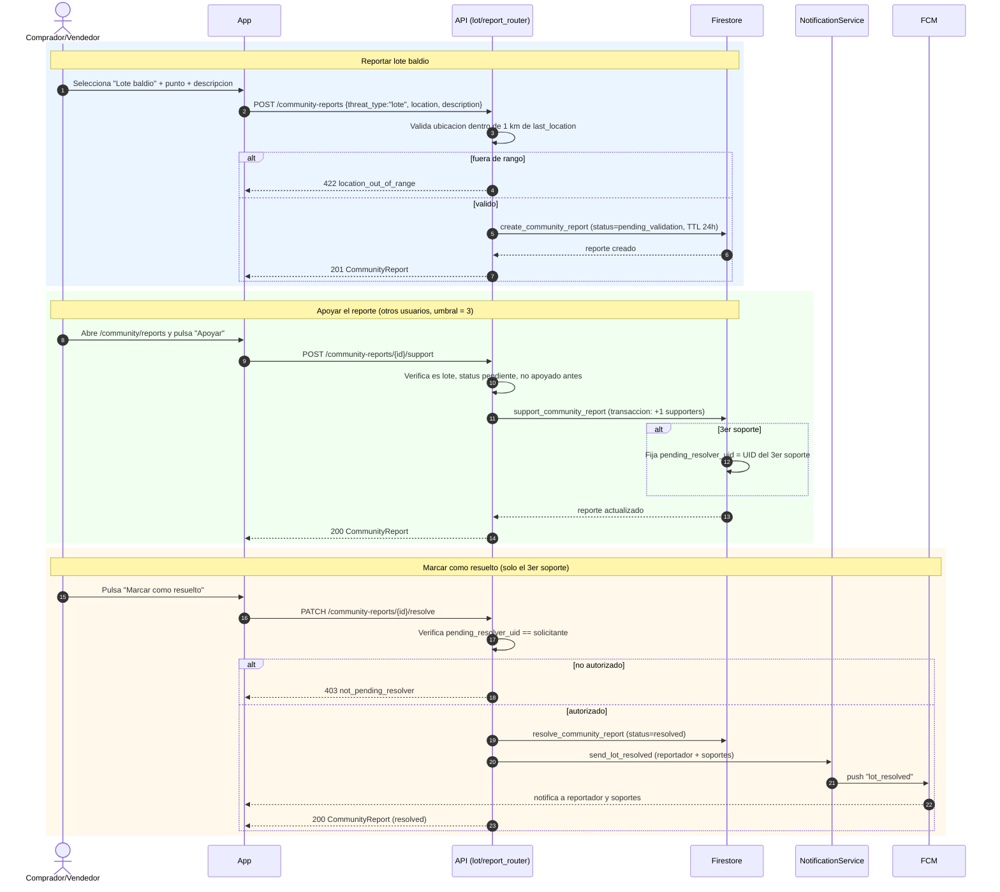
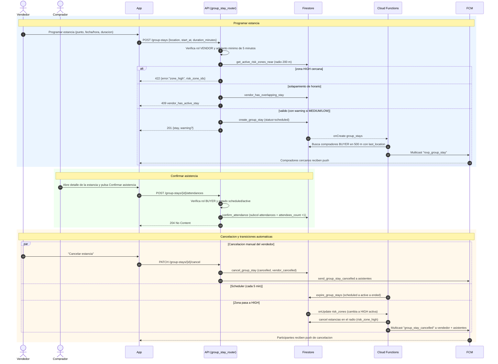

# 03 — Diagramas de Secuencia

Un diagrama de secuencia por caso de uso (CU-07, CU-08, CU-09). Reflejan el flujo normal y
los principales flujos alternativos/excepción del SRS, anclados a los endpoints y servicios
reales del backend (`ubisafe_api/`) y las Cloud Functions (`functions/main.py`).

Participantes comunes:
- **App**: app Flutter (`ubisafe_app/`).
- **API**: FastAPI (`ubisafe_api/`), con `FirestoreService` y `NotificationService`.
- **Firestore**: base de datos.
- **CF**: Cloud Functions.
- **FCM**: Firebase Cloud Messaging.

---

## CU-07 — Gestionar lotes baldíos

Cubre los tres momentos: reportar, apoyar (umbral de 3) y resolver.

**Criterios SRS cubiertos:** CA-07.1 (registro < 10 s e informa a cercanos), CA-07.2 (rechazo
fuera de 4 km — aquí validado a 1 km del `last_location`), CA-07.3 (descripción suficiente),
CA-07.4 (3 confirmaciones), CA-07.5 (resolución + reputación al resolutor).

---

## CU-08 — Suscribirse a cercanía de vendedor

Dos fases: la suscripción (síncrona) y la alerta de proximidad (reactiva, vía Cloud Function
cuando el vendedor activa su radar).

```mermaid
sequenceDiagram
    autonumber
    actor C as Comprador
    actor V as Vendedor
    participant App
    participant API as API (subscription_router)
    participant FS as Firestore
    participant CF as Cloud Function
    participant FCM

    rect rgb(235, 245, 255)
    note over C,FS: Suscribirse a un vendedor
    C->>App: Toca marcador de vendedor y pulsa "Suscribirse"
    App->>API: POST /subscriptions {vendor_uid}
    API->>API: Verifica rol BUYER y que no exista suscripcion activa
    alt ya existe activa
        API-->>App: 409 (suscripcion duplicada)
    else nueva o reactivada
        API->>FS: create_subscription (id = buyer_uid_vendor_uid, active=true)
        API-->>App: 201 Subscription
    end
    end

    rect rgb(240, 255, 240)
    note over V,FCM: Alerta de proximidad (cuando el vendedor activa su radar)
    V->>App: Activa visibilidad (radar)
    App->>FS: users/{vendor}.is_active_radar = true
    FS-->>CF: onUpdate users/{uid} (transicion a true)
    CF->>CF: Guarda: rol VENDOR y last_location presente
    CF->>FS: Query subscriptions(active, vendor_uid) + users
    CF->>CF: Filtra suscriptores dentro de 4 km (Haversine)
    CF->>FCM: Multicast "vendor_proximity_alert"
    FCM-->>App: Comprador recibe push y muestra SnackBar
    end

    rect rgb(255, 248, 235)
    note over C,FS: Cancelar suscripcion
    C->>App: Pantalla Mis suscripciones, eliminar
    App->>API: DELETE /subscriptions/{id}
    API->>FS: cancel_subscription (active=false, cancelled_at)
    API-->>App: 204 No Content
    end
```

**Criterios SRS cubiertos:** CA-08.1 (registro < 10 s), CA-08.2 (aviso de proximidad < 10 s
dentro de 4 km), CA-08.3 (cancelación). CA-08.4 (baja automática si el vendedor elimina su
cuenta) no tiene aún disparador dedicado en el código revisado — ver sección de pendientes
en el documento de navegación.

---

## CU-09 — Programar estancia grupal

Programación con validación de zona de riesgo y solapamiento, notificación a compradores
cercanos, confirmación de asistencia y cancelación (manual o automática por zona HIGH).

**Criterios SRS cubiertos:** CA-09.1 (registro < 10 s), CA-09.2 (aviso a compradores en 500 m),
CA-09.3 (confirmar asistencia y contador), CA-09.4 (cancelación automática por zona HIGH +
aviso), CA-09.5 (rechazo al programar en zona HIGH).
