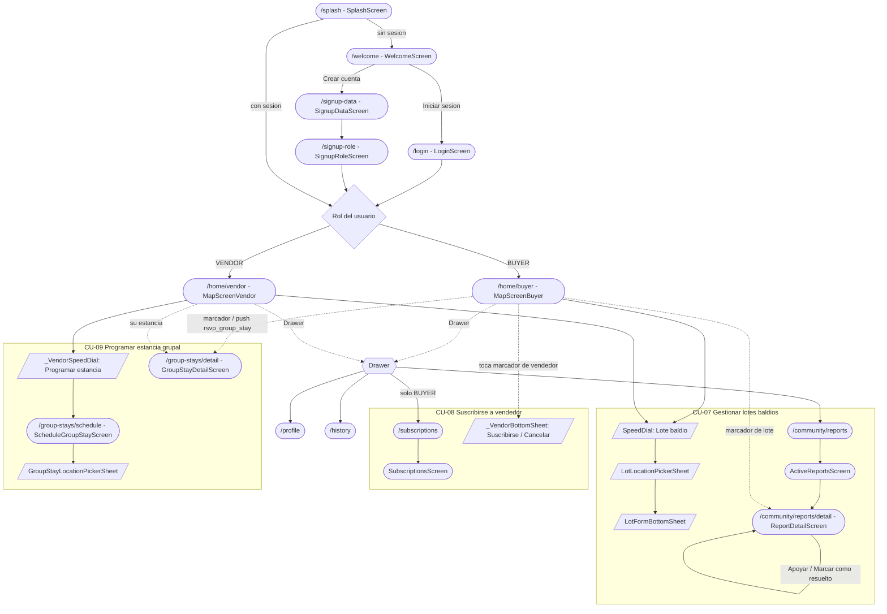

# 04 — Diagrama de Navegación

Navegación de pantallas de la app Flutter (`ubisafe_app/`), basada en las rutas de
**GoRouter** (`lib/router/app_router.dart`). Se resaltan los flujos de **CU-07**, **CU-08** y
**CU-09**. Las hojas modales (bottom sheets) se muestran con borde punteado.

Convenciones:
- Rectángulo redondeado = pantalla (ruta GoRouter).
- Rectángulo con borde punteado = bottom sheet / modal (no es una ruta).
- Rombo = decisión (rol o guard de sesión).

---

## Flujo global + CU-07 / CU-08 / CU-09

---

## Entradas y acciones por caso de uso

### CU-07 — Lotes baldíos
- **Reportar:** desde el `SpeedDial` del mapa (comprador o vendedor) → opción "Lote baldío"
  → `LotLocationPickerSheet` (elegir punto) → `LotFormBottomSheet` (descripción) → envía con
  `community_report_module.createReport()` (`POST /community-reports`).
- **Apoyar / resolver:** `Drawer → /community/reports` (`ActiveReportsScreen`) o tocar el
  marcador del lote en el mapa → `/community/reports/detail` (`ReportDetailScreen`), que ofrece
  "Apoyar" (`POST /{id}/support`) y, para el 3er soporte, "Marcar como resuelto"
  (`PATCH /{id}/resolve`).
- Archivos: `lib/features/community/screens/{lot_location_picker_sheet,lot_form_bottom_sheet,active_reports_screen,report_detail_screen}.dart`,
  `services/community_report_module.dart`.

### CU-08 — Suscripción a vendedor
- **Suscribir / cancelar in situ:** en `MapScreenBuyer`, tocar un marcador de vendedor abre
  `_VendorBottomSheet` con la acción de suscribirse o cancelar
  (`POST /subscriptions` / `DELETE /subscriptions/{id}`).
- **Gestionar suscripciones:** `Drawer → "Mis suscripciones" → /subscriptions`
  (`SubscriptionsScreen`): lista y cancela (solo comprador).
- **Alerta de proximidad:** llega como push FCM (`vendor_proximity_alert`) y se muestra como
  SnackBar en `MapScreenBuyer` (enrutado por `notification_handler.dart`).
- Archivos: `lib/features/shared/subscriptions/screens/subscriptions_screen.dart`,
  `services/subscription_module.dart`, y `_VendorBottomSheet` en
  `lib/features/dispatching/screens/map_screen_buyer.dart`.

### CU-09 — Estancia grupal
- **Programar (vendedor):** `_VendorSpeedDial → "Programar estancia" → /group-stays/schedule`
  (`ScheduleGroupStayScreen`), que usa `GroupStayLocationPickerSheet` para el punto y diálogos
  según la respuesta del backend (zona HIGH = rechazo, MEDIUM/LOW = advertencia, solapamiento).
- **Detalle / asistencia:** desde un marcador del mapa o desde la push `rsvp_group_stay` →
  `/group-stays/detail` (`GroupStayDetailScreen`); el comprador pulsa "Confirmar asistencia"
  (`POST /{id}/attendances`) y el vendedor puede "Cancelar estancia" (`PATCH /{id}/cancel`).
- Archivos: `lib/features/dispatching/group_stays/screens/{schedule_group_stay_screen,group_stay_location_picker_sheet,group_stay_detail_screen}.dart`,
  `services/group_stay_module.dart`.

---

## Notas y pendientes detectados

- **Guard de rutas:** `app_router.dart` redirige a `/welcome` a quien no tenga sesión y a
  `/splash` a quien esté autenticado en una pantalla de auth. `/group-stays/detail` y
  `/community/reports/detail` requieren su objeto en `state.extra`; si se pierde (muerte del
  proceso), hacen *fallback* a la lista o al mapa en vez de fallar.
- **CA-08.4 (baja automática de suscripción al eliminar la cuenta del vendedor):** no se
  encontró un disparador dedicado en el backend revisado; conviene documentarlo como tarea
  pendiente o confirmar si se cubre en otra parte del sistema.
